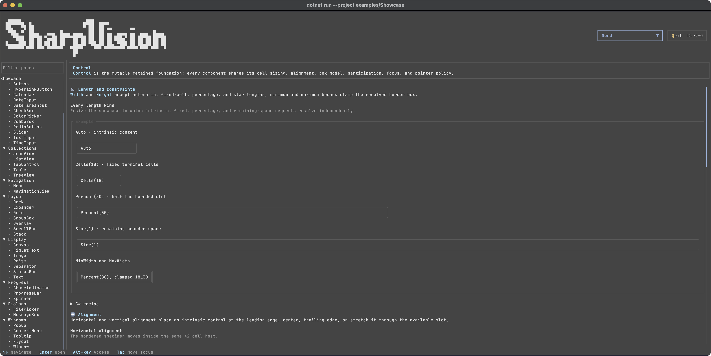
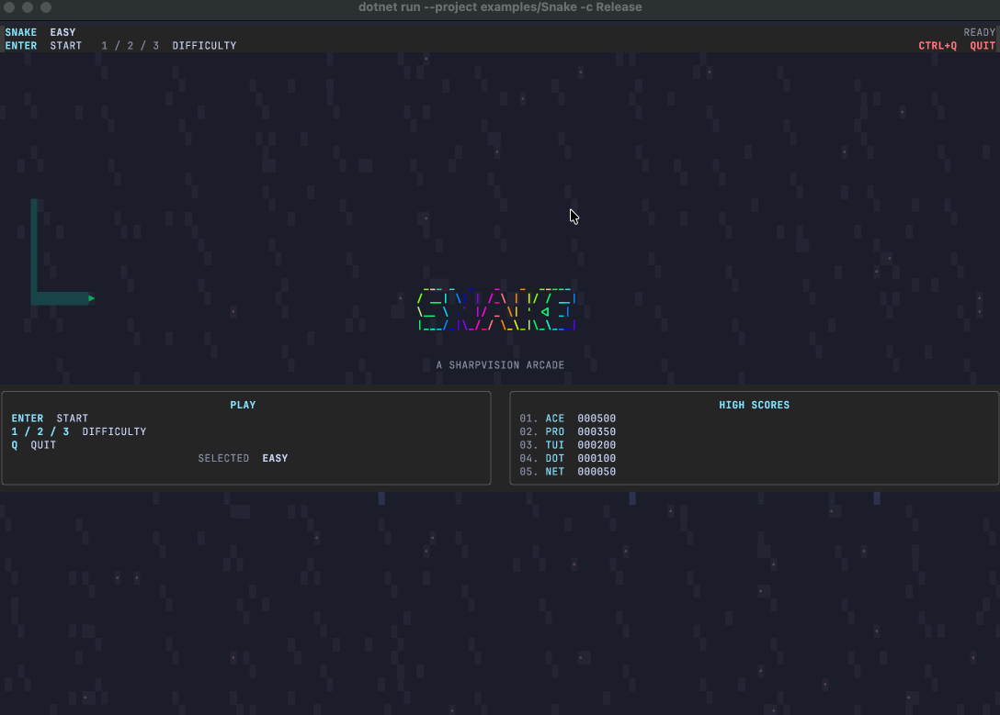
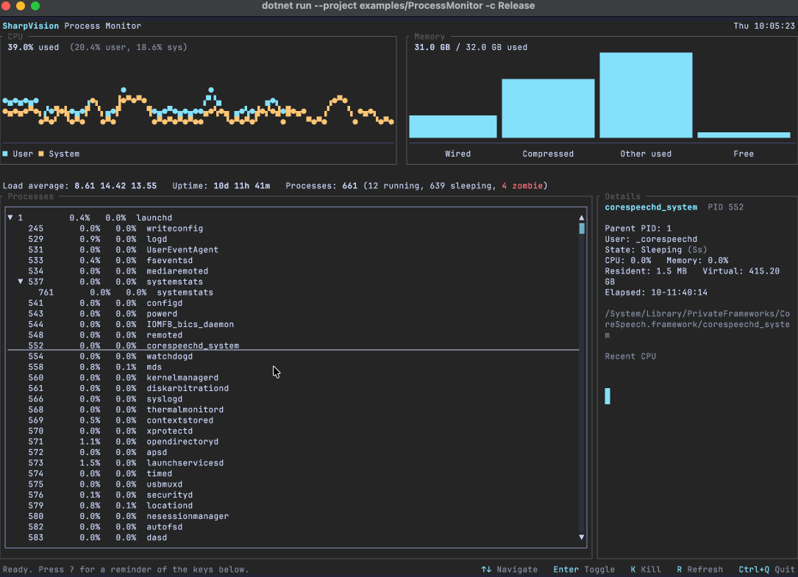

# SharpVision

<!-- markdownlint-disable-next-line MD033 -->


Build rich terminal applications in C# without giving up Unicode, predictable
layout, or correct terminal behavior.

[](https://github.com/pavkam/sharp-vision/actions/workflows/sharpvision-publish.yml)
[](LICENSE)
[](https://github.com/pavkam/sharp-vision/issues)
[](https://www.nuget.org/packages/SharpVision)




SharpVision is a .NET 10 terminal UI library with familiar mutable controls,
responsive layouts, routed input, themes, scrolling, menus, popups, windows, and
a terminal engine that treats rendering correctness as a feature—not a pleasant
accident.

The project is under active development. The API is still prerelease, and the
[protocol coverage matrix](docs/protocols/coverage-matrix.md#coverage) is the
source of truth for implemented and verified terminal support.

## Take it for a spin

Clone the repository and launch the interactive control gallery:

```bash
git clone https://github.com/pavkam/sharp-vision.git
cd sharp-vision
make restore
make run
```

The showcase lets you explore shipped controls, themes, layout behavior, and
interaction states in a real terminal. Press `Ctrl+Q` to leave.

Ready to build something? Start with the
[first-application walkthrough](docs/walkthroughs/first-application.md#build-your-first-application),
then browse the [control catalog](docs/controls/index.md#control-catalog).

## Why SharpVision

- **A familiar UI model.** Compose retained, mutable controls and update them
  through a dispatcher instead of learning a virtual-tree framework.
- **Useful controls included.** Build with inputs, collections, navigation,
  dialogs, menus, windows, data views, and responsive layout primitives.
- **Terminal behavior you can inspect.** Unicode cell geometry, capabilities,
  input protocols, rendering, and cleanup have explicit specifications and
  observable tests.
- **Examples that run.** The showcase, text editor, Snake, and Process Monitor
  applications are production examples rather than disconnected snippets.
- **Documentation that makes commitments.** Public behavior, implementation
  gaps, and verified protocol support live alongside the code.

## Examples

|                                                     |                                                                                  |
| --------------------------------------------------- | -------------------------------------------------------------------------------- |
|     |             |
| [Snake](examples/Snake/README.md#sharpvision-snake) | [Process Monitor](examples/ProcessMonitor/README.md#sharpvision-process-monitor) |

## Packages

SharpVision `1.0.0-beta.1` is a prerelease and may change before the stable API.

`SharpVision` installs `SharpVision.Terminal` transitively. Reference the
lower-level package directly only when building terminal infrastructure without
the UI control layer.

The optional `SharpVision.FigletFonts` package adds 19 audited BSD/MIT FIGlet
fonts without making every application carry the font assets:

```bash
dotnet add package SharpVision.FigletFonts
```

It accepts the matching `SharpVision` version or later.

## Find your way around

| You want to…                               | Start here                                                                                                                                                                                                                                                          |
| ------------------------------------------ | ------------------------------------------------------------------------------------------------------------------------------------------------------------------------------------------------------------------------------------------------------------------- |
| Build your first application               | [First-application walkthrough](docs/walkthroughs/first-application.md#build-your-first-application)                                                                                                                                                                |
| Explore controls and composition           | [Control catalog](docs/controls/index.md#control-catalog)                                                                                                                                                                                                           |
| Understand layout, input, themes, or hosts | [Concept map](docs/concepts/index.md#concept-map)                                                                                                                                                                                                                   |
| Check whether a feature is ready           | [Feature support](docs/features/index.md#feature-support)                                                                                                                                                                                                           |
| Check terminal protocol support            | [Coverage matrix](docs/protocols/coverage-matrix.md#coverage)                                                                                                                                                                                                       |
| Understand ownership and runtime flow      | [Architecture map](docs/architecture/index.md#architecture-map)                                                                                                                                                                                                     |
| See complete applications                  | [Showcase](docs/architecture/showcase.md#overview), [text editor](examples/TextEditor/README.md#sharpvision-text-editor), [Snake](examples/Snake/README.md#sharpvision-snake), and [Process Monitor](examples/ProcessMonitor/README.md#sharpvision-process-monitor) |

The repository has three main pieces:

- `SharpVision.Terminal` owns transport, terminal protocols, capabilities,
  Unicode cell geometry, input, buffers, and rendering.
- `SharpVision` owns the application runtime, controls, layout, focus, routed
  input, styling, scrolling, menus, popups, and windows.
- `SharpVision.FigletFonts` provides the optional font catalog.

The
[project structure specification](docs/architecture/project-structure.md#overview)
describes the dependency boundaries in detail.

## Build the repository

You need .NET SDK 10.0.203 or a compatible patch, Node.js 22+, and Make. Run the
same quality gates used by continuous integration:

```bash
make restore
make format
make lint
make build
make test
```

The [test map](docs/testing/index.md#test-map) explains what each evidence layer
proves, and the
[continuous-integration specification](docs/testing/continuous-integration.md#overview)
maps the commands to the public gate.

## Contributing and support

Read [Contributing](CONTRIBUTING.md), [Security](SECURITY.md),
[Support](SUPPORT.md), and the [Code of Conduct](CODE_OF_CONDUCT.md) before
opening an issue or pull request. They explain the docs-first workflow, private
vulnerability reports, and the evidence expected for changes.
