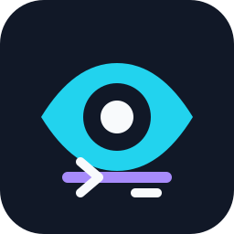

# SharpVision

<!-- markdownlint-disable-next-line MD033 -->


High-performance, specification-first terminal UI for .NET 10.

[](https://github.com/pavkam/sharp-vision/actions/workflows/sharpvision-publish.yml)
[](LICENSE)
[](https://github.com/pavkam/sharp-vision/issues)
[](https://www.nuget.org/packages/SharpVision)


SharpVision is a terminal UI library for applications that need correct terminal
protocol behavior, Unicode-aware layout, deterministic mutable controls, and
observable rendering proof. The repository is under active development; the
[protocol coverage matrix](docs/protocols/coverage-matrix.md#coverage) is the
authoritative statement of what is implemented and tested.

## Demo

Calendar controls, selection states, navigation, and responsive layout in the
live showcase:


FIGlet text, theme-aware styling, scrolling, and the control catalog:


## What is here

- `SharpVision.Terminal` handles transport, terminal protocols, capabilities,
  Unicode cell geometry, input, buffers, and rendering.
- `SharpVision` supplies dispatcher-affine mutable controls, layout, focus,
  routed input, styling, scrolling, menus, popups, and windows.
- `examples/Showcase` contains the `SharpVision.Showcase` runnable gallery for
  shipped controls and interaction states.
- `tests/` contains the terminal and UI verification suites.

The
[project structure specification](docs/architecture/project-structure.md#overview)
defines the one-way dependency graph and ownership boundaries.

## Package status

SharpVision `0.7.0-alpha.1` is a prerelease and may change before the stable
API.

> [!IMPORTANT]
>
> The published UI package currently has an unresolved exact dependency because
> the matching `SharpVision.Terminal` package is not published. It is not
> currently installable. Build this repository or use project references until
> the terminal package is available.

Once published, `SharpVision.Terminal` is installed transitively. Reference that
lower-level package directly only when building terminal infrastructure without
the UI control layer. The
[first-application walkthrough](docs/walkthroughs/first-application.md#build-your-first-application)
contains a complete hosted example.

## Build the repository

Requirements: .NET SDK 10.0.203 (or a compatible patch), Node.js 22+, and Make.
Restore, build, and verify the repository with:

```bash
make restore
make format
make lint
make build
make test
```

Run the interactive gallery with `make run`. The
[continuous-integration specification](docs/testing/continuous-integration.md#overview)
maps these commands to the public gate.

To build an application instead of the repository, start with the
[first-application walkthrough](docs/walkthroughs/first-application.md#build-your-first-application).

## Documentation

The documentation is part of the product. Start with the
[documentation index](docs/index.md#documentation-rules), then choose the area
you are changing:

| Need                                                            | Start here                                                                                                                                                                        |
| --------------------------------------------------------------- | --------------------------------------------------------------------------------------------------------------------------------------------------------------------------------- |
| First app, layout, events, background work, and custom controls | [Walkthroughs](docs/walkthroughs/index.md#walkthroughs)                                                                                                                           |
| Terminal wire behavior and support                              | [Protocol index](docs/protocols/index.md#protocol-families) and [coverage matrix](docs/protocols/coverage-matrix.md#coverage)                                                     |
| Reader-facing feature availability                              | [Feature support](docs/features/index.md#feature-support)                                                                                                                         |
| Ownership, runtime, rendering, and capabilities                 | [Architecture map](docs/architecture/index.md#architecture-map)                                                                                                                   |
| Layout, input, threading, lifecycle, themes, and hosting        | [Concept map](docs/concepts/index.md#concept-map)                                                                                                                                 |
| Public control APIs and composition                             | [Control catalog](docs/controls/index.md#control-catalog)                                                                                                                         |
| Test oracles and quality expectations                           | [Test map](docs/testing/index.md#test-map)                                                                                                                                        |
| Runnable API examples                                           | [Showcase](docs/architecture/showcase.md#overview), [text editor](examples/TextEditor/README.md#sharpvision-text-editor), and [Snake](examples/Snake/README.md#sharpvision-snake) |

## Contributing and support

Read [Contributing](CONTRIBUTING.md), [Security](SECURITY.md),
[Support](SUPPORT.md), and the [Code of Conduct](CODE_OF_CONDUCT.md) before
opening an issue or pull request. Those documents explain the docs-first
workflow, private vulnerability reports, and the evidence expected for changes.
