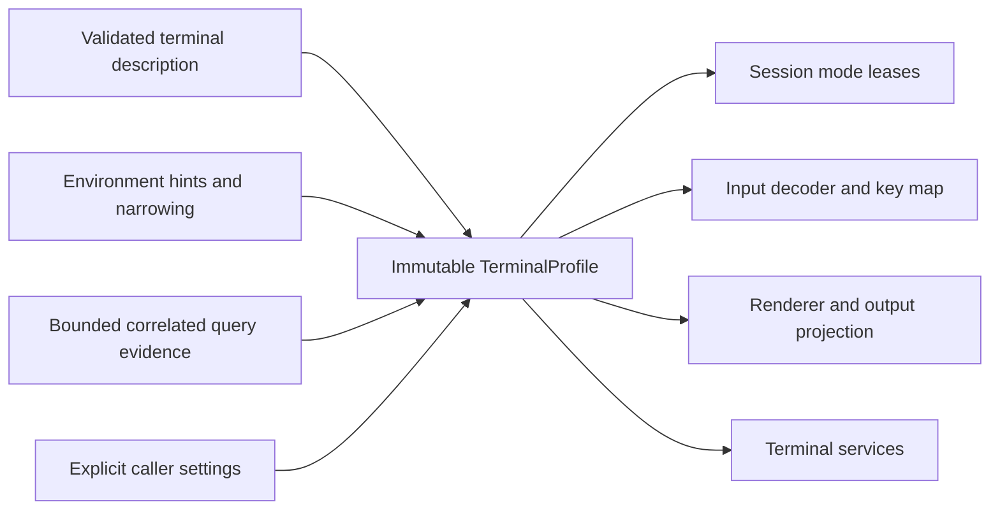
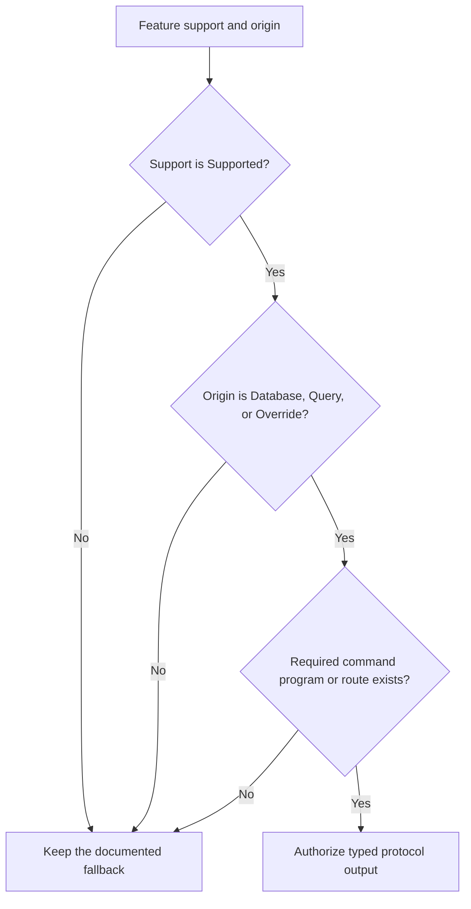

# Terminal capabilities

## Overview

`Capabilities` is an immutable value published after bounded detection. It
states which protocol features are supported, the color and style fidelity, the
Unicode-width policy, cell and pixel metrics, and multiplexer constraints.

Capabilities authorize optional runtime behavior; they do not identify the
terminal emulator. The
[terminal backend contract](terminal-backends.md#overview) owns the fixed
VT/xterm/Kitty/iTerm2 identity, while the
[discovery pipeline](discovery-pipeline.md#overview) owns source precedence,
adapters, resolution, and immutable publication.

The capability profile represents each optional protocol as a `Feature` carrying
a support state and an origin. The state says what SharpVision currently knows;
the origin says where that knowledge came from.

| Support state | Reader-facing meaning                                                      |
| ------------- | -------------------------------------------------------------------------- |
| Unknown       | No source has established whether the feature works.                       |
| Unsupported   | A source established that the feature must not be used.                    |
| Tentative     | A hint suggests the feature, but output is not yet authorized.             |
| Supported     | The source reports support; its origin still decides whether it is usable. |

| Origin      | Typical source                            | Authorizes output? |
| ----------- | ----------------------------------------- | ------------------ |
| Default     | Conservative library starting value.      | No.                |
| Environment | `TERM` or another allowlisted host hint.  | No.                |
| Database    | A validated terminal-description program. | Yes.               |
| Query       | A bounded, correlated terminal reply.     | Yes.               |
| Override    | Explicit caller policy.                   | Yes.               |

Emitting active protocol output requires both `Feature.Supported` and an
authoritative origin — database, bounded query, or explicit override — which
`Feature.Authoritative` reports as one predicate. Default and environment
origins never authorize output, even if a caller constructs the otherwise
inconsistent `Supported` state. Session mode leases, `Renderer` synchronized
output, and both encoder paths gate on that predicate, so environment-only
evidence emits no mode-2026 wrapping, no overline, no typed underline, and no
underline color. Environment evidence remains observable, but it cannot silently
enable a feature. `ColorDepth` separately records monochrome, 16-color,
indexed-256, or true-color fidelity together with its origin. Presence of the
`NO_COLOR` environment variable (any value, including empty, per the
no-color.org convention) forces `ColorDepth.Monochrome`/`Origin.Environment`
ahead of the `COLORTERM`/`TERM` heuristics, so a caller's explicit request to
disable color output is never masked by a terminal that also happens to
advertise truecolor or 256-color support.

The profile reports `UnicodeVersion` as the library's pinned Unicode 17.0.0 data
and carries an explicit `AmbiguousWidth` policy. The policy defaults to narrow,
never changes because of locale or terminal-name hints, and may be set to wide
only by caller `CapabilityOverrides` applied at the final precedence step.

Most `Feature` properties are stored evidence, but a few are computed behavioral
guarantees derived from stored evidence, so a consumer outside this assembly
depends on the behavior it needs rather than on which specific terminal protocol
happens to provide it today. `KeyReleaseEvents` is one example: it currently
mirrors `KittyKeyboard` exactly, because Kitty's progressive enhancement is the
only implemented protocol that reports key release, but nothing outside
`SharpVision.Terminal` ever names Kitty to ask whether key release is available.
A future protocol that also reports key release only needs to extend the
computed property; every caller keeps working unchanged. A computed capability
is not independently queryable, so it has no `TerminalProtocol` value and does
not appear in `Support(TerminalProtocol)` or `Features`.

The arrows describe evidence flow, not equal authority. The
[discovery pipeline](discovery-pipeline.md#overview) owns the ordered precedence
and publication rules.

## Terminal-description boundary

The terminal assembly has an internal ncurses provider, which loads one
requested Unix terminfo/termcap description, and a deterministic Windows VT
provider, which builds the
[documented built-in profile](../protocols/ansi-vt.md#windows-vt-built-in-description).
`DescriptionLoader` applies an explicit profile precedence, selects either the
injected Unix provider or the established Windows VT provider, preserves typed
absence and failure, and performs only the explicitly permitted ANSI fallback
when the Unix provider is unavailable. Platform console connections retain
immutable platform, output-descriptor, and Windows-VT facts.
`ConsoleConnection.ResolveDescription` publishes the immutable
`DescriptionResult`: a `DescriptionLoadStatus`, an optional owned profile, and
ordered redacted `DescriptionDiagnostic` values. `ResolveProfile` remains a
convenience projection that intentionally discards the status and diagnostics.
Hosting consumes the complete result before constructing an application or
session and rejects every suitability other than `Usable` before any terminal,
query, or render bytes. Runtime options and capability negotiation carry that
complete profile and use its semantic capabilities as the baseline.
`Runtime.TerminalOptions.Profile` is always non-null; its compatibility
`Capabilities` initializer wraps the exact semantic value in a built-in ANSI
profile, and when low-level code supplies both initializers the last one wins.
`Options.Minimal` uses that usable profile but enables no mode or negotiation
and remains byte-quiet. `Runtime.Session` consumes the matched lifecycle
programs and routes the profile's key map into its input decoder. The renderer
consumes the description programs. The
[coverage matrix](../protocols/coverage-matrix.md#coverage) owns that boundary.

The description boundary therefore runs in this order:

1. Select an explicit profile, the platform provider, or the permitted ANSI
   fallback.
2. Load one owned description result with redacted diagnostics.
3. Validate full-screen suitability before any terminal output.
4. Compile and retain only accepted programs and key bindings.
5. Publish the profile as the semantic baseline for discovery and runtime use.

## Terminal-description profile

The immutable `TerminalProfile` owns the `Description`, the semantic
`Capabilities`, opaque compiled-program values, and the key map, all as
immutable snapshots. The ncurses provider loads a database and compiles its
programs. Session lifecycle consumes the matched base and keypad pairs, and
renderer routing consumes the exact cursor, erase, rendition, color, default,
and cursor-shape programs. Input routing consumes the same profile's described
key map. Built-in ANSI programs are intrinsic markers for operations already
owned by the existing ANSI encoder, not placeholder output bytecode.

`TerminalProfile.CreateAnsi` is a deliberate trusted compatibility boundary: it
retains the exact caller `Capabilities` instance and value, including explicit
database-origin features, because its required programs are library-owned
intrinsics rather than transplanted database claims. `WithCapabilities` keeps
that exact-retention behavior only for profiles derived from this private ANSI
singleton. All general and database-loaded profile construction continues to
normalize a database support claim to unknown when its exact backing program is
absent.

`KeyBinding` copies one non-empty terminal byte sequence without interpreting it
as text; invalid UTF-8 is retained exactly. `KeyMap` snapshots the binding
order, compiles C0/DEL, Escape, CSI, and SS3 strings to typed structural
signatures, coalesces an identical repeated binding, and rejects exact-byte or
equivalent-signature conflicts. Seven-bit and eight-bit CSI/SS3 aliases share
one signature. Non-signature strings compile into a bounded longest-match trie
owned by the input decoder. The key map's lifecycle query recognizes exact
seven- or eight-bit SS3 cursor/Home/End spellings as application-mode
requirements while excluding the SS3 F1–F4 normal spellings.

Key-signature construction uses the parser limits captured for the active
profile. Native provider validation diagnoses one malformed optional key locally
and still publishes every other valid binding; it does not turn an otherwise
usable terminal description into a provider failure.

Eight-bit key signatures do not mutate the caller's parser limits. The decoder
tracks CSI and SS3 authorization separately and recognizes a described C1
introducer only from ground state with no pending UTF-8 scalar and no pending
legacy mouse or SS3 payload. An explicit parser-wide C1 policy remains a
separate caller choice.

A usable profile requires non-empty `cup` and `sgr0` programs plus either a
non-empty `clear` or both `el` and `ed`. An otherwise usable description that
does not meet that requirement reports `Suitability.Incomplete`. Database
evidence records `Description.Origin` as `DescriptionOrigin.Database`. A
semantic feature records supported `Origin.Database` evidence only when its
exact non-empty backing program is retained. Projection fills only the exact
conservative `Feature.Unknown` value; it preserves every other state or origin,
so later environment, query, and explicit evidence keeps its precedence. A
supported database claim transplanted without its exact backing program is
normalized to `Feature.Unknown` at the profile boundary.

Database focus support requires the complete `fe`, `fd`, `kxIN`, and `kxOUT`
set. Bracketed paste requires `BE`, `BD`, `PS`, and `PE`. Cell mouse requires
`XM` plus at least one compatible `kmous` or `xm` program; `kmous` alone never
authorizes active mouse mode. Provider projection and transplanted-claim
normalization apply these same exact sets.

The public two-argument `TerminalProfile(Description, Capabilities)` constructor
owns semantic values only and supplies no compiled programs or key bindings. It
therefore publishes an otherwise usable description as `Suitability.Incomplete`;
`CreateAnsi` supplies the intrinsic required programs and remains usable.

Final profile construction applies, in order: built-in safety defaults, accepted
database evidence, environment narrowing and hints, bounded query results, and
then explicit semantic settings or an explicit replacement `TerminalProfile`.
Published profiles reject undefined color-depth and evidence-origin enum values.
The [terminfo lookup contract](../protocols/terminfo.md#lookup-and-fallback) and
the loaded ncurses build own database selection and compatibility fallback.
Environment names never replace database command programs. `CapabilityOverrides`
may override semantic features only; it cannot carry raw command strings. A
complete explicit `TerminalProfile` replacement is the only explicit way to
override command programs.

An unsuitable database description is rejected before output rather than
weakened by an environment hint. A bounded query may refine a semantic feature
but never rewrites a compiled database program.

An environment name never proves every extension associated with a terminal.
Missing, late, malformed, duplicate, and contradictory query responses leave the
conservative value in place and emit structured diagnostics.

`Detector.Detect` reads only its caller-supplied dictionary, so tests and hosts
do not depend on process-global state. It delegates the immutable baseline and
the owned evidence snapshot through the ordered environment, query, and override
strategies specified by the
[discovery pipeline](discovery-pipeline.md#immutable-input-and-adapters). Kitty,
xterm, and iTerm names contribute tentative hints. tmux, GNU screen, and SSH
presence may only narrow risky features. A nullable `QueryResults` value
replaces hints with query evidence, and a nullable `CapabilityOverrides` value
is applied last as explicit caller policy.

### Multiplexer boundary

A detected `TMUX`, `TERM=tmux-*`, or `TERM=screen-*` value identifies only the
nearest inner multiplexer. It never identifies the outer terminal, never becomes
the terminal backend identity, and never enables passthrough.
`Multiplexing.MultiplexingPolicy` keeps the active inner profile and an explicit
outer profile separate, owns a nearest-to-farthest route with finite depth and
byte budget, and approves only the typed capability-query, clipboard, and
graphics families. The runtime routes its implemented startup-query batch, OSC
52 clipboard writes and requests, and graphics transactions through those typed
paths. Kitty OSC 5522 clipboard transactions travel the same typed paths, as its
[protocol page](../protocols/kitty-clipboard.md#supported-features) describes.
Graphics selection receives the complete detected route even when passthrough is
unauthorized, which prevents a direct-output fallback around multiplexer policy.

tmux may carry the complete approved query set. A route containing GNU screen
permits one farthest Screen layer with surrounding tmux layers, and carries CSI
queries only. OSC palette/default-color queries plus XTGETTCAP and DECRQSS are
omitted before registration, because Screen's first ST terminator ends its DCS
relay. Unsafe topologies and batches are rejected atomically rather than
partially written.

An active query route uses the outer profile only as negotiation's semantic
baseline. It does not replace the description programs or key strings used to
drive the inner multiplexer terminal, and inner environment names do not narrow
or augment that explicit outer evidence. Replies are unwrapped through every
configured layer before ordinary typed parsing and exact `QueryTracker`
correlation. Unwrapping admits exactly one recognized query-response value:
text, input controls, unrecognized strings, trailing bytes, and concatenated
responses reject the complete envelope. A structurally valid reply with the
wrong identity remains observable for correlation diagnostics. Screen-wrapped
CSI is accepted, and string-terminated Screen envelopes recover through the full
outer boundary without leaking control bytes. Raw diagnostic offsets include
accepted wrapper overhead and every byte of rejected or oversized envelopes. An
atomic outbound encoding failure retires the registered batch and publishes
absent evidence immediately — without bytes, a flush, active modes, or a
deadline. Disabled or visibility-ineligible passthrough, missing explicit outer
evidence, malformed or oversized envelopes, and the shared exclusive timeout all
leave the inner profile conservatively narrowed.

## Queries and publication

Queries use the typed transactions defined by the
[device-attribute contract](../protocols/device-attributes.md#overview). Each
has a timeout that can be tested with a fake clock. Publication creates a new
immutable profile; a late reply may inform diagnostics or a later explicit
refresh, but it does not mutate values being used by a frame.

`QueryTracker` enforces `QueryLimits.MaxConcurrentQueries`, permits one active
uncorrelated query per response family, and uses a sanitized identifier for
concurrent Kitty clipboard queries. It retains a bounded grace record after
completion, cancellation, or timeout, so duplicate and late replies are
classified without reopening a transaction. DECRQSS and XTGETTCAP registration
retains the exact typed selector or name in both active and history keys, so a
wrong or identity-less response cannot retire another request. Their typed
responses preserve only approved bounded data: unknown valid status replies are
diagnostic, and returned capability bytes never become executable description
programs.

### Runtime negotiator

`Negotiator` is the compatibility facade over `ActiveQueryDiscoveryStrategy`.
The strategy snapshots caller-supplied environment values and fills one bounded
startup batch in priority order:

| Priority | Query family                               | When it is included                                                   |
| -------: | ------------------------------------------ | --------------------------------------------------------------------- |
|        1 | Kitty keyboard status                      | Support is unknown and at least two query slots exist.                |
|        2 | Primary device attributes (DA1)            | Always.                                                               |
|        3 | Secondary device attributes (DA2)          | Capacity remains.                                                     |
|        4 | Private modes 2026, 1004, 2004, 1006, 1016 | The corresponding feature is unknown or tentative.                    |
|        5 | Geometry                                   | Local host geometry is incomplete.                                    |
|        6 | Palette and default colors                 | Capacity remains; results remain diagnostic or caller-consumed facts. |
|        7 | Finite xterm refinements                   | An xterm-like hint exists and stronger evidence has not settled it.   |

Definitive database evidence and explicit overrides suppress redundant feature
probes. The
[active-query architecture](discovery-pipeline.md#active-query-strategy) owns
the facade, deadline, correlation, classification, and publication boundaries;
this section owns the capability-specific query order.

When `TERM` is an xterm hint but not a Kitty hint, the remaining slots append
the finite XTGETTCAP `RGB` refinement followed by the DECRQSS modifyOtherKeys
status. On an approved outer route, that hint is read from the route's own
explicit outer-terminal identity rather than the inner pane's `TERM`, matching
the routed carve-out already applied to publication and query planning below —
otherwise the inner pane's `TERM` would decide whether the outer terminal's own
DCS probes are written. A native Windows connection carries the same risk from
the opposite direction: `TERM` is essentially never set there, under either
classic conhost or modern Windows Terminal (which sets `WT_SESSION`, not
`TERM`), so an unrouted connection whose resolved description is the built-in
`windows-vt` profile is also accepted as an xterm-like hint for these two
probes. That description is only selected after
`ENABLE_VIRTUAL_TERMINAL_PROCESSING` is confirmed active, and both probes
degrade safely on a terminal that does not understand them: conhost's own DCS
parser answers an unrecognized DECRQSS status with a conformant `DCS 0 $ r ST`
negative reply and consumes an unrecognized XTGETTCAP request the same way it
discards any other unknown DCS. That status may publish query-origin
`XtermKeyboard` support. RGB can refine only default or environment-only color
evidence; database, prior-query, and override origins remain authoritative.
`NO_COLOR` is the one carve-out within that environment-only case: once it has
forced `Monochrome`/`Origin.Environment`, the RGB query must not refine that
evidence even though its origin is otherwise refinable, so a live terminal that
answers the direct-color probe can never silently override the caller's request
to disable color. An explicit `Settings.ColorDepth`, or `NO_COLOR` itself,
prevents the RGB query from registering or writing at all, which preserves its
capacity slot for another probe. `Session` prefers proven Kitty keyboard
support; otherwise it leases the configured xterm level and restores xterm's
initial resource value during reverse cleanup.

Synchronous host dimensions are the highest-confidence geometry evidence.
`TIOCGWINSZ` cells and pixels suppress the corresponding window queries before
any batch bytes are emitted. A validated terminal metrics reply remains
observable and may refine only pointer bytes decoded after that reply; it never
reinterprets an already delivered value and never overrides complete local
geometry. OSC 10/11 defaults remain owned query evidence for diagnostics or
explicit application theme adaptation; they never mutate semantic theme colors.

The active strategy's
[deadline and response lifecycle](discovery-pipeline.md#active-query-strategy)
owns timing, correlation, classification, and completion. The
[initialization sequence](discovery-pipeline.md#initialization-sequence) owns
startup publication relative to resize and optional modes, while
[runtime routing](../protocols/runtime-routing.md#inbound-consumption-surface)
owns typed response-event delivery. An absent reply remains absent query
evidence; it does not become an unsupported value, so it cannot erase
environment hints or explicit overrides.

`Application` publishes its active `TerminalProfile` and semantic `Capabilities`
from the static session options, then applies negotiated capabilities by
creating a new profile that retains the description, programs, and key map. It
does so on the UI dispatcher, before attaching the root or processing the
retained first resize. It raises `CapabilitiesChanged` after the immutable
reference changes and before invalidation. An ambiguous-width change invalidates
measure; every other profile change invalidates rendering. Every refresh
invalidates the renderer completely. Each frame captures one profile, so a
refresh arriving during terminal output is used only by the next frame and
cannot alter an in-flight encoding.

The effective Unicode cell policy is an immutable derivative of the capability
profile. Root attachment gives that same policy reference to every control, and
children added later inherit it before measurement. A geometry-affecting profile
change replaces the tree policy on the dispatcher and invalidates root measure
once. A nullable control-local ambiguous-width override — where an API offers
one — wins only for that control and remains explicit.

The exact `Dimensions.CellMetrics` value is a separate dispatcher-owned
inherited context. The application updates it before each resize layout, and a
child added later inherits the current value before measurement. Uniform and
exact uneven grids provide a bounded pixel-to-cell inverse that counts a partial
final cell. The same immutable metrics snapshot is passed to graphics rendering
for that frame; missing metrics conservatively preserve cell fallback for
protocols that require pixel geometry.

### Output projection

`Renderer` passes the exact immutable profile captured for a frame to `Encoder`.
Resolved semantic frame colors remain RGB, and the encoder projects only the
emitted presentation: true color preserves RGB, indexed 256 privately selects
the nearest xterm-compatible reference position, basic 16 uses typed
ANSI/aixterm SGR, and monochrome emits no color selection. Database true color
requires the complete `setrgbf`/`setrgbb` pair, and indexed color requires the
complete `setaf`/`setab` pair; an incomplete directional pair lowers output to
the next complete tier. A capability change forces the existing full-redraw
path, so one frame cannot mix color tiers.

The reference palette is a deterministic degradation policy, not a claim about
physical terminal colors — terminals may configure their first sixteen entries.
Equal-distance projection selects the lower palette index, and projected style
equality suppresses redundant transitions.

Styled underlines, independent underline color, and overline are separate
optional features. Terminal-name hints may mark them tentative for diagnostics,
but only query evidence or an explicit nullable `CapabilityOverrides` override
marks them supported. A supported styled-underline feature permits `4:1` through
`4:5`; otherwise every typed variant degrades to legacy SGR 4. Unsupported
underline color and overline are omitted. For database profiles, every
decoration requires its exact retained program; an absent program omits the
decoration. The encoder compares these projected decoration fields alongside the
projected colors before deciding whether a transition is redundant.

## Safe degradation

Feature fallback is deterministic: omit an unsupported visual attribute, reduce
color fidelity through the selected palette, use legacy input when the enhanced
keyboard and mouse modes are absent, and return an unavailable result for
operations, such as clipboard reads, that lack a safe alternative. Strict mode
promotes selected diagnostics without changing valid encodings.

## Expected behavior

The capability rules above are backed by evidence at three layers:

| Layer       | Required evidence                                                                                            |
| ----------- | ------------------------------------------------------------------------------------------------------------ |
| Unit        | Defaults, feature/origin mapping, description projection, overrides, validation, and deterministic fallback. |
| Integration | Description, environment, query, multiplexer, publication, encoder projection, and invalidation.             |
| End to end  | Unsupported features remain byte-quiet while proven features emit exact authorized bytes.                    |
