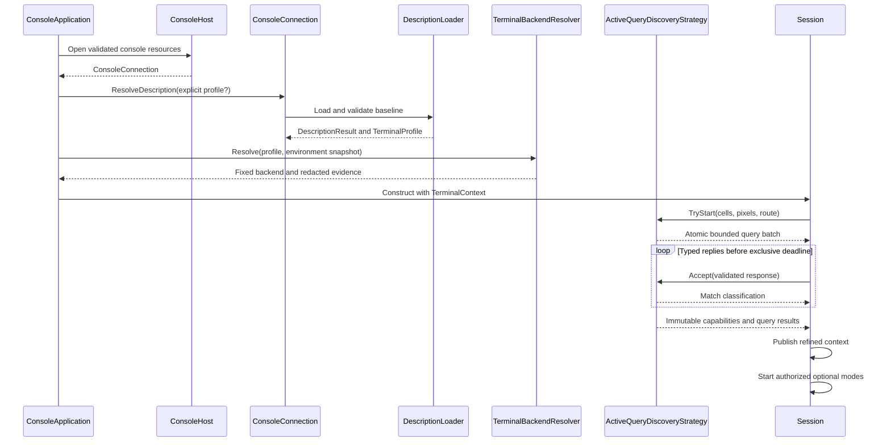

# Terminal discovery pipeline

## Overview

Terminal initialization turns bounded, caller-owned evidence into two distinct
results: one fixed terminal backend identity and one immutable capability
profile that may be refined before publication. Discovery does not own the TTY,
does not copy protocol codecs, and does not authorize output outside the
[capability contract](capabilities.md#overview).

The effective precedence is:

1. conservative library defaults and a validated terminal-description profile;
2. caller-supplied environment hints and safety narrowing;
3. bounded, correlated active-query evidence; and
4. explicit caller overrides.

Description loading establishes the immutable baseline before the strategy
pipeline. The pipeline itself contains exactly one strategy for each defined
`DiscoveryPhase`: `Environment`, `Query`, and `Override`. Its constructor
rejects an undefined, duplicate, missing, or null strategy, then executes the
validated set in phase order. Each strategy receives the current immutable
`Capabilities` value and returns a new value; it cannot mutate an earlier
snapshot or skip the precedence of a later phase.

## Immutable input and adapters

`DiscoveryContext` snapshots the baseline, environment, optional query results,
and optional `Settings`. It reads no process-global environment during
detection. The snapshot preserves caller dictionary lookup semantics for the
known terminal variables while publishing an ordinal, read-only owned copy.

Adapters translate source-specific values into the neutral model; strategies own
precedence:

- `DescriptionEvidenceAdapter` applies validated description programs to the
  conservative semantic baseline.
- `EnvironmentEvidenceAdapter` applies caller-supplied hints and environmental
  narrowing without authorizing output.
- `QueryEvidenceAdapter` applies only validated, bounded query results.
- `OverrideEvidenceAdapter` applies explicit final caller policy.
- `DescriptionBackendEvidenceAdapter` and `EnvironmentBackendEvidenceAdapter`
  produce redacted identity evidence for `TerminalBackendResolver`.

`DescriptionLoader`, `Detector`, and `Negotiator` remain compatibility facades.
`Detector` constructs an immutable context and delegates semantic refinement to
`DiscoveryPipeline`. `Negotiator` delegates active-query lifecycle to
`ActiveQueryDiscoveryStrategy`. Facades MUST preserve public validation,
deadlines, result classification, exact bytes, and publication behavior.

Description diagnostics contain only typed codes and allowlisted capability
names. Backend evidence contains only the typed origin and resolved kind.
Environment values, terminal payloads, clipboard data, native buffers, and raw
command programs MUST NOT enter diagnostics or backend evidence.

## Identity resolution

`TerminalBackendResolver` combines description and environment identity evidence
after those sources have been snapshotted. The resolver is deterministic and
chooses Kitty over iTerm2, iTerm2 over xterm, and xterm over VT.
Equal-specificity environment evidence wins over description evidence. Unknown
or absent evidence returns the VT fallback.

Identity and capabilities are intentionally independent. Identity is selected
once when `Options` creates `TerminalContext`. Query and override evidence may
refine capabilities by producing a replacement context, but the exact backend
reference remains fixed for the application lifetime. Optional sixel, graphics,
keyboard, clipboard, and mode evidence therefore changes authorization, not
emulator identity. See the
[terminal backend contract](terminal-backends.md#overview).

## Active query strategy

`ActiveQueryDiscoveryStrategy` owns one mutable startup query batch. It starts
once, writes one atomic bounded batch, correlates typed replies through
`QueryTracker`, and publishes one immutable capability and query-result
snapshot. `Negotiator` and `NegotiationSink` forward to that lifecycle; they do
not maintain a competing tracker or publication path.

The configured `QueryLimits` bound concurrent queries, payloads, route depth and
bytes, and response history. The strategy records one absolute exclusive UTC
deadline before registering any family. Every registered family uses that same
instant. A reply observed at or after the deadline expires the batch before
matching. An early timer callback is only a wakeup; it re-arms against the same
deadline. Query capacity determines the finite family order specified by the
[capability query contract](capabilities.md#runtime-negotiator).

Replies are parsed and validated by existing typed protocol codecs before the
strategy sees them. `QueryTracker` classifies a response as matched, duplicate,
late, or unknown without allowing the wrong identity to retire another request.
Matched replies may refine evidence. Missing, malformed, late, duplicate,
contradictory, oversized, or unsolicited values remain conservative and emit
redacted diagnostics according to their existing protocol contracts. Query
classification never suppresses the validated typed response event owned by the
[runtime routing contract](../protocols/runtime-routing.md#inbound-consumption-surface).

Active-query output uses the
[multiplexer boundary](capabilities.md#multiplexer-boundary). An approved route
wraps the complete typed batch and unwraps replies before correlation. Route
encoding failure retires the batch and publishes absent evidence atomically,
without partial bytes, flush, active optional modes, or scheduled deadline work.
A route never changes backend identity.

## Initialization sequence

Application construction never occurs after a rejected description. The runtime
publishes the startup profile before the retained first resize, optional mode
selection, and first frame. Existing protocol encoders and decoders remain the
only source of query and mode bytes. No discovery class may emit hand-written
escape sequences or interpret raw replies independently.

## Publication and fallback

The baseline remains usable when optional evidence is absent. Environment hints
cannot replace database command programs. Query results can refine semantic
features but cannot rewrite description programs or key maps. Explicit
`Settings` apply last and cannot introduce raw commands.

Publication creates immutable snapshots. A response arriving after publication
may be delivered as a typed event or diagnostic but cannot mutate the profile
used by an in-flight frame. A capability refresh preserves backend identity and
forces the documented layout or rendering invalidation before a later frame.
Unknown identity keeps the VT backend; absent optional evidence keeps safe
fallback. Strict mode may promote an existing diagnostic where specified, but
does not change valid output.

## Expected behavior

Tests MUST freeze description, environment, query, and override precedence;
strategy sorting and undefined/duplicate/missing rejection; adapter absence,
validation, immutability, and redaction; resolver specificity and fixed
identity; and `Detector`/`Negotiator` facade parity. Active-query tests MUST
cover exact batch bytes, every supported capacity, shared deadlines, all reply
classifications, fragmentation, bounded history, atomic route failure,
publication order, diagnostics, and conservative timeout. A cross-layer test
MUST drive description, environment, query replies, backend selection,
capability publication, optional-mode startup, input routing, first output, and
reverse cleanup through the real runtime boundaries.
