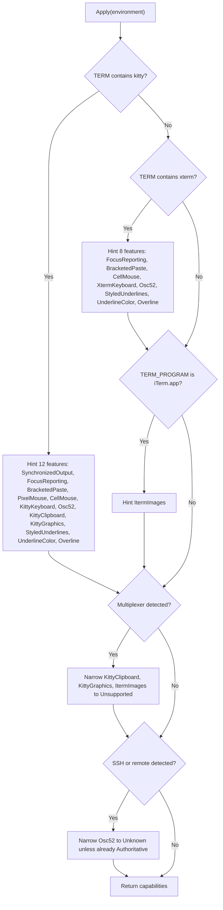
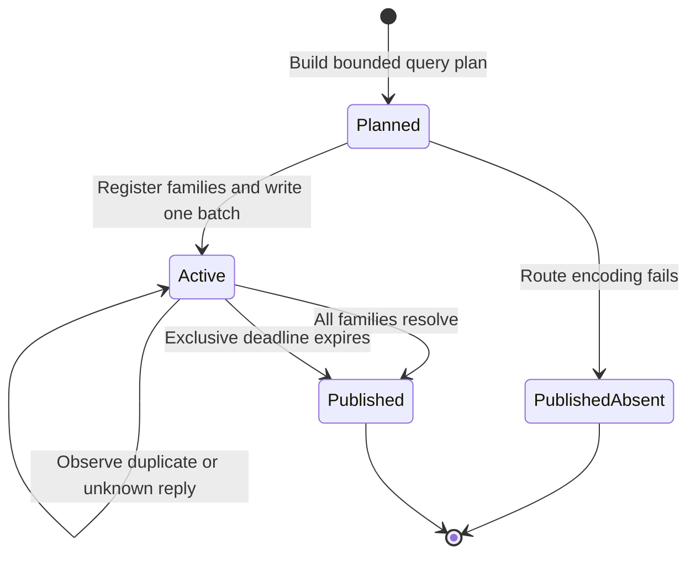
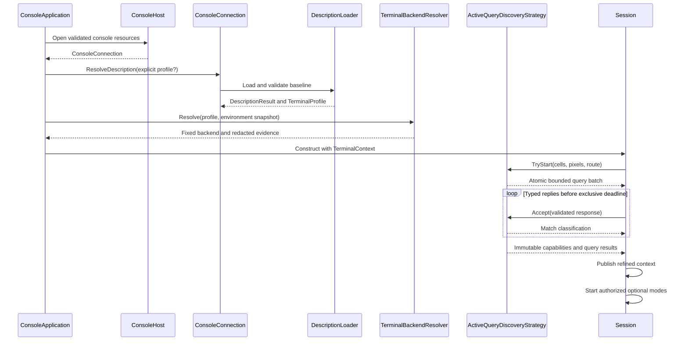

# Terminal discovery pipeline

## Overview

Terminal initialization gathers facts about the current terminal before the
first frame. Each fact is **evidence**: a value paired with the source that
produced it. SharpVision turns bounded, caller-owned evidence into two distinct
results: one fixed terminal backend identity, and one immutable capability
profile that may be refined before publication. Discovery does not own the TTY,
does not copy protocol codecs, and does not authorize output outside the
[capability contract](capabilities.md#overview).

| Result                    | Answers                                      | Can change after startup? |
| ------------------------- | -------------------------------------------- | ------------------------- |
| Terminal backend identity | Which protocol family should route messages? | No.                       |
| Capability profile        | Which optional features are safe to use?     | Yes, by replacement.      |

The effective precedence is:

1. conservative library defaults and a validated terminal-description profile;
2. caller-supplied environment hints and safety narrowing;
3. bounded, correlated active-query evidence; and
4. explicit caller overrides.

Description loading establishes the immutable baseline before the strategy
pipeline runs. The pipeline contains exactly one strategy for each defined
`DiscoveryPhase`: `Environment`, `Query`, and `Override`. Its constructor
rejects an undefined, duplicate, missing, or null strategy, then executes the
validated set in phase order. Each strategy receives the current immutable
`Capabilities` value and returns a new value; a strategy cannot mutate an
earlier snapshot and cannot skip the precedence of a later phase.

## Immutable input and adapters

`DiscoveryContext` snapshots the baseline, the environment, optional query
results, and optional `CapabilityOverrides`. It reads no process-global
environment during detection. The snapshot preserves the caller dictionary's
lookup semantics for the known terminal variables while publishing an ordinal,
read-only owned copy.

Adapters translate source-specific values into the neutral model, and the
strategies own precedence:

- `DescriptionEvidenceAdapter` applies validated description programs to the
  conservative semantic baseline.
- `EnvironmentEvidenceAdapter` applies caller-supplied hints and environmental
  narrowing without authorizing output.
- `QueryEvidenceAdapter` applies only validated, bounded query results.
- `OverrideEvidenceAdapter` applies explicit final caller policy.
- `DescriptionBackendEvidenceAdapter` and `EnvironmentBackendEvidenceAdapter`
  produce redacted identity evidence for `TerminalBackendResolver`.

`DescriptionLoader`, `CapabilityDetector`, and `Negotiator` remain as
compatibility facades. `CapabilityDetector` constructs an immutable context and
delegates semantic refinement to `DiscoveryPipeline`. `Negotiator` delegates the
active-query lifecycle to `ActiveQueryDiscoveryStrategy`. The facades MUST
preserve the public validation, deadlines, result classification, exact bytes,
and publication behavior.

Description diagnostics contain only typed codes and allowlisted capability
names. Backend evidence contains only the typed origin and resolved kind.
Environment values, terminal payloads, clipboard data, native buffers, and raw
command programs MUST NOT enter diagnostics or backend evidence.

### Environment hint precedence

`EnvironmentEvidenceAdapter.Apply` is the internal branch structure that turns
`TERM`, `COLORTERM`, and `TERM_PROGRAM` into tentative feature hints before
narrowing them for a detected multiplexer or a remote connection.

The xterm check and the iTerm2 check are independent siblings, not a chained
`else if`: a genuine iTerm2 session reports `TERM=xterm-256color` by default, so
it receives the xterm hint set and its own `ItermImages` hint together. Only
Kitty is mutually exclusive with the rest of the tree, because
`TERM=xterm-kitty` never also contains `xterm`. This exact exclusivity was the
source of two real bugs: an initial version let a stale `TERM_PROGRAM=iTerm.app`
add the `ItermImages` hint even on a genuine Kitty session, and the fix that
followed over-corrected by chaining the iTerm2 check as a third `else if`
sibling of the kitty/xterm chain, which wrongly made iTerm2 mutually exclusive
with xterm too and dropped the `ItermImages` hint from real iTerm2 sessions
(which report `TERM=xterm-256color` and matched the xterm branch first).

## Runtime diagnostics snapshot

`TerminalDiagnostics` preserves the discovery facts needed to explain runtime
behavior after the startup negotiator has retired. The immutable snapshot
contains the fixed canonical backend family and protocol-extension composition,
typed redacted backend-evidence sources, negotiation state and final normalized
`TerminalQueryDiagnostics`, configured, evidence-authorized, and successfully
activated terminal modes, multiplexer topology and effective typed route
decisions, and renderer graphics-backend selection. XTGETTCAP diagnostics retain
only approved capability names, never their response bytes. The snapshot
contains no raw environment values, query bytes, clipboard content, or unbounded
response history.

`Session.Diagnostics` is available immediately: it reports `Pending` while an
active batch is outstanding and `Disabled` when the caller pinned a profile.
Every completion path—matched replies, the fence, deadline expiry, input EOF, or
atomic route failure—replaces it with one `Completed` snapshot before the
matching capability profile is published. `ISink.Diagnostics` carries that
ordered replacement and defaults to a validated no-op for sinks that do not
consume diagnostics. Successful mode leases publish a later snapshot so
authorization cannot be mistaken for activation.

`Application.TerminalDiagnostics` republishes the snapshot on the UI dispatcher
through `TerminalDiagnosticsChanged`. The application adds the renderer-owned
`CellFallback`, `Kitty`, or `NonRetained` graphics selection without changing
session identity or query evidence. A diagnostics event is raised before the
corresponding `CapabilitiesChanged` event so consumers never explain a new
profile with stale discovery facts.

## Identity resolution

`TerminalBackendResolver` combines description and environment identity evidence
after those sources have been snapshotted. The resolver is deterministic: it
chooses Kitty over iTerm2, iTerm2 over xterm, and xterm over VT. When both
sources offer evidence of equal specificity, the environment evidence wins over
the description evidence. Unknown or absent evidence returns the VT fallback.

Identity and capabilities are intentionally independent. Identity is selected
once, when `Options` creates `TerminalContext`. Query and override evidence may
refine capabilities by producing a replacement context, but the exact backend
reference stays fixed for the application lifetime. Optional sixel, graphics,
keyboard, clipboard, and mode evidence therefore changes authorization, not
emulator identity. See the
[terminal backend contract](terminal-backends.md#overview).

## Active query strategy

`ActiveQueryDiscoveryStrategy` owns one mutable startup query batch. It starts
once, writes one atomic bounded batch, correlates typed replies through
`QueryTracker`, and publishes one immutable capability and query-result
snapshot. `Negotiator` and `NegotiationSink` forward to that lifecycle; they do
not maintain a competing tracker or publication path.

The tracker classifies each valid reply without changing transport order:

| Classification | Meaning                                                     | Capability effect                         |
| -------------- | ----------------------------------------------------------- | ----------------------------------------- |
| Matched        | The reply has the expected family and identity.             | May refine evidence.                      |
| Duplicate      | The matching request already completed.                     | None.                                     |
| Late           | The reply arrived at or after the exclusive deadline.       | None.                                     |
| Unknown        | No registered request owns the reply.                       | None.                                     |
| Contradictory  | The reply is valid but conflicts with authoritative policy. | None; the stronger evidence remains.      |
| Malformed      | A protocol decoder rejected the bytes before correlation.   | None; a redacted diagnostic is published. |

The configured `QueryLimits` bound concurrent queries, payloads, route depth and
bytes, and response history. The strategy records one absolute exclusive UTC
deadline before registering any family, and every registered family uses that
same instant. A reply observed at or after the deadline expires the batch before
matching. An early timer callback is only a wakeup; it re-arms against the same
deadline. Query capacity determines the finite family order specified by the
[capability query contract](capabilities.md#runtime-negotiator).

Replies are parsed and validated by the existing typed protocol codecs before
the strategy sees them. `QueryTracker` classifies a response as matched,
duplicate, late, or unknown, and a response with the wrong identity can never
retire another request. Matched replies may refine evidence. Missing, malformed,
late, duplicate, contradictory, oversized, or unsolicited values leave the
conservative value in place and emit redacted diagnostics according to their
existing protocol contracts. Query classification never suppresses the validated
typed response event owned by the
[runtime routing contract](../protocols/runtime-routing.md#inbound-consumption-surface).

Active-query output uses the
[multiplexer boundary](capabilities.md#multiplexer-boundary). An approved route
wraps the complete typed batch and unwraps replies before correlation. If route
encoding fails, the batch is retired and absent evidence is published atomically
— no partial bytes, no flush, no active optional modes, and no scheduled
deadline work. A route never changes backend identity.

The batch retires outstanding families in two ways:

1. `Keyboard` and `KittyGraphics` piggyback on primary device attributes (DA1).
   If DA1 arrives without their reply, they retire immediately instead of
   waiting for the deadline.
2. The one shared exclusive deadline retires the batch when no reply arrives for
   a still-outstanding family.

The last standard query is `CSI 6n`, a cursor-position request used as a
completion fence, but its reply resolves only its own tracked family. It
deliberately does not retire any other still-outstanding family: the reply
grammar is byte-identical to a modified F3 keystroke, which a user or replayed
typeahead can deliver at any point in the shared deadline window, so a match is
never trustworthy proof that every other family stayed silent. The batch still
publishes once every family has resolved — through its own matching reply, DA1
piggyback, or the fence's own resolution when it happens to be the last
outstanding family — or once the shared deadline expires.

Silence never means unsupported. A family retired by the deadline stays absent
because that alone never proves what that feature can do.

Query planning consults a temporary projection of the baseline with environment
evidence applied. The projection affects only these decisions:

| Situation                              | Probe omitted                                  | Reason                                                      |
| -------------------------------------- | ---------------------------------------------- | ----------------------------------------------------------- |
| Detected multiplexer without a route   | `OSC 1337 ; Capabilities`                      | The inner environment cannot prove the outer iTerm2 host.   |
| Detected multiplexer or SSH connection | Kitty clipboard mode                           | The environment already narrows the feature to unsupported. |
| Approved outer-terminal route          | Neither probe is omitted for this reason alone | Explicit outer evidence replaces inner environment hints.   |

The projection is never assigned back to the baseline or passed to
`CapabilityDetector.Detect`; it changes query planning, not evidence precedence.

## Initialization sequence

Application construction never happens after a rejected description. The runtime
publishes the startup profile before the retained first resize, optional mode
selection, and the first frame. The existing protocol encoders and decoders
remain the only source of query and mode bytes: no discovery class may emit
hand-written escape sequences or interpret raw replies on its own.

## Publication and fallback

The baseline remains usable when optional evidence is absent. Environment hints
cannot replace database command programs. Query results can refine semantic
features but cannot rewrite description programs or key maps. Explicit
`CapabilityOverrides` apply last and cannot introduce raw commands.

Publication creates immutable snapshots. The following fallbacks are observable
at the public boundary:

| Condition                            | Result                                                                        |
| ------------------------------------ | ----------------------------------------------------------------------------- |
| Description is valid; queries silent | The conservative description-based profile remains usable.                    |
| Reply arrives after publication      | A typed event or diagnostic is delivered; the active profile does not mutate. |
| Capability profile is replaced       | Backend identity is preserved and later layout or rendering is invalidated.   |
| Identity is unknown                  | The VT backend is retained.                                                   |
| Optional evidence is absent          | The feature stays unavailable or uses its documented safe fallback.           |

Strict mode may promote an existing diagnostic where specified, but it does not
change valid output.

## Expected behavior

Readers can rely on the following, and the test suites keep each point true:

- Description, environment, query, and override evidence apply in exactly the
  documented precedence; strategy ordering is enforced, and an undefined,
  duplicate, or missing strategy is rejected at construction.
- Adapters handle absent sources, validate their input, preserve immutability,
  and redact diagnostics and backend evidence.
- The resolver applies its specificity order deterministically, and the resolved
  identity stays fixed afterward.
- `CapabilityDetector` and `Negotiator` behave identically to the pipeline and
  strategy they delegate to.
- The active-query batch emits exact bytes at every supported capacity, shares
  one deadline across families, classifies every reply kind (including
  fragmented replies), bounds its history, fails routes atomically, publishes in
  the documented order, emits diagnostics, and times out conservatively.
- One cross-layer scenario drives description, environment, query replies,
  backend selection, capability publication, optional-mode startup, input
  routing, first output, and reverse cleanup through the real runtime
  boundaries.
