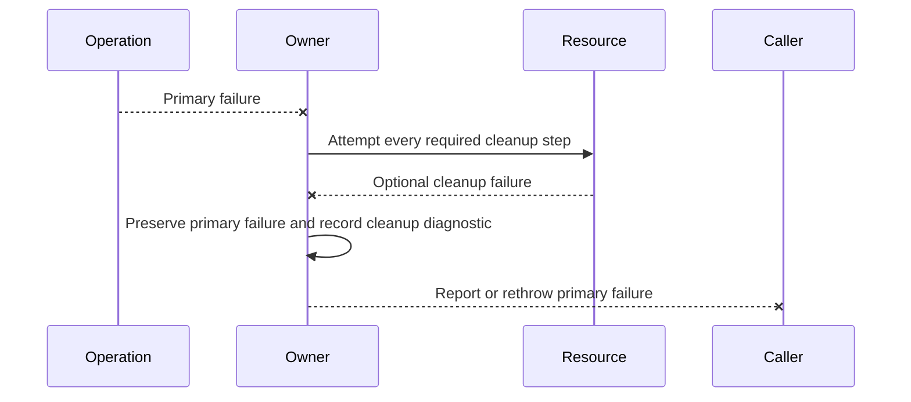

# Error handling and diagnostics

## Overview

Programmer errors throw immediately before observable mutation. Environmental
failures degrade or terminate through typed results/events and structured
diagnostics according to whether safe continuation is possible.

## Programmer errors

Examples include null required values, invalid dimensions/percentages, enum
values outside the contract, parenting cycles, cross-thread mutation,
disposed-object access, invalid span lengths, and ownership violations. Public
XML docs name the exception and validation rule.

## Environmental failures

Unsupported capabilities, missing query replies, malformed/oversized terminal
input, permission denial, timeout, transport closure, and cleanup failure are
environmental. The library preserves parser sync where possible, emits a
redacted diagnostic, and chooses the documented fallback. A disconnected
transport stops the application after restoration attempts.

## Diagnostic model

The protocol `Diagnostic` carries only a stable `DiagnosticCode`, sequence kind,
stream offset, and discarded-byte count. Its invariant-culture text contains
those structural fields and no input payload. Kitty packet values, clipboard
bytes, passwords, names, and terminal-provided secrets are never included.
Transaction state and sanitized correlation identifiers remain in their typed
objects rather than being copied into diagnostics. Severity, runtime operation,
and captured exceptions belong to later host-level diagnostic envelopes; they
are not falsely claimed by the protocol value.

## Exception preservation

Mode restoration and disposal execute in `finally`. When cleanup also fails, the
original exception remains primary and cleanup is attached diagnostically.
Unhandled application callbacks raise `Application.UnhandledException` at the
dispatcher boundary. They force the idempotent shutdown path unless that exact
event is marked handled; handling permits the dispatcher to continue but does
not erase `Application.Failure`. Terminal session faults always drive shutdown
after notification because transport ordering can no longer be guaranteed. The
runtime exposes no separate global continue-after-unhandled policy.

`Renderer.LastCleanupException` preserves the first bounded recovery failure for
the renderer lifetime; later successful frames and secondary failures neither
clear nor replace it. `Runtime.Session.LastCleanupException` retains the first
session recovery failure without replacing a primary write, flush, startup,
read, resize, input-handler, or cancellation exception. Normal transport EOF is
a typed closure callback, not a fabricated fault.
`Application.LastCleanupException` exposes the first later renderer or session
cleanup failure while preserving the primary application failure.

Layout and rendering clear dirty state only around an attempted transaction. If
a control extension point throws, the affected measure, arrange, or render bit
is restored before the exception escapes, so a caught diagnostic never leaves a
silently clean but incomplete tree. Routed handler snapshots are always returned
to their pools from `finally` cleanup.

## Expected behavior

| Layer       | Required evidence                                                                                         |
| ----------- | --------------------------------------------------------------------------------------------------------- |
| Unit        | Argument atomicity, diagnostic redaction, dirty-state restoration, and idempotent cleanup.                |
| Integration | Primary exception preservation across callbacks, rendering, transport, session, and application shutdown. |
| End to end  | Injected failures retain the first failure and still release every owned resource.                        |
