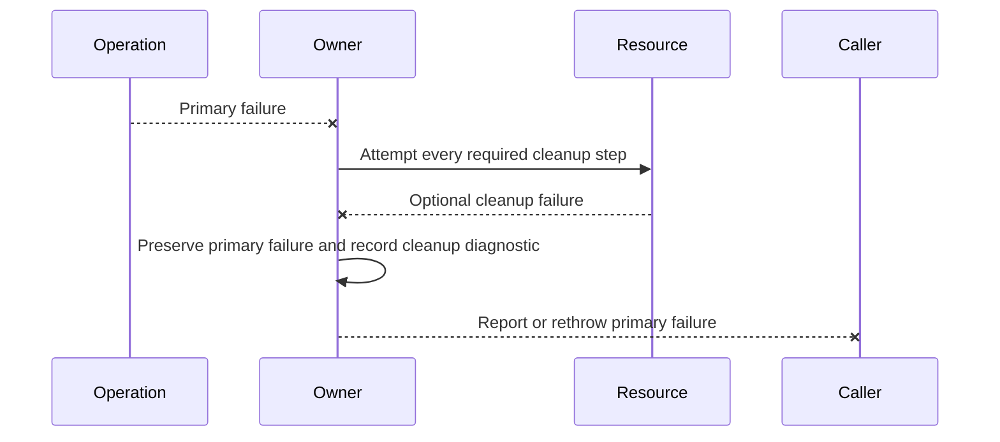

# Error handling and diagnostics

## Overview

SharpVision separates programmer errors from environmental failures. A
programmer error throws immediately, before any observable state changes. An
environmental failure either degrades to a documented fallback or terminates the
application, depending on whether safe continuation is possible, and is reported
through typed results, typed events, and structured diagnostics.

## Programmer errors

Programmer errors include passing null for a required value, invalid dimensions
or percentages, enum values outside the documented range, parenting cycles,
cross-thread mutation, access to a disposed object, invalid span lengths, and
ownership violations. The public XML documentation for each API names the
exception type and the validation rule that triggers it.

## Environmental failures

Environmental failures include unsupported capabilities, missing query replies,
malformed or oversized terminal input, permission denial, timeouts, transport
closure, and cleanup failure. When one occurs, the library preserves parser
synchronization where it can, emits a redacted diagnostic, and falls back to the
documented behavior. A disconnected transport stops the application after the
library has attempted terminal restoration.

## Diagnostic model

A protocol `Diagnostic` carries only a defined stable `DiagnosticCode`, the
defined sequence kind, the stream offset, and the count of discarded bytes. Its
invariant-culture text repeats those structural fields and contains no input
payload. Kitty packet values, clipboard bytes, passwords, names, and other
terminal-provided secrets never appear in a diagnostic. Transaction state and
sanitized correlation identifiers stay in their typed objects rather than being
copied into diagnostics. Severity, the runtime operation, and captured
exceptions belong to the host-level diagnostic envelopes added later; the
protocol value does not claim them.

## Exception preservation

Mode restoration and disposal run in `finally` blocks. When cleanup itself
fails, the original exception stays primary and the cleanup failure is attached
as a diagnostic.

An unhandled exception from an application callback raises
`Application.UnhandledException` at the dispatcher boundary. Unless a handler
marks that exact event as handled, the exception forces the idempotent shutdown
path. Marking it handled lets the dispatcher continue, but does not erase
`Application.Failure`. A terminal session fault always drives shutdown after
notification, because transport ordering can no longer be guaranteed once the
session has faulted. The runtime exposes no separate global
continue-after-unhandled policy; the per-event handled flag is the only
continuation decision.

`Renderer.LastCleanupException` keeps the first bounded recovery failure for the
lifetime of the renderer; later successful frames and secondary failures neither
clear nor replace it. `Runtime.Session.LastCleanupException` retains the first
session recovery failure and never replaces a primary write, flush, startup,
read, resize, input-handler, or cancellation exception. A normal transport EOF
arrives as a typed closure callback; it is not turned into a fault.
`Application.LastCleanupException` exposes the first later renderer or session
cleanup failure while preserving the primary application failure.

Layout and rendering clear dirty state only around an attempted transaction. If
a control extension point throws, the affected measure, arrange, or render bit
is restored before the exception escapes, so a caught diagnostic never leaves a
tree that looks clean but is incomplete. Routed handler snapshots are always
returned to their pools from `finally` cleanup.

## Expected behavior

The guarantees above are backed by evidence at three layers:

| Layer       | Required evidence                                                                                         |
| ----------- | --------------------------------------------------------------------------------------------------------- |
| Unit        | Argument atomicity, diagnostic redaction, dirty-state restoration, and idempotent cleanup.                |
| Integration | Primary exception preservation across callbacks, rendering, transport, session, and application shutdown. |
| End to end  | Injected failures retain the first failure and still release every owned resource.                        |
