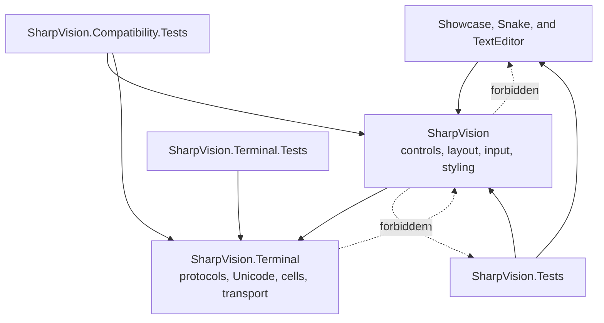
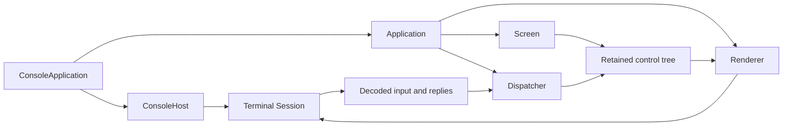

# Architecture specifications

## Architecture map

SharpVision has one dependency direction: the retained UI layer depends on the
terminal layer, while the terminal layer knows nothing about controls. The
showcase and runnable examples are consumers, not privileged framework code.

The dotted edges are forbidden. The precise project and namespace rules live in
[project structure](project-structure.md#project-structure-contract).

## Runtime ownership

`Application` is the coordination boundary. Terminal readers publish bounded,
immutable work; the dispatcher serializes control mutation; the renderer turns
the committed tree into cells and terminal bytes. See the
[runtime event loop](runtime-event-loop.md#runtime-event-loop-contract) for
ordering and [memory ownership](memory-ownership.md#memory-ownership-contract)
for the lifetimes crossing these arrows.

## Architecture contracts

- [Project structure](project-structure.md#project-structure-contract) defines
  layer direction, assemblies, namespaces, and change boundaries.
- [Runtime event loop](runtime-event-loop.md#runtime-event-loop-contract)
  defines dispatcher ordering, input, resize, frames, idle, and shutdown.
- [Rendering pipeline](rendering-pipeline.md#rendering-pipeline-contract)
  defines Unicode cell drawing, damage, synchronized output, and frame commit.
- [Capabilities](capabilities.md#capability-contract) defines detection,
  overrides, publication, and safe fallback.
- [Terminal backends](terminal-backends.md#terminal-backend-contract) separates
  physical connection ownership, fixed emulator identity, composed protocol
  extensions, capability authorization, and renderer-owned graphics backends.
- [Discovery pipeline](discovery-pipeline.md#discovery-pipeline-contract)
  defines immutable evidence, strategy precedence, adapters, backend resolution,
  bounded active queries, and publication.
- [Terminal integration](terminal-integration.md#terminal-integration-contract)
  connects hosting, description loading, discovery, protocol routing, rendering,
  terminal services, fallback, and cleanup as one end-to-end contract.
- [Memory ownership](memory-ownership.md#memory-ownership-contract) defines
  spans, pooled storage, copies, and asynchronous lifetime.
- [Error handling](error-handling.md#error-handling-contract) defines programmer
  errors, environmental failures, diagnostics, and restoration.
- [Showcase](showcase.md#showcase-contract) defines the interactive gallery and
  executable API proof.
- [Floating surfaces](../concepts/floating-surfaces.md#floating-surface-contract)
  defines the one-identity lifecycle shared by Windows, dialogs, Popups,
  Flyouts, and Tooltips.

For application-facing explanations, start with the
[walkthroughs](../walkthroughs/index.md#walkthroughs). For verified
availability, use [feature support](../features/index.md#feature-support).
