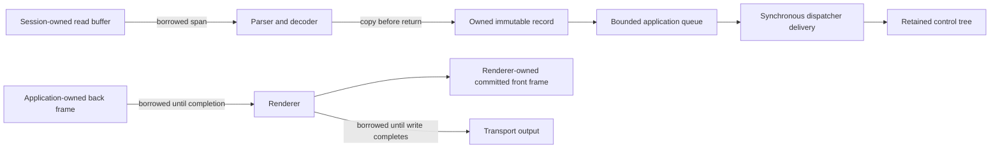

# Memory ownership

## Memory ownership contract

Borrowed spans are valid only for the duration of a synchronous call. Owned
memory has an explicit owner and disposal point. Pooled storage is never exposed
after return, frame completion, or disposal.

| Data                    | Owner                        | Lifetime                         |
| ----------------------- | ---------------------------- | -------------------------------- |
| Transport read buffer   | Runtime session              | Until the drained read completes |
| Decoder state           | Decoder instance             | Until reset/disposal             |
| Decoded immutable event | Event value or owned payload | Through dispatcher delivery      |
| Terminal context        | Session and application      | One immutable snapshot at a time |
| Backend identity        | Shared immutable instance    | Fixed for application lifetime   |
| Discovery input         | Discovery context            | One detection pass               |
| Query lifecycle state   | Active-query strategy        | Startup publication or disposal  |
| Front frame             | Renderer                     | Until a later successful commit  |
| Back frame              | Frame builder                | Until commit/abandon             |
| Grapheme arena          | Frame/screen owner           | While referenced by owned cells  |
| Image source bytes      | Immutable graphics image     | Image value lifetime             |
| Image placements        | Rendering frame              | Frame clear, copy, or disposal   |
| Graphics backend state  | Renderer                     | Renderer disposal                |
| Encoded write batch     | Renderer                     | Until write and flush complete   |
| Child control           | Parent `Control` slot        | Until removal/owner disposal     |
| Routed event snapshot   | Router                       | Until synchronous dispatch ends  |
| UI input record         | `Application`                | Until dispatcher delivery        |
| UI back frame           | `Application`                | Until render completion/disposal |

Every asynchronous boundary receives owned storage or a copy. Borrowed spans end
with their synchronous call, and borrowed frame or transport memory remains
alive until the returned asynchronous operation completes.

`Parser` invokes `ISequenceSink` synchronously. Every span supplied to a sink is
borrowed only until that callback returns. A sink that queues or retains a value
must copy it. Parser disposal clears and returns its pooled terminal-string
storage.

`Input.Decoder` borrows each transport span only until `Decode` returns. Key,
text, pointer, and focus callbacks contain values only. During bracketed paste,
the decoder owns one finite pooled buffer, clears it on overflow, completion,
truncation, and disposal, and copies normalized UTF-8 into the delivered
`Paste`. Its `ReadOnlyMemory<byte>` therefore remains owned and stable after
later decoder calls; no pooled array or transport memory escapes.

`Osc52.Decode` and `Kitty.Clipboard.Packet.Parse` copy successfully decoded
payloads into owned arrays. A completed `Kitty.Clipboard.Transaction` transfers
its accumulated MIME buffers into `Kitty.Clipboard.Result`; the result owner
must dispose it, which clears every buffer. Temporary Base64 and transaction
buffers are returned with clearing.

`DiscoveryContext` owns an immutable baseline plus copied environment, query,
and override references for one semantic discovery pass. Source adapters retain
no caller dictionary, native description buffer, or raw terminal payload.
`TerminalBackendResolver` publishes immutable redacted evidence and one shared
backend instance. `TerminalContext` owns one immutable `TerminalProfile`
reference and that fixed backend reference; capability refinement creates a new
context without replacing backend identity. The
[discovery contract](discovery-pipeline.md#immutable-input-and-adapters) owns
redaction and publication ordering.

`ActiveQueryDiscoveryStrategy` owns its `QueryTracker`, pending family sets,
typed response values, shared deadline, and unpublished evidence until it
publishes one immutable result. `Negotiator` and `NegotiationSink` borrow and
forward that state; they do not own a second lifecycle. Typed responses copied
by the parser/router remain owned after the session read buffer is reused.

A rendering `Frame` owns its pooled cells and UTF-8 arena until disposal.
`CellInfo` contains metadata only; `CopyGrapheme` is the caller-owned byte
boundary. `Canvas` borrows its frame and becomes unusable when that frame is
disposed. `Frame.Clear` clears active text bytes for reuse, while disposal
clears the full rented arrays—including hyperlink references—before pool return.

`Renderer` owns its committed front-frame copy, one finite pooled byte buffer,
and one bounded description-program interpreter. That committed frame is never
handed to a caller: damage tracking compares every target against it, so
external mutation would desynchronize the frame from the physical terminal and
external disposal would permanently break a live renderer.
`Renderer.AttachCommittedFrame` instead links it to a target frame, which reads
it only through `Canvas.HasPreviousFrame` and `Canvas.CopyFromPrevious`. That
copy takes complete grapheme owners only — a wide cluster straddling the region
is written blank rather than split — validates geometry compatibility, and
preflights the destination arena, so a rejected copy leaves the target unchanged
and repeated copies cannot exceed the advertised bound. Its preallocated
transaction snapshot retains only owned immutable static-variable values and
rolls back on failed encoding or output. The caller retains ownership of every
back frame and transport. Back frame memory is borrowed until `RenderAsync`
completes; `ITransport.WriteAsync` borrows renderer memory until its returned
operation completes and must either transfer the complete memory or throw.
Renderer disposal never disposes a borrowed transport.

`Terminal.Graphics.ImageSource` copies RGBA or structurally validated PNG bytes
into private immutable storage. Public callers recover bytes only through a
complete copy into caller-owned memory. Synchronous terminal encoders may borrow
the internal source span only until they return; a renderer must copy encoded
output into its owned finite batch before awaiting transport I/O.

A rendering frame retains immutable images through a finite cleared pooled
placement array. Nonempty placement values contain image identity and positive
source and destination geometry only; they never expose image bytes. The valid
default/`Empty` sentinel retains no image and cannot enter the active span.
Clone and copy own independent arrays, preserve stable order, and may share
immutable image objects. Frame clear and disposal clear active placement
references before pool return.

The renderer exclusively owns an optional `IGraphicsBackend`. Backend
preparation may allocate but completes before terminal I/O; its upload,
placement, and removal writers synchronously borrow the renderer batch. Prepared
backend state is committed only after the complete shared cell-and-graphics
batch flushes, or discarded and fully invalidated after encoding, write, flush,
or cancellation uncertainty. Identifiers newly referenced by a possibly partial
failed batch remain reserved in finite uncertain-image and uncertain-placement
collections. A later committed cleanup returns them only after exact remote
deletes flush; local disposal returns them without claiming remote cleanup. No
graphics backend retains a borrowed frame or transport after its call. Renderer
disposal releases the front before graphics-backend cleanup and releases its
pooled batch in a `finally` path. A graphics-backend cleanup exception therefore
propagates without retaining local pooled ownership or leaving the writer gate
acquired; subsequent disposal is a no-op.

`Runtime.Session` rents one finite read buffer for the event loop and clears it
before pool return. Because `ITransport.ReadAsync` borrows that destination
until its returned operation completes, and cancellation is only a request, the
event loop drains the outstanding read before it releases the rental. Every
event-loop exit — orderly closure, cancellation, a sink or optional-mode
failure, or a transport fault — cancels the linked token, awaits the read to
terminal completion, and only then returns the cleared array. The drain is
bounded by `Options.CleanupTimeout`: a transport that neither completes nor
honors cancellation within that budget permanently forfeits that one array
instead of publishing storage it can still write into. The session also observes
its abandoned read, resize, and negotiation-deadline tasks so a late failure
cannot resurface as an unobserved task exception. `IResizeSource` returns
immutable `Dimensions` values and retains no caller memory. The session owns
disposal of its transport and resize source; `StreamTransport` in turn owns its
streams unless `leaveOpen` is true.

Every `SharpVision.Controls.Control` owns one central registry of ordered visual
slots. `Container.Children` exposes only its public container-child slot;
`ListView`, `Menu`, and `Table` register private item-presentation hosts, while
container and editor scrollbar rails use distinct framework-part slots.
`ContentControl` registers the capacity-one public content role, and `Pressable`
inherits that same edge rather than exposing `Children`. `ComboBox` registers
exactly one private popup-layer framework-part slot; `Popup.Content` owns its
private ListView, so no control receives two parents. `CompositeControl` owns a
permanent composition root, while `ItemsControl` owns one private presentation
host whose children are realized item visuals. Normal and popup are independent
render layers, not ownership roles. A `Popup` still promotes an ordinary legacy
ownership edge when necessary. Removal transfers the now-detached control back
to the caller, while owner disposal recursively disposes every remaining slot
member. Attachment borrows one dispatcher reference for the lifetime of the
attachment. A control subscribes only to its direct `Style`; replacement,
detachment where applicable, and disposal remove owned registrations
deterministically.

`FloatingSurface` retains one public content edge and at most one live
application-owned modal scope. Window and Popup add no proxy ownership edge.
Dialogs are direct Window identities, and Flyout and Tooltip are direct Popup
identities. Screen presentation owns the concrete Window or dialog in its
private Overlay; completion exits modality, removes that same object, and then
disposes it. Tooltip attachment owns the Tooltip itself in one keyed popup-layer
framework slot, which remains reusable after the association is cleared.

Intrinsic border and shadow chrome are style state on the decorated `Control`;
they allocate no child, add no registry edge, and do not change parentage,
routed ancestry, style scope, or disposal ownership. Shadow overflow is drawn
only into the borrowed frame canvas for the current render under the
[intrinsic chrome clipping contract](../controls/control.md#intrinsic-appearance).
When chrome requires distinct bounds, margin, style, ancestry, or lifetime, an
ordinary container such as `Dock` owns the decorated content through its normal
registry slot and is disposed by the same tree rules as every other container.

Routed input snapshots both ancestry and matching handler registrations before
invocation. The router owns its rented arrays only through synchronous preview,
target, and bubble delivery and clears them before pool return. Handlers must
copy any data they retain. Terminal `Paste` payloads are already immutable owned
values and may cross the dispatcher queue without borrowing decoder storage.

`SharpVision.Application` owns its dispatcher, terminal session, renderer,
focus/capture managers, current UI back frame, transport, and resize source. Its
bounded input queue stores immutable value records. Resize storms use one
newest-value slot rather than one allocation per notification. A back frame
remains application-owned until its asynchronous renderer lease completes; only
then may it be disposed or replaced.

## Span and asynchronous boundaries

Text layout borrows `ReadOnlySpan<char>` only for one synchronous format call
and writes immutable `Line` values into caller-owned storage. `Text` owns and
reuses its line array; its public `ReadOnlyMemory<Line>` view remains valid only
until the next successful layout. Every registered slot owns its attached
controls exclusively. Complete-slot and capacity-one replacement validate the
whole candidate snapshot before detaching any previous control.

Protocol encoders write synchronously to caller spans or `IBufferWriter<byte>`.
Any data crossing an `await`, queue, callback, or dispatcher boundary must be an
owned immutable value or copy. A `ReadOnlyMemory<T>` API documents whether the
caller or library owns its backing storage. `StreamTransport` borrows input and
output streams until disposal and serializes writes and flushes. Stream
ownership is decided per stream: the `leaveOpen` overload applies one decision
to both, while `StreamTransport(input, output, leaveInputOpen, leaveOutputOpen)`
lets a transport own the device it was handed while borrowing another. A stream
supplied as both input and output is closed at most once. A host that opens its
own input device must claim that stream, because a single shared flag would
either leak the opened device or close a stream the transport never owned.

## Pool safety

Owners clear sensitive clipboard/credential buffers before returning them when
the pool contract permits. Disposal is idempotent. Debug assertions verify
ownership state, continuation-cell references, and non-overlapping active
leases; public APIs still throw for caller misuse.

## Allocation contract

Steady-state parsing, unchanged measure/arrange, routed-event delivery, damage
scanning, and frame encoding allocate no object per byte, Rune, grapheme, or
cell. A warmed unchanged or profile-driven cursor/style
[`Renderer.RenderAsync`](rendering-pipeline.md#commit-and-terminal-state-invalidation)
call allocates zero managed bytes. Performance tests measure allocation and peak
retained memory for representative frames, control trees, routes, dispatcher
posts, and bounded large payloads.

## Expected behavior

| Layer       | Required evidence                                                                               |
| ----------- | ----------------------------------------------------------------------------------------------- |
| Unit        | Copy/borrow boundaries, disposal, pool return, sensitive clearing, and post-disposal rejection. |
| Allocation  | Warmed parsing, layout, routing, rendering, and encoding meet their allocation contracts.       |
| Integration | No pooled, borrowed, frame-owned, or caller-owned storage crosses its documented lifetime.      |
