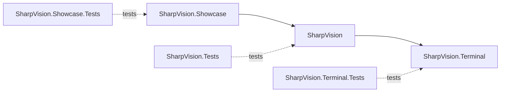

# Project structure

## Project structure contract

The solution contains three production projects and one matching test project
for each.

`SharpVision.Terminal` owns protocols, transport, capabilities, input events,
Unicode cell geometry, screen buffers, damage, and terminal output. It has no
reference to the UI project.

`SharpVision` owns the dispatcher, application lifecycle, traditional mutable
controls, layout, styling, focus, routed input, scrolling, menus, popups, and
windows. It draws to the terminal project's cell canvas and never emits escape
bytes.

`SharpVision.Showcase` owns no library behavior. It composes public APIs into a
responsive gallery. Production projects never reference the showcase or tests.

## Namespace and file boundaries

Namespaces provide context, so public names avoid repeated `Terminal`,
`SharpVision`, and `Control` affixes. Each file has one primary responsibility.
Internal helpers stay inside the lowest layer that owns their invariant.

## Change rule

A cross-layer feature starts with terminal typed behavior, then UI consumption,
then showcase proof. Tests at each layer assert that the dependency direction
remains one-way.
