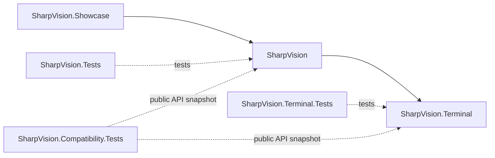

# Project structure

## Project structure contract

The solution contains three production projects and matching test projects for
the terminal and UI libraries. The showcase is compiled as a production example
and has no dedicated test project.

`SharpVision.Terminal` owns protocols, transport, capabilities, input events,
Unicode cell geometry, screen buffers, damage, and terminal output. It has no
reference to the UI project.

Its current public runtime boundaries are `Protocols` for exact encoders and
streaming framing, `Input.Decoder` for typed values, `Rendering.Frame`/`Canvas`
and `Renderer` for semantic output, `Transport.ITransport` for bounded I/O, and
`Runtime.Session` for mode leases plus ordered input/resize/closure/fault
delivery. Internal pooled storage never becomes a cross-project contract.

### Friend access

`SharpVision.Terminal` grants `InternalsVisibleTo` only to its own test and
probe assemblies and to the UI test assembly. It deliberately does **not** grant
it to `SharpVision`.

The UI project consumes the terminal project exactly like any external consumer,
through public API only. That constraint is load-bearing: whenever the UI layer
needs something, the answer is a designed public seam, not friend access. If a
capability is not expressible publicly without leaking low-level machinery, the
terminal project publishes a focused facade that owns that machinery instead.

Two such seams exist today:

| UI need                          | Public seam                             | Stays internal                                                    |
| -------------------------------- | --------------------------------------- | ----------------------------------------------------------------- |
| Expand named terminfo programs   | `TerminalProfile.CreateProgramExpander` | `Programs`, `Program`, `Interpreter`, `Limits`                    |
| Obtain graphics-capable renderer | `Renderer(Capabilities, Route?, …)`     | `IGraphicsBackend`, `GraphicsBackendSelector`, backend identities |

`TerminalContext` and the whole `Backends` namespace also stay internal. The
session owns the only terminal context; the application retains just the
immutable `TerminalProfile`, so no second context lineage can drift from the
resolved backend identity.

`SharpVision` owns the dispatcher, application lifecycle, traditional mutable
controls, layout, styling, focus, and routed input. It draws to the terminal
project's cell canvas and never emits escape bytes. Phase 4 provides these
infrastructure namespaces:

| Namespace                          | Shipped responsibility                                                         |
| ---------------------------------- | ------------------------------------------------------------------------------ |
| `SharpVision.Threading`            | Single-owner dispatcher, invocation, and idle transition.                      |
| `SharpVision.Controls`             | Foundational mutable control tree, ownership, invalidation, and drawing.       |
| `SharpVision.Controls.Display`     | Text, images, indicators, and passive presentation controls.                   |
| `SharpVision.Controls.Input`       | Buttons, editors, pickers, calendars, and value controls.                      |
| `SharpVision.Controls.Layout`      | Panels, overlays, structural chrome, and tables.                               |
| `SharpVision.Controls.Collections` | Lists, tabs, trees, typed collections, and item realization.                   |
| `SharpVision.Controls.Scrolling`   | The ScrollBar control and its glyph and style values.                          |
| `SharpVision.Menus`                | Menus, typed menu entries, and context menus.                                  |
| `SharpVision.Navigation`           | Sidebar navigation controls and entries.                                       |
| `SharpVision.Surfaces`             | Shared elevated-surface lifecycle, bounds, and modality coordination.          |
| `SharpVision.Popups`               | Anchored popup, flyout, and tooltip surfaces.                                  |
| `SharpVision.Windows`              | Free-standing retained window surfaces.                                        |
| `SharpVision.Dialogs`              | Complete retained modal tasks with typed options and results.                  |
| `SharpVision.Layout`               | Shared box geometry, measure/arrange, and track allocation.                    |
| `SharpVision.Scrolling`            | Scroll axes, visibility, chrome, range/thumb math, and transition events.      |
| `SharpVision.Input`                | Shared routed input, focus, hit testing, and pointer capture.                  |
| `SharpVision.Styling`              | Shared style resources, chrome contracts, and visual-state resolution.         |
| `SharpVision.Runtime`              | Terminal session ownership, application lifecycle, and console host bootstrap. |

The current UI project ships the complete
[control catalog](../controls/index.md#control-catalog): layout panels, text and
editing, selection and item controls, menus, context menus, popups, tooltips,
flyouts, windows, intrinsic container scrolling, styling, focus, and routed
input follow these feature and shared-service boundaries. Border and shadow
properties live on `Control`, and `Border` always participates in its base box
model. The sealed control render pipeline always paints configured intrinsic
chrome around `OnRenderContent`; specialized controls select narrow chrome
options rather than bypassing the pipeline. Neither feature requires a dedicated
wrapper type or moves terminal protocol or renderer behavior into the UI layer.

`SharpVision.Controls` is foundational in the sense that every feature namespace
derives from and depends on it, not in the sense that it depends on nothing. It
may reference a feature namespace when a foundational type genuinely _is_ one of
that feature's controls. Two such references are deliberate and permanent:

| Root type                   | Feature dependency             | Why it is not a layering violation                                               |
| --------------------------- | ------------------------------ | -------------------------------------------------------------------------------- |
| `Screen`/`PresentationHost` | `Controls.Layout.Overlay`      | A screen's presentation root is a layering panel; nothing else it could be.      |
| `Container`                 | `Controls.Scrolling.ScrollBar` | Intrinsic `AutoScroll` chrome is the shipped scrollbar, not a private lookalike. |

Both are ordinary same-assembly references with no cycle. The alternative —
root-level lookalike panels kept only so a dependency arrow points one way —
would duplicate shipped behavior to satisfy a diagram. Feature namespaces must
not acquire further root privileges on the strength of this rule; it covers
these two compositions and nothing else.

The separate [dialog catalog](../dialogs/index.md#dialog-catalog) derives typed
tasks from Window without moving them into the Controls folder or namespace. The
dialog object is its direct retained and presented surface. A dialog may own
private filesystem or workflow collaborators, but its visible tree still follows
ordinary control ownership, layout, modality, styling, input, and dispatcher
contracts.

`examples/Showcase` contains `SharpVision.Showcase`, which owns no library
behavior and composes public APIs into a responsive gallery. Production projects
never reference the showcase or tests.

`SharpVision.Compatibility.Tests` owns the versioned public API baselines for
both libraries. It references production projects only from the test layer and
participates in the solution-wide gate. The normative reconciliation workflow is
defined by the
[public API compatibility contract](../testing/correctness-model.md#public-api-compatibility).

## Namespace and file boundaries

Namespaces provide context, so public names avoid repeated `Terminal`,
`SharpVision`, and `Control` affixes. Each file has one primary responsibility.
Internal helpers stay inside the lowest layer that owns their invariant.

## Change rule

A cross-layer feature starts with terminal typed behavior, then UI consumption,
then showcase proof. Tests at each layer assert that the dependency direction
remains one-way.

## Test obligations

| Layer        | Required evidence                                                                                   |
| ------------ | --------------------------------------------------------------------------------------------------- |
| Build        | Production projects compile without test/showcase references and preserve terminal-to-UI direction. |
| Architecture | Namespace, one-type-per-file, public API, and forbidden-type tests cover declared boundaries.       |
| Consumer     | Public examples compile without friend access or production dependency inversion.                   |
