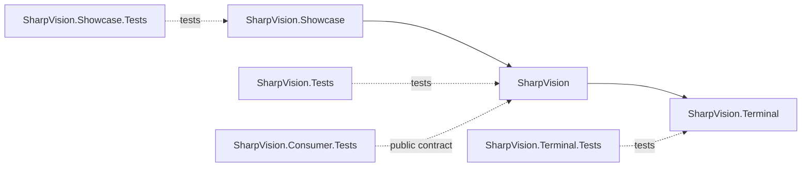

# Project structure

## Project structure contract

The solution contains three production projects, one matching test project for
each, and one deliberately unprivileged consumer-contract test project.

`SharpVision.Terminal` owns protocols, transport, capabilities, input events,
Unicode cell geometry, screen buffers, damage, and terminal output. It has no
reference to the UI project.

Its current public runtime boundaries are `Protocols` for exact encoders and
streaming framing, `Input.Decoder` for typed values, `Rendering.Frame`/`Canvas`
and `Renderer` for semantic output, `Transport.ITransport` for bounded I/O, and
`Runtime.Session` for mode leases plus ordered input/resize/closure/fault
delivery. Internal pooled storage never becomes a cross-project contract.

`SharpVision` owns the dispatcher, application lifecycle, traditional mutable
controls, layout, styling, focus, and routed input. It draws to the terminal
project's cell canvas and never emits escape bytes. Phase 4 provides these
infrastructure namespaces:

| Namespace               | Shipped responsibility                                                         |
| ----------------------- | ------------------------------------------------------------------------------ |
| `SharpVision.Threading` | Single-owner dispatcher, invocation, and idle transition.                      |
| `SharpVision.Controls`  | Mutable control tree, `Screen`, ownership, invalidation, and drawing.          |
| `SharpVision.Layout`    | Box geometry, measure/arrange, and track allocation.                           |
| `SharpVision.Input`     | Routed input, focus, hit testing, and pointer capture.                         |
| `SharpVision.Styling`   | Mutable style resources and visual-state resolution.                           |
| `SharpVision.Runtime`   | Terminal session ownership, application lifecycle, and console host bootstrap. |

The current UI project ships the complete
[control catalog](../controls/index.md#control-catalog): layout panels, text and
editing, selection and item controls, menus, popups, windows, intrinsic
container scrolling, styling, focus, and routed input all remain on these
boundaries. Border and shadow properties live on `Control`, and
`BorderThickness` always participates in its base box model. A render path
paints that chrome only when it calls `RenderChrome` or a specialized
equivalent. A sealed bespoke renderer that calls neither path uses an ordinary
chrome-rendering container when it needs a visible frame or shadow. Neither
feature requires a dedicated wrapper type or moves terminal protocol or renderer
behavior into the UI layer.

`SharpVision.Showcase` owns no library behavior. It composes public APIs into a
responsive gallery. Production projects never reference the showcase or tests.

`SharpVision.Consumer.Tests` compiles the third-party `Gauge`, `FlowPanel`,
`OverflowPanel`, `InteractiveProbe`, and `ExternalContentControl` specimens
against only `SharpVision.csproj`. The product assembly must not grant it
`InternalsVisibleTo`; its build is the executable foundation guard for leaf,
layout, single-content ownership, focus/capture, and lifecycle extension
contracts. Internal `SharpVision.Tests` friendship proves framework invariants,
not third-party usability. Role-specific specimens are added during the role
migration, and a later pack-and-consume gate proves package shape rather than
project-reference shape.

## Namespace and file boundaries

Namespaces provide context, so public names avoid repeated `Terminal`,
`SharpVision`, and `Control` affixes. Each file has one primary responsibility.
Internal helpers stay inside the lowest layer that owns their invariant.

## Change rule

A cross-layer feature starts with terminal typed behavior, then UI consumption,
then showcase proof. Tests at each layer assert that the dependency direction
remains one-way.
