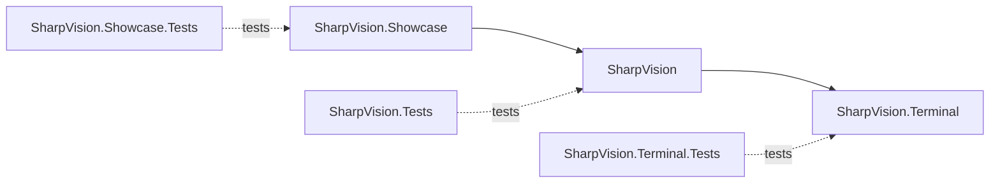

# Project structure

## Project structure contract

The solution contains three production projects and one matching test project
for each.

`SharpVision.Terminal` owns protocols, transport, capabilities, input events,
Unicode cell geometry, screen buffers, damage, and terminal output. It has no
reference to the UI project.

Its current public runtime boundaries are `Protocols` for exact encoders and
streaming framing, `Input.Decoder` for typed values, `Rendering.Frame`/`Canvas`
and `Renderer` for semantic output, `Transport.ITransport` for bounded I/O, and
`Runtime.Session` for mode leases plus ordered input/resize/closure/fault
delivery. Internal pooled storage never becomes a cross-project contract.

`SharpVision` owns the dispatcher, application lifecycle, traditional mutable
controls, layout, styling, focus, and routed input. It draws to the terminal
project's cell canvas and never emits escape bytes. Phase 4 provides these
infrastructure namespaces:

| Namespace               | Shipped responsibility                                      |
| ----------------------- | ----------------------------------------------------------- |
| `SharpVision.Threading` | Single-owner dispatcher, invocation, and idle transition.   |
| `SharpVision.Controls`  | Mutable control tree, ownership, invalidation, and drawing. |
| `SharpVision.Layout`    | Box geometry, measure/arrange, and track allocation.        |
| `SharpVision.Input`     | Routed input, focus, hit testing, and pointer capture.      |
| `SharpVision.Styling`   | Mutable style resources and visual-state resolution.        |
| `SharpVision.Runtime`   | Terminal session ownership and application lifecycle.       |

Phase 5A adds public Stack, Grid, Dock, Overlay, Canvas, Text, and Border types
on these boundaries. Remaining controls, scrolling, menus, popups, and windows
stay assigned to later Phase 5 slices; none may move terminal protocol or
rendering behavior into the UI layer.

`SharpVision.Showcase` owns no library behavior. It composes public APIs into a
responsive gallery. Production projects never reference the showcase or tests.

## Namespace and file boundaries

Namespaces provide context, so public names avoid repeated `Terminal`,
`SharpVision`, and `Control` affixes. Each file has one primary responsibility.
Internal helpers stay inside the lowest layer that owns their invariant.

## Change rule

A cross-layer feature starts with terminal typed behavior, then UI consumption,
then showcase proof. Tests at each layer assert that the dependency direction
remains one-way.
