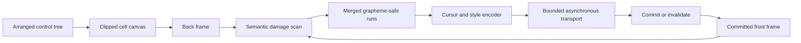

# Rendering pipeline

## Rendering pipeline contract

Controls produce semantic cells; the terminal layer owns byte emission.

## Cell and frame rules

Cell equality includes grapheme identity, width/continuation ownership, colors,
attributes, hyperlinks, and renderer-visible metadata. Damage expands to every
cell owned by an affected grapheme, then merges adjacent ranges.

The encoder minimizes cursor moves and style transitions only after correctness
is known. When synchronized output is available, one complete frame is wrapped
according to the
[mode 2026 contract](../protocols/synchronized-output.md#synchronized-output-contract).

## Commit and invalidation

A complete successful write commits the back frame as the new front state. A
partial/interrupted write, resize, capability change, alternate-screen
transition, clear, or out-of-band output marks terminal state unknown and forces
the next frame to redraw completely.

## Correctness oracle

Tests apply incremental bytes for frame B to a virtual terminal initialized by
frame A and compare the final screen, cursor, style, hyperlink, and mode state
with a clean full render of B. Random frame pairs and targeted wide-cell
transitions use this same oracle.
