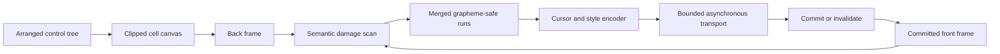

# Rendering pipeline

## Rendering pipeline contract

Controls produce semantic cells; the terminal layer owns byte emission.

## Cell and frame rules

Cell equality includes grapheme identity, width/continuation ownership, colors,
attributes, hyperlinks, and renderer-visible metadata. Damage expands to every
cell owned by an affected grapheme, then merges adjacent ranges.

`Frame` owns a pooled row-major cell array and a finite pooled UTF-8 grapheme
arena. Public callers observe only `CellInfo` and copy a complete grapheme into
their own span; pooled memory never escapes. `Canvas.Draw` segments and measures
with the frame's explicit ambiguous-width policy, preflights the complete arena
cost, then mutates in a second pass. A failed capacity check therefore leaves
the frame unchanged.

`Canvas.Draw` and `Canvas.DrawRune` use an opaque background by default. Passing
`BackgroundMode.Transparent` keeps the destination cell's existing background
while replacing its grapheme, foreground, attributes, and hyperlink. The same
option is available to `Canvas.ApplyStyle`; structural lines, borders, shadows,
and partial-glyph controls use it whenever they do not own an explicit surface
background. This keeps controls visually aligned with painted panels instead of
resetting isolated cells to the terminal default.

Wide leads own exactly one continuation in the current implementation.
Overwriting or clearing either cell first repairs the complete previous owner.
`Edge.Clip`, `Edge.Wrap`, and `Edge.Replace` skip, move, or replace the whole
cluster at the right edge; none emits or stores half a glyph. Child canvases use
the geometric intersection of their requested clip, parent clip, and frame.

The encoder minimizes cursor moves and style transitions only after correctness
is known. When synchronized output is available, one complete frame is wrapped
according to the
[mode 2026 contract](../protocols/synchronized-output.md#synchronized-output-contract).

## Control rendering

`Control.Render(Canvas)` is dispatcher-affine and rejects reentrancy. It clears
render invalidation before extension code, intersects the supplied ancestor
canvas with `VisualBounds`, and passes that visual canvas to `OnRender`. This
allows the control's own shadow or other deliberate visual overflow to draw
outside committed `Bounds` while remaining clipped by the frame and every
retained ancestor clip. It separately prepares a `Bounds`-clipped canvas for
children: `RenderChildren` receives that canvas when `ClipsChildren` is true, or
the inherited ancestor canvas when the control deliberately permits unclipped
descendants. An invalidation raised during either callback remains pending for
the next frame; an exception restores render dirtiness before propagating.

Hidden, collapsed, and effectively hidden subtrees draw nothing. Containers
render their own content before children in collection order, so later children
have higher z-order. A descendant retains the inherited ancestor clip and adds
each clipping parent's arranged `Bounds`; a parent with `ClipsChildren = false`
omits only its own bounds intersection. Coordinates remain absolute terminal
cells, avoiding accumulated transform rounding. Pointer hit testing continues to
use arranged bounds and the separate documented overflow policy, never
`VisualBounds`.

Derived controls draw only through semantic `Canvas` operations and use their
border-then-padding-deflated content bounds. The base `OnRender` draws shared
body, border, and shadow chrome; a full `OnRender` override calls protected
`RenderChrome` when it opts into that intrinsic chrome. Controls never write
ANSI, split graphemes, or touch pooled frame storage.

## Commit and invalidation

`Renderer.RenderAsync` accepts a borrowed back `Frame`, `ITransport`, immutable
`Capabilities`, and cancellation token. It encodes into one finite reusable
pooled batch, performs one directly awaited complete write followed by flush,
and only then copies or switches the target into its renderer-owned front frame.
Any required front-frame allocation or capacity growth happens before the first
terminal byte, so a successful flush cannot be followed by a failed memory
allocation during commit.

A partial/interrupted write, cancelled write, failed flush, resize, capability
change, alternate-screen transition, clear, or out-of-band output marks terminal
state unknown and forces the next frame to redraw completely. Explicit callers
use `Renderer.Invalidate`; changed dimensions and capability snapshots
invalidate automatically. Cancellation observed before a write preserves the
previously committed state.

There is no renderer output queue. A pending transport operation directly
backpressures `RenderAsync`, and a concurrent render attempt throws. The
transport is borrowed; disposing the renderer releases only its front frame and
pooled batch.

When
[synchronized output is proven](../protocols/synchronized-output.md#synchronized-output-contract),
the renderer wraps only non-empty batches in mode 2026. If that batch fails, it
attempts a separate disable-and-flush with a finite independent timeout.
`LastCleanupException` exposes a cleanup diagnostic without replacing the
original write, flush, or cancellation exception.

`Damage.Enumerate` compares semantic cells row-major and returns merged
`DamageSpan` values expanded through ownership in both frames. A grapheme hash
is only a mismatch prefilter; equal hashes still require exact UTF-8 comparison.
`Encoder.Encode` requires the immutable capability snapshot for the frame. It
positions each changed run, emits complete leads while skipping continuations,
projects semantic colors to the profile's monochrome, basic-16, indexed-256, or
true-color tier, projects typed underline, underline color, and overline through
proved feature support, applies deterministic SGR/OSC 8 transitions, resets
presentation, and restores the frame's cursor state. Unsupported typed
underlines become legacy straight underlines; unsupported underline color and
overline are omitted. Transition comparison uses the complete projected style,
so richer semantic colors or decorations that share one terminal fallback do not
produce redundant bytes. A size mismatch, missing front frame, or changed
capability snapshot is always a full redraw.

## Correctness oracle

Phase 5A panels commit geometry and child order. Every control may rasterize its
intrinsic border, shadow, and opaque fill through shared chrome before
descendants render; Text additionally draws committed grapheme-aligned slices
and a typed ellipsis. No control emits escape bytes; frame differencing and
terminal encoding remain below the canvas boundary.

Tests apply incremental bytes for frame B to a virtual terminal initialized by
frame A and compare the final screen, cursor, style, hyperlink, and mode state
with a clean full render of B. Random frame pairs and targeted wide-cell
transitions use this same oracle.

`Rendering.Metrics` reports bytes, writes, damage spans, full/incremental
classification, and elapsed time only for completed operations. An unchanged
frame reports zero bytes and writes and follows a synchronous zero-allocation
fast path.
