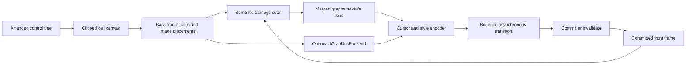

# Rendering pipeline

## Overview

Controls produce semantic cells; the terminal layer owns byte emission. The
[invalidation contract](../concepts/invalidation.md#overview) owns which
control-tree phases run before a target frame is built. This page owns semantic
cell generation, terminal-state comparison, output, and commit.

## Cell and frame rules

Cell equality includes grapheme identity, width and continuation ownership,
colors, attributes, hyperlinks, and renderer-visible metadata. Damage expands to
every cell owned by an affected grapheme, then merges adjacent ranges.

`Frame` owns a pooled row-major cell array and a finite pooled UTF-8 grapheme
arena. Public callers observe only `CellInfo` and copy a complete grapheme into
their own span; pooled memory never escapes. `TerminalCanvas.Draw` segments and
measures with the frame's explicit ambiguous-width policy, preflights the
complete arena cost, and only then mutates in a second pass, so a failed
capacity check leaves the frame unchanged.

`Frame` also owns a finite pooled array of semantic image placements. Each
nonempty placement retains one immutable `Graphics.ImageSource`, its positive
pixel source, its clipped positive cell destination, and a contain, cover, or
stretch mode. `default(Placement)` and `Placement.Empty` are the same valid
sentinel: no image, identity zero, empty rectangles, and contain mode. Empty
sentinels are never active frame entries, so rented unused slots cannot be
mistaken for graphics. Insertion order is the stable paint and z-order. Clone
and copy operations prepare independent placement arrays before output, while
clear and disposal release all retained image references before returning the
cleared pooled storage. The default limit is 4,096 placements per frame.

`TerminalCanvas.DrawImage(ImageSource, Rect, PlacementMode)` is the only
control-facing image primitive. It clips the requested destination through both
the canvas and the frame, records the image's complete pixel source, and emits
no bytes. An empty intersection is a no-op. The canvas never selects Kitty,
sixel, iTerm2, or any other terminal protocol.

Each nonempty placement also records the frame-local mutation revision after its
fallback cells were painted. A placement is effective only while no later cell
mutation intersects its complete destination. This conservative whole-placement
filter is shared by semantic damage, Kitty retained placement/removal, and
non-retained repaint classification, so a later control, Window, or elevated
Popup reliably occludes graphics. Clone and copy preserve this provenance.
Public placement equality, hashing, identity, and terminal bytes intentionally
exclude the internal revision.

The renderer supplies an optional `IGraphicsBackend` with the active terminal
profile and measured cell-pixel geometry before any transport I/O. A retained
backend may upload, place, and delete remote identities transactionally. A
non-retained backend may instead request a complete cell redraw to erase stale
pixels, then repaint the intersecting target placements after cell output.
Profile, frame geometry, ambiguous-width, and cell-pixel-metric transitions all
force complete reconstruction. Backend commit follows a successful flush; any
preparation or I/O failure invalidates the next transaction.

`GraphicsBackendSelector` accepts only supported authoritative capability
evidence and an authorized route. It does not resolve terminal emulator
identity; that separate boundary is specified by the
[terminal backend contract](terminal-backends.md#graphics-backend-boundary).
Kitty query or override evidence wins globally. Otherwise, one shared
non-retained graphics backend preserves frame paint order while choosing sixel
for compatible RGBA placements with exact metrics and query/override evidence,
or iTerm2 multipart for compatible PNG placements with query- or override-origin
support, version-narrowed to iTerm2 3.5 or newer.

> [!NOTE]
>
> The selector's authority test is stricter than the capability model's
> `Feature.Authoritative`, which every other optional-output gate uses: graphics
> selection accepts only query and override origins, so database-origin
> `Supported` evidence for Kitty graphics, sixel, or iTerm2 images never selects
> a backend — such a placement stays on cell fallback without a diagnostic.

Missing evidence, metrics, route capacity, or format semantics leaves the
affected placement on ordinary cell fallback. Incremental repaint follows the
finite transitive closure of later overlapping placements, so lower output never
obscures an unchanged upper image. If an upper overlap cannot be encoded, it and
every transitively affected lower placement remain on ordinary cell fallback;
the backend does not invent unsafe clipping. Retained Kitty applies the same
backward closure when a later placement is ineffective, preventing a lower
remote image from obscuring that later placement's ordinary-cell fallback.

The application creates the renderer lazily for the first render, after profile
and resize publication, and passes the current exact cell metrics to that
frame's five-argument renderer entry point. Any detected multiplexer layer
produces a route object even when policy authorization is disabled; selection
must reject the route rather than fall back to unsafe direct bytes. Shutdown is
bounded and awaited before Session disposes its borrowed transport. Renderer
cleanup, Session disposal, and host-lease disposal are attempted in order,
without one failure skipping later lifetime boundaries; the earliest lifetime
diagnostic is retained.

Graphics-backend family selection stays fixed for the Application lifetime, but
it is not an irrevocable capability grant. Each graphics backend rechecks the
current frame profile. Revocation deletes retained Kitty state or performs a
complete cell repair for sixel/iTerm2, and suppresses further graphics. Later
profiles cannot promote a renderer created without an `IGraphicsBackend` or
switch its graphics-backend family; fresh Application construction performs
fresh selection.

> [!NOTE]
>
> The recheck is one-way: later evidence can only revoke, never promote.
> Selection happens once, at the lazily created renderer's construction, so
> authoritative graphics evidence that arrives after the first render is
> silently unusable for the rest of the process — only a new `Application`
> observes it.

Terminal backend identity is independently fixed in `TerminalContext` and cannot
be inferred from this choice.

A profile change received while frame output or flush is in flight records a
pending renderer invalidation; it never invalidates the backend transaction that
is already prepared. After that render commits or fails, the next `StartRender`
applies the invalidation before preparing the new profile. This preserves the
in-flight commit boundary while ensuring revocation removal or cell repair
happens on the immediately following frame.

`TerminalCanvas.Draw` and `TerminalCanvas.DrawRune` use an opaque background by
default. Passing `BackgroundMode.Transparent` keeps the destination cell's
existing background while replacing its grapheme, foreground, attributes, and
hyperlink. The same option is available to `TerminalCanvas.ApplyStyle`.
Structural lines, borders, shadows, and partial-glyph controls use it whenever
they do not own an explicit surface background, which keeps controls visually
aligned with painted panels instead of resetting isolated cells to the terminal
default.

Horizontal, vertical, and box line primitives merge compatible topology at
intersections. `TerminalCanvas.DrawLineCell` instead writes one exact non-empty
`LineConnections` topology, replacing any previous connections in that cell.
Controls use the exact primitive for authored line endings such as a Window
title-bar tee; the canvas still owns line-family resolution and the
deterministic ASCII fallback under a wide ambiguous-width policy.

`TerminalCanvas.ApplyForeground` transforms only the foreground of stored
grapheme owners. It visits complete owners once, in row-major order, and
supplies each owner's absolute lead-cell coordinate to the synchronous selector.
Stored spaces participate, while untouched blank cells are skipped. Background,
attributes, hyperlink, typed underline, and underline color remain unchanged. A
wide owner is transformed only when its complete cell range is inside the
effective canvas clip. Selector callbacks are borrowed for the call and never
retained. A callback exception propagates unchanged and fails the current
render; owners completed earlier in the traversal remain transformed, while the
failing and later owners remain unchanged.

`TerminalCanvas.ApplyCellStyle` uses the same complete-owner discovery and
clipping rules but replaces the complete returned `CellStyle`: foreground,
background, attributes, typed underline, underline color, and hyperlink. A
caller that intends to preserve a hyperlink must return it in the replacement.
This is the final-overlay primitive used by semantic selection, so touching
either cell of a wide owner styles the whole owner or, when the canvas clip
excludes part of it, skips it entirely. Stored spaces participate, untouched
blanks do not, and a throwing selector leaves the completed row-major prefix
transformed.

`TerminalCanvas.DrawWithForeground` adds write provenance to that same
transformation. It validates both callbacks before frame lifetime, captures the
frame's current mutation revision, invokes the borrowed drawing callback exactly
once with the current clipped canvas, and captures the upper revision
immediately when that callback returns. Traversal considers the cells in the
requested region intersected with the current canvas clip, and any intersecting
cell resolves to its complete stored owner. The closed draw-window revision —
after the checkpoint and at or before the captured upper bound — decides whether
a discovered owner is eligible. A selected owner's complete span may cross the
requested-region boundary, but it must remain fully inside the effective canvas
clip; the selector receives its absolute lead-cell coordinate. A semantic
overwrite counts as a mutation even when the glyph and style values are
identical. Stored spaces written by the callback participate, while pre-existing
owners, untouched blanks, and selector-side-effect writes do not. The foreground
selector retains the same row-major, once-per-lead, wide-owner, and
non-foreground-preservation contract as `ApplyForeground`.

Each internal cell carries its latest frame-local mutation revision, and the
frame advances one unsigned revision for every owner write, repair, blank, fill,
or successful style replacement. Copy and clone operations preserve both cell
and frame revision state. These revisions are provenance metadata only: public
cell values, semantic equality, damage, hashing, encoding, and terminal bytes
all ignore them. Normal capture begins and ends in constant time and allocates
no managed memory. Revisions are never allowed to wrap through an active
capture: the frame rebases the metadata only at unsigned exhaustion while no
capture is active and no image placement remains, or throws before the next
mutation when an active placement or bounded synchronous callback prevents a
semantics-safe rebase.

Write-scoped effects nest. An inner effect advances the same frame revision, so
its writes and foreground replacements remain visible to an outer checkpoint;
each effect's requested region independently discovers owners without clipping a
selected owner's atomic span. Neither callback is retained. If drawing throws,
no foreground pass begins and the same exception propagates after capture
cleanup. If selection throws, the already transformed prefix remains valid and
the failing and later owners remain unchanged.

Wide leads own exactly one continuation. Overwriting or clearing either cell
first repairs the complete previous owner. `Edge.Clip`, `Edge.Wrap`, and
`Edge.Replace` skip, move, or replace the whole cluster at the right edge; none
of them emits or stores half a glyph. Child canvases use the geometric
intersection of their requested clip, the parent clip, and the frame.

The encoder minimizes cursor moves and style transitions only after correctness
is established. When synchronized output is available, one complete frame is
wrapped according to the
[mode 2026 contract](../protocols/synchronized-output.md#overview).

## Control rendering

`ControlBase.Render(TerminalCanvas)` is dispatcher-affine and rejects
reentrancy. It clears render invalidation before extension code runs, clips its
own drawing to `VisualBounds`, draws the framework-owned chrome underlay, calls
`OnRenderContent`, and then renders owned children through either the arranged
`Bounds` clip or the documented unclipped-child path. An invalidation raised
during either callback therefore remains pending for the next frame. An
exception restores render dirtiness before propagating.

A control that was already render-clean copies its previous frame's cells
instead of running that paint sequence, when a previous frame is available
(`TerminalCanvas.HasPreviousFrame`, attached only when no layout ran anywhere in
the tree since that frame), the control owns no children of its own
(`OwnedControlCount == 0`, covering both the normal and popup layers), its
resolved background is opaque (a transparent underlay never authors its
uncovered cells, so copying them would resurrect stale content painted
underneath), any visible shadow is BlockGlyph mode with an opaque resolved
background (the only shadow paint that is a full destination overwrite provably
independent of whatever was there before - Composite always preserves the
underlying grapheme, and FractionalBlock always blends), and it does not itself
override `RequiresCompleteRender` to opt out (a general escape hatch; nothing
currently sets it). Being overlapped or bordered by a popup that belongs to a
different control needs no exclusion: the popup layer repaints unconditionally
on every frame, and any frame where a popup's footprint could have changed is,
by construction, a frame where no control application-wide has a previous frame
to copy from.

A control whose own paint has an effect a cell copy alone cannot reproduce -
currently only [`Image`](../controls/display/image.md#overview)'s semantic
`DrawImage` placement, recorded outside the frame's cell arena - re-asserts that
effect through `OnReuseCleanRender`, called at the exact traversal position
`OnRenderContent` would otherwise run. It reads the control's own current
properties, never a cached prior value, so the reasserted state is provably
identical to what a fresh paint would have produced: an unset render bit already
proves nothing that would change them fired since the last real paint. This
closes the last excluded case from the earlier narrow, conservative behavior.

Hidden, collapsed, and effectively hidden subtrees draw nothing. Every control
renders its normal-layer ownership slots in slot-registration then item order,
so a later eligible target has the higher default z-order. After the root's
ordinary pass, popup-layer controls and promoted popup descendants render in the
same stable global order above every ordinary sibling. A promoted surface is
omitted from the ordinary pass, so elevation never invokes its content twice.
The specialized Overlay, Stack, and scrolling-container passes retain their
documented ordering and viewport semantics. The normal traversal carries one
hard canvas and one soft content aperture down each branch. Each control expands
only its own soft aperture for deliberate `VisualBounds` overflow, so shadows
cross arbitrary ordinary nesting without granting that space to siblings. The
frame, the caller canvas, explicit Overlay bounds, and the scroll viewport are
hard intersections. This single downward traversal visits every rendered control
and remains allocation-free and linear in the rendered control count, though a
qualifying render-clean leaf's own paint work is a constant-cost cell copy
instead of running its full paint sequence. Coordinates remain absolute terminal
cells, which avoids accumulated transform rounding.

The framework render path draws intrinsic chrome around content, in order:
shadow, body fill when `Background` is non-null, content, normal-layer children,
then border or a specialized frame overlay. A derived control overrides
`OnRenderContent` for content only; it cannot skip intrinsic chrome. Window,
Popup, and GroupBox defer their bespoke frame and title overlays until after
their retained children, so child shadows cannot replace owning frame cells.
Partial borders draw only the enabled edges and repair glyphs that are wide
under the active ambiguous-width policy to portable ASCII. Detached shadow
colors resolve from the theme's normal shadow contribution unless a control
supplies a local override; they never inherit the body's opaque surface color.
On the base path, shadow expands the control's own `VisualBounds` by its signed
offset without reserving layout, child space, or hit targets, and hard canvas
clips still contain that overflow. Button intentionally translates its face and
owned content while pressed while keeping its arranged hit target.

Button uses specialized `ControlChrome` options for pressed-face translation,
normal-appearance shadow styling, and its one-cell shadow gap. Window uses the
shared shadow underlay and draws its bespoke titled uniform frame through the
final overlay seam; its frame is not `Border` chrome.

Sealed bespoke renderers such as `Text`, `FigletText`, and `TextInput` draw
content only; framework-owned chrome still surrounds them when configured.

Derived controls draw only through semantic `Canvas` operations and use their
border-and-padding-deflated `ContentBounds`. They never write ANSI, split
graphemes, repeat the base box-model deflation, or touch pooled frame storage.

## Commit and terminal-state invalidation

`Renderer.RenderAsync` accepts a borrowed back `Frame`, an `ITransport`, an
immutable `TerminalProfile`, and a cancellation token. The compatibility
overload wraps an exact `Capabilities` value in the built-in ANSI profile. The
renderer encodes into one finite reusable pooled batch, performs one directly
awaited complete write followed by a flush, and only then copies or switches the
target into its renderer-owned front frame. Any required front-frame allocation
or capacity growth happens before the first terminal byte, so a successful flush
cannot be followed by a failed memory allocation during commit.

When a renderer owns a graphics backend, that backend prepares every upload,
placement, removal, identifier, and buffer before transport I/O. One bounded
batch orders new image uploads before cell replacement, replacement placements
after their uploads, and stale placement or image removal last. Backend state,
the terminfo interpreter, and the complete cell-and-placement front frame commit
only after the shared batch is written and flushed. A successfully prepared
byte-quiet backend transaction also commits; its `Changed` result controls bytes
and metrics, never whether the transaction is concluded. Backend encoding or
terminal output failure invalidates both fronts and requires complete graphics
and cell repair on the next frame. Newly rented graphics identifiers remain
reserved as uncertain tombstones until a later hard-image or uncovered
soft-placement delete is flushed; they are never returned immediately after a
possibly partial batch. Explicit renderer invalidation does the same.
`Renderer.ShutdownAsync` owns normal remote backend cleanup and follows the
ordinary single-writer exclusion. It writes and flushes bounded image-release
commands through its borrowed transport before releasing local state.
Cancellation, write failure, or flush failure invalidates remote state but still
releases the front frame, backend, identifiers, and pooled batch while
preserving the original exception. Repeated shutdown is byte-quiet. The
parameterless `Dispose` is the emergency local-only path and emits no terminal
bytes.

The renderer acquires that same writer gate before backend preparation. A
concurrent render or disposal attempt is rejected while preparation, encoding,
transport write, or flush is in flight. Cancellation after output begins,
synchronized-output frame or cleanup failure, profile changes, and explicit
invalidation all invalidate backend state and require complete reconstruction;
the original frame failure remains primary. `LastCleanupException` preserves the
first secondary cleanup failure for the renderer lifetime; later success and
later cleanup failures do not clear or replace it.

Without a backend, placements remain semantic frame state and produce no escape
bytes. Ordinary cells therefore provide the deterministic text fallback, while
placement-only changes still commit to the renderer front so later comparisons
remain correct.

A partial or interrupted write, a cancelled write, a failed flush, a
program-expansion failure, a resize, a profile change, an alternate-screen
transition, or a clear marks terminal state unknown and forces the next frame to
redraw completely. Explicit callers use `Renderer.Invalidate`; changed
dimensions and any semantic description, program, margin, erasure, or capability
value invalidate automatically. A changed frame size or East Asian Ambiguous
width policy forces both complete cell output and complete graphics
reconstruction, even when every placement is otherwise semantically equal.
Cancellation observed before a write preserves the previously committed state.

One renderer owns one bounded `Interpreter`. A frame encode is an outer
static-variable transaction: uppercase terminfo variables commit only after the
complete transport write and flush. Expansion, write, flush, and cancellation
after output begins all roll back that transaction. A non-equivalent profile
expands through a fresh candidate interpreter and replaces the committed
interpreter only after success, so description-local static variables never leak
across profiles.

Every full redraw begins with the profile's exact `sgr0`. It then uses the exact
`clear` when present; a usable description backed by `el` and `ed` instead uses
exact `cup(0, 0)` followed by exact `ed`. Failure while expanding any required
reset, positioning, or erasure program writes nothing, rolls back the outer
interpreter transaction, retains the prior committed profile/interpreter, and
leaves the renderer invalidated for recovery.

There is no renderer output queue. A pending transport operation directly
backpressures `RenderAsync`, and a concurrent render attempt throws. The
transport is borrowed: disposing the renderer releases its front frame, pooled
batch, and owned graphics backend, but never disposes the transport.

When
[synchronized output is proven](../protocols/synchronized-output.md#overview),
the renderer wraps only non-empty batches in mode 2026. If that batch fails, it
attempts a separate disable-and-flush with a finite independent timeout.
`LastCleanupException` exposes the cleanup diagnostic without replacing the
original write, flush, or cancellation exception.

`Damage.Enumerate` compares semantic cells row-major and returns merged
`DamageSpan` values expanded through grapheme ownership in both frames. A
grapheme hash is only a mismatch prefilter; equal hashes still require an exact
UTF-8 comparison. `Damage.PlacementsChanged` separately compares the complete
ordered placement snapshot, including image identity, source, destination, and
fitting mode. `Encoder.Encode` requires the immutable terminal profile for the
frame. It positions each changed run through `cup`, emits complete leads while
skipping continuations, projects resolved RGB colors to the profile's
monochrome, basic-16, indexed-256, or true-color tier, and expands only the
described color program for that tier. A described tier is usable only when both
its foreground and background programs prove their exact arity and a non-empty
representative expansion; incomplete true color lowers to complete indexed
color, and incomplete indexed color lowers to monochrome. The encoder expands
described rendition, typed underline, palette-resolved packed-RGB `Setulc`
underline color, default-color, reset, cursor visibility, and complete `Ss`/`Se`
cursor-shape programs. Unsupported typed underlines become legacy straight
underlines; unsupported underline color and overline are omitted. A missing
cursor-shape pair omits shape bytes while retaining cursor position and
visibility. Transition comparison uses the complete projected style, so richer
semantic colors or decorations that share one terminal fallback do not produce
redundant bytes. The built-in ANSI compatibility profile retains its canonical
typed fast path only for equivalent intrinsic programs.

Rapid blink lowers to ordinary blink when only `blink` is described and is
omitted when neither form is available. Other unavailable visual attributes are
omitted. These projections participate in style comparison, so unsupported
semantic differences cannot cause redundant terminal transitions.

Cursor visibility is emitted only through a complete executable `civis`/`cnorm`
pair, so a one-sided description can never hide the cursor without a restoration
path. Cursor shape similarly requires executable `Ss`/`Se`. All four cursor
programs require exact arity and compiler proof of unconditional non-empty
output; conditional or otherwise fallible programs disable the whole pair
instead of relying on a representative probe. An admitted cursor transition is
required frame output: if its live expansion nevertheless fails, encoding aborts
the staged frame, the transport remains byte-quiet, the prior front frame
remains committed, and the next render retries the transition. Wrong-arity,
outputless, or failed optional-program probes are omitted before projection.
Each live program expansion is staged too: actual zero output or evaluation
failure emits nothing, commits no program-local static-variable changes, and
cannot advance projected encoder state. Optional failures therefore degrade by
omission, while required-program failure aborts the staged frame before
transport, so a failed frame publishes no bytes and no projected state.

When `bce` is absent, blank damage is emitted as explicit spaces. With `bce`, a
uniform erase-safe trailing blank run may use exact `el`; styled, non-trailing,
wide-owner, or otherwise unsafe damage still uses explicit cells. On an `am`
description, a run ending in the final column is followed immediately by
absolute positioning, clearing delayed-wrap state before another byte can wrap
or scroll, including the `xenl` case. A size or ambiguous-width-policy mismatch,
a missing front frame, or a changed profile snapshot is always a full redraw and
graphics reconstruction.

## Correctness oracle

Layout panels commit geometry and child order. Text draws committed
grapheme-aligned slices and a typed ellipsis, while intrinsic control chrome
fills the body and draws validated one-cell border glyphs through the same
semantic canvas. Composite shadow preserves the destination grapheme and
restyles its complete cell owner; block-glyph shadow replaces only the
translated, non-body footprint. No control emits escape bytes; frame
differencing and terminal encoding remain below the canvas boundary.

Tests apply the incremental bytes for frame B to a virtual terminal initialized
by frame A, then compare the final screen, cursor, style, hyperlink, and mode
state with a clean full render of B. Random frame pairs and targeted wide-cell
transitions use this same oracle.

`Rendering.RenderMetrics` reports bytes, writes, damage spans, full/incremental
classification, and elapsed time only for completed operations. An unchanged
frame reports zero bytes and writes and follows a synchronous zero-allocation
fast path.

## Expected behavior

The pipeline's guarantees are backed by evidence at three layers:

| Layer       | Required evidence                                                                               |
| ----------- | ----------------------------------------------------------------------------------------------- |
| Unit        | Cell ownership, damage, cursor/style state, invalidation, transaction rollback, and metrics.    |
| Equivalence | Applying incremental B to full A produces the same screen as a clean full render of B.          |
| Integration | Controls, graphics, synchronized output, description programs, transport, and failure recovery. |

The [correctness oracle](#correctness-oracle) runs targeted Unicode/wide-cell
transitions and fixed-seed random frame pairs. Exact bytes remain mandatory for
protocol and terminal-description output paths.
