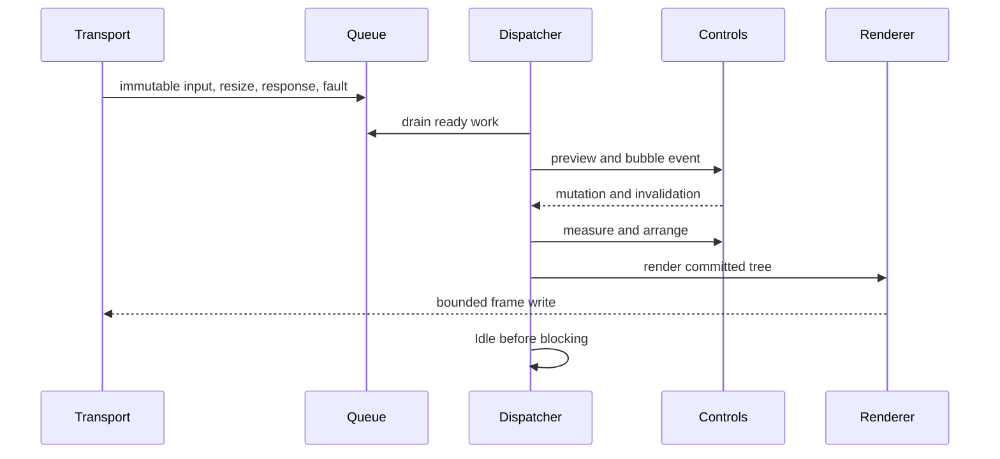

# Runtime event loop

## Overview

One dispatcher thread owns input delivery, terminal-response delivery, control
mutation, focus, pointer capture, layout, frame production, and application
callbacks. Transport and OS watchers only enqueue immutable records. The
[runtime protocol router](../protocols/runtime-routing.md#overview) separates
typed replies from user input before either reaches the queue.



## Iteration order

Each wake drains posted work, terminal input, and coalesced system events. It
then performs any required layout, renders at most one coalesced frame, raises
frame-complete callbacks, and fires `Idle` once immediately before waiting. Work
posted by an `Idle` handler starts another drain without a polling delay.

No application callback runs while an internal lock is held. Event dispatch uses
a snapshot route, so a tree mutation affects later events rather than the
current preview/bubble path. State changed during layout or control rendering is
retained as pending work for the next transaction, while direct reentry into a
phase is rejected. The
[invalidation update cycle](../concepts/invalidation.md#update-cycle) owns the
complete mutation-to-frame sequence.

`SharpVision.Application` owns the dispatcher, root, terminal `Session`,
renderer, focus, capture, and modality managers, and the active back frame.
Session callbacks copy immutable records into a bounded queue; they never enter
the control tree. Resize uses a newest-value slot plus one queued wake, so a
resize storm cannot grow the pending work without bound.

[`ConsoleApplication.RunAsync`](../concepts/hosting.md#entry-points) (as a
one-liner, with a configure callback, or with immutable `ConsoleRunOptions`) and
`ConsoleApplicationBuilder.RunAsync` are the supported interactive console entry
points. They reject redirected standard I/O, open the portable console host
lease and the transport/resize source, resolve and validate one terminal
profile, negotiate terminal capabilities, map Ctrl+C to cooperative shutdown
unless `TreatControlCAsInput` is set, attach the supplied `Screen`, start the
application, wait for completion or cancellation, stop cleanly, and restore the
host terminal state.

`Application.RunAsync(CancellationToken)` is a lower-level instance convenience
that any host — console or otherwise — can call once a transport-backed
`Application` already exists: it awaits `StartAsync`, then `Completion`, then
`StopAsync`, and surfaces `Failure` by rethrowing. The console-specific
`ConsoleRunStatus` mapping
(`Redirected`/`UnsupportedTerminal`/`Completed`/`Cancelled`/`Failed`) lives only
in the console entry points above; the instance method itself is host-agnostic.
The public `Application` constructor independently rejects a non-usable profile
before mutating the detached root or creating the renderer, dispatcher, terminal
services, or session.

`StartAsync` raises `Starting` on the dispatcher before `Session.RunAsync` can
enable a mode. The first resize attaches the root, creates focus, capture, and
[modality ownership](../concepts/modality.md#plane-membership-and-ownership),
commits layout, raises `Resize`, and starts frame rendering. `Started` follows
the first flushed frame; a zero-cell suspended layout starts without a frame.

When bounded capability negotiation is enabled, startup order is:

```text
console open -> description resolve/suitability preflight -> Application/Session
-> Starting callback -> described base/keypad leases -> query batch
-> input/reply/resize collection -> profile publication
-> optional mode leases -> first resize/layout/frame -> Started callback
```

User input remains live during the query window. The session retains only the
newest pre-publication resize and forwards it after the immutable profile and
optional leases commit. Cancellation, terminal closure, and query-write failure
use the same reverse-cleanup path as an ordinary runtime failure.

Before constructing the batch, a resize source may provide one synchronous local
dimension snapshot. Unix uses the same `TIOCGWINSZ` boundary as resize delivery.
Local cells and pixels suppress the lower-confidence XTWINOPS queries and seed
pixel-pointer inference before input reads; the ordinary resize callback still
owns application geometry ordering. When that snapshot is available it is also
routed through the same startup-readiness path as an ordinary resize event.
`Application.StartAsync` only unblocks once a resize reaches its sink, so a
resize source whose `ReadAsync` reports only genuine changes — never an initial
observation — still starts normally as long as it implements
`IResizeSource.TryReadCurrent`.

Missing, generic, hardcopy, incomplete, and padding-dependent profiles stop at
preflight. `Build()` throws `NotSupportedException`; `RunAsync` returns
`UnsupportedTerminal` and may write one configured plain message. That path
constructs no application or session, so it emits no mode, query, or renderer
bytes.

The application applies `ISink.Profile` on its dispatcher before the retained
resize attaches the tree, so `CapabilitiesChanged` precedes `Resize`, layout,
and the first frame. The renderer receives the active profile rather than the
original static options. Later profiles coalesce through a newest-value slot: an
update received during a frame requests one following frame without swapping the
profile borrowed by the current write.

## Resize ordering

Resize storms coalesce to the newest valid size. The dispatcher commits the
size, invalidates root measure, completes layout, raises one resize event with
the committed geometry, processes the resulting invalidation, and renders. A
zero-sized terminal remains a valid suspended layout.

Input received before the first resize stays in the bounded queue until the tree
is attached. Key, text, paste, and terminal-focus targeting obey the
[modal keyboard contract](../concepts/modality.md#keyboard-text-and-paste)
before routed delivery. Pointer targeting separately obeys the
[modal pointer contract](../concepts/modality.md#modal-pointer-and-capture);
unrestricted pointer values otherwise use capture and then hit testing. Terminal
focus loss cancels pointer interaction. Each input drain processes the resulting
layout and render invalidation before idleness. Resize preserves the exact
managers, the active scope, and an eligible focused target.

## Out-of-band protocol writes

The implemented output protocols — described bell, proven `SetTitle`, and
capability-gated clipboard writes behind
[`ITerminalServices`](../protocols/index.md#discovery-and-output-facade) — never
interleave with a frame write. `Application.PostOutOfBand` appends encoded bytes
to a pending buffer guarded by the same internal gate used for input, resize,
and profile records, and posts a drain to the dispatcher.

The drain reuses the renderer's single-writer discipline: it shares the
`_rendering` flag with frame rendering, so at most one of a frame render or an
out-of-band flush is ever writing to the transport. If a frame render is already
in flight, the bytes stay buffered and `CompleteRender` drains them immediately
after that frame's write completes, before servicing any deferred render
request. If no render is in flight, the drain itself starts an out-of-band
flush: it sets `_rendering`, writes and flushes the buffered bytes through the
transport under a dispatcher hold, and on completion clears `_rendering` and
resumes normal invalidation (a pending render, or another out-of-band write
queued meanwhile) through the same pump used after an ordinary frame. Because
frame renders and out-of-band flushes share both the `_rendering` gate and the
dispatcher hold, byte ordering between UI frames and protocol bytes is
deterministic, and a bell or title change requested mid-frame is guaranteed to
land only after that frame's bytes are on the wire.

BEL, OSC 2, described `TS`/`fsl` title writes, and clipboard OSC requests do not
mutate the terminal cell grid, cursor, or rendition state, so a successful
service write does not invalidate the renderer front frame. The described title
prefix and suffix are both expanded before the UTF-8 payload is queued; an
incomplete or failed pair publishes no bytes. Control-bearing title payloads are
rejected before either expansion or queueing. A failed out-of-band transport
write is an application failure and stops the session; no later frame assumes
that transport remains usable.

## Shutdown

Stopping rejects new application work, cancels waits, drains required cleanup,
restores terminal modes, raises the stopped event once, and completes pending
invocations with the documented cancellation or failure.

Shutdown unwinds every active
[modal scope](../concepts/modality.md#nested-scopes-and-lifetime) before
disposing pointer and focus ownership. It does not restore saved focus into the
stopping tree, and an exit-callback failure cannot skip later application
cleanup.

An explicit `Stopping` callback may cancel the request. Closure, a terminal
fault, or an unhandled application callback forces the same idempotent path.
Active render cancellation during a requested shutdown is not promoted to a
failure. `Failure` preserves the first primary exception, and
`LastCleanupException` exposes a later session or synchronized-output cleanup
failure.

### Stop request versus caller wait

The `StopAsync` cancellation token bounds only the caller's observation. The
shutdown request itself is irrevocable and is always queued to the dispatcher
without that token, so an already-cancelled token cannot leave the application
running with `Completion` pending. A cancelled caller may receive
`OperationCanceledException`, but `Stopping` is still raised, cleanup still
runs, `Completion` still finishes, and owned resources are still disposed once.
A caller that stops waiting leaves the queued request observed, so a
lifecycle-handler failure cannot resurface as an unobserved task exception.

One stop request raises `Stopping` exactly once. Dispatcher invocation runs
inline on the dispatcher thread, so a handler that called `StopAsync` again
would otherwise re-enter the same cancellable event and recurse until the stack
was exhausted. A nested request made while the event is being raised is
therefore absorbed: it cannot raise the event again and cannot override a
handler that cancelled it. A nested _forced_ request — closure, a terminal
fault, or an unhandled callback — still overrides that cancellation.

### Exception-complete disposal

Every owned resource is attempted exactly once, in its documented order, even
when an earlier one throws. `Session` disposal attempts the resize source, the
transport, and the lifetime source; `StreamTransport` disposal attempts each
stream it owns. The first exception is retained and rethrown after the remaining
cleanup finishes, so one failure never abandons unrelated handles or buffered
output. A stream supplied as both input and output is attempted exactly once.

Disposal stays idempotent: a second call after a failed first is quiet and
retries nothing. When callers dispose concurrently, only the caller that
performed the teardown reports its failure; the joiners return once it has
finished.

## Terminal session implementation

`SharpVision.Terminal.Runtime.Session` owns the terminal-side startup, read,
resize, protocol-routing, and cleanup boundary. Startup enables only requested
modes whose optional feature is supported by database, bounded-query, or
explicit-override evidence. Default and environment origins never enable a mode,
even when paired with a constructed `Supported` state. Alternate screen and
cursor policy are explicit non-detected options, but their output requires
complete expandable `smcup`/`rmcup` and `civis`/`cnorm` description pairs. A
complete `smkx`/`rmkx` pair is leased only when the owned key map contains an
SS3 application cursor, Home, or End spelling; SS3 F1–F4 alone does not qualify.
Each attempted enable becomes a lease that owns its exact enable and disable
bytes before transport I/O, so even an uncertain partial write receives its
exact conservative cleanup attempt.

One event loop awaits one transport read and one resize read, then invokes
exactly one sink callback at a time. Input and resize handlers therefore cannot
race each other, and no callback runs while `StreamTransport` holds its write
gate. Input closure completes the decoder before `ISink.Closed`; read, decoder,
resize, and handler faults are reported through `ISink.Fault` and remain the
primary exception.

`ConsoleResizeSource` returns cell-only changes after a finite injected-clock
delay. On Linux and macOS, `UnixResizeSource` uses a capacity-one channel to
coalesce `SIGWINCH`: the signal callback only requests a wakeup, while ordinary
async code reads the newest `winsize` cell and pixel dimensions. The same source
also exposes a synchronous current snapshot for description-first query
selection. Linux uses the native `ioctl` boundary; macOS uses the .NET runtime's
fixed native window-size shim, because Darwin ARM64 variadic arguments cannot
safely cross a fabricated fixed managed `ioctl` signature. The shim is the same
[`SystemNative_GetWindowSize`](https://github.com/dotnet/runtime/blob/main/src/native/libs/System.Native/pal_console.c#L23)
boundary used by `System.Console`. Derived positive cell metrics update
pixel-pointer inference before the ordered resize callback.

Unix integration tests use an actual raw pseudoterminal pair. They prove exact
bidirectional bytes, master-close EOF, kernel cell/pixel dimensions, SIGWINCH
coalescing, and delivery of the newest dimensions through `Runtime.Session`.

Cleanup walks the leases in exact reverse order under an independent finite
timeout, continuing after individual failures. `LastCleanupException` exposes
the first restoration failure but never replaces an earlier startup, read,
resize, cancellation, or handler exception. Lifecycle programs expand with one
session-owned bounded interpreter. A pair is one static-variable transaction:
both zero-parameter expansions succeed before output, or neither commits.

### Run and disposal interleaving

This section is normative for how `Session.RunAsync` and `Session.DisposeAsync`
interleave; `docs/concepts/hosting.md` describes only the console host's own
ownership of that session.

Reverse mode restoration writes through the transport, so disposal must never
tear the transport down while a run is still unwinding its leases. Claiming the
run slot and marking disposal are one atomic step under a single session lock,
which yields exactly two orderings:

1. A run is active when disposal begins. `DisposeAsync` cancels the session
   lifetime, waits for that run to finish writing and flushing every disable
   sequence, and only then disposes the resize source, the transport, and the
   lifetime source.
2. Disposal begins first. A later `RunAsync` throws `ObjectDisposedException`
   from its lifecycle guard, never from inside the loop against disposed
   lifetime state, and acquires no mode lease.

Disposal is idempotent and safe to call concurrently. Every caller awaits the
same underlying teardown and returns only after it has completed, so reverse
cleanup runs exactly once and no caller observes a half-disposed session. The
wait stays bounded because the event loop drains its read within the cleanup
budget and restoration writes run under their own finite timeout.

`DisposeAsync` must not be awaited from an `ISink` callback raised by its own
run: that asks the run to complete from inside itself. The owner of `RunAsync`
disposes the session instead, and a reentrant dispose attempt should fail fast
with a clear exception rather than hang.

> [!WARNING]
>
> **Implementation gap:** There is currently no reentrancy guard — awaiting
> `DisposeAsync` from a sink callback deadlocks silently. The runtime needs to
> detect the reentrant call and either fail fast or defer teardown.

## Expected behavior

The loop's guarantees are backed by evidence at three layers:

| Layer          | Required evidence                                                                               |
| -------------- | ----------------------------------------------------------------------------------------------- |
| Unit           | Iteration order, resize coalescing, scheduling, out-of-band ordering, and shutdown idempotence. |
| Integration    | Typed input/replies, dispatcher callbacks, render commit, mode leases, and reverse cleanup.     |
| Pseudoterminal | Fragmented reads, resize signals, EOF, cancellation, faults, exact bytes, and restoration.      |
