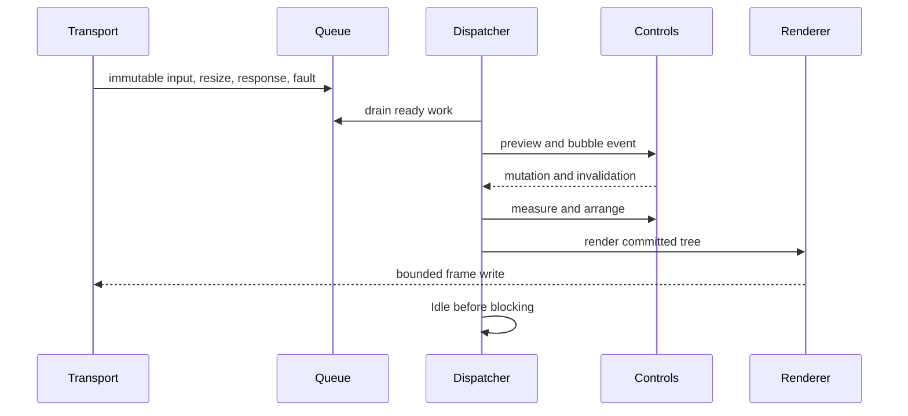

# Runtime event loop

## Runtime event loop contract

One dispatcher thread owns input delivery, control mutation, focus, pointer
capture, layout, frame production, and application callbacks. Transport and OS
watchers enqueue immutable records only.

## Iteration order

Each wake drains posted work, terminal input, due timers, and coalesced system
events. It then performs required layout, renders at most one coalesced frame,
raises frame-complete callbacks, and fires `Idle` once immediately before
waiting. Work posted by `Idle` starts another drain without a polling delay.

No application callback runs while an internal lock is held. Event dispatch uses
a snapshot route so tree mutations affect later events, not the current
preview/bubble path. Reentrant layout and render calls queue invalidation.

## Resize ordering

Resize storms coalesce to the newest valid size. The dispatcher commits the
size, invalidates root measure, completes layout, raises one resize event with
committed geometry, processes resulting invalidation, and renders. Zero-sized
terminals remain valid suspended layouts.

## Shutdown

Stopping rejects new application work, cancels waits, drains required cleanup,
restores terminal modes, raises stopped once, and completes pending invocations
with documented cancellation or failure.

## Terminal session implementation

`SharpVision.Terminal.Runtime.Session` owns the terminal-side startup, read,
resize, and cleanup boundary. Startup enables only requested modes whose
optional `Feature.State` is `Supported`; environment-tentative evidence never
enables a mode. Alternate screen and cursor policy are explicit non-detected
options. Each attempted enable becomes a lease before transport I/O so even an
uncertain partial write receives a conservative cleanup attempt.

One event loop awaits one transport read and one resize read, then invokes
exactly one sink callback at a time. Input and resize handlers therefore cannot
race each other, and no callback runs while `StreamTransport` holds its write
gate. Input closure completes the decoder before `ISink.Closed`; read, decoder,
resize, and handler faults are reported through `ISink.Fault` and remain the
primary exception.

`ConsoleResizeSource` returns cell-only changes after a finite injected-clock
delay. On Linux/macOS, `UnixResizeSource` uses a capacity-one channel to
coalesce `SIGWINCH`; the signal callback only requests a wakeup, while ordinary
async code reads the newest `winsize` cell and pixel dimensions. Linux uses the
native `ioctl` boundary; macOS uses the .NET runtime's fixed native window-size
shim because Darwin ARM64 variadic arguments cannot safely cross a fabricated
fixed managed `ioctl` signature. The shim is the same
[`SystemNative_GetWindowSize`](https://github.com/dotnet/runtime/blob/main/src/native/libs/System.Native/pal_console.c#L23)
boundary used by `System.Console`. Derived positive cell metrics update
pixel-pointer inference before the ordered resize callback.

Unix integration tests use an actual raw pseudoterminal pair. They prove exact
bidirectional bytes, master-close EOF, kernel cell/pixel dimensions, SIGWINCH
coalescing, and delivery of the newest dimensions through `Runtime.Session`.

Cleanup walks leases in exact reverse order under an independent finite timeout,
continuing after individual failures. `LastCleanupException` exposes the first
restoration failure but never replaces an earlier startup, read, resize,
cancellation, or handler exception.
