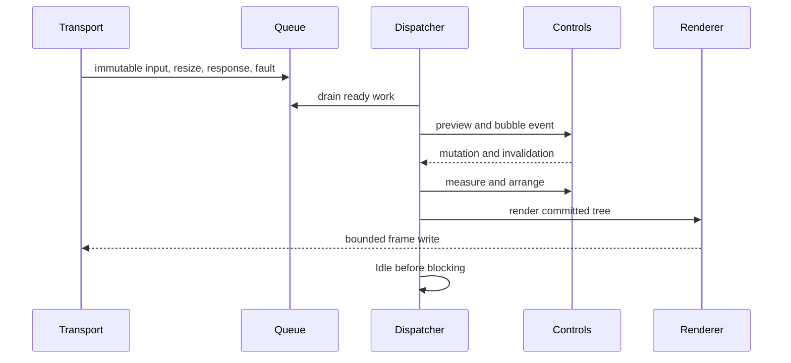

# Runtime event loop

## Runtime event loop contract

One dispatcher thread owns input delivery, terminal-response delivery, control
mutation, focus, pointer capture, layout, frame production, and application
callbacks. Transport and OS watchers enqueue immutable records only. The
[runtime protocol router](../protocols/runtime-routing.md#runtime-routing-contract)
separates typed replies from user input before either reaches the queue.



## Iteration order

Each wake drains posted work, terminal input, and coalesced system events. It
then performs required layout, renders at most one coalesced frame, raises
frame-complete callbacks, and fires `Idle` once immediately before waiting. Work
posted by `Idle` starts another drain without a polling delay.

No application callback runs while an internal lock is held. Event dispatch uses
a snapshot route so tree mutations affect later events, not the current
preview/bubble path. Reentrant layout and render calls queue invalidation.

`SharpVision.Runtime.Application` owns the dispatcher, root, terminal `Session`,
renderer, focus/capture managers, and active back frame. Session callbacks copy
immutable records into a bounded queue; they never enter the control tree.
Resize uses a newest-value slot plus one queued wake, so storms cannot grow work
without bound.

[`ConsoleApplication.RunAsync`](../concepts/hosting.md#entry-points) (one-liner,
configure-callback, or immutable `ConsoleRunOptions`) and
`ConsoleApplicationBuilder.RunAsync` are the supported interactive console entry
points. They reject redirected standard I/O, open the portable console host
lease and transport/resize source, negotiate terminal capabilities, map Ctrl+C
to cooperative shutdown unless `TreatControlCAsInput` is set, attach the
supplied `Screen`, start the application, wait for completion or cancellation,
stop cleanly, and restore host terminal state.

`Application.RunAsync(CancellationToken)` is a lower-level instance convenience
that any host — console or otherwise — can call once a transport-backed
`Application` already exists: it awaits `StartAsync`, then `Completion`, then
`StopAsync`, surfacing `Failure` by rethrowing. The console-specific
`ConsoleRunStatus` mapping (`Redirected`/`Completed`/ `Cancelled`/`Failed`)
lives only in the console entry points above; the instance method itself is
host-agnostic.

`StartAsync` raises `Starting` on the dispatcher before `Session.RunAsync` can
enable a mode. The first resize attaches the root, creates focus/capture
ownership, commits layout, raises `Resize`, and starts frame rendering.
`Started` follows the first flushed frame; a zero-cell suspended layout starts
without a frame.

When bounded capability negotiation is enabled, startup order is:

```text
Starting callback -> base terminal leases -> query batch
-> input/reply/resize collection -> profile publication
-> optional mode leases -> first resize/layout/frame -> Started callback
```

User input remains live during the query window. The session retains only the
newest pre-publication resize and forwards it after the immutable profile and
optional leases commit. Cancellation, terminal closure, and query-write failure
use the same reverse-cleanup path as ordinary runtime failure.

The application applies `ISink.Profile` on its dispatcher before the retained
resize attaches the tree. `CapabilitiesChanged` therefore precedes `Resize`,
layout, and the first frame. The renderer receives the active profile rather
than the original static options. Later profiles coalesce through a newest-value
slot; an update received during a frame requests one following frame without
swapping the profile borrowed by the current write.

## Resize ordering

Resize storms coalesce to the newest valid size. The dispatcher commits the
size, invalidates root measure, completes layout, raises one resize event with
committed geometry, processes resulting invalidation, and renders. Zero-sized
terminals remain valid suspended layouts.

Input received before the first resize remains in the bounded queue until the
tree is attached. Key/text/paste target focus; pointer values use capture then
hit testing; terminal focus loss cancels pointer interaction. Each input drain
processes resulting layout/render invalidation before idleness.

## Out-of-band protocol writes

Implemented output protocols — the bell, `SetTitle`, and clipboard writes behind
[`ITerminalServices`](../protocols/index.md#discovery-and-output-facade) — never
interleave a frame write. `Application.PostOutOfBand` appends encoded bytes to a
pending buffer guarded by the same internal gate used for input, resize, and
profile records, and posts a drain to the dispatcher.

The drain reuses the renderer's single-writer discipline: it shares the
`_rendering` flag with frame rendering, so at most one of a frame render or an
out-of-band flush is ever writing to the transport. If a frame render is already
in flight, the bytes stay buffered and `CompleteRender` drains them immediately
after that frame's write completes, before servicing any deferred render
request. If no render is in flight, the drain itself starts an out-of-band
flush: it sets `_rendering`, writes and flushes the buffered bytes through the
transport under a dispatcher hold, and on completion clears `_rendering` and
resumes normal invalidation (a pending render, or another out-of-band write
queued meanwhile) through the same pump used after an ordinary frame. Because
frame renders and out-of-band flushes share both the `_rendering` gate and the
dispatcher hold, byte ordering between UI frames and protocol bytes is
deterministic and a bell or title change requested mid-frame is guaranteed to
land only after that frame's bytes are on the wire.

## Shutdown

Stopping rejects new application work, cancels waits, drains required cleanup,
restores terminal modes, raises stopped once, and completes pending invocations
with documented cancellation or failure.

An explicit `Stopping` callback may cancel the request. Closure, terminal fault,
or an unhandled application callback forces the same idempotent path. Active
render cancellation during requested shutdown is not promoted to failure.
`Failure` preserves the first primary exception; `LastCleanupException` exposes
a later session or synchronized-output cleanup failure.

## Terminal session implementation

`SharpVision.Terminal.Runtime.Session` owns the terminal-side startup, read,
resize, protocol-routing, and cleanup boundary. Startup enables only requested
modes whose optional `Feature.State` is `Supported`; environment-tentative
evidence never enables a mode. Alternate screen and cursor policy are explicit
non-detected options. Each attempted enable becomes a lease before transport I/O
so even an uncertain partial write receives a conservative cleanup attempt.

One event loop awaits one transport read and one resize read, then invokes
exactly one sink callback at a time. Input and resize handlers therefore cannot
race each other, and no callback runs while `StreamTransport` holds its write
gate. Input closure completes the decoder before `ISink.Closed`; read, decoder,
resize, and handler faults are reported through `ISink.Fault` and remain the
primary exception.

`ConsoleResizeSource` returns cell-only changes after a finite injected-clock
delay. On Linux/macOS, `UnixResizeSource` uses a capacity-one channel to
coalesce `SIGWINCH`; the signal callback only requests a wakeup, while ordinary
async code reads the newest `winsize` cell and pixel dimensions. Linux uses the
native `ioctl` boundary; macOS uses the .NET runtime's fixed native window-size
shim because Darwin ARM64 variadic arguments cannot safely cross a fabricated
fixed managed `ioctl` signature. The shim is the same
[`SystemNative_GetWindowSize`](https://github.com/dotnet/runtime/blob/main/src/native/libs/System.Native/pal_console.c#L23)
boundary used by `System.Console`. Derived positive cell metrics update
pixel-pointer inference before the ordered resize callback.

Unix integration tests use an actual raw pseudoterminal pair. They prove exact
bidirectional bytes, master-close EOF, kernel cell/pixel dimensions, SIGWINCH
coalescing, and delivery of the newest dimensions through `Runtime.Session`.

Cleanup walks leases in exact reverse order under an independent finite timeout,
continuing after individual failures. `LastCleanupException` exposes the first
restoration failure but never replaces an earlier startup, read, resize,
cancellation, or handler exception.
