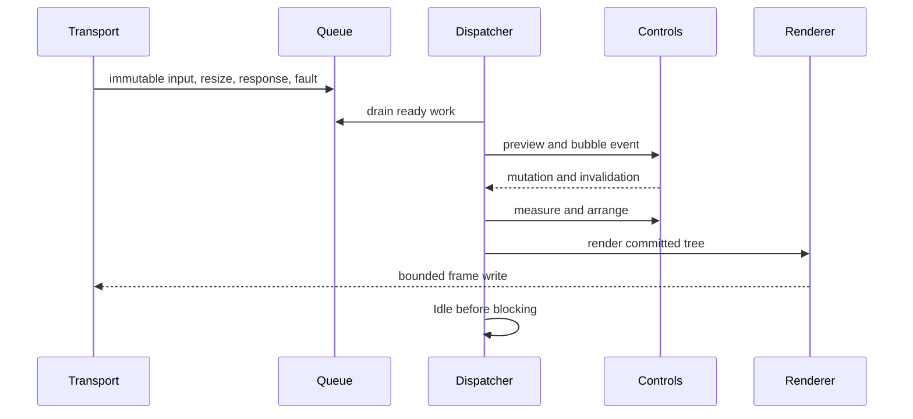

# Runtime event loop

## Runtime event loop contract

One dispatcher thread owns input delivery, control mutation, focus, pointer
capture, layout, frame production, and application callbacks. Transport and OS
watchers enqueue immutable records only.

## Iteration order

Each wake drains posted work, terminal input, due timers, and coalesced system
events. It then performs required layout, renders at most one coalesced frame,
raises frame-complete callbacks, and fires `Idle` once immediately before
waiting. Work posted by `Idle` starts another drain without a polling delay.

No application callback runs while an internal lock is held. Event dispatch uses
a snapshot route so tree mutations affect later events, not the current
preview/bubble path. Reentrant layout and render calls queue invalidation.

## Resize ordering

Resize storms coalesce to the newest valid size. The dispatcher commits the
size, invalidates root measure, completes layout, raises one resize event with
committed geometry, processes resulting invalidation, and renders. Zero-sized
terminals remain valid suspended layouts.

## Shutdown

Stopping rejects new application work, cancels waits, drains required cleanup,
restores terminal modes, raises stopped once, and completes pending invocations
with documented cancellation or failure.
