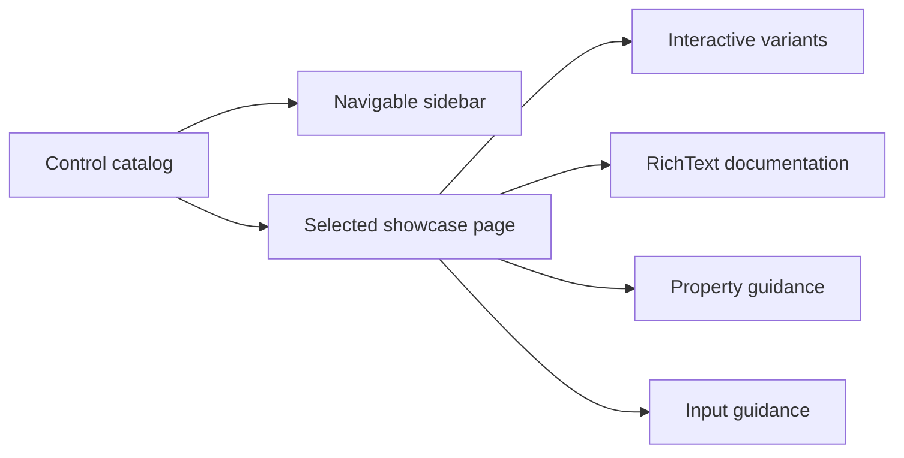
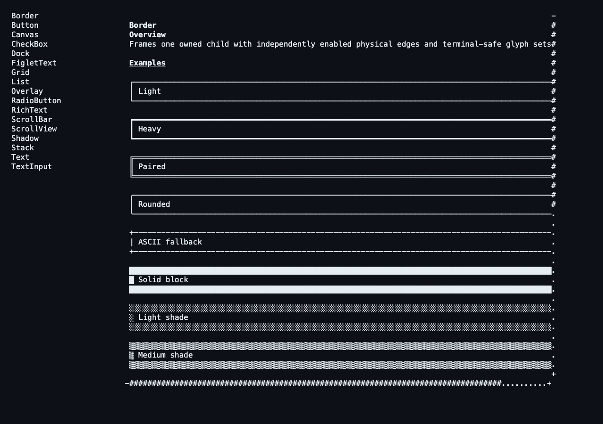

# Showcase architecture

## Showcase contract

`SharpVision.Showcase` is a runnable gallery and executable proof of the public
control API. It contains no behavior unavailable to ordinary library users.

The sidebar contains one entry for each concrete shipped control: Border,
Button, Canvas, CheckBox, Dock, FigletText, Grid, List, Overlay, RadioButton,
RichText, ScrollBar, ScrollView, Shadow, Stack, Text, and TextInput. Foundation
types and unimplemented specifications are not navigation entries.

Each immutable catalog `Page` owns the exact name, purpose, interaction
guidance, meaningful `PropertyDescription` values, and a factory for fresh live
examples. Its page shell uses public Stack, RichText, Border, and layout APIs to
render Overview, Examples, Properties, and Interaction sections. Examples use
only behavior available to ordinary application code; reflection and private
render paths are forbidden.

The image is generated by `scripts/capture-showcase.sh` from the actual Release
application running in a 120 by 40 cell tmux pane. ANSI rendition is preserved
when the captured pane is converted to PNG.

## Responsive behavior

The root is a Dock with a fixed 24-cell List sidebar and the main ScrollView in
the remaining space. The main pane reserves horizontal and vertical scrollbars
automatically. At narrow widths geometry saturates and clips safely rather than
throwing or creating negative extents. Selection survives resize, and keyboard,
pointer, focus, editing, and scrolling continue through the public runtime path.

Vendored resources used by examples remain under the documented
[external-resource boundary](../../extern/README.md#external-resources). Stable
logical embedded-resource names keep repository paths out of runtime APIs.

## Test contract

Showcase tests assert the exact inventory, metadata validation, fresh detached
example ownership, and matching runtime control type. They render every page at
30 by 8, 80 by 24, and 140 by 40 cells, validate wide-cell continuation
structure, and prove automatic scrolling. A full Application test drives SGR
pointer selection, keyboard button activation, wheel scrolling, text editing,
and pixel-aware resize through terminal bytes. The live image supplements these
assertions; it cannot replace them.
