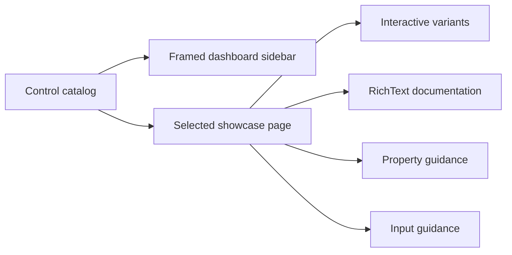

# Showcase architecture

## Showcase contract

`SharpVision.Showcase` is a runnable gallery and executable proof of the public
control API. It contains no behavior unavailable to ordinary library users.

The sidebar contains one entry for each concrete shipped control: Border,
Button, Canvas, CheckBox, ComboBox, Dock, FigletText, Grid, List, Menu, Overlay,
Popup, RadioButton, RichText, ScrollBar, ScrollView, Shadow, Stack, Table, Text,
TextInput, and Window. Foundation types and unimplemented specifications are not
navigation entries.

Each immutable catalog `Page` owns the exact name, purpose, structured
interaction rows, meaningful `PropertyDescription` values, and a factory for
fresh live examples. Its page shell uses public Stack, RichText, Table, Border,
and layout APIs to render Overview, a Practical recipe, Examples, Properties,
and a standalone Interaction table. Every interaction row records the input
path, the control behavior, and the observable result; interaction prose is not
hidden inside a decorative card. The recipe is one borderless, word-wrapped
RichText narrative that combines the control's purpose, every supported
interaction path, and responsive exploration guidance. Its text reflows as the
page narrows, as do the heading, section labels, property table, and interaction
table. Examples use only behavior available to ordinary application code;
reflection and private render paths are forbidden.

Canvas and Shadow demonstrate visual behavior as several labeled, framed live
specimens rather than a single crowded sample. Each stage keeps the control's
real layout and rendering path visible beside concise guidance: fixed,
percentage, edge-constrained, layered, and clipped Canvas children; and separate
composite and light-shade block-glyph shadows.

The image is generated by `scripts/capture-showcase.sh` from the actual Release
application running in a 120 by 40 cell tmux pane. ANSI rendition is preserved
when the captured pane is converted to PNG.

## Responsive behavior

The root is a `Dock` with a fixed 28-cell `Border` sidebar and the main
`ScrollView` in the remaining space. The sidebar owns product identity,
component-only stateful navigation entries, and compact interaction hints; its
selected, focused, hovered, and pressed states use a shared indexed-color
palette. The executable app explicitly requests xterm any-event (`1003`) SGR
cell mouse reporting through an application-level capability override and owns a
Unix raw-input lease while running, while the terminal library's default
environment-hint policy remains conservative.

The main pane reserves a vertical scrollbar automatically and suppresses a
horizontal scrollbar so documentation remains a readable column. At narrow
widths geometry saturates and clips safely rather than throwing or creating
negative extents. Selecting a different sidebar component retains sidebar state
but resets the main viewport to that page's header. Selection survives resize,
and keyboard, pointer, focus, editing, and scrolling continue through the public
runtime path. The initial sidebar entry takes focus after the first frame; Up,
Down, Left, Right, Tab, Shift+Tab, Home, End, Page Up, and Page Down move the
selected page and keep its entry visible. Enter activates the focused entry
using the same path as a primary pointer release.

The FigletText page is an editor, not a static ornament: a `TextInput` updates
the preview as text changes, while a Button-disclosed, scrollable List exposes
the 400 audited catalog names and loads only the font the user selects. The
ScrollBar page includes an explicit live value label beside the draggable
horizontal thumb so capture, drag geometry, and commit are directly observable.
Every showcase `TextInput` applies the dedicated editor palette, and the control
paints that resolved background across its entire committed box. Empty space is
therefore visibly part of the input rather than blending into its card.

On Unix the executable reads directly from `/dev/tty` through a one-byte
asynchronous stream after acquiring its raw-input lease. This avoids the
line-buffered standard-input behavior that can otherwise defer escape-prefixed
mouse reports until a later key. Windows retains the standard console stream
fallback. The protocol layer still receives only decoded terminal input values.

Vendored resources used by examples remain under the documented
[external-resource boundary](../../extern/README.md#external-resources). Stable
logical embedded-resource names keep repository paths out of runtime APIs.

## Test contract

Showcase tests assert the exact inventory, metadata validation, fresh detached
example ownership, and matching runtime control type. They render every page at
30 by 8, 80 by 24, and 140 by 40 cells, validate wide-cell continuation
structure, and prove automatic scrolling. A full Application test drives SGR
pointer selection, keyboard sidebar navigation and button activation, wheel
scrolling, text editing, and pixel-aware resize through terminal bytes. Startup
coverage requires the exact SGR mouse-mode lease before the first frame. The
live tmux smoke test then proves a normal Down key, separate complete SGR clicks
for Canvas and Button, Figlet dropdown opening and font selection, and a
captured ScrollBar thumb drag. Each completes without a trailing flushing key.
The live image supplements these assertions; it cannot replace them.
