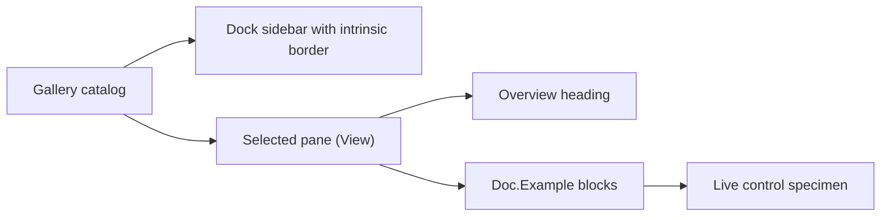
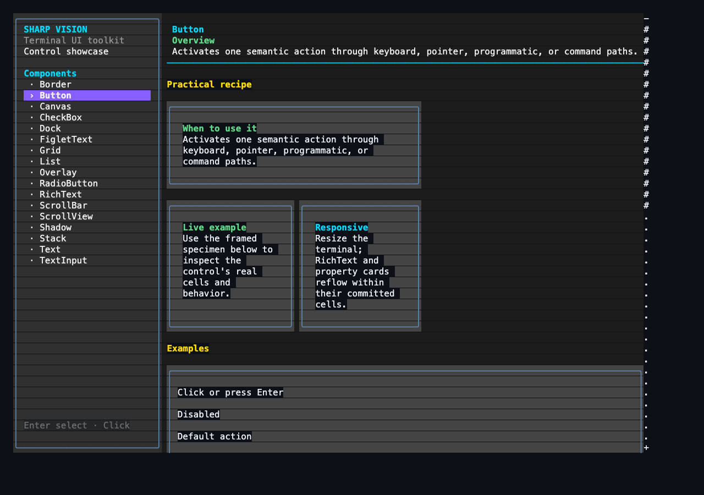

# Showcase architecture

## Showcase contract

`SharpVision.Showcase` is a runnable gallery and executable proof of the public
control API. It contains no behavior unavailable to ordinary library users.

Each concrete control lives in `src/SharpVision.Showcase/Panes/` as a
`*Pane : View` that overrides `Build()` and returns its content root once, on
first layout, exactly like any other application-authored `View`. There is no
shared showcase base class and no mandatory metadata: a pane composes public
`Stack`, marked `Text`, `Dock`, and layout APIs directly. `Doc` (in
`src/SharpVision.Showcase/Panes/Doc.cs`) holds the small composition helpers
every pane shares: `Doc.Page(name, overview, sections...)` builds the bold
heading plus an "Overview" paragraph and stacks the given sections beneath it;
`Doc.Example(heading, description, specimen)` builds one labeled block pairing
prose with a live specimen; `Doc.Card`, `Doc.Row`, and `Doc.Column` are
composition shorthands for framing and arranging specimens.

`Gallery` owns the stable catalog of pane titles and factories
(`(string Name, Func<View> Create)[]`). The sidebar contains 19 entries: Button,
Canvas, CheckBox, ComboBox, Dock, FigletText, Grid, List, Menu, Overlay, Popup,
RadioButton, ScrollBar, Stack, Table, Text, TextInput, Window, and Theming.
Foundation types, intrinsic chrome such as border and shadow, and unimplemented
specifications are not navigation entries.

Each pane's `Build()` returns `Doc.Page` composed of one or more `Doc.Example`
blocks: an Overview paragraph stating the control's purpose, followed by
labeled, live examples that show its real behavior (activation, selection,
shadow styles, disabled state, and so on) using only behavior available to
ordinary application code — reflection and private render paths are forbidden.
There are no Property or Interaction tables and no separate "Practical recipe"
narrative section; documentation prose lives inline next to the specimen it
describes. Marked `Text` headings and example descriptions use `Overflow.Wrap`,
so they reflow as the page narrows along with the live specimens.

Canvas demonstrates visual behavior as several labeled, framed live specimens
rather than a single crowded sample. Each stage keeps the control's real layout
and rendering path visible beside concise guidance for fixed, percentage,
edge-constrained, layered, and clipped children. Intrinsic composite and
block-glyph shadow variants remain visible on the Button and Window pages.

The image is generated by `scripts/capture-showcase.sh` from the actual Release
application running in a 120 by 40 cell tmux pane. ANSI rendition is preserved
when the captured pane is converted to PNG.

## Responsive behavior

The root is a `Dock`. Its fixed 28-cell sidebar is another `Dock` whose frame is
configured with intrinsic `BorderThickness` and `BorderGlyphs`; an intrinsically
scrollable `Stack` occupies the remaining space. The sidebar owns product
identity, component-only stateful navigation entries, and compact interaction
hints. Each entry is a single-content `Pressable` whose inherited Text content
is measured and arranged beside its marker; selected, focused, hovered, and
pressed states follow the active application theme. The sidebar footer hosts a
theme picker `ComboBox` and a
visible `Quit` button. The picker lists every theme in the embedded
`SharpVision.Styling.ThemeCatalog.Default` catalog — the built-in Light and Dark
themes plus the curated editor themes (Dracula, Nord, Gruvbox, Solarized, and
others) — grouped dark-first then light, and republishes the chosen application
theme when selected. The Theming page renders the 12 semantic `ColorRole` values
as labeled color swatches of the active application theme, updating live as the
sidebar picker changes themes. `Ctrl+C` also exits from anywhere: the gallery
handles it as a key in the preview pass so it works even when the terminal's
Kitty keyboard protocol reports `Ctrl+C` as a key event rather than raising a
host cancellation signal. The executable app runs through
`ConsoleApplication.RunAsync` with a `Gallery` screen and no further
configuration, so it gets the default xterm any-event (`1003`) SGR cell mouse
reporting from `ConsoleRunOptions` while `ConsoleApplication` owns the Unix
raw-input lease and console transport for the run. The terminal library's
default environment-hint policy remains conservative.

The main pane reserves a vertical scrollbar automatically and suppresses a
horizontal scrollbar so documentation remains a readable column. At narrow
widths geometry saturates and clips safely rather than throwing or creating
negative extents. Selecting a different sidebar component retains sidebar state
but resets the main viewport to that page's header. Selection survives resize,
and keyboard, pointer, focus, editing, and scrolling continue through the public
runtime path. The initial sidebar entry takes focus after the first frame; Up,
Down, Left, Right, Tab, Shift+Tab, Home, End, Page Up, and Page Down move the
selected page and keep its entry visible. Enter activates the focused entry
using the same path as a primary pointer release.

The FigletText page is an editor, not a static ornament: a `TextInput` updates
the preview as text changes, while a Button-disclosed, scrollable List exposes
the 400 audited catalog names and loads only the font the user selects. The
ScrollBar page includes an explicit live value label beside the draggable
horizontal thumb so capture, drag geometry, and commit are directly observable.
Every showcase `TextInput` inherits the active theme, and the control paints its
resolved background across its entire committed box. Empty space is therefore
visibly part of the input rather than blending into its card.

On Unix, `ConsoleApplication.RunAsync` reads directly from `/dev/tty` through a
one-byte asynchronous stream after acquiring its raw-input lease. This avoids
the line-buffered standard-input behavior that can otherwise defer
escape-prefixed mouse reports until a later key. Windows retains the standard
console stream fallback. The protocol layer still receives only decoded terminal
input values.

Vendored resources used by examples remain under the documented
[external-resource boundary](../../extern/README.md#external-resources). Stable
logical embedded-resource names keep repository paths out of runtime APIs.

## Test contract

Showcase tests assert the exact 19-page inventory, Button as the initial page,
marked `Text` documentation coverage, fresh detached page ownership, and
matching runtime control type. They render every page at 30 by 8, 80 by 24, and
140 by 40 cells, validate wide-cell continuation structure, and prove automatic
scrolling. A full Application test drives SGR pointer selection, keyboard
sidebar navigation and button activation, wheel scrolling, text editing, and
pixel-aware resize through terminal bytes. Dedicated tests prove cooperative
exit through both the sidebar `Quit` button and a decoded `Ctrl+C` key. Startup
coverage requires the exact SGR mouse-mode lease before the first frame. The
live tmux smoke test then proves a normal Down/Up keyboard round trip between
Button and Canvas, passive Canvas hover and leave, separate complete SGR clicks
for Canvas and Button, Figlet dropdown opening and font selection, and a
captured ScrollBar thumb drag. Each completes without a trailing flushing key.
The live image supplements these assertions; it cannot replace them.
