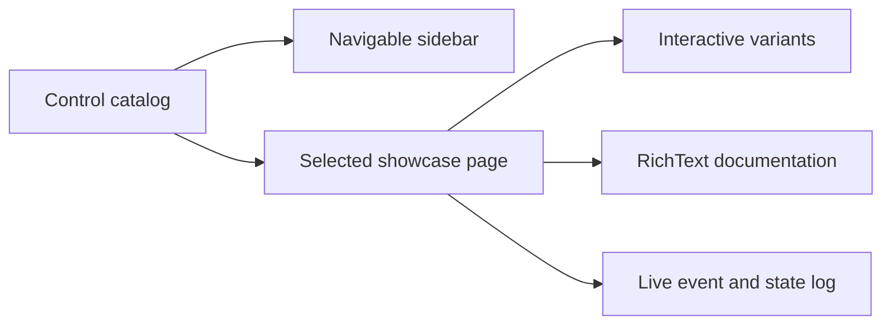

# Showcase architecture

## Showcase contract

`SharpVision.Showcase` is a runnable gallery and executable proof of the public
control API. It contains no behavior unavailable to ordinary library users.

Every shipped control appears on a registered family page containing purpose,
representative properties, states, and interactive variants. The current pages
cover borders and shadows, typography, buttons and selection, inputs and lists,
and layout and scrolling. The catalog test fails when a registered page lacks a
typed `RichText` description.

## Responsive behavior

At normal widths the sidebar and main page share a grid. At narrow widths the
sidebar collapses into an accessible menu/overlay and returns focus to the
selected page on dismissal. Both panes use automatic scrolling and remain usable
through keyboard and pointer input after resize.

## Test contract

Showcase tests navigate using public input paths, assert the selected page and
event log, and compare semantic virtual screens at documented minimum, typical,
and large sizes. A screenshot cannot replace assertions that all controls and
documentation are registered.
