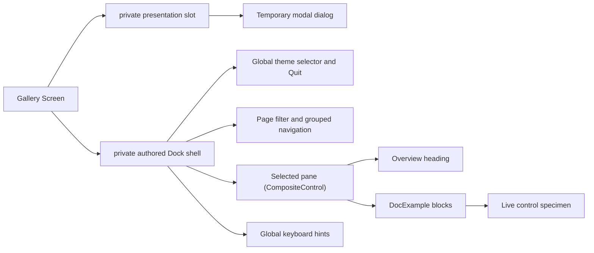

# Showcase architecture

## Showcase contract

Every enabled authored interactive specimen caption declares an intentional
ampersand [access key](../concepts/access-keys.md#access-key-contract). Keys are
unique across the active shell and selected page, and across every
simultaneously open menu/submenu path. The shell advertises `Alt+key`, while
Menu and GroupBox pages demonstrate invocation and focus transfer.

The sidebar remains one arrow-key `NavigationView`; its heading, groups, and 38
catalog items set `UseMnemonic = false` because no useful single-character
assignment can be globally unique. Repeated `DocExample` and `C# recipe`
structural chrome also opts out. Body prose and generated list data remain
literal.

`SharpVision.Showcase` is a runnable gallery and executable proof of the public
control API. It contains no behavior unavailable to ordinary library users.

Each control or concept page lives in `src/SharpVision.Showcase/Panes/` as a
`*Pane : CompositeControl`. Its constructor creates a retained page root and
installs it once through `InitializeContent` before any layout. There is no
measure-time construction, shared showcase base class, or mandatory metadata: a
pane composes public `Stack`, marked `Text`, `Dock`, and layout APIs directly.
`src/SharpVision.Showcase/Controls/` holds the small composition controls every
pane shares: `DocPage(name, overview, sections...)` builds the bold heading and
overview inside a complete intrinsic light frame, then stacks the given sections
beneath it; `DocExample(heading, description, specimen)` builds one labeled
block and places every live specimen in a standard `GroupBox`. The controls
themselves own surface, foreground, border, shadow, multi-part, and visual-state
defaults. Ordinary control pages never assign those appearance values or supply
a decorative initial color to repair a specimen. The dedicated Border, Shadow,
and Styling concept pages assign only the exact property they teach. Specimens
and their optional code surfaces stretch across the available reading column; an
optional source excerpt begins in a collapsed `C# recipe` expander and remains
available without permanently consuming viewport height. `DocCard`, `DocRow`,
and `DocColumn` are composition shorthands for framing and arranging specimens.

Page overviews and section/example descriptions are trusted authored `Text`
markup. They use named colors to distinguish API vocabulary, literal keys,
states, outcomes, and conceptual emphasis while remaining understandable from
their visible wording alone. This authored text content does not replace any
control's appearance defaults. Page names, icons, headings, and recipe source
are escaped by the documentation controls; any dynamic value interpolated into
authored prose must be escaped explicitly with `Text.Escape`. Blink, conceal,
and rapid blink remain isolated demonstrations rather than general documentation
styling.

`Gallery` owns the stable catalog of pane group names, titles, and factories
(`(string Group, string Name, Func<CompositeControl> Create)[]`). The sidebar
organizes its 38 entries by primary use:

- Concepts: Control, Border, Shadow, Data Binding, and Styling.
- Input: Button, Calendar, CheckBox, ColorPicker, ComboBox, RadioButton, Slider,
  and TextInput.
- Collections: ListView, TabControl, and Table.
- Navigation: Menu and NavigationView.
- Layout: Dock, Expander, Grid, GroupBox, Overlay, ScrollBar, and Stack.
- Display: Canvas drawing, FigletText, Image, Prism, Separator, StatusBar, and
  Text.
- Progress: ChaseIndicator, ProgressBar, and Spinner.
- Dialogs: FilePicker.
- Windows: MessageBox, Popup, and Window.

Each purpose group is expanded initially and can be collapsed through the
standard `NavigationViewGroup` interaction. The first Concepts group owns
cross-cutting behavior that is not a component: the retained Control foundation,
intrinsic border and shadow chrome, data binding, and styling. A concept becomes
a navigation entry only when it has concrete live specimens rather than prose
alone.

Each pane installs one `DocPage` composed of one or more `DocExample` blocks: an
Overview paragraph stating the control's purpose, followed by labeled, live
examples that show its real behavior (activation, selection, shadow styles,
disabled state, and so on) using only behavior available to ordinary application
code — reflection and private render paths are forbidden. There are no Property
or Interaction tables and no separate "Practical recipe" narrative section;
documentation prose lives inline next to the specimen it describes. Marked
`Text` headings and example descriptions use `Overflow.Wrap`, so they reflow as
the page narrows along with the live specimens.

At the supported wide layout, every ordinary specimen label is self-explanatory
and fits its committed content box without accidental abbreviation. A layout
example may clip a child only when clipping, saturation, or constrained overflow
is the behavior being taught, and its adjacent heading or description must say
so explicitly. Decorative borders and padding must not turn semantic labels into
unexplained fragments.

Popup specimens use bounded application stages with separate backdrop,
interaction, and promoted-popup layers. Triggers keep their intrinsic size, each
stage reserves enough space for every demonstrated open placement, and an open
surface never covers another action or escapes into the next example. The
placement specimen uses a rounded frame, a centered `⚓ Anchor`, bordered
direction controls, and a separated status row so the relationship remains
legible across themes.

The primary Popup specimen opens through `IsOpen` and receives Dismiss modality
without caller plumbing. It exposes a backdrop action plus scope status; its
[outside press](../concepts/modality.md#outside-interaction-and-dismissal)
closes the popup without activating the backdrop. The Window page places normal
and dialog constructor roles side by side, exposes a draggable close/reopen
workflow, and compares light, rounded, heavy, paired, and ASCII bracketed close
chrome across both close edges and all title placements. Its confirmation
specimen uses the
[modal Window presentation](../concepts/modality.md#popup-and-window-presentations)
with Ignore, keeps a workspace action visible behind it, cycles focus inside the
dialog, and reports restoration after Deploy, Cancel, Escape, or frame close.
The File/Edit/View/Help Menu specimen uses its ordinary retained submenu API:
sibling switching and the nested Open Recent path remain one
[menu plane](../concepts/modality.md#menu-planes), reported through public
selection and invocation events rather than internal state.

The FilePicker page keeps a bounded workspace as inert backdrop but launches the
real `SharpVision.Dialogs.FilePickerDialog` from its Button, so the temporary
modal surface resolves the application-level host instead of becoming a child of
the specimen stage. Single and multiple variants expose source, document, and
all-file filters; the multiple variant begins with hidden entries visible. The
retained result label reports accepted basenames or cancellation only after the
temporary modal surface has restored focus and removed itself.

The StatusBar page presents the control at application scale inside a bordered
72-by-11-cell editor workspace. The pretend editor uses the same semantic
`Surface` background as an edit control and leaves two blank document rows above
its visually distinct, bottom-docked `Background` status surface. The bar
retains a real playing `Spinner`, branch state, pointer coordinates, caret
position, encoding, line endings, and an interactive autosave `CheckBox` across
leading and trailing item groups. Mixed bar, bullet, chevron, and diamond item
separators demonstrate the predefined separator palette without wrapping
retained content. Moving the pointer through the editor updates the coordinate
item from routed `LocalCells`; clicking the CheckBox updates an eight-cell
activity slot between `Indexing`, `Saved`, and `Modified` without shifting or
clipping the adjacent branch. Its semantic hovered, focused, and checked
appearances retain contrast against the status surface without local child
appearance configuration. The example therefore demonstrates live composition
and dispatcher-affine mutation, not a static row of labels.

Canvas demonstrates the frame-owned drawing API through labeled, framed live
specimens rather than pretending to be a child-owning layout control. Fixed,
percentage, edge-constrained, layered, and clipped child specimens live on the
Overlay page. Intrinsic composite and block-glyph shadow variants remain visible
on the Button and Window pages. The former ad hoc Canvas palette grid now lives
in the dedicated ColorPicker page, where the same swatch language supports
retained keyboard and pointer selection and adapts to the active terminal color
depth. The Slider page proves direct signed-range selection independently of
scrolling viewport semantics.

Both images show the actual interactive application rather than a separately
mocked documentation surface.

## Responsive behavior

The Gallery Screen directly owns its authored `Dock` through the permanent
composition slot and owns temporary modal dialogs through a separate private
presentation slot. The Dock contains a six-row application bar, a fixed 26-cell
page sidebar, the selected page surface, and a one-row `StatusBar`. Temporary
modal dialogs share the complete terminal bounds and never participate in the
Dock's edge allocation. The application bar reserves one blank row above and
below its four-row FIGlet identity. Its theme picker stays at its intrinsic
three-row height, and the selected theme name serves as its label. The Quit
button follows the theme picker at the trailing edge, while the bottom status
bar contains the Navigate, Open, and focus-movement keyboard hints. The picker
lists every theme in `SharpVision.Styling.Themes.Entries` — the built-in Light
and Dark themes plus the curated editor themes (Dracula, Nord, Gruvbox,
Solarized, and others) — grouped dark-first then light, and republishes the
chosen application theme when selected. The sidebar uses its quiet themed
background, contains only a `TextInput` page filter and the grouped
`NavigationView`, and uses a single intrinsic separator at its right edge.
Filtering compares the committed query to authored page names without regard to
case, collapses nonmatching items, and collapses any group with no remaining
item. Each page entry is a single-content `Pressable` whose inherited Text
content is measured and arranged beside its marker; selected, focused, hovered,
and pressed states follow the active application theme. The Styling concept
shows every Color representation, the complete visual-state overlay vocabulary,
theme metadata, zero-configuration built-in controls, and an ordinary
third-party control. The active theme updates type/state colors while local RGB
values, code-owned glyphs, and geometry remain stable. `Ctrl+Q` exits from
anywhere: the gallery handles it as a key in the preview pass without stealing
ordinary text editing input. The executable app runs through
`ConsoleApplication.RunAsync` with a `Gallery` screen and no further
configuration, so it gets the default xterm any-event (`1003`) SGR cell mouse
reporting from `ConsoleRunOptions` while `ConsoleApplication` owns the Unix
raw-input lease and console transport for the run. The terminal library's
default environment-hint policy remains conservative.

The main pane reserves a vertical scrollbar automatically and suppresses a
horizontal scrollbar. Live examples use the available reading width instead of
an arbitrary 100-cell cap; at narrow widths geometry still saturates and clips
safely rather than throwing or creating negative extents. Selecting a different
sidebar page retains sidebar filter state but resets the main viewport to that
page's header. Selection survives resize, and keyboard, pointer, focus, editing,
and scrolling continue through the public runtime path. The initial sidebar
entry takes focus after the first frame; Up, Down, Left, Right, Tab, Shift+Tab,
Home, End, Page Up, and Page Down move the selected page and keep its entry
visible. Enter activates the focused entry using the same path as a primary
pointer release.

The FigletText page is an editor, not a static ornament: a `TextInput` updates
the preview as text changes, while a Button-disclosed, scrollable ListView
exposes the 400 audited catalog names and loads only the font the user selects.
The ScrollBar page includes an explicit live value label beside the draggable
horizontal thumb so capture, drag geometry, and commit are directly observable.
Every showcase `TextInput` inherits the active theme. Its light semantic border
defines the editable box while the body composes transparently with the
surrounding application, so the showcase exercises the same restrained default
as an ordinary app.

The Prism page compares horizontal, vertical, and diagonal hue coordinates, then
advances a diagonal FIGlet specimen one explicit phase step at a time. Its
rich-text specimen makes the foreground-only boundary visible by retaining the
original background, bold attribute, typed underline, underline color, and
hyperlink metadata. The page uses no hidden timer; the caller owns every phase
mutation.

On Unix, `ConsoleApplication.RunAsync` reads directly from `/dev/tty` through a
one-byte asynchronous stream after acquiring its raw-input lease. This avoids
the line-buffered standard-input behavior that can otherwise defer
escape-prefixed mouse reports until a later key. Windows retains the standard
console stream fallback. The protocol layer still receives only decoded terminal
input values.

Vendored resources used by examples remain under the documented
[external-resource boundary](../../extern/README.md#external-resources). Stable
logical embedded-resource names keep repository paths out of runtime APIs.

## Verification contract

The showcase compiles with the solution as production code and uses only public
library APIs. Behavioral, input, layout, rendering, and Unicode guarantees are
proved by the terminal and UI suites at the library boundaries that own them.
The checked-in live image demonstrates the runnable gallery but does not replace
those automated contracts. Showcase tests assert the exact 38-page inventory,
Control as the initial page, marked `Text` documentation coverage, fresh
detached composite ownership, stable composition-root identity across first
layout, no pane inheriting `Container`, and matching runtime control type. They
render every page at 30 by 8, 80 by 24, and 140 by 40 cells, validate wide-cell
continuation structure, and prove automatic scrolling. A full Application test
drives SGR pointer selection, keyboard sidebar navigation and button activation,
wheel scrolling, text editing, and pixel-aware resize through terminal bytes.
Dedicated tests prove cooperative exit through both the application-bar `Quit`
button and a decoded `Ctrl+C` key. Startup coverage requires the exact SGR
mouse-mode lease before the first frame. The live tmux smoke test then proves a
normal Down/Up keyboard round trip between Control and Border, passive Canvas
hover and leave, separate complete SGR clicks for Canvas and Button, Figlet
dropdown opening and font selection, and a captured ScrollBar thumb drag. Each
completes without a trailing flushing key. The live image supplements these
assertions; it cannot replace them.

`ModalityPaneTests` mounts each real pane under `Application` and
`FakeTerminal`. Raw Enter, Tab, Kitty Escape, SGR move, press, and release
records prove Window Ignore isolation and focus restoration, Popup Dismiss
without backdrop replay, and exact `ModalScope` identity through Menu sibling
and nested-submenu transitions.

## Test obligations

| Layer       | Required evidence                                                                                    |
| ----------- | ---------------------------------------------------------------------------------------------------- |
| Build       | Every shipped page and public example compiles against production APIs only.                         |
| Surface     | Narrow, normal, and wide layouts preserve containment, semantic defaults, and representative states. |
| Interaction | Mounted input drives activation, focus, selection, popups, mutation, and final cells.                |

The preceding [verification contract](#verification-contract) owns the exact
showcase-page and capture expectations.
