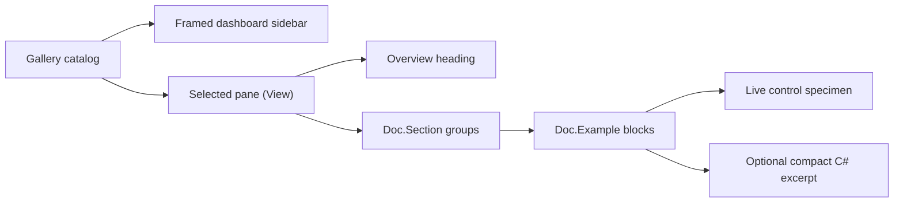

# Showcase architecture

## Showcase contract

`SharpVision.Showcase` is a runnable gallery and executable proof of the public
control API. It contains no behavior unavailable to ordinary library users.

Each concrete control lives in `src/SharpVision.Showcase/Panes/` as a
`*Pane : View` that overrides `Build()` and returns its content root once, on
first layout, exactly like any other application-authored `View`. There is no
shared showcase base class and no mandatory metadata: a pane composes public
`Stack`, marked `Text`, intrinsic chrome properties, and layout APIs directly.
`Doc` (in `src/SharpVision.Showcase/Doc.cs`) holds the small composition helpers
every pane shares: `Doc.Page(name, overview, sections...)` builds the bold
heading plus an "Overview" paragraph and stacks the given sections beneath it;
`Doc.Section(heading, description, examples...)` groups related live examples
into one progressive teaching area; and
`Doc.Example(heading, description, specimen, source?)` pairs actionable prose
with one live specimen and an optional escaped C# excerpt. `Doc.Card`,
`Doc.Row`, and `Doc.Column` remain composition shorthands for framing and
arranging specimens. Source excerpts illustrate the same public setup used by
the specimen and never define behavior absent from production code.

`Gallery` owns the stable catalog of pane titles and factories
(`(string Name, Func<View> Create)[]`). The sidebar contains one entry for each
concrete shipped control: Button, Canvas, CheckBox, ComboBox, Dock, FigletText,
Grid, List, Menu, Overlay, Popup, RadioButton, ScrollBar, Stack, Table, Text,
TextInput, Window, and Theming. Foundation types and unimplemented
specifications are not navigation entries.

Each pane's `Build()` returns a `Doc.Page` with at least four visible teaching
sections, one reproducible C# excerpt, a live instance of its subject, an
application-shaped composition, and a relevant interaction, state, layout,
Unicode, or constrained-size boundary. Sections progress from first use through
configuration, interaction, composition, and limits, using names appropriate to
the subject instead of mandatory boilerplate. Every material claim remains next
to the live public-API specimen that proves it; reflection and private render
paths are forbidden. Marked `Text` headings, descriptions, and excerpts wrap so
they reflow with the documentation column. The exact per-page teaching areas are
part of the
[showcase test contract](../testing/showcase.md#progressive-content-contract).

The Canvas page explicitly separates the
[layout `Canvas` control](../controls/layout/canvas.md#canvas-contract) from the
`TerminalCanvas` received by a custom control in `OnRender`. Layout sections
cover fixed, percentage, trailing-edge, opposing-edge stretch, explicit-size
precedence, intrinsic union, negative placement, clipping, layering, and pointer
transparency. Drawing sections cover line and box topology, fill and clear,
shade and quadrant blocks, Unicode grapheme ownership at clip edges, a
deterministic chart, and routed pointer coordinates. Custom drawing follows the
[semantic rendering pipeline](rendering-pipeline.md#rendering-pipeline-contract)
and
[Unicode cell geometry](../concepts/unicode-cell-geometry.md#unicode-cell-geometry-contract);
it never emits terminal bytes. Intrinsic shadow chrome remains demonstrated by
ordinary Button and Window pages rather than a dedicated control page.

## Responsive behavior

The root is a `Dock` with a fixed 28-cell intrinsically bordered `Dock` sidebar
and the main `Stack` in the remaining space. The main stack enables intrinsic
`AutoScroll` on the vertical axis and reserves its scrollbar only when needed.
The sidebar owns product identity, component-only stateful navigation entries,
and compact interaction hints; its selected, focused, hovered, and pressed
states follow the active application theme. The sidebar footer hosts a theme
picker `ComboBox` and a visible `Quit` button. The picker lists every theme in
the embedded `SharpVision.Styling.ThemeCatalog.Default` catalog — the built-in
Light and Dark themes plus the curated editor themes (Dracula, Nord, Gruvbox,
Solarized, and others) — grouped dark-first then light, and republishes the
chosen application theme when selected. The Theming page renders the 12 semantic
`ColorRole` values as labeled color swatches of the active application theme,
updating live as the sidebar picker changes themes. `Ctrl+C` also exits from
anywhere: the gallery handles it as a key in the preview pass so it works even
when the terminal's Kitty keyboard protocol reports `Ctrl+C` as a key event
rather than raising a host cancellation signal. The executable app runs through
`ConsoleApplication.RunAsync` with a `Gallery` screen and no further
configuration, so it gets the default xterm any-event (`1003`) SGR cell mouse
reporting from `ConsoleRunOptions` while `ConsoleApplication` owns the Unix
raw-input lease and console transport for the run. The terminal library's
default environment-hint policy remains conservative.

The main pane reserves a vertical scrollbar automatically and suppresses a
horizontal scrollbar so documentation remains a readable column. At narrow
widths geometry saturates and clips safely rather than throwing or creating
negative extents. Selecting a different sidebar component retains sidebar state
but resets the main viewport to that page's header. Selection survives resize,
and keyboard, pointer, focus, editing, and scrolling continue through the public
runtime path. The initial sidebar entry takes focus after the first frame; Up,
Down, Left, Right, Tab, Shift+Tab, Home, End, Page Up, and Page Down move the
selected page and keep its entry visible. Enter activates the focused entry
using the same path as a primary pointer release.

The FigletText page is an editor, not a static ornament: a `TextInput` updates
the preview as text changes, while a scrollable `ComboBox` exposes the 400
audited catalog names and loads only the font the user selects. Font-comparison,
layout-option, style, bounded scrolling, and fallback sections supplement the
live editor. The ScrollBar page includes an explicit live value label beside the
draggable horizontal thumb so capture, drag geometry, and commit are directly
observable. Every showcase `TextInput` inherits the active theme, and the
control paints its resolved background across its entire committed box. Empty
space is therefore visibly part of the input rather than blending into its card.

On Unix, `ConsoleApplication.RunAsync` reads directly from `/dev/tty` through a
one-byte asynchronous stream after acquiring its raw-input lease. This avoids
the line-buffered standard-input behavior that can otherwise defer
escape-prefixed mouse reports until a later key. Windows retains the standard
console stream fallback. The protocol layer still receives only decoded terminal
input values.

Vendored resources used by examples remain under the documented
[external-resource boundary](../../extern/README.md#external-resources). Stable
logical embedded-resource names keep repository paths out of runtime APIs.

## Test contract

Showcase tests assert the exact inventory, progressive section and source
coverage, fresh detached page ownership, and matching runtime control type.
Domain-focused page tests exercise command, selection, editing, layout, data,
layering, display, theme, Canvas, Unicode, and lifecycle recipes. They render
every page at 30 by 8, 80 by 24, and 140 by 40 cells, validate wide-cell
continuation structure, and prove automatic scrolling. A full Application test
drives SGR pointer selection, keyboard sidebar navigation and button activation,
wheel scrolling, text editing, and pixel-aware resize through terminal bytes.
Dedicated tests prove cooperative exit through both the sidebar `Quit` button
and a decoded `Ctrl+C` key. Startup coverage requires the exact SGR mouse-mode
lease before the first frame. The live tmux smoke test then proves a normal Down
key, separate complete SGR clicks for Canvas and Button, Figlet dropdown opening
and font selection, and a captured ScrollBar thumb drag. Each completes without
a trailing flushing key.
