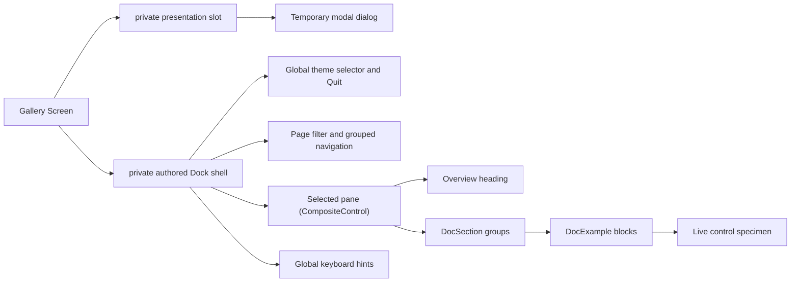
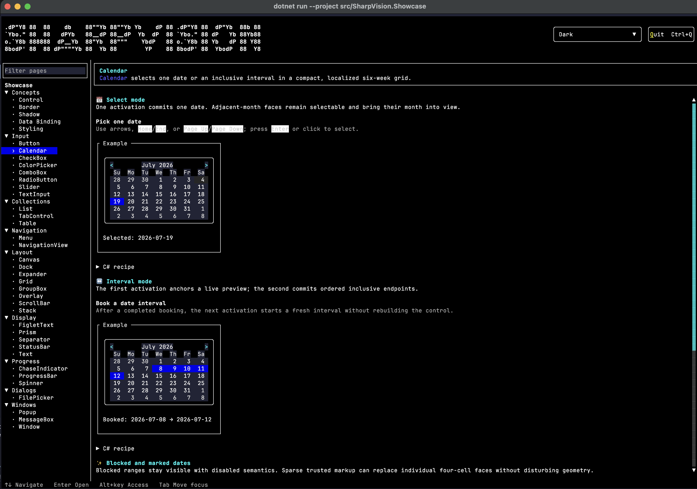
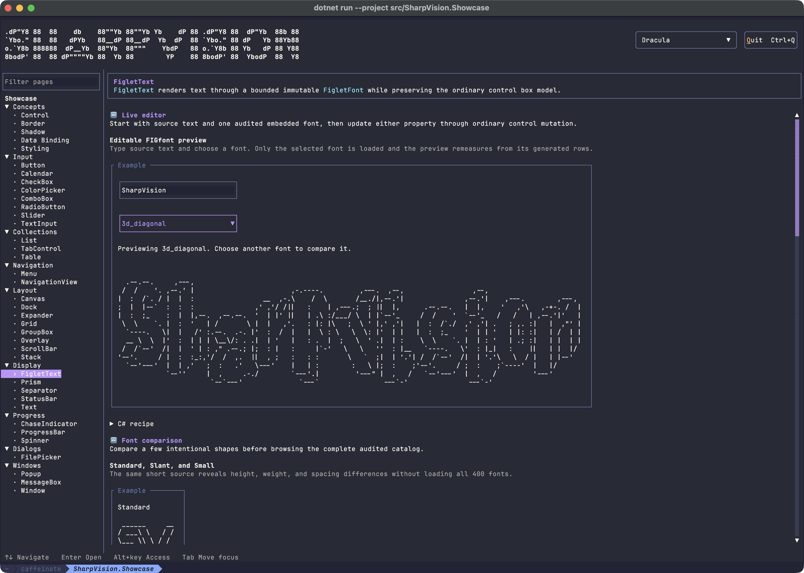

# Showcase architecture

## Overview

`SharpVision.Showcase` is a runnable gallery and an executable proof of the
public control API. It contains no behavior that is unavailable to ordinary
library users.

Every enabled authored interactive specimen caption declares an intentional
ampersand [access key](../concepts/access-keys.md#overview). Keys are unique
across the active shell and selected page, and across every simultaneously open
menu/submenu path. The shell advertises `Alt+key`, while the Menu and GroupBox
pages demonstrate invocation and focus transfer.

The sidebar remains one arrow-key `NavigationView`. Its heading, groups, and 68
catalog items set `UseMnemonic = false`, because no useful single-character
assignment can be globally unique at that scale. The repeated `DocExample` and
`C# recipe` structural chrome also opts out. Body prose and generated list data
remain literal text.

Each control or concept page lives in `examples/Showcase/Panes/` as a
`*Pane : CompositeControlBase`. Its constructor creates a retained page root and
installs it once through `InitializeContent` before any layout. There is no
measure-time construction, no shared showcase base class, and no mandatory
metadata: a pane composes the public `Stack`, marked `Text`, `Dock`, and layout
APIs directly. `examples/Showcase/Controls/` holds the small composition
controls every pane shares. `DocPage(name, overview, sections...)` builds the
bold heading and overview inside a complete intrinsic light frame, then stacks
the given sections beneath it. `DocExample(heading, description, specimen)`
builds one labeled block and places every live specimen in a standard
`GroupBox`, and `DocSection(heading, examples...)` groups related examples under
one subheading - it is the mandatory middle layer, so an example is never nested
directly in a page. The controls themselves own the surface, foreground, border,
shadow, multi-part, and visual-state defaults; ordinary control pages never
assign those appearance values or supply a decorative initial color to repair a
specimen. The dedicated Border, Shadow, and Styling concept pages assign only
the exact property they teach. Specimens and their optional code surfaces
stretch across the available reading column; an optional source excerpt begins
in a collapsed `C# recipe` expander, so it stays available without permanently
consuming viewport height. `DocCard`, `DocRow`, and `DocColumn` are composition
shorthands for framing and arranging specimens.

Every chart page provides two or three recipe-backed examples covering distinct
scale, color, legend, or grouping behavior. At least one example on each page
mutates retained chart data through a consistently aligned `Add data` action and
trailing status. The rendered examples show complete category labels, visible
label/plot axes where applicable, spaced legend markers, automatic scaling, and
an explicit-scale alternative. Plot and bottom-legend rows have a visible
separator. Because `Sparkline` intentionally has no built-in legend, its
examples compose an external color key that identifies the demonstrated series.

Page overviews and section and example descriptions are trusted authored `Text`
markup. They use named colors to distinguish API vocabulary, literal keys,
states, outcomes, and conceptual emphasis, while remaining understandable from
their visible wording alone. This authored text does not replace any control's
appearance defaults. Page names, icons, headings, and recipe source are escaped
by the documentation controls; any dynamic value interpolated into authored
prose must be escaped explicitly with `Text.Escape`. Blink, conceal, and rapid
blink remain isolated demonstrations rather than general documentation styling.

`Gallery` owns the stable catalog of pane group names, titles, and factories
(`(string Group, string Name, Func<CompositeControlBase> Create)[]`). The
sidebar organizes its 68 entries by primary use:

- Concepts: ControlBase, Border, Shadow, Data Binding, and Styling.
- Input: Button, HyperlinkButton, Calendar, DateInput, DateTimeInput, CheckBox,
  ColorPicker, CommandBar, CommandPalette, ComboBox, CurrencyInput, NumberInput,
  RadioButton, Slider, SuggestionInput, TextInput, and TimeInput.
- Collections: JsonView, ListView, TabControl, Table, and TreeView.
- Navigation: Breadcrumb, Menu, NavigationView, and Pager.
- Layout: Dock, Expander, Grid, GroupBox, Overlay, ScrollBar, SplitPane, Stack,
  and Wrap.
- Display: Canvas drawing, CodeView, Document, FigletText, Image, Markdown,
  Prism, Separator, StatusBar, and Text.
- Charts: HorizontalBarChart, VerticalBarChart, LineChart, AreaChart, and
  Sparkline.
- Progress: ChaseIndicator, ProgressBar, and Spinner.
- Notifications: InfoBar and Toast.
- Dialogs: MessageBox, OpenFilePicker, and SaveFilePicker.
- Windows: Popup, ContextMenu, Tooltip, Flyout, and Window.

Each purpose group starts expanded and can be collapsed through the standard
`NavigationViewGroup` interaction. The first Concepts group owns cross-cutting
behavior that is not a single component: the retained Control foundation,
intrinsic border and shadow chrome, data binding, and styling. A concept becomes
a navigation entry only when it has concrete live specimens rather than prose
alone.

Each pane installs one `DocPage` composed of one or more `DocSection` groups,
each holding `DocExample` blocks: an Overview paragraph stating the control's
purpose, followed by labeled live examples that show its real behavior —
activation, selection, shadow styles, disabled state, and so on — using only
behavior available to ordinary application code. Reflection and private render
paths are forbidden. There are no Property or Interaction tables and no separate
"Practical recipe" narrative section; documentation prose lives inline, next to
the specimen it describes. Marked `Text` headings and example descriptions use
`Overflow.Wrap`, so they reflow along with the live specimens as the page
narrows.

At the supported wide layout, every ordinary specimen label is self-explanatory
and fits its committed content box without accidental abbreviation. A layout
example may clip a child only when clipping, saturation, or constrained overflow
is the behavior being taught, and its adjacent heading or description must say
so explicitly. Decorative borders and padding must not turn semantic labels into
unexplained fragments.

Popup specimens use bounded application stages with separate backdrop,
interaction, and promoted-popup layers. Triggers keep their intrinsic size, each
stage reserves enough space for every demonstrated open placement, and an open
surface never covers another action or escapes into the next example. The
placement specimen uses a rounded frame, a centered `⚓ Anchor`, bordered
direction controls, and a separated status row, so the anchor relationship stays
legible across themes.

The primary Popup specimen opens through `IsOpen` and receives Dismiss modality
without caller plumbing. It exposes a backdrop action plus scope status; its
[outside press](../concepts/modality.md#outside-interaction-and-dismissal)
closes the popup without activating the backdrop. The Window page starts with a
practical retained settings surface whose real `IsDefault` and `IsCancel`
buttons report Enter and Escape activation, exposes a draggable close/reopen
workflow, and compares light, rounded, heavy, paired, and ASCII bracketed close
chrome across both close edges and all title placements. Its confirmation
specimen uses the
[modal Window presentation](../concepts/modality.md#popup-and-window-presentations)
with Ignore, keeps a workspace action visible behind it, cycles focus inside the
dialog, and reports restoration after Deploy, Cancel, Escape, or frame close.
The File/Edit/View/Help Menu specimen uses the ordinary retained submenu API:
sibling switching and the nested Open Recent path remain one
[menu plane](../concepts/modality.md#menu-planes), reported through public
selection and invocation events rather than internal state. The same page also
demonstrates `MenuBuilder`'s fluent chain — `Item`, `Check`, `Separator`, and a
nested `Submenu` — composing an equivalent menu without an object graph
assembled by hand. Its `Every item role` example owns the former MenuItem helper
page's command, submenu, separator, shortcut, check, radio, and disabled-state
proof.

The SuggestionInput page keeps one real editor focused while its asynchronous
resolver publishes a long Unicode result set. Threshold controls re-evaluate the
current grapheme count, a deliberately cancellation-ignoring slow request races
a newer swift request, and the activity log distinguishes keyboard and pointer
acceptance from Escape, Tab, and outside dismissal. Separate disabled and narrow
specimens expose availability and wide-cell clipping through public control
state only.

The OpenFilePicker and SaveFilePicker pages launch the real
`SharpVision.Dialogs.FilePickerDialog` and `SaveFileDialog` directly from their
Buttons, without a decorative specimen surface that cannot host the
application-level Window. Open uses a deterministic sample directory for
single-file, multiple-file, and directory selection, with hidden entries visible
in the multiple variant. Save separates a new filename from an existing report
that reaches overwrite confirmation. Each retained result label reports accepted
basenames, the confirmed save basename, or cancellation only after the temporary
modal surface has restored focus and removed itself.

The StatusBar page presents the control at application scale inside a bordered
46-by-11-cell editor workspace. The pretend editor uses the same semantic
`Surface` background as an edit control and leaves two blank document rows above
its visually distinct, bottom-docked `Background` status surface. The bar
retains a real playing `Spinner`, branch state, pointer coordinates, caret
position, a read-only indicator, and an interactive autosave `CheckBox` across
leading and trailing item groups. Mixed bar, bullet, chevron, and diamond item
separators demonstrate the predefined separator palette without wrapping
retained content. Moving the pointer through the editor updates the coordinate
item from routed `LocalCells`; pointer or keyboard activation of the CheckBox
updates a five-cell activity slot between `Index`, `Saved`, and `Dirty` without
shifting or clipping the adjacent branch. The bar's semantic hovered, focused,
and checked appearances retain contrast against the status surface without local
child appearance configuration. The example therefore demonstrates live
composition and dispatcher-affine mutation, not a static row of labels.

The InfoBar page contrasts all four complete semantic presentations, then keeps
one concise 44-cell warning notification interactive with an aligned checkbox
and Button action row, public dismissal event log, and external reopen action.
Its narrow specimen combines long text and Unicode so whole-cluster adornment
fallback and the trailing keyboard-reachable dismiss cell remain visible under
constraint.

Canvas demonstrates the frame-owned drawing API through labeled, framed live
specimens rather than pretending to be a child-owning layout control. Fixed,
percentage, edge-constrained, layered, and clipped child specimens live on the
Overlay page. Intrinsic composite and block-glyph shadow variants remain visible
on the Button and Window pages. The former ad hoc Canvas palette grid now lives
in the dedicated ColorPicker page, where the same swatch language supports
retained keyboard and pointer selection and adapts to the active terminal color
depth. The Slider page proves direct signed-range selection independently of
scrolling viewport semantics. The Pager page binds one page index, shows empty,
single, first, middle, and last states, and contrasts the full target sequence
with deterministic narrow retention.

The CommandBar page presents one resizable typed command surface with access-key
captions, a separator, a disabled action, and separate semantic-event and
`ICommand` logs. Narrowing the specimen moves only its source-order tail into
the live private overflow menu; widening restores the same retained command
identities without creating a second Tab stop. Named examples on the same page
own CommandBarItem activation and availability plus CommandBarSeparator styling
and participation, so those public helper types need no duplicate navigation
entries.

The Breadcrumb page bounds its primary project path at 44 cells and toggles it
to an explicit 18-cell overflow state. Its named item example retains current,
event, command, style, and availability proof without a separate helper page.
The Wrap page exposes independent Narrow/Widen controls for horizontal rows and
Shorten/Lengthen controls for vertical columns; visible width, height, and
source-order status make both reflow axes observable.

The Charts group demonstrates retained chart controls rather than ad hoc Canvas
drawings. Horizontal and vertical bars cover mixed-sign scaling, category
labels, colors, and legends; line and area charts cover bound observable series
and non-zero trend scaling; Sparkline covers compact fractional rendering. Each
page changes live public model data so invalidation and binding remain visible.

Both images show the actual interactive application rather than a separately
mocked documentation surface.

## Responsive behavior

The Gallery Screen directly owns its authored `Dock` through the permanent
composition slot and owns temporary modal dialogs through a separate private
presentation slot. The Dock contains a nine-row application bar, a fixed 26-cell
page sidebar, the selected page surface, and a one-row `StatusBar`. Temporary
modal dialogs share the complete terminal bounds and never participate in the
Dock's edge allocation. The application bar is exactly as tall as the FIGlet
identity it carries - nine rows for the `Classy` font - with horizontal padding
only, so no blank rows are reserved above or below it. Its theme picker stays at
its intrinsic three-row height, and the selected theme name serves as its label.
The Quit button follows the theme picker at the trailing edge, while the bottom
status bar contains the Navigate, Open, and focus-movement keyboard hints. The
picker lists every theme in `SharpVision.Styling.ThemeCatalog.Entries` — the
built-in Light and Dark themes plus the curated editor themes (Dracula, Nord,
Gruvbox, Solarized, and others) — grouped dark-first then light, and republishes
the chosen application theme when one is selected. The sidebar uses its quiet
themed background, contains only a `TextInput` page filter and the grouped
`NavigationView`, and uses a single intrinsic separator at its right edge.
Filtering compares the committed query to the authored page names without regard
to case, collapses nonmatching items, and collapses any group with no remaining
item. Each page entry is a single-content, caption-and-command-enabled
`InputBase` row whose `Text` content is measured and arranged beside its marker;
the selected, focused, hovered, and pressed states follow the active application
theme. The Styling concept page enumerates every `SemanticColor` into compact
theme-resolved swatches, keeps concrete `Color` samples literal, and compares
bounded `Face`, border, and shadow channels. Its normal, focused, pressed,
selected, and disabled specimens are ordinary mounted controls driven by real
focus, pointer, selection, and availability state. `Ctrl+Q` exits from anywhere:
the gallery handles it as a key in the preview pass without stealing ordinary
text-editing input. The executable app runs through
`ConsoleApplication.RunAsync` with a `Gallery` screen and one builder call,
`TreatControlCAsInput()`, which is why `Ctrl+Q` rather than `Ctrl+C` is the exit
chord - Ctrl+C reaches the application as ordinary input instead of requesting
cooperative shutdown (see
[hosting.md](../concepts/hosting.md#treatcontrolcasinput)). Everything else is
default, so it gets the default xterm any-event (`1003`) SGR cell mouse
reporting from `ConsoleRunOptions`, while `ConsoleApplication` owns the Unix
raw-input lease and console transport for the run. The terminal library's
default environment-hint policy remains conservative.

The main pane reserves a vertical scrollbar automatically and suppresses a
horizontal scrollbar. Live examples use the available reading width instead of
an arbitrary 100-cell cap; at narrow widths, geometry still saturates and clips
safely rather than throwing or creating negative extents. Selecting a different
sidebar page retains the sidebar filter state but resets the main viewport to
that page's header. Selection survives resize, and keyboard, pointer, focus,
editing, and scrolling continue through the public runtime path. The initial
sidebar entry takes focus after the first frame; Up, Down, Left, Right, Tab,
Shift+Tab, Home, End, Page Up, and Page Down move the selected page and keep its
entry visible. Enter activates the focused entry using the same path as a
primary pointer release.

Because the main pane suppresses its horizontal scrollbar, a pane that requests
a fixed `Length.Cells` specimen width wider than the reading column does not
overflow into a scrollable area - it silently disappears instead.
`ControlBase.ResolveArrangeAxis` resolves a `LengthKind.Cells` request through
`Math.Min(available, Math.Clamp(requested, minimum, maximum))`, so an over-wide
fixed width never exceeds the arrange slot; it just clamps down to whatever
width `DocPage` actually has, historically around 46-47 usable columns inside
`DocExample`. With `HorizontalBarVisibility` hidden there is no affordance
revealing the clamp, so the clamped-away content is simply invisible rather than
scrolled out of view. A pane authoring a fixed specimen width must stay inside
the current reading column instead of assuming a historical fixed cap.

The FigletText page is an editor, not a static ornament: a `TextInput` updates
the preview as text changes, while a scrollable `ComboBox` drop-down exposes the
19 audited optional-package names and opens only the independent resource for
the font the user selects. The ScrollBar page includes an explicit live value
label beside the draggable horizontal thumb, so capture, drag geometry, and
commit are directly observable. Every showcase `TextInput` inherits the active
theme: its light semantic border defines the editable box while the body
composes transparently with the surrounding application, so the showcase
exercises the same restrained default as an ordinary app.

The Prism page compares horizontal, vertical, and diagonal hue coordinates, then
advances a diagonal FIGlet specimen one explicit phase step at a time. Its
rich-text specimen makes the foreground-only boundary visible by retaining the
original background, bold attribute, typed underline, underline color, and
hyperlink metadata. The page uses no hidden timer; the caller owns every phase
mutation.

On Unix, `ConsoleApplication.RunAsync` reads directly from `/dev/tty` through a
one-byte asynchronous stream after acquiring its raw-input lease. This avoids
the line-buffered standard-input behavior that can otherwise defer
escape-prefixed mouse reports until a later key. Windows retains the standard
console stream fallback. The protocol layer still receives only decoded terminal
input values.

Vendored resources used by the examples remain under the documented
[external-resource boundary](../../extern/README.md#external-resources). Stable
logical embedded-resource names keep repository paths out of runtime APIs.

## Verification

The showcase compiles with the solution as production code and uses only public
library APIs. Behavioral, input, layout, rendering, and Unicode guarantees are
proved by the terminal and UI suites at the library boundaries that own them —
the showcase carries no test project of its own, and no suite mounts its panes.
The control-image manifest maps full documentation paths to primary pages and
named examples, including every concrete control and dialog document. The
deterministic capture workflow drives declared actions, expands popup crops for
overlay surfaces, and regenerates the checked-in images; the coverage validator
requires every mapped page, asset, and document reference to agree. The complete
gallery image remains illustrative rather than an automated contract.

Modality is not covered at the showcase-pane layer. Window isolation, popup
dismissal, and `ModalScope` identity across menu and submenu transitions are
proved against purpose-built trees in the modality suites described under
[Controls integration](../testing/controls-integration.md#overview), not by
mounting the real panes.

## Expected behavior

The showcase's guarantees are backed by evidence at three layers:

| Layer       | Required evidence                                                                                    |
| ----------- | ---------------------------------------------------------------------------------------------------- |
| Build       | Every shipped page and public example compiles against production APIs only.                         |
| Surface     | Narrow, normal, and wide layouts preserve containment, semantic defaults, and representative states. |
| Interaction | Mounted input drives activation, focus, selection, popups, mutation, and final cells.                |

The preceding [verification contract](#verification) owns the exact
showcase-page and capture expectations.
