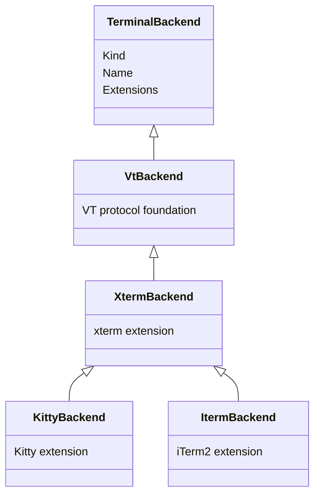
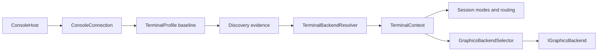

# Terminal backends

## Overview

One SharpVision application uses one physical terminal connection and one fixed
terminal backend identity. The connection, backend identity, protocol
extensions, capabilities, and graphics backend are separate boundaries:

| Boundary            | Responsibility                                                               | Lifetime                            |
| ------------------- | ---------------------------------------------------------------------------- | ----------------------------------- |
| Connection          | Owns TTY transport, resize source, and the platform restore lease            | Console host open through shutdown  |
| Terminal backend    | Identifies the VT, xterm, Kitty, or iTerm2 emulator family                   | Fixed for one application lifetime  |
| Protocol extension  | Describes reusable typed behavior layered over the inherited protocol family | Immutable backend metadata          |
| Capability evidence | Authorizes optional behavior for the current immutable terminal profile      | May be refined by bounded discovery |
| Graphics backend    | Prepares and commits renderer-owned image transactions                       | Renderer construction through stop  |

`ConsoleConnection` is the physical connection boundary; it neither identifies
the emulator nor authorizes optional output. `TerminalBackend` is immutable
family identity and owns no transport, no query tracker, and no mutable
capability state. `ProtocolExtension` is composition metadata: the existing
typed encoders, decoders, routers, services, and graphics implementations remain
the only wire implementations. The
[discovery pipeline](discovery-pipeline.md#overview) produces the evidence used
to resolve identity and refine capabilities.

`TerminalContext` binds the selected backend to the current immutable
`TerminalProfile`. One context lineage exists for an application lifetime.
Capability publication replaces the context and profile snapshots while
preserving the exact backend reference. Runtime code MUST NOT re-resolve or
replace terminal identity after initialization.

## Backend hierarchy

`TerminalBackend` assembles one immutable extension collection, ordering
inherited extensions before local ones. Duplicate extension kinds fail
construction. `VtBackend` supplies the conservative VT foundation.
`XtermBackend` inherits that foundation and adds the xterm extension.
`KittyBackend` and `ItermBackend` inherit both and each add only their own local
extension. Backend classes identify existing protocol families in their ordered
metadata; the independent protocol codecs implement the wire behavior, and
backend classes neither reference nor duplicate escape-sequence encoding or
parsing.

`TerminalBackendResolver` consumes the immutable profile and environment
snapshots through `DescriptionBackendEvidenceAdapter` and
`EnvironmentBackendEvidenceAdapter`. Those adapters publish redacted
`BackendEvidence` containing only the typed origin and backend kind. The
resolver never reads process-global state, issues queries, or inspects semantic
capability values. The most specific satisfied identity wins in this order:

1. Kitty;
2. iTerm2;
3. xterm-compatible; and
4. conservative VT fallback.

The fallback authorizes no optional output by itself. A sixel response enables
the sixel extension when its evidence is authoritative; it never changes the
identity to a sixel backend, and there is no `SixelBackend`. Likewise, Kitty
graphics support is a capability of a resolved backend, not evidence that may
replace an already published identity.

## Extensions and authorization

A backend's extension collection says which protocol families the library can
compose for that identity. It is not a support claim, and it is not permission
to emit bytes. The [capability contract](capabilities.md#overview) authorizes
optional output only from supported evidence with an approved origin.
Environment hints may remain observable or tentative, but they never become an
output grant merely because an extension descriptor exists.

VT, xterm, Kitty, and iTerm2 protocol behavior continues to live in the focused
typed codecs linked from the
[protocol index](../protocols/index.md#protocol-families). Sixel remains a DEC
graphics extension rather than an emulator identity. tmux and GNU screen remain
typed route adapters around an explicitly described outer terminal. A
multiplexer neither becomes the backend identity nor permits direct bytes that
bypass its [routing policy](capabilities.md#multiplexer-boundary).

## Graphics backend boundary

`IGraphicsBackend` is renderer-owned transactional state. It prepares uploads,
placements, and removals before transport I/O, commits them after a successful
flush, and invalidates them after uncertain output. `GraphicsBackendSelector`
chooses a Kitty or shared non-retained graphics backend only from the active
`TerminalContext`, authoritative capability evidence, and an authorized route.
It does not resolve terminal identity.

Renderer construction fixes the graphics backend family for that application.
Every frame still rechecks the current capability evidence, so a later
revocation can remove or repair graphics without replacing the graphics backend.
The [rendering pipeline](rendering-pipeline.md#overview) owns transaction
ordering, cell fallback, invalidation, and cleanup. The
[memory contract](memory-ownership.md#overview) owns backend state and borrowed
buffers.

## Initialization and ownership

The host resolves one usable description before any terminal output. Options
create the initial `TerminalContext`; `Session` and `Application` retain
contexts with the same backend identity as capability evidence is published. The
application creates its renderer lazily, after profile and resize publication.
Shutdown awaits graphics cleanup, then disposes session-owned transport and
resize state, then restores the platform terminal lease as specified by the
[hosting contract](../concepts/hosting.md#portable-console-host).

## Failure and fallback

- Missing or unsuitable descriptions retain their typed preflight rejection and
  emit no terminal/query/render bytes.
- Insufficient identity evidence selects `VtBackend` without enabling optional
  protocols.
- Duplicate extension composition fails before terminal output.
- Unsupported or unauthorized extensions remain byte-quiet and use their
  documented safe fallback.
- Multiplexer route rejection is atomic and cannot fall back to direct output.
- Backend resolution and capability refinement cannot replace an earlier cleanup
  failure or bypass reverse ownership order.

This architecture is organizational. It changes no wire grammar or support
state. The [coverage matrix](../protocols/coverage-matrix.md#coverage) remains
the sole support summary.

## Expected behavior

Readers can rely on the following, and the test suites keep each point true:

- Backend hierarchy inheritance, the immutable inherited-before-local extension
  order, duplicate-extension rejection, and resolver specificity behave exactly
  as described above.
- Sixel evidence and multiplexers never become terminal identities.
- Capability refinement preserves the exact backend reference.
- `GraphicsBackendSelector` requires authoritative evidence and route approval
  before it selects any graphics backend.
- One cross-layer initialization path drives connection, description, discovery,
  backend publication, optional-mode startup, rendering, and reverse cleanup; no
  second identity-selection path exists.
