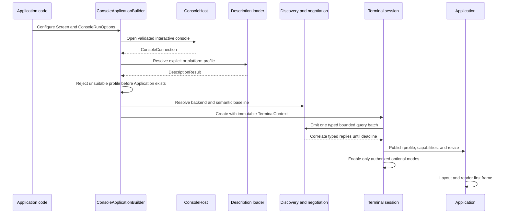
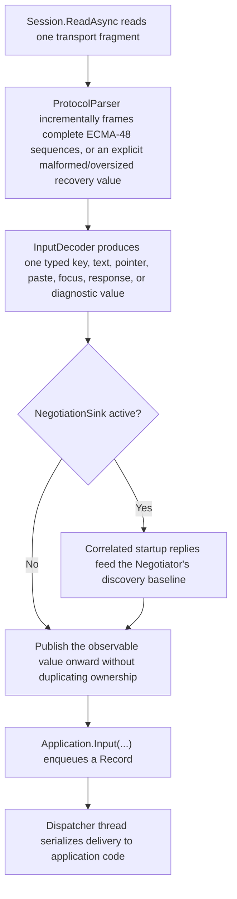

# Terminal integration

## Overview

Terminal integration is the bridge between SharpVision controls and the user's
terminal program. It is one ordered runtime path that starts at an owned
physical console connection and ends at typed input, retained UI state, rendered
cells, and restored terminal modes. Application code enters through
`SharpVision.ConsoleApplication`; it does not construct a session, transport,
parser, renderer, or terminal-description provider by hand.

The integration keeps four concerns separate:

| Concern              | Owner                                       | Published result                                         |
| -------------------- | ------------------------------------------- | -------------------------------------------------------- |
| Physical console     | `ConsoleHost` and `ConsoleConnection`       | Transport, resize source, and platform restore lease.    |
| Terminal description | `ConsoleConnection.ResolveDescription`      | `DescriptionResult` and validated `TerminalProfile`.     |
| Semantic discovery   | discovery strategies and active negotiation | Immutable `Capabilities` snapshots with evidence origin. |
| Protocol use         | session, renderer, and `ITerminalServices`  | Typed input/events or ordered output bytes.              |

An emulator identity such as VT, xterm, Kitty, or iTerm2 is neither a physical
connection nor an optional protocol feature. Backend identity is fixed for the
application lifetime. Capability snapshots may be replaced as bounded evidence
arrives, but replacing a snapshot cannot silently change the backend.

## Public API

| API                                                                 | Purpose                                                                      | Ownership and fallback                                                                        |
| ------------------------------------------------------------------- | ---------------------------------------------------------------------------- | --------------------------------------------------------------------------------------------- |
| `ConsoleApplication.CreateBuilder(Screen)`                          | Creates the fluent interactive host configuration.                           | The builder retains the detached screen until `Build()` or `RunAsync()`.                      |
| `ConsoleApplication.RunAsync(...)`                                  | Runs the complete host lifecycle and returns `ConsoleRunStatus`.             | Redirected or unsuitable terminals return a typed status without constructing an application. |
| `ConsoleApplicationBuilder.UseTerminalProfile(TerminalProfile)`     | Supplies a complete caller-owned profile.                                    | Highest precedence; bypasses native description lookup and disables negotiation.              |
| `ConsoleApplicationBuilder.UseCapabilities(TerminalCapabilities)`   | Supplies exact semantic capability evidence through a built-in ANSI profile. | Compatibility path; disables native description lookup and negotiation.                       |
| `ConsoleApplicationBuilder.UseNegotiation(NegotiationOptions)`      | Configures bounded active discovery.                                         | Query evidence refines the baseline before optional modes and the first frame.                |
| `ConsoleApplicationBuilder.WithClipboardOperationTimeout(TimeSpan)` | Configures the human-interaction deadline for clipboard operations.          | Defaults to 30 seconds and does not lengthen startup capability negotiation.                  |
| `Application.Terminal`                                              | Exposes `ITerminalServices`.                                                 | Unsupported operations are byte-quiet unless the public method documents argument rejection.  |
| `Application.Capabilities`                                          | Exposes the current immutable semantic profile.                              | Replaced atomically after accepted discovery evidence.                                        |
| `Application.TerminalProfile`                                       | Exposes description plus current capabilities.                               | Description programs and key maps remain fixed across semantic refinement.                    |
| `Session.Diagnostics`                                               | Exposes typed backend, query, mode, and route facts.                         | Immutable and redacted; replaced when bounded negotiation completes.                          |
| `Application.TerminalDiagnostics`                                   | Adds dispatcher-published diagnostics and renderer graphics selection.       | Changes before the matching capability event and retains no raw terminal payloads.            |

See [Hosting](../concepts/hosting.md#overview) for every builder option and
status. See [Terminal capabilities](capabilities.md#overview) for the complete
feature model.

## Startup sequence

The detailed evidence precedence and query lifecycle live in the
[discovery pipeline](discovery-pipeline.md#overview). The
[runtime event loop](runtime-event-loop.md#overview) owns ordering after
publication.

## Discovery evidence

Evidence is applied from weakest to strongest:

1. Conservative library defaults.
2. A validated terminal-description profile and its compiled programs.
3. Allowlisted environment hints and safety narrowing.
4. Correlated, bounded active-query replies received before one exclusive
   deadline.
5. Explicit caller overrides.

Environment names may suggest a backend identity, but they do not by themselves
authorize arbitrary protocol output. Description capabilities authorize only the
programs that were actually loaded, validated, and compiled. Query replies pass
through the existing typed codecs before they may refine a feature. Explicit
settings apply last, but they cannot inject raw escape strings.

Each optional protocol is represented by a `Feature`, which carries a
`CapabilitySupport` state and an `Origin`. Consumers call
`Capabilities.Support(TerminalProtocol)` or inspect `Capabilities.Features`;
they do not infer support from terminal names. The
[coverage matrix](../protocols/coverage-matrix.md#coverage) is the sole summary
of what the current code and tests prove.

## Protocol routing

Inbound bytes follow one bounded path:

1. The session reads arbitrary fragments from the transport.
2. The incremental ECMA-48 parser frames complete sequences and explicit
   malformed/oversized recovery values.
3. Typed decoders produce key, text, pointer, paste, focus, response, or
   diagnostic values.
4. The protocol router sends correlated startup replies to discovery and
   publishes observable replies without duplicating ownership.
5. The dispatcher serializes application input and lifecycle callbacks.

Outbound behavior follows typed ownership:

- Controls draw cells; they never emit escape bytes.
- The renderer owns cursor movement, rendition, frame synchronization, and
  graphics-backend selection.
- `Application.Terminal.Bell.Ring()`, `SetTitle(string)`, and
  `Application.Terminal.Clipboard` expose the implemented out-of-band services.
- The session owns optional-mode leases and restores successful acquisitions in
  reverse order.
- Encoders and terminal-description programs are the only sources of output
  bytes; discovery code never hand-writes protocol strings.

The [protocol index](../protocols/index.md#protocol-families) maps each family
to its wire contract, while
[runtime protocol routing](../protocols/runtime-routing.md#overview) owns typed
dispatch and recovery.

## Failure, fallback, and cleanup

- Redirected input or output returns `ConsoleRunStatus.Redirected`.
- Missing, generic, hardcopy, incomplete, or padding-dependent descriptions
  return `ConsoleRunStatus.UnsupportedTerminal` from managed `RunAsync`.
- Unknown backend identity selects the conservative VT backend.
- Missing or contradictory optional evidence leaves the feature unsupported or
  unknown; it does not enable speculative output.
- Unsupported terminal services produce no bytes.
- Strict diagnostics may promote a documented environmental diagnostic to an
  exception but cannot change valid protocol output.
- Shutdown disables acquired terminal modes in reverse order, disposes session
  transport/resize resources, and restores the platform console lease last. A
  Unix restore discards unread terminal input before re-enabling canonical echo,
  preventing a partial mouse report from leaking into the resumed shell.
- A cleanup failure never replaces an earlier application or transport failure.

## Expected behavior

The integration path is backed by evidence at three layers:

| Layer          | Required evidence                                                                                                                          |
| -------------- | ------------------------------------------------------------------------------------------------------------------------------------------ |
| Unit           | Option validation, evidence precedence, immutable publication, exact typed encoder bytes, parser recovery, and unsupported no-op behavior. |
| Integration    | Description, backend, discovery, routing, dispatcher, layout, rendering, out-of-band writes, and reverse cleanup through real boundaries.  |
| Pseudoterminal | Raw mode, fragmented input, resize, cancellation, failure, exact output order, and terminal restoration without privileges.                |

The cross-layer startup scenario proves, in order:

1. one physical connection and validated description;
2. fixed backend identity and conservative capability baseline;
3. one bounded query batch with typed correlated replies;
4. immutable capability publication before optional modes and first frame;
5. input delivery through the dispatcher to final rendered bytes; and
6. reverse protocol and platform cleanup after normal exit and injected failure.
