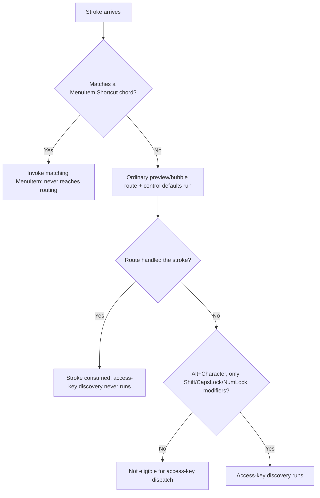
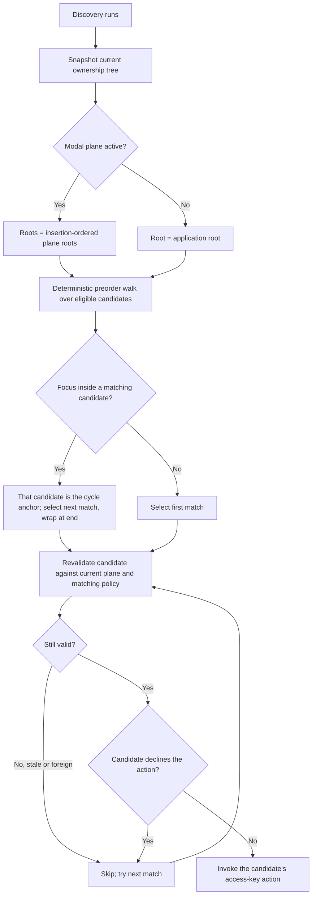

# Access keys

## Overview

An access key is a caption-local keyboard action declared with an ampersand. It
differs from a command shortcut such as `Ctrl+S`: the caption owns the access
key, SharpVision discovers it from the current retained tree, and the captioned
control decides what the result is - focus transfer, selection, a toggle,
opening a popup, or invocation.

This behavior follows the Windows Forms access-key convention documented in
Microsoft's
[Add an access key shortcut to a control](https://learn.microsoft.com/dotnet/desktop/winforms/controls/how-to-create-access-keys)
(accessed 2026-07-18) and the VCL `Caption` accelerator convention documented in
Embarcadero's
[`TControl.Caption`](https://docwiki.embarcadero.com/Libraries/Sydney/en/Vcl.Controls.TControl.Caption)
(accessed 2026-07-18).

## Caption syntax

The first unescaped `&` followed immediately by a valid Unicode scalar declares
the access key. Matching is invariant and case-insensitive. The marker itself
occupies no cells; the complete grapheme that begins with the marked scalar is
underlined and drawn in the active theme's `Hotkey` status foreground while the
caption's owner is enabled. For example, `"&Save"` renders `Save`, and
`"&e\u0301dit"` underlines the one-cell grapheme `é` rather than separating its
combining mark.

`&&` renders a single literal ampersand and declares no key. A trailing `&` also
renders literally, because no scalar follows it. When a caption contains more
than one unescaped marker, every marker is removed from the visible text, but
only the first marked scalar is the access key and only its grapheme is
underlined.

`ControlBase.UseMnemonic` defaults to `true` for captioned controls. Setting it
to `false` removes the control from access-key discovery and renders its caption
ampersands literally. `Text` is a rich, body-text control and therefore defaults
`UseMnemonic` to `false`; set it to `true` explicitly when a standalone `Text`
acts as a label. A retained `Text` used as a semantic caption by `InputBase` or
`HeaderedContentControl` inherits the owner's effective setting through one
internal caption-owner contract. Rendering and discovery consume that same
ownership fact, so the visible syntax and dispatch behavior cannot disagree or
register the retained display child as a second candidate.

## Dispatch precedence

Only a pressed `Code.Character` stroke that includes `Alt` qualifies. `Shift`,
`CapsLock`, and `NumLock` may accompany Alt, but Control, Super, Hyper, Meta, an
unknown modifier, a repeat or release transition, or a non-character key keeps
the stroke out of access-key dispatch.

The application first completes the ordinary stable preview/bubble route and
each control's default behavior. A handled route keeps the key. Only an
unhandled stroke reaches access-key discovery, so an application or control can
reserve Alt input using the normal routed-event API.

Legacy terminals represent an Alt character as an adjacent stroke/text pair, and
Kitty associated text can report several text records for one stroke. When the
stroke activates an access key, `Application` consumes every adjacent text
record unconditionally - it does not compare Runes, since a consumed stroke's
paired record(s) may carry scalars that differ from the stroke's own character -
so the mnemonic cannot leak into the newly focused editor. Only a stroke that is
both declined by routing and not discovered as an access key leaves its text
record untouched: a stroke consumed anywhere on or around its route - a preview
handler, an ordinary routed default such as `TextInput`'s Ctrl+A/Z/Y, or a
framework-level clipboard shortcut - suppresses its paired text record the same
way an access key does, so the same principle stated below for
`MenuItem.Shortcut` applies uniformly to every consume path, not only the two
named here (see [route construction](input-routing.md#route-construction)).

`MenuItem.Shortcut` dispatch is the mirror image: it runs _before_ the ordinary
route, not after. A matching chord invokes its item and the stroke never reaches
routing at all, so a shortcut always wins over whatever the focused control
would otherwise do with the same keys. Like the access-key path, a shortcut
match also consumes the stroke's adjacent paired text record, so the chord is
never also typed into whatever currently has focus. See
[MenuItem shortcut dispatch](../controls/menus/menu-item.md#shortcut-dispatch)
for its discovery rules, which mirror this section's precisely.

## Discovery eligibility and duplicates

Discovery and `MenuItem.Shortcut` dispatch share one interaction-plane walker.
It takes a snapshot of the current ownership tree for each qualifying stroke;
there is no mutable registration table that has to be kept in sync with caption,
enabled, visibility, ownership, popup, or modal changes. Traversal is a
deterministic preorder walk over the registered ownership slots. When a modal
plane is active, its insertion-ordered plane roots replace the application root.
Each plane root is also the boundary for caption-ancestor deduplication: a
matching ancestor outside that root cannot suppress an in-plane caption, while a
matching ancestor inside it still prevents a duplicate semantic candidate.

Detached, disposed, hidden, collapsed, disabled, `UseMnemonic = false`, and
out-of-plane controls are excluded. A private or public `Text` caption owned by
a semantic control does not become a second candidate for the same marker.

Duplicate keys are valid. If focus is inside one matching candidate, that
candidate becomes the cycle anchor and the next match is tried, wrapping around
at the end. Otherwise traversal starts at the first match. A candidate that
declines its action does not prevent a later match from accepting it. Because a
declining action may synchronously remove, dispose, reparent, hide, disable, or
change the active modal plane before a later snapshot entry is reached, every
candidate is revalidated against the current interaction plane and caller-owned
matching policy before invocation. Stale or foreign entries are skipped.

## Focus and semantic actions

The common `ControlBase.OnAccessKey(Rune)` default focuses an eligible captioned
control. A non-focusable captioned scope focuses its first eligible descendant
in hierarchical tab order. A label-like leaf advances through the same focus
traversal from its stable tree anchor.

Built-in action controls specialize that default without inventing a second
state path:

| Caption owner          | Access-key action                                                 |
| ---------------------- | ----------------------------------------------------------------- |
| `Button`               | Focuses and clicks with `ActivationCause.Keyboard`.               |
| `CheckBox`             | Focuses and toggles with `ActivationCause.Keyboard`.              |
| `RadioButton`          | Focuses and selects with `ActivationCause.Keyboard`.              |
| `Expander`             | Focuses and toggles expansion.                                    |
| `MenuItem`             | Selects/focuses its `Menu`, then opens its submenu or invokes.    |
| `TabItem` header       | Focuses its `TabControl` and selects the page.                    |
| `NavigationViewItem`   | Focuses the view, makes the item current, and invokes/selects it. |
| `NavigationViewGroup`  | Focuses the view, makes the group current, and toggles it.        |
| `GroupBox` or `Window` | Focuses the first eligible descendant.                            |

Unavailable controls never activate. Menu, popup, and window actions keep their
existing modality, focus restoration, selection, and event ordering.

## Rendering integration

Marker collapse, escaping, Unicode measurement, and segmented underline drawing
share one implementation. The direct `Header` and `Title` renderers use the same
visible width for measuring and drawing. `Text` converts enabled access syntax
into its existing semantic markup before grapheme layout, so clipping, wrapping,
wide-cell ownership, inherited background, attributes, and underline metadata
remain authoritative. Only the marked grapheme receives the resolved
`Theme.Hotkey` foreground. A disabled owner keeps its disabled foreground while
marker collapse and the underline remain visible. A live hotkey-only theme
replacement repaints active standalone and retained captions without measuring
or arranging them; captions without an effective marker ignore that unrelated
theme value.

## Expected behavior

The behavior above is verified across marker removal, `&&`, trailing markers,
disabled parsing, invariant Rune matching, combining and wide graphemes, exact
cells, underline style, access-key theme resolution, disabled-foreground
preservation, dynamic caption and tree mutation, duplicate cycling, routed
interception, modifier filtering, unavailable controls, modal confinement, scope
focus transfer, every built-in semantic action, and adjacent key/text
suppression. The showcase inventory keeps an intentional marker on every
authored interactive specimen, with keys unique across each selected page and
the complete active application tree, and no ancestor collision along an open
menu path. Generated list data, body prose, repeated documentation chrome, and
the arrow-navigated catalog sidebar do not participate.
