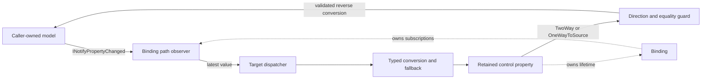

# Data binding

## Overview

SharpVision binds retained control properties to ordinary .NET model properties
through strongly typed expressions. Models remain caller-owned CLR objects;
binding adds no `DataContext`, no virtual tree, no reconciliation, no polling,
and no string property paths.

```csharp
using SharpVision.DataBinding;

input.Bind(customer, model => model.Address.City);
active.Bind(settings, model => model.Enabled);
```

The returned `Binding` keeps the relationship alive and implements
`IDisposable`. The target control also owns it, so you only need to retain the
return value when the application must stop synchronization early.



## Notification model

Initial synchronization works with any non-null reference-type model. Live
source updates rely on `INotifyPropertyChanged`: every reachable object that
owns a replaceable path segment implements that interface when its changes must
remain observable.

A notification with an exact property name refreshes only the affected path. A
null or empty property name refreshes every segment owned by that publisher.
Notifications for unrelated names are ignored. Binding never polls a plain
object and never rewrites one into a proxy.

`ControlBase` publishes its derived `EffectiveIsEnabled`, `EffectiveIsVisible`,
`CanFocus`, and `CanTabStop` changes when either authored ancestor state or
ownership ancestry changes. A binding sourced from any of those read-only
properties therefore remains current when its source subtree is added, removed,
or moved through a framework ownership transaction; no polling or manual refresh
is required.

Framework composites use a separate internal retained-part bridge when a public
owner property is implemented by a private presentation control. The bridge
names both properties, compares typed current values, forwards child-originated
changes, and cuts off superseded notifications after reentry. It is owned by the
control rather than exposed as application data binding: detaching or disposing
the part releases its subscriptions, and disposing the owner releases every
bridge before the retained tree.

## Modes and natural values

| Mode             | Initial value    | Source changes | Target changes |
| ---------------- | ---------------- | -------------- | -------------- |
| `OneWay`         | Source to target | Applied        | Ignored        |
| `TwoWay`         | Source to target | Applied        | Applied        |
| `OneWayToSource` | Target to source | Ignored        | Applied        |

The natural adapters each choose a concrete default:

| Control                                                                         | Property           | Default mode |
| ------------------------------------------------------------------------------- | ------------------ | ------------ |
| `Text`                                                                          | `Content`          | `OneWay`     |
| `InputBase` with `EnableCaption` (`Button`, `HyperlinkButton`)                  | `Text` (caption)   | `OneWay`     |
| `InputBase` with `EnableCommand` (via `BindCommand`)                            | `Command`          | `OneWay`     |
| `InputBase` with `EnableCommand` (via `BindCommandParameter`)                   | `CommandParameter` | `OneWay`     |
| `TextInput`                                                                     | `Text`             | `TwoWay`     |
| `CheckBox`, `RadioButton`                                                       | `IsChecked`        | `TwoWay`     |
| `Slider`, `ScrollBar`                                                           | `Value`            | `TwoWay`     |
| `ProgressBar`                                                                   | `Value`            | `OneWay`     |
| `ColorPicker`                                                                   | `Value`            | `TwoWay`     |
| `ListView`, `ComboBox`, `TabControl`, and `Menu`                                | `SelectedIndex`    | `TwoWay`     |
| `TreeView`                                                                      | `SelectedItem`     | `TwoWay`     |
| `TreeViewItem`                                                                  | `Header`           | `OneWay`     |
| `TreeViewItem` (via `BindExpanded`)                                             | `IsExpanded`       | `TwoWay`     |
| `Calendar`                                                                      | `Selection`        | `TwoWay`     |
| `DateInput`, `TimeInput`, `DateTimeInput`                                       | `Value`            | `TwoWay`     |
| `Expander`                                                                      | `IsExpanded`       | `TwoWay`     |
| `FigletText`                                                                    | `Content`          | `OneWay`     |
| `JsonView`                                                                      | `Json`             | `OneWay`     |
| `HorizontalBarChart`, `VerticalBarChart`, `LineChart`, `AreaChart`, `Sparkline` | `Series`           | `OneWay`     |

`BindCommand` and `BindCommandParameter` bind a control's `Command` and its
borrowed parameter one-way; both throw `InvalidOperationException` unless the
control has called `EnableCommand`. The existing `ICommand.CanExecuteChanged`
handling, click ordering, and execution stay owned by the control itself
(`Button`, `HyperlinkButton`, or any other `EnableCommand`-enabled `InputBase`).

The generic escape hatch names both properties and supplies typed conversion:

```csharp
label.BindProperty(
    control => control.Content,
    viewModel,
    model => model.Count,
    count => count.ToString(CultureInfo.InvariantCulture),
    convertBack: null,
    BindingMode.OneWay,
    fallbackValue: "0");
```

Converted `TwoWay` and `OneWayToSource` bindings require a reverse converter. A
binding declaration error - a read-only leaf, an unsupported expression, a
duplicate target property - throws with its original identity. A runtime value
rejection from a converter or a property setter does not: a forward converter or
target write that throws applies the declared fallback value instead, and a
reverse converter or model setter that throws drops the update, leaving the
model untouched.

## Paths, nulls, and ordering

Paths consist of public instance properties rooted in the expression parameter.
Fields, methods, indexers, static properties, captured roots, conditionals,
arithmetic, and value-type intermediate properties are rejected before any
subscription or mutation happens; only the leaf property may be a value type.
Expressions compile once, and updates then call cached accessors without
reflection or string lookup.

For `model => model.Address.City`, the binding observes both `Address` and the
current address's `City`. Replacing `Address` unsubscribes the old branch and
starts observing the replacement.

A null intermediate makes the path unavailable. The natural adapters project a
safe fallback in that state: empty text, a null check state, the current range
minimum, or selection index `-1`. Observation resumes as soon as the branch
becomes reachable again. A null leaf is just an ordinary value.

A reverse update cannot write through a null intermediate: binding never
constructs model objects, so it drops the update rather than writing through
one. The target has already committed and raised its own change notification by
that point; the model is simply left untouched, and the next forward update -
once the intermediate becomes reachable again - reconciles the target back to
the source's real value.

Binding compares the converted destination value before invoking its setter, so
equal values are not assigned. Direction guards suppress only the binding's own
echo. Because target properties commit before `ControlBase.PropertyChanged`,
two-way model updates happen before later typed events such as
`TextInput.TextChanged`.

Invalid declarations fail before registration, and a failed initialization
removes any subscriptions it created, keeping their original identity. Runtime
getter and subscriber exceptions also keep their original identity; a
converter's or a property setter's runtime exception does not - see above. Only
one live binding may author a given target property.

## Dispatcher and responsiveness

Attached targets remain dispatcher-affine. A source notification that already
arrives on the dispatcher is applied inline. A notification from a worker thread
marks the binding dirty and posts at most one callback. Notifications coalesce,
and the callback reads the latest complete path value instead of replaying
intermediate values.

A queued callback is bound to the target's exact dispatcher attachment. If the
target detaches or migrates before it runs, the old callback is inert and the
dirty latest value waits for or reschedules through the current attachment. A
worker notification received while a previously attached target is detached
never writes that target from the worker thread; reattachment performs the
catch-up synchronization. Collection catch-up is deferred by one dispatcher turn
after attachment so rebuilding a realized item tree cannot reenter the parent's
ownership transaction. A target that has never been attached retains the
ordinary synchronous detached-control behavior.

A notification that arrives while the callback is executing requests one
additional latest-value pass. Sustained publication yields through another
single callback each time. A worker-thread notification that finds the
dispatcher queue momentarily saturated is not silently dropped: the failure is
bridged into the dispatcher's own callback-failure path
(`Dispatcher.UnhandledException`), the same way a synchronous callback failure
already running on the dispatcher would surface, instead of vanishing with no
signal anywhere. Only a queue that is still saturated on that bridging retry -
or a target dispatcher that is genuinely disposed - abandons the pending update
and clears the scheduled state exactly once, so a later, unsaturated
notification can still schedule. Binding retains no unbounded event history.

Never-attached targets update synchronously; concurrent mutation of a single
detached control remains unsupported. Explicitly disposing an attached binding
is dispatcher-affine.

Responsiveness is held to a concrete bar: 10,000 worker notifications sent while
the dispatcher is busy result in one latest target assignment, and the same
volume stays within 256 bytes of managed allocation per scalar update with no
reverse-update recursion.

## Observable items and selection

```csharp
list.BindItems(viewModel, model => model.Results);
list.BindSelection(viewModel, model => model.SelectedResult);
```

`BindItems` connects a finite `IReadOnlyList<T>` to a `ListView` or `ComboBox`.
Property replacement uses `INotifyPropertyChanged`, and a current
`INotifyCollectionChanged` collection is observed for add, remove, replace,
move, and reset. A caller that supplies an incremental-apply delegate has each
supported single-item action applied directly to the target instead of
re-reading a complete snapshot; unsupported or coalesced actions still fall back
to one latest complete read. A null collection projects empty items, and
replacing the collection detaches the old one. Subscription replacement is a
staged transaction: event accessors run outside observer locks, a source becomes
authoritative only after subscription succeeds, and a failed add remains
retryable. Cleanup failure does not roll authority back to the old source.

Incremental application tracks the identity of the collection it is currently
observing, its observation generation, and the source-path revision that
selected it. Before applying a pending delta, binding cheaply re-reads the
current source identity. A property replacement supersedes every pending delta
from the prior revision, including work retained while detached or queued behind
the dispatcher, and forces one complete snapshot. A change notification
delivered from a collection the binding has already replaced is likewise
discarded rather than applied to the new target snapshot. This can happen even
on a single thread: when an earlier-registered handler on the same collection
replaces the bound source from within its own `CollectionChanged` callback, the
runtime has already captured the event invocation list before any handler in it
runs.

Snapshot construction is `O(n)` in `ListView`'s default eager mode, which
realizes every item. Setting
[`ListView.RowHeight`](../controls/collections/list-view.md#virtualization) opts
into windowed realization instead, so a bound snapshot never pays more than
viewport-bounded realization cost regardless of collection size. The collection
must remain stable while `Count` and its indexer are read on the target
dispatcher. Worker-thread mutation of a thread-unsafe `ObservableCollection<T>`
still requires marshaling through the application dispatcher.

`BindSelection` supports reference-type values on a single-selection `ListView`
or `ComboBox`. Matching uses `EqualityComparer<T>.Default` and picks the first
equal item. A null value or no match selects `-1`, and clearing the selection
writes null back to the model.

While an items commit is in progress, transient reverse selection writes are
suppressed and model selection is re-read afterward, so replacing the items
cannot overwrite the model with a temporary empty or first-item selection.
Multiple selection remains explicit application logic, because it requires
collection-diff and cancellation semantics.

## Expected behavior

The target owns each binding, and a binding owns its model subscriptions.
`Binding.Dispose` removes the source, target, nested-path, and collection
subscriptions. Target disposal releases bindings before `OnDisposing` while
preserving the original first failure and still attempting every later
unsubscription and registry removal. Startup rollback keeps the initiating
failure authoritative even if cleanup also fails. Detach, hide, and disable do
not end the data lifetime.

These guarantees hold across every mode and adapter; nested replacement and null
recovery; equality, ordering, conversion, exceptions, and disposal; dispatcher
coalescing and queue retry; every collection action; coordinated selection;
responsiveness; and the consumer-facing compatibility surface.
