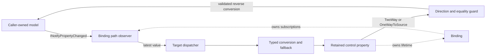

# Data binding

## Overview

SharpVision binds retained control properties to ordinary .NET model properties
through strongly typed expressions. Models remain caller-owned CLR objects;
binding adds no `DataContext`, no virtual tree, no reconciliation, no polling,
and no string property paths.

```csharp
using SharpVision.DataBinding;

input.Bind(customer, model => model.Address.City);
active.Bind(settings, model => model.Enabled);
```

The returned `Binding` keeps the relationship alive and implements
`IDisposable`. The target control also owns it, so you only need to retain the
return value when the application must stop synchronization early.



## Notification model

Initial synchronization works with any non-null reference-type model. Live
source updates rely on `INotifyPropertyChanged`: every reachable object that
owns a replaceable path segment implements that interface when its changes must
remain observable.

A notification with an exact property name refreshes only the affected path. A
null or empty property name refreshes every segment owned by that publisher.
Notifications for unrelated names are ignored. Binding never polls a plain
object and never rewrites one into a proxy.

## Modes and natural values

| Mode             | Initial value    | Source changes | Target changes |
| ---------------- | ---------------- | -------------- | -------------- |
| `OneWay`         | Source to target | Applied        | Ignored        |
| `TwoWay`         | Source to target | Applied        | Applied        |
| `OneWayToSource` | Target to source | Ignored        | Applied        |

The natural adapters each choose a concrete default:

| Control                                          | Property        | Default mode |
| ------------------------------------------------ | --------------- | ------------ |
| `Text`                                           | `Content`       | `OneWay`     |
| `TextInput`                                      | `Text`          | `TwoWay`     |
| `CheckBox`, `RadioButton`                        | `IsChecked`     | `TwoWay`     |
| `Slider`, `ScrollBar`                            | `Value`         | `TwoWay`     |
| `ProgressBar`                                    | `Value`         | `OneWay`     |
| `ColorPicker`                                    | `Value`         | `TwoWay`     |
| `ListView`, `ComboBox`, `TabControl`, and `Menu` | `SelectedIndex` | `TwoWay`     |

`BindCommand` and `BindCommandParameter` bind `Button.Command` and its borrowed
parameter one-way. The existing `ICommand.CanExecuteChanged` handling, click
ordering, and execution stay owned by `Button`.

The generic escape hatch names both properties and supplies typed conversion:

```csharp
label.BindProperty(
    control => control.Content,
    viewModel,
    model => model.Count,
    count => count.ToString(CultureInfo.InvariantCulture),
    convertBack: null,
    BindingMode.OneWay,
    fallbackValue: "0");
```

Converted `TwoWay` and `OneWayToSource` bindings require a reverse converter.
Converters execute once per destination update and never hide endpoint errors.

## Paths, nulls, and ordering

Paths consist of public instance properties rooted in the expression parameter.
Fields, methods, indexers, static properties, captured roots, conditionals, and
arithmetic are rejected before any subscription or mutation happens. Expressions
compile once, and updates then call cached accessors without reflection or
string lookup.

For `model => model.Address.City`, the binding observes both `Address` and the
current address's `City`. Replacing `Address` unsubscribes the old branch and
starts observing the replacement.

A null intermediate makes the path unavailable. The natural adapters project a
safe fallback in that state: empty text, a null check state, the current range
minimum, or selection index `-1`. Observation resumes as soon as the branch
becomes reachable again. A null leaf is just an ordinary value.

A reverse update cannot write through a null intermediate. It throws
`InvalidOperationException` after the target has committed and before any model
mutation; binding never constructs model objects and never silently discards
input.

Binding compares the converted destination value before invoking its setter, so
equal values are not assigned. Direction guards suppress only the binding's own
echo. Because target properties commit before `ControlBase.PropertyChanged`,
two-way model updates happen before later typed events such as
`TextInput.TextChanged`.

Invalid declarations fail before registration, and a failed initialization
removes any subscriptions it created. Runtime getter, converter, setter,
validation, and subscriber exceptions keep their original identity. Only one
live binding may author a given target property.

## Dispatcher and responsiveness

Attached targets remain dispatcher-affine. A source notification that already
arrives on the dispatcher is applied inline. A notification from a worker thread
marks the binding dirty and posts at most one callback. Notifications coalesce,
and the callback reads the latest complete path value instead of replaying
intermediate values.

A notification that arrives while the callback is executing requests one
additional latest-value pass. Sustained publication yields through another
single callback each time. Queue saturation propagates to the caller, clears the
scheduled state, and permits a later retry. Binding retains no unbounded event
history.

Detached targets update synchronously; concurrent mutation of a single detached
control remains unsupported. Explicitly disposing an attached binding is
dispatcher-affine.

Responsiveness is held to a concrete bar: 10,000 worker notifications sent while
the dispatcher is busy result in one latest target assignment, and the same
volume stays within 256 bytes of managed allocation per scalar update with no
reverse-update recursion.

## Observable items and selection

```csharp
list.BindItems(viewModel, model => model.Results);
list.BindSelection(viewModel, model => model.SelectedResult);
```

`BindItems` connects a finite `IReadOnlyList<T>` to a `ListView` or `ComboBox`.
Property replacement uses `INotifyPropertyChanged`, and a current
`INotifyCollectionChanged` collection is observed for add, remove, replace,
move, and reset. A caller that supplies an incremental-apply delegate has each
supported single-item action applied directly to the target instead of
re-reading a complete snapshot; unsupported or coalesced actions still fall back
to one latest complete read. A null collection projects empty items, and
replacing the collection detaches the old one.

Incremental application tracks the identity of the collection it is currently
observing. A change notification delivered from a collection the binding has
already replaced is discarded rather than applied to the new target snapshot.
This can happen even on a single thread: when an earlier-registered handler on
the same collection replaces the bound source from within its own
`CollectionChanged` callback, the runtime has already captured the event
invocation list before any handler in it runs.

Snapshot construction is `O(n)` in `ListView`'s default eager mode, which
realizes every item. Setting
[`ListView.RowHeight`](../controls/collections/list-view.md#virtualization) opts
into windowed realization instead, so a bound snapshot never pays more than
viewport-bounded realization cost regardless of collection size. The collection
must remain stable while `Count` and its indexer are read on the target
dispatcher. Worker-thread mutation of a thread-unsafe `ObservableCollection<T>`
still requires marshaling through the application dispatcher.

`BindSelection` supports reference-type values on a single-selection `ListView`
or `ComboBox`. Matching uses `EqualityComparer<T>.Default` and picks the first
equal item. A null value or no match selects `-1`, and clearing the selection
writes null back to the model.

While an items commit is in progress, transient reverse selection writes are
suppressed and model selection is re-read afterward, so replacing the items
cannot overwrite the model with a temporary empty or first-item selection.
Multiple selection remains explicit application logic, because it requires
collection-diff and cancellation semantics.

## Expected behavior

The target owns each binding, and a binding owns its model subscriptions.
`Binding.Dispose` removes the source, target, nested-path, and collection
subscriptions. Target disposal releases bindings before `OnDisposing` while
preserving first-failure cleanup. Detach, hide, and disable do not end the data
lifetime.

These guarantees hold across every mode and adapter; nested replacement and null
recovery; equality, ordering, conversion, exceptions, and disposal; dispatcher
coalescing and queue retry; every collection action; coordinated selection;
responsiveness; and the consumer-facing compatibility surface.
