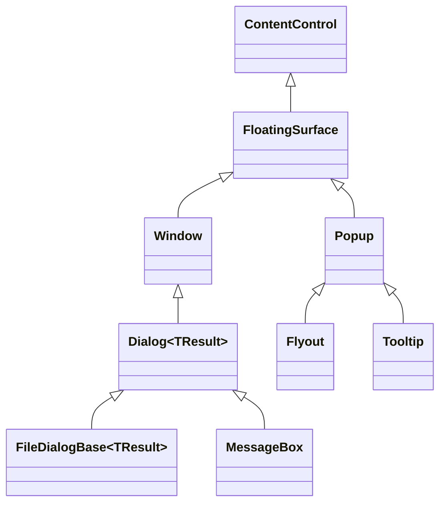

# Floating surfaces

## Overview

A floating surface is a retained `ContentControl` presented above ordinary
application content. The public surface object is the same identity that is
mounted, rendered, hit-tested, made modal, removed, and disposed; floating
controls never hide a second Window or Popup behind a forwarding wrapper.

`FloatingSurface` lives in `SharpVision.Surfaces`. `Window` and `Popup` derive
from it in their feature namespaces. `Dialog<TResult>` derives from `Window`,
and the file dialogs and `MessageBox` are direct dialog surfaces. `Flyout` and
`Tooltip` derive from `Popup` and render their inherited popup surface directly.

## Shared lifecycle

`FloatingSurface` owns the replaceable `Content`, the committed `SurfaceBounds`,
the ordered `Closing` and `Closed` lifecycle, focus and pointer-capture cleanup,
and at most one application-owned `ModalScope`. Each concrete family owns its
public open state and chrome:

- `Window` uses `Visibility` and titled window chrome.
- `Popup` uses `IsOpen`, anchor-relative placement, and popup chrome.
- `Dialog<TResult>` adds one-shot typed completion and deterministic host
  removal and disposal.
- `Flyout` fixes interactive light-dismiss behavior.
- `Tooltip` fixes passive, delayed, non-modal behavior.

Presenting a Window, or explicitly entering modality, requires an attached,
available, undisposed surface. A detached Popup may stage `IsOpen = true`: it
presents - and, under automatic modal behavior, enters modality - when it is
later attached. A surface cannot present twice or reenter an opening or closing
transaction.

Popup-family closure first makes the family ineligible for rendering and input,
then publishes `Closing`, exits modality, makes the content unavailable, clears
`SurfaceBounds`, and publishes `Closed`. Changing a Window's visibility away
from visible performs the same common cleanup directly but publishes neither
lifecycle event.

An ordinary Window close affordance, Escape action, or modal dismiss request
publishes `Closing`, then, by default, collapses the Window itself: the
visibility transaction performs the common cleanup and the close request then
publishes `Closed`. A `Closing` handler that itself changes visibility (hiding
it to a different state, restoring it, or disposing the Window) takes
responsibility for the outcome instead — if it leaves the Window visible and
presented, the Window stays open and `Closed` is not published. Cleanup attempts
every stage even after a callback failure and rethrows the earliest failure once
state is coherent. Detachment and disposal release modal, focus, and capture
state even when no normal close path was requested.

## Ownership, elevation, and modality

Elevation changes the render and hit-test order without reparenting the surface
or changing its routed ancestry. Popup-family surfaces are promoted through the
shared popup layer, a structurally separate render and hit-test pass that always
paints after ordinary Overlay content and orders nested popups, flyouts, and
submenus by opener depth — this layer never shares an `Overlay`'s `ZIndex`
space, so it always sits above every Window regardless of Window z-order.
Windows and dialogs are direct children of an `Overlay`, including the private
presentation Overlay owned by `Screen`; `WindowActivationManager` raises the
newly activated Window above its sibling Windows in that shared `ZIndex` space
on every activation, leaving non-Window overlay children and the popup layer
untouched.

Modality is an input-plane policy, not a visual wrapper. `FloatingSurface`
retains the live scope, while the application
[`ModalityManager`](modality.md#overview) owns confinement, outside interaction,
nested-scope order, capture cleanup, and focus restoration. `Window.ShowModal`
defaults to `OutsideInteraction.Ignore`, while ordinary `Popup` opening defaults
to dismissal. `Flyout` manages light dismissal without a modal scope, and
`Tooltip` never enters modality or pointer targeting.

## Layout and drawing boundaries

[`Overlay`](../controls/layout/overlay.md#overview) is the only public panel for
overlapping children, absolute `Left`/`Top`/`Right`/`Bottom` offsets, and stable
`ZIndex`. Window movement writes Overlay offsets, and Overlay keeps a Window's
border box inside its latest content bounds without changing the authored
offsets.

`SharpVision.Terminal.Rendering.Canvas` is the frame-owned drawing value passed
to control rendering hooks. It draws graphemes, lines, boxes, fills, images, and
styles; it is not a `Container`, owns no children, and performs no layout. To
put controls above custom drawing, compose the drawing control and those
controls in an Overlay.

## Expected behavior

The public inheritance chain is exactly as diagrammed, and the retired layout
Canvas and proxy surface fields no longer exist. The family-specific attachment
rules hold, including detached-staged Popup opening. Lifecycle order and
rollback, detach and disposal cleanup, the single live modal scope, focus
restoration, capture release, elevated render and hit-test order, logical
ancestry, direct dialog host identity, Popup placement, Flyout light dismiss,
Tooltip delay and passivity, and the final semantic cells all behave as
described above.
