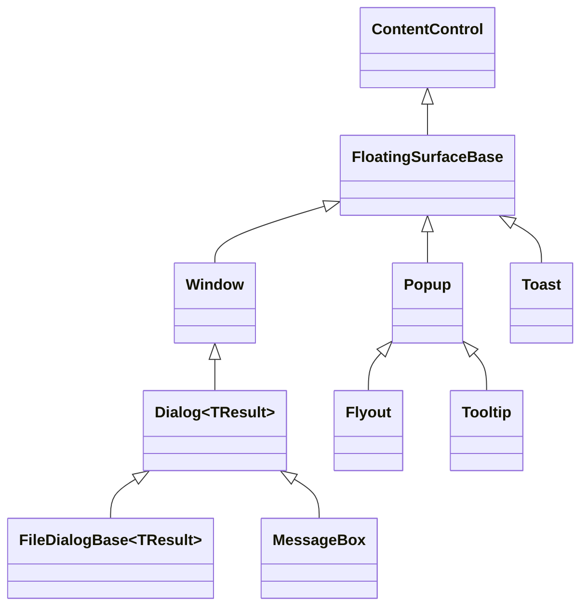
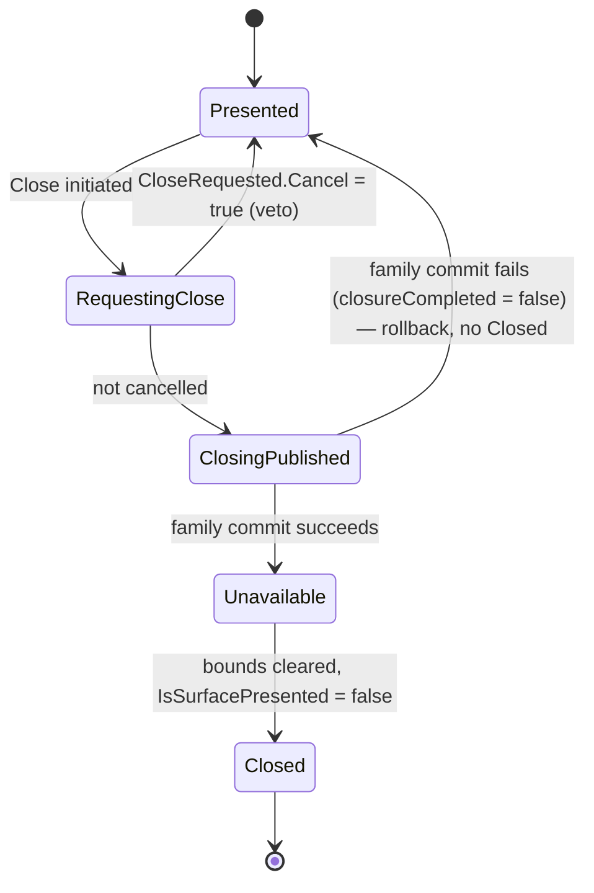
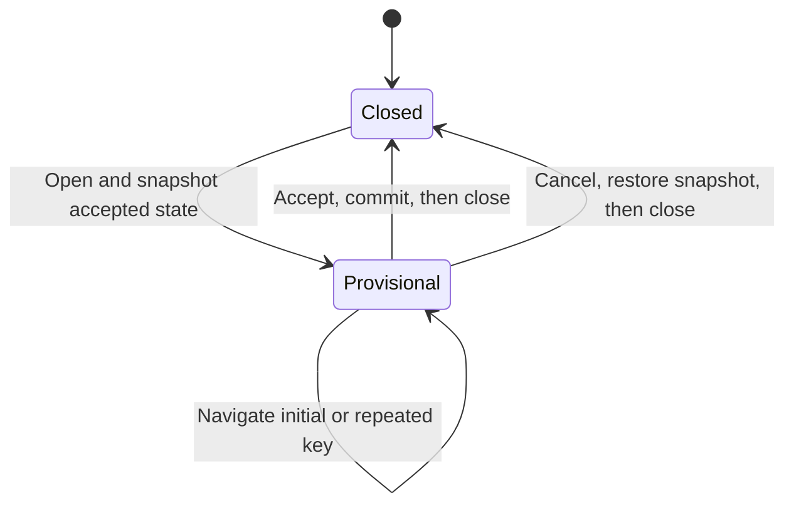

# Floating surfaces

## Overview

A floating surface is a retained `ContentControl` presented above ordinary
application content. The public surface object is the same identity that is
mounted, rendered, hit-tested, made modal, removed, and disposed; floating
controls never hide a second Window or Popup behind a forwarding wrapper.

`FloatingSurfaceBase` lives in `SharpVision.Surfaces`. Its `Border`/`Shadow`
authoring surface is public but gated behind
`ControlBase.EnableChromeAuthoring()` until a derived control opts in; the two
floating surfaces whose whole purpose is letting a caller author their own
chrome directly - `Window` and `Popup`, each in its own feature namespace - call
it from their own constructors. `Dialog<TResult>` derives from `Window`, and the
file dialogs and `MessageBox` are direct dialog surfaces. `Flyout` and `Tooltip`
derive from `Popup` and render their inherited popup surface directly. An
externally defined typed surface family derives from `FloatingSurfaceBase`
directly and declares [`IStyled<TStyle>`](styling.md#overview) itself, the same
contract any other control uses to add a primary `Style`/`ActualStyle` slot -
see [Appearance](styling.md#overview) for the full mechanism.
[`Toast`](../controls/notifications/toast.md#overview) is the non-modal direct
surface sibling: it mounts itself in the owning Screen or Overlay presentation
plane, stacks by screen edge, and supplies its own `ToastStyle` contract.

## Shared lifecycle

`FloatingSurfaceBase` owns the replaceable `Content`, the committed
`SurfaceBounds`, the ordered `Closing` and `Closed` lifecycle, focus and
pointer-capture cleanup, and at most one application-owned `ModalScope`. Each
concrete family owns its public open state and chrome:

- `Window` uses `Visibility` and titled window chrome.
- `Popup` uses `IsOpen`, anchor-relative placement, and popup chrome.
- `Dialog<TResult>` adds one-shot typed completion and deterministic host
  removal and disposal.
- `Flyout` fixes interactive light-dismiss behavior.
- `Tooltip` fixes passive, delayed, non-modal behavior.
- `Toast` uses `Show(owner)` and `Dismiss()` with a timed, non-modal lifetime.

The base composes its modal lifetime through the shared session primitive rather
than wiring scope identity separately in Popup and Window. The session owns
entry reentrancy, post-entry presentation validation, exact callback
subscriptions, identity-safe external exit, and deterministic cleanup. Derived
families provide only dismissal and external-exit policy; Dialog adds typed
completion policy through the same cleared-before-callback boundary. Menu and
private dropdown owners use the identical lifetime primitive without inheriting
from the surface hierarchy. External-exit policy runs only after the old scope
identity clears, while dismissal policy receives the still-active current scope
so it can close that exact family lifetime.

The base also owns logical-open identity independently from mounted
presentation. That distinction lets a never-attached visible Window close
exactly once and lets structural detachment release bounds and modality without
pretending the family requested closure. Every detached descendant receives the
same presentation release even when only the removed subtree root received the
unavailable event; reattachment may therefore create one fresh presentation
without `Closing` or `Closed` being invented for the detach.

Popup-family infrastructure owns two callback-sensitive lifetimes centrally. An
optional light-dismiss policy becomes one root registration only after the
surface presentation commits, and close, hide, detach, or disposal releases it
before wrapper policy continues. Exclusive family opening snapshots peers around
family-specific setup and revalidates root, family, ancestry, modality, and the
initiating open identity before each close. A callback may mutate the tree or
open another peer without letting stale traversal close the newer presentation.

Disposal releases every shared lifecycle subscription, including `Opened`,
`CloseRequested`, `Closing`, and `Closed`, so retaining a disposed surface does
not retain subscriber graphs.

Presenting a Window, or explicitly entering modality, requires an attached,
available, undisposed surface. A detached Popup may stage `IsOpen = true`: it
presents - and, under automatic modal behavior, enters modality - when it is
later attached. A surface cannot present twice or reenter an opening or closing
transaction.

`Opened` runs after the common presentation commit. Popup-family and Toast
opening treat an observer failure as a failed public open and roll back both
family and common presentation state; Window keeps the committed presentation
and completes its later `Shown` and focus stages before rethrowing the earliest
failure.

Before any of that commits, `FloatingSurfaceBase` raises `CloseRequested` with a
`SurfaceCloseRequestedEventArgs.Cancel` flag a handler can set to veto the
request: nothing changes, and neither `Closing` nor `Closed` follows. Popup-
family closure first makes the family ineligible for rendering and input, then
publishes `Closing`, exits modality, makes the content unavailable, clears
`SurfaceBounds`, and publishes `Closed`. Changing a Window's visibility away
from visible performs the same common cleanup directly but publishes neither
lifecycle event.

Veto also preserves source-specific lifetime machinery. In particular, a Toast
display timeout remains scheduled after cancellation and may request dismissal
again on its next interval.

`Closed` runs only after the unavailable-state commit, bounds clearing,
presentation-version advance, and close-guard release. A handler can therefore
open the same reusable surface as a distinct presentation without reentering or
being removed by the completed close.

`CloseRequested` fires wherever the shared `CloseSurface` engine runs — the
whole Popup family, Window, and `Dialog<TResult>`'s own typed-completion path.
Repeating the same close request synchronously from `CloseRequested` is a no-op;
the outer request remains authoritative, while reentry from the later `Closing`
transaction remains invalid.

Toast raises the same vetoable request before manual, keyboard, pointer, or
timer dismissal. Showing does not enter modality or transfer focus. Its display
timer starts only after entrance completes, and detach or disposal releases the
timer and stack registration.

An ordinary Window close affordance, Escape action, or modal dismiss request
first raises `CloseRequested`; an uncancelled request then publishes `Closing`,
then, by default, collapses the Window itself: the visibility transaction
performs the common cleanup and the close request then publishes `Closed`. A
`Closing` handler that itself changes visibility (hiding it to a different
state, restoring it, or disposing the Window) takes responsibility for the
outcome instead — if it leaves the Window visible and presented, the Window
stays open and `Closed` is not published. Cleanup attempts every stage even
after a callback failure and rethrows the earliest failure once state is
coherent. Detachment and disposal release modal, focus, and capture state even
when no normal close path was requested.

## Popup navigation sessions

A popup-backed input can treat one opening as a provisional navigation session.
The opening snapshots the owner's accepted value and the popup target's current
state, then seeds the target from that snapshot. Initial and repeated navigation
strokes change only the provisional state until an explicit activation accepts
it. The target control owns the meaning of each navigation and activation key;
the floating-surface lifetime owns when that provisional state begins, commits,
rolls back, and becomes unavailable.

Acceptance is explicit. A supported Enter or Space activation, or semantic
primary-pointer activation of a popup item, commits the provisional target
before the surface closes. Merely moving a current item or active date is never
acceptance. Each control page identifies its own accepted keys and the value it
commits.

Every other close cancels the session. Escape, traversal dismissal, light
dismissal, direct popup closure, an owner API that closes the popup,
unavailability, detachment, and disposal restore the opening target state and
leave the owner's accepted value unchanged. Restoration runs once even when a
close path reenters another lifecycle callback. If a callback closes and reopens
the popup, the reopening creates a distinct session; completion or rollback from
the older session cannot close or overwrite the newer one. A snapshot also
expires when the target's semantic item domain changes, including an incremental
bound-collection delta whose numeric indexes remain stable; cancellation rebases
to current accepted state instead of applying an index captured for different
items.

## Ownership, elevation, and modality

Elevation changes the render and hit-test order without reparenting the surface
or changing its routed ancestry. Popup-family surfaces are promoted through the
shared popup layer, a structurally separate render and hit-test pass that always
paints after ordinary Overlay content and orders nested popups, flyouts, and
submenus by opener depth — this layer never shares an `Overlay`'s `ZIndex`
space, so it always sits above every Window regardless of Window z-order.
Windows and dialogs are direct children of an `Overlay`, including the private
presentation Overlay owned by `Screen`; `WindowActivationManager` raises the
newly activated Window above its sibling Windows in that shared `ZIndex` space
on every activation, leaving non-Window overlay children and the popup layer
untouched.

Modality is an input-plane policy, not a visual wrapper. `FloatingSurfaceBase`
retains the live scope, while the application
[`ModalityManager`](modality.md#overview) owns confinement, outside interaction,
nested-scope order, capture cleanup, and focus restoration. `Window.ShowModal`
defaults to `OutsideInteraction.Ignore`, while ordinary `Popup` opening defaults
to dismissal. `Flyout` manages light dismissal without a modal scope, and
`Tooltip` never enters modality or pointer targeting.

## Layout and drawing boundaries

[`Overlay`](../controls/layout/overlay.md#overview) is the only public panel for
overlapping children, absolute `Left`/`Top`/`Right`/`Bottom` offsets, and stable
`ZIndex`. Window movement writes Overlay offsets, and Overlay keeps a Window's
border box inside its latest content bounds without changing the authored
offsets.

`SharpVision.Terminal.Rendering.TerminalCanvas` is the frame-owned drawing value
passed to control rendering hooks. It draws graphemes, lines, boxes, fills,
images, and styles; it is not a `Container`, owns no children, and performs no
layout. To put controls above custom drawing, compose the drawing control and
those controls in an Overlay.

## Expected behavior

The public inheritance chain is exactly as diagrammed, and the retired layout
Canvas and proxy surface fields no longer exist. The family-specific attachment
rules hold, including detached-staged Popup opening. Lifecycle order and
rollback, detach and disposal cleanup, the single live modal scope, focus
restoration, capture release, elevated render and hit-test order, logical
ancestry, direct dialog host identity, Popup placement, Flyout light dismiss,
Tooltip delay and passivity, provisional popup navigation acceptance and
rollback, and the final semantic cells all behave as described above.
