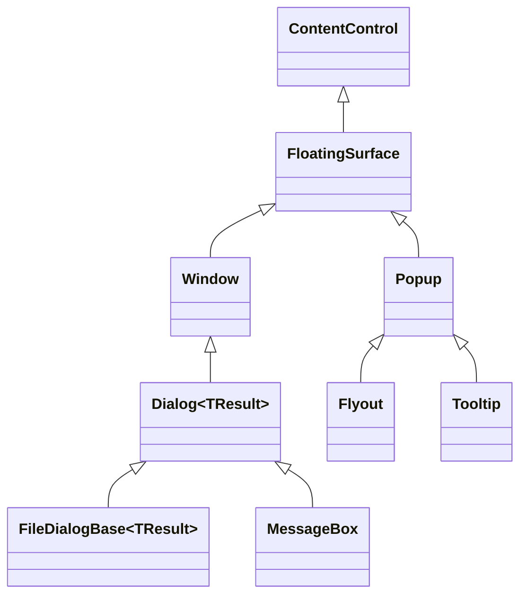

# Floating surfaces

## Overview

A floating surface is one retained `ContentControl` presented above ordinary
application content. The public surface object is also the mounted, rendered,
hit-tested, modal, removed, and disposed identity; floating controls never hide
a second Window or Popup behind a forwarding wrapper.

`FloatingSurface` lives in `SharpVision.Surfaces`. `Window` and `Popup` derive
from it in their feature namespaces. `Dialog<TResult>` derives from `Window`,
and the file dialogs and `MessageBox` are direct dialog surfaces. `Flyout` and
`Tooltip` derive from `Popup` and render their inherited popup surface directly.

## Shared lifecycle

`FloatingSurface` owns replaceable `Content`, committed `SurfaceBounds`, the
ordered `Closing` and `Closed` lifecycle, focus and pointer-capture cleanup, and
at most one application-owned `ModalScope`. Concrete families own their public
open state and chrome:

- `Window` uses `Visibility` and titled window chrome.
- `Popup` uses `IsOpen`, anchor-relative placement, and popup chrome.
- `Dialog<TResult>` adds one-shot typed completion and deterministic host
  removal and disposal.
- `Flyout` fixes interactive light-dismiss behavior.
- `Tooltip` fixes passive, delayed, non-modal behavior.

Presenting a Window or explicitly entering modality requires an attached,
available, undisposed surface. A detached Popup may stage `IsOpen = true`; it
presents and, under automatic modal behavior, enters modality when later
attached. A surface cannot present twice or reenter an opening or closing
transaction.

Popup-family closure first makes the family ineligible for rendering and input,
then publishes `Closing`, exits modality, makes content unavailable, clears
`SurfaceBounds`, and publishes `Closed`. Changing Window visibility away from
visible directly performs the same common cleanup but does not publish either
lifecycle event.

An ordinary Window close affordance, Escape action, or modal dismiss request is
owner-handled: it publishes `Closing` while the Window remains visible,
presented, and modal. If that callback hides the Window, the visibility
transaction performs common cleanup and the close request then publishes
`Closed`. Leaving visibility unchanged retains the Window and does not publish
`Closed`. Cleanup attempts every stage after a callback failure and rethrows the
earliest failure after state is coherent. Detachment and disposal release modal,
focus, and capture state even when a normal close path was not requested.

## Ownership, elevation, and modality

Elevation changes render and hit-test order without reparenting the surface or
changing routed ancestry. Popup-family surfaces are promoted through the shared
popup layer. Windows and dialogs are direct children of an `Overlay`, including
the private presentation Overlay owned by `Screen`.

Modality is an input-plane policy, not a visual wrapper. `FloatingSurface`
retains the live scope, while the application
[`ModalityManager`](modality.md#overview) owns confinement, outside interaction,
nested-scope order, capture cleanup, and focus restoration. `Window.ShowModal`
defaults to `OutsideInteraction.Ignore`; ordinary `Popup` opening defaults to
dismissal. `Flyout` manages light dismissal without a modal scope, and `Tooltip`
never enters modality or pointer targeting.

## Layout and drawing boundaries

[`Overlay`](../controls/layout/overlay.md#overview) is the only public panel for
overlapping children, absolute `Left`/`Top`/`Right`/`Bottom` offsets, and stable
`ZIndex`. Window movement writes Overlay offsets, and Overlay keeps a Window
border box inside its latest content bounds without changing the authored
offsets.

`SharpVision.Terminal.Rendering.Canvas` is the frame-owned drawing value passed
to control rendering hooks. It draws graphemes, lines, boxes, fills, images, and
styles; it is not a `Container`, owns no children, and performs no layout. To
put controls above custom drawing, compose the drawing control and those
controls in an Overlay.

## Expected behavior

Proof covers exact public inheritance, absence of the retired layout Canvas and
proxy surface fields, family-specific attachment rules including detached-staged
Popup opening, lifecycle order and rollback, detach/disposal cleanup, one live
modal scope, focus restoration, capture release, elevated render and hit-test
order, logical ancestry, direct dialog host identity, Popup placement, Flyout
light dismiss, Tooltip delay/passivity, and final semantic cells.
