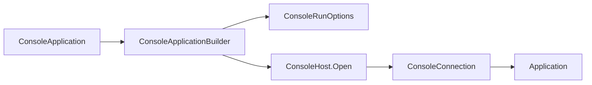

# Hosting

## Hosting contract

`SharpVision.Runtime.ConsoleApplication` is the fluent public entry point for an
interactive console host. It replaces the removed
`Application.RunConsoleAsync`/`ConsoleRun` pair with one layered seam: a
portable Terminal-layer console host
(`SharpVision.Terminal.Runtime.ConsoleHost`) opens platform transport, resize,
and raw-mode resources, and a SharpVision-layer builder
(`ConsoleApplicationBuilder`) turns a comprehensive `ConsoleRunOptions` record
into a running `Application`.



## Entry points

Three equivalent shapes configure and run a detached `Screen`:

```csharp
// One-liner: every option defaults.
await ConsoleApplication.RunAsync(new Gallery());

// Configure-callback, EF-Core style: configures a builder.
await ConsoleApplication.RunAsync(new Gallery(), b => b
    .UseTheme(Themes.Dark)
    .UseMouse(MouseTracking.Any, MouseCoordinates.Sgr)
    .WithoutNegotiation());

// Fluent builder, ASP.NET style.
await ConsoleApplication.CreateBuilder(new Gallery())
    .UseAlternateScreen()
    .UseKeyboardEnhancement(Enhancement.Disambiguate | Enhancement.EventTypes)
    .RunAsync();
```

`ConsoleApplication.CreateBuilder(Screen)` returns a `ConsoleApplicationBuilder`
for the advanced case: call `Build()` to open the console host and receive a
fully wired `Application` for manual lifecycle control, then drive it with the
instance `Application.RunAsync(CancellationToken)` convenience method (start,
await `Completion`, stop) or with `StartAsync`/`StopAsync` directly:

```csharp
Application app = ConsoleApplication.CreateBuilder(new Gallery()).Build();
await app.RunAsync();
```

There is also an immutable-options overload,
`ConsoleApplication.RunAsync(Screen, ConsoleRunOptions)`, for callers that
already assembled a `ConsoleRunOptions` value instead of using the builder.

All three managed entry points share `ConsoleApplicationBuilder.RunAsync`
internally. It checks `ConsoleHost.IsInteractive` first and returns
`ConsoleRunStatus.Redirected` (writing `RedirectedMessage` when set) rather than
opening the console when standard input or output is redirected. Otherwise it
builds the `Application`, wires `Console.CancelKeyPress` to cooperative shutdown
unless `TreatControlCAsInput` is set, starts the application, waits for
completion or cancellation, stops cleanly, and maps the outcome to
`ConsoleRunStatus`: `Completed`, `Cancelled`, or `Failed` (when
`Application.Failure` is set).

## `ConsoleRunOptions`

`ConsoleRunOptions` is an immutable `record` with a validating `init` accessor
per bounded property. `ConsoleApplicationBuilder` exposes one fluent setter per
property (each returning `this`) plus a `ConfigureOptions` escape hatch that
replaces the accumulated options wholesale.

| Property                      | Type                  | Default                                                   |
| ----------------------------- | --------------------- | --------------------------------------------------------- |
| `Theme`                       | `Theme?`              | `null` (resolves to `Themes.Dark` via `ResolveTheme()`)   |
| `AlternateScreen`             | `bool`                | `true`                                                    |
| `ShowCursor`                  | `bool`                | `false`                                                   |
| `MouseTracking`               | `MouseTracking?`      | `MouseTracking.Any`; `null` disables mouse input          |
| `MouseCoordinates`            | `MouseCoordinates`    | `MouseCoordinates.Sgr`                                    |
| `BracketedPaste`              | `bool`                | `true`                                                    |
| `FocusReporting`              | `bool`                | `true`                                                    |
| `KeyboardEnhancement`         | `Enhancement?`        | `Enhancement.Disambiguate \| Enhancement.EventTypes`      |
| `Capabilities`                | `Capabilities?`       | `null` (detect and negotiate at startup)                  |
| `ColorDepth`                  | `ColorDepth?`         | `null` (use the detected depth)                           |
| `Negotiation`                 | `NegotiationOptions?` | `null` (default startup negotiation from the environment) |
| `CleanupTimeout`              | `TimeSpan`            | `1` second                                                |
| `ReadBufferSize`              | `int`                 | `16 * 1024` (16 KiB)                                      |
| `ResizeInterval`              | `TimeSpan`            | `100` ms                                                  |
| `TreatControlCAsInput`        | `bool`                | `false`                                                   |
| `UseEnvironmentSizeOverrides` | `bool`                | `false`                                                   |
| `RedirectedMessage`           | `string?`             | `null`                                                    |

Every timeout and interval must be positive and finite; `ReadBufferSize` must be
positive; `MouseTracking`, `ColorDepth`, and `MouseCoordinates` must be defined
enum values. Each violation throws `ArgumentOutOfRangeException` from the `init`
accessor before any state changes.

`ConsoleRunOptions.ToTerminalOptions()` maps these properties onto the
Terminal-layer `Options` record consumed by `Session` (capabilities,
negotiation, alternate screen, cursor visibility, focus/paste, mouse tracking
and coordinates, keyboard enhancement, cleanup timeout, and read buffer size).
`ToHostOptions()` maps `ResizeInterval` and `TreatControlCAsInput` onto
`ConsoleHostOptions` for `ConsoleHost.Open`. When `Capabilities` is set
explicitly it bypasses detection entirely; `ColorDepth`, when set, overrides the
color depth on either the explicit or the detected profile.
`ConsoleApplicationBuilder.WithoutNegotiation()` clears `Negotiation` and — only
if no explicit `Capabilities` was already set — falls back to
`Capabilities.Conservative` so a caller that disables negotiation still gets a
defined, safe profile.

## Portable console host

`ConsoleHost.Open(ConsoleHostOptions)` is the single Terminal-layer seam that
selects a platform strategy and returns a `ConsoleConnection`. Advanced hosts
that bypass `ConsoleApplication` entirely can call it directly; the public
surface exposes only `ConsoleHost`, `ConsoleHostOptions`, and
`ConsoleConnection` — the platform strategies (`UnixConsoleHost`,
`WindowsConsoleHost`) and their raw/VT mode leases (`UnixConsoleMode`,
`WindowsConsoleMode`) are internal implementation details.

`ConsoleHostOptions` carries `ResizeInterval` (the positive, finite poll
interval used by the cell-only resize fallback; default `100` ms) and
`CaptureControlKeys` (whether Ctrl+C and other control keys are delivered as
input rather than raising the host's cancellation signal; default `false`).

`ConsoleConnection` bundles the opened `ITransport` and `IResizeSource` and owns
only the platform terminal-mode restore lease. Ownership is split deliberately:
the connection _constructs_ the transport and resize source, but the running
`Session` disposes those as part of ordinary shutdown; the connection's own
`DisposeAsync` restores the platform terminal mode (`stty` on Unix,
`SetConsoleMode` on Windows) exactly once, idempotently. `Application` disposes
the host lease _last_, after the session's reverse DEC-mode cleanup, so VT modes
are undone only after cooked/echoed input has already been restored underneath
them.

### Unix

`UnixConsoleHost.Open` enters raw mode through `UnixConsoleMode.Enter`, which
shells out to `/bin/stty`: it captures the current terminal state (`stty -g`)
for restoration, then applies `stty raw -echo` and, unless `CaptureControlKeys`
is `true`, also `isig` (so Ctrl+C keeps raising the host's signal instead of
arriving as a decoded key). It opens `/dev/tty` as a one-byte-buffered
asynchronous input stream and wraps it with `Console.OpenStandardOutput()` in a
`StreamTransport`. Because the input descriptor is the real tty file descriptor,
`UnixResizeSource` drives resize from `SIGWINCH` and reads both cell _and pixel_
dimensions through `TIOCGWINSZ` — this is what makes pixel-accurate mouse
reporting work in a console run, unlike the cell-only polling fallback.

### Windows

`WindowsConsoleHost.Open` enters VT mode through `WindowsConsoleMode.Enter`,
which resolves the standard input/output handles (`GetStdHandle`), saves both
console modes (`GetConsoleMode`), and applies computed modes via
`SetConsoleMode`: the input mode clears `ENABLE_LINE_INPUT` and
`ENABLE_ECHO_INPUT`, sets `ENABLE_VIRTUAL_TERMINAL_INPUT`, and sets or clears
`ENABLE_PROCESSED_INPUT` depending on `CaptureControlKeys` (cleared when `true`,
so Ctrl+C arrives as input instead of the host signal); the output mode adds
`ENABLE_PROCESSED_OUTPUT`, `ENABLE_VIRTUAL_TERMINAL_PROCESSING`, and
`DISABLE_NEWLINE_AUTO_RETURN`. It reads standard input/output streams and uses
the polling `ConsoleResizeSource` on `ResizeInterval`, because the standard
Windows console does not report pixel dimensions — Windows resize is always
cell-only, and pixel mouse coordinates are unavailable on that path. A mode read
or write failure throws `IOException` wrapping a `Win32Exception`
(`Marshal.GetLastPInvokeError()`), mirroring the existing Unix
`Native.GetDimensions` failure shape.

**The Windows path is unit-tested for the console mode-flag computation and the
P/Invoke boundary shape, but has not been validated against a real Windows
console or in Windows CI.** Treat it as implemented-but-unverified until
hardware or CI coverage exists.

## `TreatControlCAsInput`

`TreatControlCAsInput` (default `false`) is one option with two coordinated
effects. On `ConsoleRunOptions`/the builder, it flows into
`ConsoleHostOptions.CaptureControlKeys`, which changes the platform mode leases
above so Ctrl+C (and other control keys) reach the decoder as ordinary key input
instead of being intercepted by the terminal driver. At the
`ConsoleApplicationBuilder.RunAsync`/`ConsoleApplication.RunAsync` level, the
same flag also suppresses the managed `Console.CancelKeyPress` wiring that would
otherwise translate Ctrl+C into cooperative shutdown
(`ConsoleRunStatus.Cancelled`). This leaves Ctrl+C available to focused control
commands, including TextInput copy. A host that sets this option owns a separate
decoded exit chord when it still needs a global keyboard exit path.
