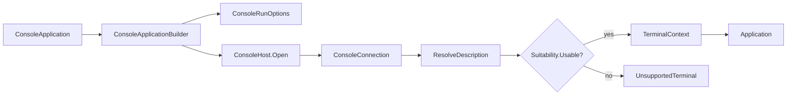

# Hosting

## Hosting contract

`SharpVision.Runtime.ConsoleApplication` is the fluent public entry point for an
interactive console host. It replaces the removed
`Application.RunConsoleAsync`/`ConsoleRun` pair with one layered seam: a
portable Terminal-layer console host
(`SharpVision.Terminal.Runtime.ConsoleHost`) opens platform transport, resize,
and raw-mode resources, and a SharpVision-layer builder
(`ConsoleApplicationBuilder`) turns a comprehensive `ConsoleRunOptions` record
into a running `Application`.



## Entry points

Three equivalent shapes configure and run a detached `Screen`:

```csharp
// One-liner: every option defaults.
await ConsoleApplication.RunAsync(new Gallery());

// Configure-callback, EF-Core style: configures a builder.
await ConsoleApplication.RunAsync(new Gallery(), b => b
    .UseTheme(Themes.Dark)
    .UseMouse(MouseTracking.Any, MouseCoordinates.Sgr)
    .WithoutNegotiation());

// Fluent builder, ASP.NET style.
await ConsoleApplication.CreateBuilder(new Gallery())
    .UseAlternateScreen()
    .UseKeyboardEnhancement(Enhancement.Disambiguate | Enhancement.EventTypes)
    .RunAsync();
```

`ConsoleApplication.CreateBuilder(Screen)` returns a `ConsoleApplicationBuilder`
for the advanced case: call `Build()` to open the console host and receive a
fully wired `Application` for manual lifecycle control, then drive it with the
instance `Application.RunAsync(CancellationToken)` convenience method (start,
await `Completion`, stop) or with `StartAsync`/`StopAsync` directly:

```csharp
Application app = ConsoleApplication.CreateBuilder(new Gallery()).Build();
await app.RunAsync();
```

There is also an immutable-options overload,
`ConsoleApplication.RunAsync(Screen, ConsoleRunOptions)`, for callers that
already assembled a `ConsoleRunOptions` value instead of using the builder.

All three managed entry points share `ConsoleApplicationBuilder.RunAsync`
internally. It checks `ConsoleHost.IsInteractive` first and returns
`ConsoleRunStatus.Redirected` (writing `RedirectedMessage` when set) rather than
opening the console when standard input or output is redirected. Otherwise it
opens only the platform connection needed for description lookup and resolves
one `TerminalProfile`. Missing, generic, hardcopy, incomplete, and
padding-dependent descriptions return `ConsoleRunStatus.UnsupportedTerminal` and
optionally write `UnsupportedTerminalMessage` as plain host text. No
application, session, terminal query, mode lease, or renderer is constructed on
that path. `Build()` instead throws `NotSupportedException` after disposing the
resize source, transport, and platform restore lease in that order.

After successful preflight, terminal options resolve one immutable
`TerminalContext` from the profile and caller-supplied environment snapshot. Its
backend identity is fixed for the application lifetime; negotiated capability
publication creates replacement profile/context snapshots without re-resolving
that identity. The
[terminal backend contract](../architecture/terminal-backends.md#initialization-and-ownership)
owns this distinction from the physical `ConsoleConnection`, and the
[discovery sequence](../architecture/discovery-pipeline.md#initialization-sequence)
owns evidence precedence and startup publication.

After successful preflight the host builds the `Application`, wires
`Console.CancelKeyPress` to cooperative shutdown unless `TreatControlCAsInput`
is set, starts the application, waits for completion or cancellation, stops
cleanly, and maps the outcome to `ConsoleRunStatus`: `Completed`, `Cancelled`,
or `Failed` (when `Application.Failure` is set). The numeric values remain
stable for compatibility: `Redirected=0`, `Completed=1`, `Cancelled=2`,
`Failed=3`, and the appended `UnsupportedTerminal=4`.

Session startup expands complete description-owned alternate-screen,
cursor-visibility, and required application-key pairs before transport output.
Missing, one-sided, parameter-consuming, empty, or over-limit optional pairs are
omitted safely. Each successful pair becomes an exact-byte lease before its
enable write and restores in reverse acquisition order even after partial I/O,
cancellation, or failure. `Options.Minimal` requests none of these modes and
remains byte-quiet.

## `ConsoleRunOptions`

`ConsoleRunOptions` is an immutable `record` with a validating `init` accessor
per bounded property. `ConsoleApplicationBuilder` exposes one fluent setter per
property (each returning `this`) plus a `ConfigureOptions` escape hatch that
replaces the accumulated options wholesale.

| Property                      | Type                  | Default                                                   |
| ----------------------------- | --------------------- | --------------------------------------------------------- |
| `Theme`                       | `Theme?`              | `null` (resolves to `Themes.Dark` via `ResolveTheme()`)   |
| `AlternateScreen`             | `bool`                | `true`                                                    |
| `ShowCursor`                  | `bool`                | `false`                                                   |
| `MouseTracking`               | `MouseTracking?`      | `MouseTracking.Any`; `null` disables mouse input          |
| `MouseCoordinates`            | `MouseCoordinates`    | `MouseCoordinates.Sgr`                                    |
| `BracketedPaste`              | `bool`                | `true`                                                    |
| `FocusReporting`              | `bool`                | `true`                                                    |
| `KeyboardEnhancement`         | `Enhancement?`        | `Enhancement.Disambiguate \| Enhancement.EventTypes`      |
| `Profile`                     | `TerminalProfile?`    | `null` (resolve from the platform connection)             |
| `Capabilities`                | `Capabilities?`       | `null` (detect and negotiate at startup)                  |
| `ColorDepth`                  | `ColorDepth?`         | `null` (use the detected depth)                           |
| `Negotiation`                 | `NegotiationOptions?` | `null` (default startup negotiation from the environment) |
| `CleanupTimeout`              | `TimeSpan`            | `1` second                                                |
| `ReadBufferSize`              | `int`                 | `16 * 1024` (16 KiB)                                      |
| `ResizeInterval`              | `TimeSpan`            | `100` ms                                                  |
| `TreatControlCAsInput`        | `bool`                | `false`                                                   |
| `UseEnvironmentSizeOverrides` | `bool`                | `false`                                                   |
| `RedirectedMessage`           | `string?`             | `null`                                                    |
| `UnsupportedTerminalMessage`  | `string?`             | `null`                                                    |

Every timeout and interval must be positive and finite; `ReadBufferSize` must be
positive; `MouseTracking`, `ColorDepth`, and `MouseCoordinates` must be defined
enum values. Each violation throws `ArgumentOutOfRangeException` from the `init`
accessor before any state changes.

`CleanupTimeout` bounds two distinct shutdown steps. It caps the reverse
terminal-mode restoration writes, and it caps the drain that waits for an
outstanding `ITransport.ReadAsync` to finish borrowing the session read buffer.
A transport whose cancellation completes asynchronously therefore delays exit by
at most this budget; a transport that never completes forfeits its pooled read
array rather than stalling shutdown. Custom transports that complete
cancellation promptly never observe either delay.

`ConsoleRunOptions.ToTerminalOptions(TerminalProfile)` maps these properties
onto the Terminal-layer `Options` record consumed by `Session` (the complete
profile, negotiation, alternate screen, cursor visibility, focus/paste, mouse
tracking and coordinates, keyboard enhancement, cleanup timeout, and read buffer
size). `ToHostOptions()` maps `ResizeInterval` and `TreatControlCAsInput` onto
`ConsoleHostOptions` for `ConsoleHost.Open`. `Profile` has highest precedence
and bypasses native discovery. Otherwise `Capabilities`, when set, is retained
for compatibility by wrapping its exact value in `TerminalProfile.CreateAnsi`;
platform discovery is third. `ColorDepth` is the final semantic override and
records `ColorOrigin=Origin.Override` while retaining the selected description,
programs, and key map. Either complete explicit form disables negotiation;
otherwise the resolved profile's capabilities are the negotiation baseline.

The parameterless `ToTerminalOptions()` remains a public source-compatibility
surface for low-level callers. It uses `Profile` first, otherwise wraps
`Capabilities` in a built-in ANSI profile, otherwise reproduces the historical
conservative detection plus explicit cell-mouse semantics in a built-in ANSI
profile. Interactive hosting uses the resolved-profile overload above; the
parameterless compatibility path never replaces native preflight.
`ConsoleApplicationBuilder.WithoutNegotiation()` clears `Negotiation` and — only
if no explicit profile or capabilities was already set — selects an explicit
built-in ANSI profile around `Capabilities.Conservative`. That opt-in helper is
distinct from the default native path and cannot weaken an unsuitable database
description.

### Terminal-description preflight

The console host resolves terminal descriptions through
`ConsoleConnection.ResolveDescription`. That Terminal-layer operation owns the
connection's hidden platform, output-descriptor, and Windows-VT facts. An
explicit profile is returned in a loaded result without reading `TERM` or
calling a provider. The default Unix path snapshots the live `TERM` value and
uses the
[terminfo lookup and fallback contract](../protocols/terminfo.md#lookup-and-fallback)
and its
[full-screen suitability rules](../protocols/terminfo.md#full-screen-suitability).
Windows uses the built-in profile only when the connection established VT input
and output. A caller-built connection with no platform facts cannot invent ANSI
support: its typed result is `PlatformUnavailable`, and the `ResolveProfile`
projection is null unless given an explicit profile.

The public immutable result retains `DescriptionLoadStatus`, an optional
`TerminalProfile`, and ordered redacted diagnostics (`DescriptionDiagnosticCode`
plus an optional allowlisted capability name). Advanced hosts can inspect that
result directly; `ResolveProfile` remains the nullable convenience projection.
SharpVision preflight retains the same result in its typed internal rejection.
`Build()` exposes a safe `NotSupportedException` message containing the status,
unsuitable classification, and diagnostic codes; `RunAsync` still maps that
exact rejection to `UnsupportedTerminal`.

The
[terminal-description profile](../architecture/capabilities.md#terminal-description-profile)
owns the typed result; `ConsoleRunOptions` adds no raw command overrides. Its
[native-provider trust boundary](../protocols/terminfo.md#native-provider-trust-boundary)
also applies to hosting. A deployment requiring an end-to-end bounded lookup
supplies an explicit owned `TerminalProfile` and disables native discovery.

## Portable console host

`ConsoleHost.Open(ConsoleHostOptions)` is the single Terminal-layer seam that
selects a platform strategy and returns a `ConsoleConnection`. Advanced hosts
that bypass `ConsoleApplication` entirely can call it directly; the public
surface exposes only `ConsoleHost`, `ConsoleHostOptions`, and
`ConsoleConnection` — the platform strategies (`UnixConsoleHost`,
`WindowsConsoleHost`) and their raw/VT mode leases (`UnixConsoleMode`,
`WindowsConsoleMode`) are internal implementation details.

`ConsoleHostOptions` carries `ResizeInterval` (the positive, finite poll
interval used by the cell-only resize fallback; default `100` ms) and
`CaptureControlKeys` (whether Ctrl+C and other control keys are delivered as
input rather than raising the host's cancellation signal; default `false`).

`ConsoleConnection` bundles the opened `ITransport` and `IResizeSource` and owns
only the platform terminal-mode restore lease. It is a physical TTY connection,
not xterm, Kitty, or iTerm2 identity. Ownership is split deliberately: the
connection _constructs_ the transport and resize source, but the running
`Session` disposes those as part of ordinary shutdown; the connection's own
`DisposeAsync` restores the platform terminal mode (`stty` on Unix,
`SetConsoleMode` on Windows) exactly once, idempotently. `Application` disposes
the host lease _last_, after the session's reverse DEC-mode cleanup, so VT modes
are undone only after cooked/echoed input has already been restored underneath
them.

`Application` awaits the session run before disposing the session, so the
framework hosting path never interleaves the two. A direct `Session` consumer
that disposes concurrently with an active run is covered by the normative
[run and disposal interleaving](../architecture/runtime-event-loop.md#run-and-disposal-interleaving)
rules, which that document owns.

Platform restoration failure is reported, never discarded. Both mode leases
always attempt every restore — Unix replays the captured `stty -g` state, and
Windows restores the input handle and then the output handle even when the input
restore failed — and then throw the first failure.
`ConsoleConnection.DisposeAsync` lets that failure propagate, and `Application`
folds it into `LastCleanupException` without replacing the primary `Failure`. So
a terminal left raw, without echo, or with modified Windows console modes is
observable instead of being reported as a clean shutdown. Repeated disposal
stays quiet and retries nothing, so a failed restore is never attempted twice.

### Unix

`UnixConsoleHost.Open` enters raw mode through `UnixConsoleMode.Enter`, which
shells out to `/bin/stty`: it captures the current terminal state (`stty -g`)
for restoration, then applies `stty raw -echo` and, unless `CaptureControlKeys`
is `true`, also `isig` (so Ctrl+C keeps raising the host's signal instead of
arriving as a decoded key). It opens `/dev/tty` as a one-byte-buffered
asynchronous input stream and wraps it with `Console.OpenStandardOutput()` in a
`StreamTransport`. Because the input descriptor is the real tty file descriptor,
`UnixResizeSource` drives resize from `SIGWINCH` and reads both cell _and pixel_
dimensions through `TIOCGWINSZ` — this is what makes pixel-accurate mouse
reporting work in a console run, unlike the cell-only polling fallback.

Those two streams have different owners, so the transport is constructed with
`leaveInputOpen: false, leaveOutputOpen: true`. The host opened `/dev/tty`
itself and must close it during ordinary shutdown, while standard output belongs
to the process and is only borrowed. Disposing the transport therefore closes
the tty descriptor, and a completed lifecycle leaves nothing open. Windows keeps
a shared `leaveOpen: true`, which is correct there because
`Console.OpenStandardInput` and `Console.OpenStandardOutput` both wrap
process-owned handles.

If construction fails partway, `Open` unwinds in exact reverse order — resize
source, transport, tty stream, then the raw-mode lease — because the resize
source borrows the raw tty descriptor and must stop observing it before the
stream that owns it closes. Each release is guarded so a cleanup failure cannot
replace the construction failure the caller needs to see.

### Windows

`WindowsConsoleHost.Open` enters VT mode through `WindowsConsoleMode.Enter`,
which resolves the standard input/output handles (`GetStdHandle`), saves both
console modes (`GetConsoleMode`), and applies computed modes via
`SetConsoleMode`: the input mode clears `ENABLE_LINE_INPUT` and
`ENABLE_ECHO_INPUT`, sets `ENABLE_VIRTUAL_TERMINAL_INPUT`, and sets or clears
`ENABLE_PROCESSED_INPUT` depending on `CaptureControlKeys` (cleared when `true`,
so Ctrl+C arrives as input instead of the host signal); the output mode adds
`ENABLE_PROCESSED_OUTPUT`, `ENABLE_VIRTUAL_TERMINAL_PROCESSING`, and
`DISABLE_NEWLINE_AUTO_RETURN`. It reads standard input/output streams and uses
the polling `ConsoleResizeSource` on `ResizeInterval`, because the standard
Windows console does not report pixel dimensions — Windows resize is always
cell-only, and pixel mouse coordinates are unavailable on that path. A mode read
or write failure throws `IOException` wrapping a `Win32Exception`
(`Marshal.GetLastPInvokeError()`), mirroring the existing Unix
`Native.GetDimensions` failure shape.

**The Windows path is unit-tested for the console mode-flag computation and the
P/Invoke boundary shape, but has not been validated against a real Windows
console or in Windows CI.** Treat it as implemented-but-unverified until
hardware or CI coverage exists.

## `TreatControlCAsInput`

`TreatControlCAsInput` (default `false`) is one option with two coordinated
effects. On `ConsoleRunOptions`/the builder, it flows into
`ConsoleHostOptions.CaptureControlKeys`, which changes the platform mode leases
above so Ctrl+C (and other control keys) reach the decoder as ordinary key input
instead of being intercepted by the terminal driver. At the
`ConsoleApplicationBuilder.RunAsync`/`ConsoleApplication.RunAsync` level, the
same flag also suppresses the managed `Console.CancelKeyPress` wiring that would
otherwise translate Ctrl+C into cooperative shutdown
(`ConsoleRunStatus.Cancelled`). This leaves Ctrl+C available to focused control
commands, including TextInput copy. A host that sets this option owns a separate
decoded exit chord when it still needs a global keyboard exit path.

## Test obligations

| Layer          | Required evidence                                                                                             |
| -------------- | ------------------------------------------------------------------------------------------------------------- |
| Unit           | Builder/option defaults, validation, mapping, preflight statuses, and cleanup exception preservation.         |
| Integration    | Description resolution, discovery publication, mode acquisition, input, resize, output, and reverse shutdown. |
| Pseudoterminal | Real raw-mode entry, Ctrl+C policy, fragmented input, SIGWINCH, cancellation, and restoration.                |

- Windows remains implemented but not fully verified until a real Windows
  console or Windows CI exercises its mode and resize path.
- Redirected and unsuitable-terminal paths prove that no application, session,
  query, or optional mode was created.
