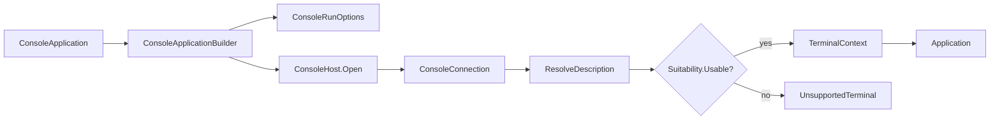

# Hosting

## Overview

`SharpVision.ConsoleApplication` is the fluent public entry point for an
interactive console host. It replaces the removed
`Application.RunConsoleAsync`/`ConsoleRun` pair with one layered seam: a
portable Terminal-layer console host
(`SharpVision.Terminal.Runtime.ConsoleHost`) opens the platform transport,
resize, and raw-mode resources, and a SharpVision-layer builder
(`ConsoleApplicationBuilder`) turns a comprehensive `ConsoleRunOptions` record
into a running `Application`.



## Entry points

Three equivalent shapes configure and run a detached `Screen`:

```csharp
// One-liner: every option defaults.
await ConsoleApplication.RunAsync(new Gallery());

// Configure-callback, EF-Core style: configures a builder.
await ConsoleApplication.RunAsync(new Gallery(), b => b
    .UseTheme(ThemeCatalog.Dark)
    .UseMouse(MouseTracking.Any, MouseCoordinates.Sgr)
    .WithoutNegotiation());

// Fluent builder, ASP.NET style.
await ConsoleApplication.CreateBuilder(new Gallery())
    .UseAlternateScreen()
    .UseKeyboardEnhancement(KittyKeyboardEnhancement.Disambiguate | KittyKeyboardEnhancement.EventTypes)
    .RunAsync();
```

`ConsoleApplication.CreateBuilder(Screen)` returns a `ConsoleApplicationBuilder`
for the advanced case: call `Build()` to open the console host and receive a
fully wired `Application` for manual lifecycle control, then drive it either
with the instance `Application.RunAsync(CancellationToken)` convenience method
(start, await `Completion`, stop) or with `StartAsync`/`StopAsync` directly:

```csharp
Application app = ConsoleApplication.CreateBuilder(new Gallery()).Build();
await app.RunAsync();
```

There is also an immutable-options overload,
`ConsoleApplication.RunAsync(Screen, ConsoleRunOptions)`, for callers that have
already assembled a `ConsoleRunOptions` value instead of using the builder.

The three equivalent shapes above share `ConsoleApplicationBuilder.RunAsync` (in
turn `ConsoleApplication.RunCoreAsync`) internally; the advanced case calls
`Application.RunAsync` directly once `Build()` returns, with no `RunCoreAsync`
wrapping it. Both still share the same
`SharpVision.Runtime.CooperativeShutdownSignals` registration logic described
below - `RunCoreAsync` and `Application` each call it rather than keeping two
copies of its Unix `Console`-initialization-avoidance behavior. `RunCoreAsync`
checks `ConsoleHost.Interactive` first: when standard input or output is
redirected, it returns `ConsoleRunStatus.Redirected` (writing
`RedirectedMessage` when set) rather than opening the console. Otherwise it
opens only the platform connection needed for description lookup and resolves
one `TerminalProfile`. Missing, generic, hardcopy, incomplete, and
padding-dependent descriptions return `ConsoleRunStatus.UnsupportedTerminal`,
optionally writing `UnsupportedTerminalMessage` as plain host text. On that path
no application, session, terminal query, mode lease, or renderer is ever
constructed. `Build()` instead throws the public `UnsupportedTerminalException`
(a `NotSupportedException` carrying the resolved `DescriptionResult` as
`Resolution`), after disposing the resize source, the transport, and the
platform restore lease in that order.

After a successful preflight, the terminal options resolve one immutable
`TerminalContext` from the profile and the caller-supplied environment snapshot.
Its backend identity is fixed for the application lifetime; negotiated
capability publication creates replacement profile and context snapshots without
re-resolving that identity. The
[terminal backend contract](../architecture/terminal-backends.md#initialization-and-ownership)
owns the distinction from the physical `ConsoleConnection`, and the
[discovery sequence](../architecture/discovery-pipeline.md#initialization-sequence)
owns evidence precedence and startup publication.

For the three equivalent shapes above, `RunCoreAsync` wires Ctrl+C to
cooperative shutdown unless `TreatControlCAsInput` is set - through
`PosixSignalRegistration` for `SIGINT` and `SIGQUIT` on Unix, and
`Console.CancelKeyPress` on Windows, for the reason given under [Unix](#unix) -
_before_ it builds the `Application`, not after. Registration wraps the whole
preflight-and-build step as well as the subsequent run, so a signal arriving
while `Build()` is entering raw/VT mode and running the screen's synchronous
`OnAttach` is cancelled cooperatively instead of hitting the OS default
disposition and killing the process before the terminal-mode restore lease
inside `Build()` ever runs. Once built, the host starts the application, waits
for completion or cancellation, stops cleanly, and maps the outcome to a
`ConsoleRunStatus`: `Completed`, `Cancelled`, or `Failed` (when
`Application.Failure` is set). A signal-driven shutdown reports `Cancelled` even
when the cooperative stop completes before the run token observes the
cancellation — the application latches the signal request, so a
`SIGTERM`/`SIGHUP`/Ctrl+C run never reports `Completed`. The numeric values
remain stable for compatibility: `Redirected=0`, `Completed=1`, `Cancelled=2`,
`Failed=3`, and the appended `UnsupportedTerminal=4`.

On Unix, `SIGTERM` and `SIGHUP` also drive the same cooperative shutdown,
through their own `PosixSignalRegistration`s reusing the Ctrl+C cancellation
callback and token. Unlike `SIGINT`/`SIGQUIT`, these two are registered
unconditionally - `TreatControlCAsInput` has no effect on them - because they
are the signals a process manager, container orchestrator, systemd unit, or
plain `kill` sends to request graceful termination, not Ctrl+C. The same
cooperative shutdown should cover the equivalent involuntary exits on Windows.

> [!IMPORTANT]
>
> **Implementation gap:** Windows has no equivalent registration.
> `CTRL_CLOSE_EVENT`, `CTRL_LOGOFF_EVENT`, and `CTRL_SHUTDOWN_EVENT` are not
> handled, so a console-window close, logoff, or system shutdown on Windows
> bypasses `Application.StopAsync` and its terminal-mode restoration.

A signal that lands while `Build()` is blocked inside the screen's synchronous
`OnAttach` is still cancelled cooperatively - the linked token is cancelled and
the process is no longer killed - but the run cannot unblock early: aborting
arbitrary user code mid-execution would be unsafe, so `Build()` keeps running
`OnAttach` to completion and the guarded shutdown only proceeds once it returns.
The accepted trade is a hang until `OnAttach` finishes rather than a
terminal-corrupting kill, not immediate cancellation.

The advanced case has no `RunCoreAsync` wrapping it, but is not left
unprotected: `Application` itself owns the identical registration from the
moment its own constructor runs, which `ConsoleApplicationBuilder.Build()`
triggers by passing a non-null `observeProcessSignals` derived from
`TreatControlCAsInput` (direct construction of `Application` outside the builder
defaults that parameter to null, registering nothing, so unrelated embedders
never have their process signals hijacked by an `Application` they did not build
through `ConsoleApplicationBuilder`).

> [!WARNING]
>
> An `Application` constructed directly with no signal observation leaves
> `SIGTERM` and `SIGHUP` on the operating system's default disposition: the
> process dies without running the stop path, and the platform terminal-mode
> restore lease is never disposed, so the tty is left raw with echo off. An
> embedder opting out of signal registration owns equivalent restoration itself.

Because construction happens before `Build()` attaches the screen, this covers
the same synchronous `OnAttach` window as the three equivalent shapes above, and
everything from there through `StartAsync`, the run, and `StopAsync` - a signal
arriving before the caller ever reaches `StartAsync` latches a request that call
itself resolves without a session ever having gone live, instead of being lost.
The one window this cannot close is a signal landing before the `Application`
constructor has even run - during `Build()`'s own preflight and
terminal-description resolution - because no instance exists yet for anything to
hook into; that narrow gap still hits the OS default disposition, same as it
would before the constructor of any object exists in any shape.

Session startup expands the complete description-owned alternate-screen,
cursor-visibility, and required application-key pairs before any transport
output. Missing, one-sided, parameter-consuming, empty, and over-limit optional
pairs are omitted safely. Each successful pair becomes an exact-byte lease
before its enable write, and the leases restore in reverse acquisition order
even after partial I/O, cancellation, or failure. `Options.Minimal` requests
none of these modes and stays byte-quiet.

## `ConsoleRunOptions`

`ConsoleRunOptions` is an immutable `record` with a validating `init` accessor
for each bounded property. `ConsoleApplicationBuilder` exposes one fluent setter
per property (each returning `this`) plus a `ConfigureOptions` escape hatch that
replaces the accumulated options wholesale.

| Property                      | Type                        | Default                                                                        |
| ----------------------------- | --------------------------- | ------------------------------------------------------------------------------ |
| `Theme`                       | `Theme?`                    | `null` (resolves to `ThemeCatalog.Dark` via `ResolveTheme()`)                  |
| `AlternateScreen`             | `bool`                      | `true`                                                                         |
| `ShowCursor`                  | `bool`                      | `false`                                                                        |
| `MouseTracking`               | `MouseTracking?`            | `MouseTracking.Any`; `null` disables mouse input                               |
| `MouseCoordinates`            | `MouseCoordinates`          | `MouseCoordinates.Sgr`                                                         |
| `BracketedPaste`              | `bool`                      | `true`                                                                         |
| `FocusReporting`              | `bool`                      | `true`                                                                         |
| `KeyboardEnhancement`         | `KittyKeyboardEnhancement?` | `KittyKeyboardEnhancement.Disambiguate \| KittyKeyboardEnhancement.EventTypes` |
| `Profile`                     | `TerminalProfile?`          | `null` (resolve from the platform connection)                                  |
| `Capabilities`                | `Capabilities?`             | `null` (detect and negotiate at startup)                                       |
| `ColorDepth`                  | `ColorDepth?`               | `null` (use the detected depth)                                                |
| `Negotiation`                 | `NegotiationOptions?`       | `null` (default startup negotiation from the environment)                      |
| `CleanupTimeout`              | `TimeSpan`                  | `1` second                                                                     |
| `ReadBufferSize`              | `int`                       | `16 * 1024` (16 KiB)                                                           |
| `ResizeInterval`              | `TimeSpan`                  | `100` ms                                                                       |
| `TreatControlCAsInput`        | `bool`                      | `false`                                                                        |
| `UseEnvironmentSizeOverrides` | `bool`                      | `false`                                                                        |
| `RedirectedMessage`           | `string?`                   | `null`                                                                         |
| `UnsupportedTerminalMessage`  | `string?`                   | `null`                                                                         |

Every timeout and interval must be positive and finite, `ReadBufferSize` must be
positive, `MouseTracking`, `ColorDepth`, and `MouseCoordinates` must be defined
enum values, and `KeyboardEnhancement` may contain only defined
`KittyKeyboardEnhancement` bits. Each of those violations throws
`ArgumentOutOfRangeException` from the `init` accessor before any state changes.
`KeyboardEnhancement` additionally rejects
`KittyKeyboardEnhancement.AssociatedText` set without
`KittyKeyboardEnhancement.AllKeys`, and that case throws `ArgumentException`
instead - associated-text reporting is meaningless without all-key reporting, so
this is a cross-flag consistency rule rather than an out-of-range value.

`CleanupTimeout` bounds two distinct shutdown steps. It caps the reverse
terminal-mode restoration writes, and it caps the drain that waits for an
outstanding `ITransport.ReadAsync` to finish borrowing the session read buffer.
A transport whose cancellation completes asynchronously therefore delays exit by
at most this budget, and a transport that never completes forfeits its pooled
read array rather than stalling shutdown. Custom transports that complete
cancellation promptly never observe either delay.

`ConsoleRunOptions.ToTerminalOptions(TerminalProfile)` maps these properties
onto the Terminal-layer `Options` record consumed by `Session` (the complete
profile, negotiation, alternate screen, cursor visibility, focus/paste, mouse
tracking and coordinates, keyboard enhancement, cleanup timeout, and read buffer
size). `ToHostOptions()` maps `ResizeInterval` and `TreatControlCAsInput` onto
`ConsoleHostOptions` for `ConsoleHost.Open`. `UseEnvironmentSizeOverrides` is
neither of those: `Build()` applies it by wrapping the connection's own resize
source, so it reaches an application built through `ConsoleApplicationBuilder`
or `ConsoleApplication` rather than one opening `ConsoleHost.Open` directly.
Both `COLUMNS` and `LINES` must name a positive integer or nothing is
overridden, pixel dimensions are dropped along with the measured cell size, and
only the first observed size is replaced — a genuine resize afterwards always
wins. `Profile` has the highest precedence and bypasses native discovery.
Otherwise `Capabilities`, when set, is retained for compatibility by wrapping
its exact value in `TerminalProfile.CreateAnsi`; platform discovery comes third.
`ColorDepth` is the final semantic override: it records
`ColorOrigin=Origin.Override` while keeping the selected description, programs,
and key map. Either complete explicit form disables negotiation — except the
multiplexer routing policy, which survives from `Negotiation.Multiplexing` so
graphics still cross an approved passthrough; otherwise the resolved profile's
capabilities are the negotiation baseline.

The parameterless `ToTerminalOptions()` remains a public source-compatibility
surface for low-level callers. It uses `Profile` first, otherwise wraps
`Capabilities` in a built-in ANSI profile, and otherwise reproduces the
historical conservative detection plus explicit cell-mouse semantics in a
built-in ANSI profile. Interactive hosting uses the resolved-profile overload
above; the parameterless compatibility path never replaces native preflight.
`ConsoleApplicationBuilder.WithoutNegotiation()` clears `Negotiation` and - only
if no explicit profile or capabilities was already set - selects an explicit
built-in ANSI profile around `Capabilities.Conservative`. That opt-in helper is
distinct from the default native path and cannot weaken an unsuitable database
description.

### Terminal-description preflight

The console host resolves terminal descriptions through
`ConsoleConnection.ResolveDescription`. That Terminal-layer operation owns the
connection's hidden platform, output-descriptor, and Windows-VT facts. An
explicit profile is returned in a loaded result without reading `TERM` or
calling a provider. The default Unix path snapshots the live `TERM` value and
uses the
[terminfo lookup and fallback contract](../protocols/terminfo.md#lookup-and-fallback)
and its
[full-screen suitability rules](../protocols/terminfo.md#full-screen-suitability).
Windows uses the built-in profile only when the connection established VT input
and output. A caller-built connection with no platform facts cannot invent ANSI
support: its typed result is `PlatformUnavailable`, and the `ResolveProfile`
projection is null unless an explicit profile was given.

The public immutable result retains a `DescriptionLoadStatus`, an optional
`TerminalProfile`, and ordered redacted diagnostics (`DescriptionDiagnosticCode`
plus an optional allowlisted capability name). Advanced hosts can inspect that
result directly; `ResolveProfile` remains the nullable convenience projection.
SharpVision preflight retains the same result in the public
`UnsupportedTerminalException`, whose `Resolution` property exposes it.
`Build()` exposes a safe exception message containing the status, the unsuitable
classification, and the diagnostic codes; `RunAsync` maps that exact rejection
to `UnsupportedTerminal`.

The
[terminal-description profile](../architecture/capabilities.md#terminal-description-profile)
owns the typed result; `ConsoleRunOptions` adds no raw command overrides. Its
[native-provider trust boundary](../protocols/terminfo.md#native-provider-trust-boundary)
also applies to hosting. A deployment that requires an end-to-end bounded lookup
supplies an explicit owned `TerminalProfile` and disables native discovery.

## Portable console host

`ConsoleHost.Open(ConsoleHostOptions)` is the single Terminal-layer seam that
selects a platform strategy and returns a `ConsoleConnection`. Advanced hosts
that bypass `ConsoleApplication` entirely can call it directly. The public
surface exposes only `ConsoleHost`, `ConsoleHostOptions`, and
`ConsoleConnection`; the platform strategies (`UnixConsoleHost`,
`WindowsConsoleHost`) and their raw/VT mode leases (`UnixConsoleMode`,
`WindowsConsoleMode`) are internal implementation details.

`ConsoleHostOptions` carries `ResizeInterval` (the positive, finite poll
interval used by the cell-only resize fallback; default `100` ms) and
`CaptureControlKeys` (whether Ctrl+C and other control keys are delivered as
input rather than raising the host's cancellation signal; default `false`).

`ConsoleConnection` bundles the opened `ITransport` and `IResizeSource` and owns
only the platform terminal-mode restore lease. It represents a physical TTY
connection, not an xterm, Kitty, or iTerm2 identity. Ownership is split
deliberately: the connection _constructs_ the transport and resize source, but
the running `Session` disposes them as part of ordinary shutdown, while the
connection's own `DisposeAsync` restores the platform terminal mode (`tcsetattr`
on Unix, `SetConsoleMode` on Windows) exactly once, idempotently. `Application`
disposes the host lease _last_, after the session's reverse DEC-mode cleanup, so
VT modes are undone only after cooked and echoed input has already been restored
underneath them.

`Application` awaits the session run before disposing the session, so the
framework hosting path never interleaves the two. A direct `Session` consumer
that disposes concurrently with an active run is covered by the normative
[run and disposal interleaving](../architecture/runtime-event-loop.md#run-and-disposal-interleaving)
rules, which that document owns.

Platform restoration failure is reported, never discarded. Both mode leases
always attempt every restore - Unix replays the captured `tcgetattr` state, and
Windows restores the input handle and then the output handle even when the input
restore failed - and then throw the first failure.
`ConsoleConnection.DisposeAsync` lets that failure propagate, and `Application`
folds it into `LastCleanupException` without replacing the primary `Failure`. A
terminal left raw, without echo, or with modified Windows console modes is
therefore observable instead of being reported as a clean shutdown. Repeated
disposal stays quiet and retries nothing, so a failed restore is never attempted
twice.

### Unix

`UnixConsoleHost.Open` enters raw mode through `UnixConsoleMode.Enter`, which
calls `tcgetattr`/`tcsetattr` directly: it captures the current terminal state
(`tcgetattr`) for restoration, then derives a raw-mode state with `cfmakeraw`
and, unless `CaptureControlKeys` is `true`, re-enables `ISIG` in `c_lflag` after
`cfmakeraw` clears it (so Ctrl+C keeps raising the host's signal instead of
arriving as a decoded key). No subprocess is spawned for entry or restoration.
It opens `/dev/tty` as a one-byte-buffered asynchronous input stream and wraps
it with a raw `FileStream` over the borrowed standard-output descriptor in a
`StreamTransport`. This host never calls `Console.OpenStandardOutput()`,
`Console.Error`, `Console.Out`, or `Console.CancelKeyPress`: on Unix, the _first
write_ through any of those initializes the BCL's Unix console, which emits
`smkx` (application keypad mode) and leaves the runtime re-emitting it on every
later child-process exit - including this host's own restore-lease teardown,
which previously re-armed the leak on every clean shutdown. `ConsoleApplication`
and `ConsoleApplicationBuilder` write host text through `ConsoleTextChannel`
instead, and observe Ctrl+C through `PosixSignalRegistration` (`SIGINT` and
`SIGQUIT`) rather than `Console.CancelKeyPress`, for the same reason; Windows
keeps using `Console` directly, since it has no equivalent side effect. Because
the input descriptor is the real tty file descriptor, `UnixResizeSource` drives
resize from `SIGWINCH` and reads both cell _and pixel_ dimensions through
`TIOCGWINSZ` - this is what makes pixel-accurate mouse reporting work in a
console run, unlike the cell-only polling fallback.

The two streams have different owners, so the transport is constructed with
`leaveInputOpen: false, leaveOutputOpen: true`. The host opened `/dev/tty`
itself and must close it during ordinary shutdown, while standard output belongs
to the process and is only borrowed. Disposing the transport therefore closes
the tty descriptor, and a completed lifecycle leaves nothing open. Windows keeps
a shared `leaveOpen: true`, which is correct there because
`Console.OpenStandardInput` and `Console.OpenStandardOutput` both wrap
process-owned handles.

If construction fails partway, `Open` unwinds in exact reverse order - resize
source, transport, tty stream, then the raw-mode lease - because the resize
source borrows the raw tty descriptor and must stop observing it before the
stream that owns it closes. Each release is guarded so a cleanup failure cannot
replace the construction failure the caller needs to see.

### Windows

`WindowsConsoleHost.Open` enters VT mode through `WindowsConsoleMode.Enter`,
which resolves the standard input and output handles (`GetStdHandle`), saves
both console modes (`GetConsoleMode`), and applies computed modes via
`SetConsoleMode`: the input mode clears `ENABLE_LINE_INPUT` and
`ENABLE_ECHO_INPUT`, sets `ENABLE_VIRTUAL_TERMINAL_INPUT`, and sets or clears
`ENABLE_PROCESSED_INPUT` depending on `CaptureControlKeys` (cleared when `true`,
so Ctrl+C arrives as input instead of the host signal); the output mode adds
`ENABLE_PROCESSED_OUTPUT`, `ENABLE_VIRTUAL_TERMINAL_PROCESSING`, and
`DISABLE_NEWLINE_AUTO_RETURN`. It reads the standard input and output streams
and uses the polling `ConsoleResizeSource` on `ResizeInterval`, because the
standard Windows console does not report pixel dimensions - Windows resize is
always cell-only, and pixel mouse coordinates are unavailable on that path. A
mode read or write failure throws `IOException` wrapping a `Win32Exception`
(`Marshal.GetLastPInvokeError()`), mirroring the existing Unix
`Native.GetDimensions` failure shape.

The Windows path is validated beyond its unit-tested mode-flag computation and
P/Invoke boundary shape: a real ConPTY-backed fixture drives `ConsoleHost.Open`
against a genuine pseudo console — mode application, control-key capture,
restore-on-dispose, byte transfer, and the cells-only resize path — and the
continuous-integration Windows lane runs that coverage on every change. The one
remaining untested path is `WindowsConsoleMode.Enter`'s output-mode-set failure
rollback, which needs a native-call injection seam; see
[pseudoterminals](../testing/pseudoterminals.md#overview).

## `TreatControlCAsInput`

`TreatControlCAsInput` (default `false`) is one option with two coordinated
effects. On `ConsoleRunOptions` and the builder, it flows into
`ConsoleHostOptions.CaptureControlKeys`, which changes the platform mode leases
above so Ctrl+C (and other control keys) reach the decoder as ordinary key input
instead of being intercepted by the terminal driver. At the
`ConsoleApplicationBuilder.RunAsync`/`ConsoleApplication.RunAsync` level, the
same flag also suppresses the managed Ctrl+C wiring - the `SIGINT`/`SIGQUIT`
signal registrations on Unix, the `Console.CancelKeyPress` subscription on
Windows - that would otherwise translate Ctrl+C into cooperative shutdown
(`ConsoleRunStatus.Cancelled`). This leaves Ctrl+C available to focused control
commands, including TextInput copy. A host that sets this option owns a separate
decoded exit chord when it still needs a global keyboard exit path. This
suppression reaches every shape uniformly, including the bare `Build()` +
`app.RunAsync()` one: `ConsoleApplicationBuilder.Build()` passes
`!TreatControlCAsInput` as `Application`'s own `observeProcessSignals`
constructor parameter, so the option gates that instance's Ctrl+C registration
the same way it gates `RunCoreAsync`'s.

`TreatControlCAsInput` scopes to Ctrl+C delivery only - it does not affect
`SIGTERM` or `SIGHUP` on Unix. Both remain registered and drive the same
cooperative shutdown regardless of this option, because they represent
process-manager-initiated termination rather than a Ctrl+C key press.

## Expected behavior

| Layer          | Required evidence                                                                                             |
| -------------- | ------------------------------------------------------------------------------------------------------------- |
| Unit           | Builder/option defaults, validation, mapping, preflight statuses, and cleanup exception preservation.         |
| Integration    | Description resolution, discovery publication, mode acquisition, input, resize, output, and reverse shutdown. |
| Pseudoterminal | Real raw-mode entry, Ctrl+C policy, fragmented input, SIGWINCH, cancellation, and restoration.                |

- Windows mode and resize behavior is exercised by a real ConPTY fixture in the
  Windows continuous-integration lane; only the output-mode-set failure rollback
  still lacks a test.
- The redirected and unsuitable-terminal paths create no application, session,
  query, or optional mode, and that absence is proven.
