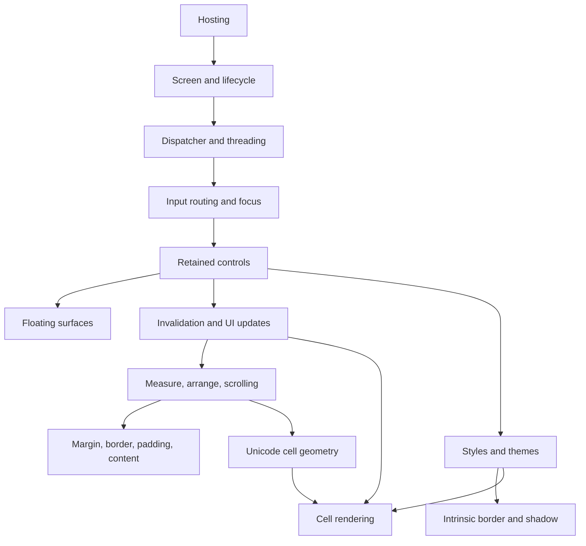

# Shared concept specifications

## Concept map

Concept pages own behavior that several controls share. A control page links
here for the common rule and documents only its own specialization.

- [Unicode cell geometry](unicode-cell-geometry.md#overview)
- [Images](images.md#overview)
- [Styling](styling.md#overview)
- [Intrinsic chrome](intrinsic-chrome.md#overview)
- [Themes](themes.md#overview)
- [Markdown documents](markdown-documents.md#overview)
- [Syntax highlighting](syntax-highlighting.md#overview)
- [Layout](layout.md#overview)
- [Invalidation and UI updates](invalidation.md#overview)
- [Box model](box-model.md#overview)
- [Scrolling](scrolling.md#overview)
- [Focus](focus.md#overview)
- [Modality](modality.md#overview)
- [Input routing](input-routing.md#overview)
- [Access keys](access-keys.md#overview)
- [Threading](threading.md#overview)
- [Data binding](data-binding.md#overview)
- [Lifecycle events](lifecycle-events.md#overview)
- [Floating surfaces](floating-surfaces.md#overview)
- [Screen](screen.md#overview)
- [Custom components](custom-components.md#overview)
- [Safe degradation](safe-degradation.md#overview)
- [Hosting](hosting.md#overview)
