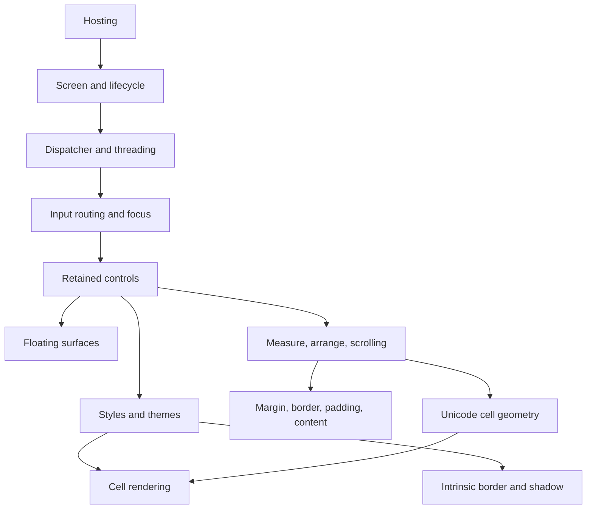

# Shared concept specifications

## Concept map

Concept pages own behavior shared by several controls. A control page links here
for the common rule and documents only its specialization.

- [Unicode cell geometry](unicode-cell-geometry.md#unicode-cell-geometry-contract)
- [Images](images.md#image-ownership-contract)
- [Styling](styling.md#styling-contract)
- [Intrinsic chrome](intrinsic-chrome.md#intrinsic-chrome-contract)
- [Themes](themes.md#theme-file-contract)
- [Layout](layout.md#layout-contract)
- [Box model](box-model.md#box-model-contract)
- [Scrolling](scrolling.md#scrolling-contract)
- [Focus](focus.md#focus-contract)
- [Modality](modality.md#modality-contract)
- [Input routing](input-routing.md#input-routing-contract)
- [Access keys](access-keys.md#access-key-contract)
- [Threading](threading.md#threading-contract)
- [Data binding](data-binding.md#data-binding-contract)
- [Lifecycle events](lifecycle-events.md#lifecycle-event-contract)
- [Floating surfaces](floating-surfaces.md#floating-surface-contract)
- [Screen](screen.md#screen-contract)
- [Custom components](custom-components.md#custom-components-contract)
- [Safe degradation](safe-degradation.md#safe-degradation-contract)
- [Hosting](hosting.md#hosting-contract)
