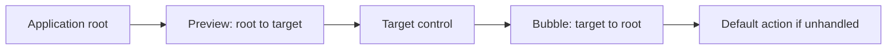

# Input routing

## Input routing contract

Terminal bytes decode into immutable key, text, pointer, paste, focus, resize,
query, closure, or fault events before entering the UI project. Controls never
parse terminal bytes.

## Terminal input values

`SharpVision.Terminal.Input.Decoder` incrementally consumes borrowed byte spans
and synchronously calls `IInputSink`. The sink receives immutable `Stroke`,
`Text`, `Pointer`, and `Focus` values, an owned `Paste`, or a redacted protocol
`Diagnostic`; no parser callback span crosses that boundary.

`Stroke` preserves a logical `Code`, an optional Unicode `Rune` for character
keys, a non-negative native numeric code, composable `Modifiers`, and a
press/repeat/release `Action`. `Text` contains exactly one valid Rune. Printable
input emits a stroke/text pair so keyboard commands and text composition remain
distinct. Legacy Escape-prefixed printable text sets Alt on the stroke while
preserving the same text Rune.

The decoder retains at most three incomplete UTF-8 bytes and replaces malformed
subsequences minimally with U+FFFD. It maps Enter, Tab, Backspace, cursor keys,
Home/End, Insert/Delete, Page Up/Down, Begin, F1-F63, Shift-Tab, described CSI
modifiers, and seven- or eight-bit SS3 forms. Valid unknown keys retain
`Code.Unknown` plus their native code; malformed and unsupported forms produce
one structural diagnostic and leave the next input decodable. The original
`Code.Unknown` through `Code.Menu` numeric values remain stable; Begin and
F36-F63 are appended values rather than insertions into that public range.

Enhanced Kitty events add optional shifted/base-layout Runes, all defined
modifier bits, native F13-F35/lock identities, and press/repeat/release without
changing the same `Stroke`/`Text` boundary. Pointer input preserves both cell
and optional pixel coordinates, while resize-derived metrics mark inferred cell
coordinates explicitly. These additions degrade to the legacy values above when
support is not proven.

A raw Escape remains ambiguous until another byte arrives. `ExpireEscape` emits
it only after `Options.EscapeTimeout` on the injected `TimeProvider`, and
`Complete` resolves it immediately at end-of-stream. The decoder accounts for
bytes handled outside the protocol parser so later diagnostic offsets remain
absolute. Bracketed paste, focus, and mouse decoding build on these values in
the [paste/focus](../protocols/paste-focus.md#paste-and-focus-contract) and
[mouse](../protocols/mouse.md#mouse-reporting-contract) milestones.

## Route construction

The route is a stable ownership-ancestry snapshot. Preview permits an ancestor
to intercept before the target, while bubble lets an ancestor handle input the
target did not consume.

Keyboard targets the focused control, or the application root when no control is
focused. Pointer input targets capture when active, otherwise hit testing over
committed layout and clipping. The dispatcher snapshots ancestry, previews root
to target, then bubbles target to root. `OriginalSource` never changes;
controlled retargeting may change `Source`. Ancestry follows `Control.Parent`
across every ownership role; route construction never requires the parent to be
a `Container` or the edge to appear in public `Children`.

`Handled` suppresses remaining ordinary handlers and default control behavior.
Handlers explicitly registered for handled events still run. Tree mutation
during dispatch does not alter the current route; invalidation waits until
dispatch completes.

`Handled` never truncates the route itself. Both phases always walk the full
captured ancestry, and each registration decides for itself whether it runs, so
an opted-in ancestor handler still observes an event that a descendant already
handled. Default control behavior remains gated on unhandled state, so an
ancestor default cannot claim an event a descendant consumed.

An active modal scope replaces the application root with the matching plane root
as the preview/bubble boundary. Direct `Router.Route` calls enforce the same
restriction, and an in-progress route keeps its captured ancestry. The
[modal route contract](modality.md#modal-route-boundaries) owns the exact
target, boundary, and rejection rules.

## Routed-event API

`Event<TArgs>` is an immutable typed identifier with a diagnostic name and a
`TunnelBubble`, `Bubble`, or `Direct` strategy. The standard `Events` catalog
provides key, text, pointer, paste, and terminal-focus identifiers paired with
sealed argument classes over the immutable terminal input values.

`Control.AddHandler` rejects null or duplicate event/delegate pairs and returns
an idempotent registration. Attached registration and removal are
dispatcher-affine. Setting `Handled` skips later ordinary handlers and remaining
default behaviors; `handledEventsToo: true` opts into observing handled routes.

`Router.Route` snapshots both ancestry and the registration-order cutoff before
preview begins. Reparenting and newly added handlers therefore affect the next
route, never the current bubble. Disposed registrations stop immediately. Both
ancestry and per-control handler snapshots use cleared pooled storage so they do
not retain controls or delegates.

`OriginalSource` remains the initiating target. `Source` begins at that target
and can be changed through `Retarget` only while dispatch is active. The current
route control is the handler's `sender`; `Phase` reports preview or bubble. Each
route member runs its bubble handlers and then, if still unhandled, its own
default behavior before the next ancestor is considered. This prevents an
ancestor widget default from preempting a nested editor. A pressed Tab with no
modifiers other than Shift requests one post-route application traversal; the
application executes that command exactly once from the stable route anchor. The
same path enters the first eligible tab stop when no control was focused. A
control that owns Tab semantics, such as a `TextInput` with `AcceptsTab`,
handles it before this fallback. Exceptions propagate after route state and
pooled storage are cleaned. Under modality, the fallback traverses and wraps
only within the [active plane](modality.md#keyboard-text-and-paste).

An unhandled pressed Alt character then enters the application
[access-key fallback](access-keys.md#dispatch-precedence). Access-key discovery
never preempts preview, bubble, or a control default. When that fallback accepts
a legacy Alt stroke, it consumes the immediately adjacent equal text Rune so the
mnemonic cannot be inserted into the newly focused editor.

## Pointer capture and coordinates

Capture is exclusive per pointer source and supports press, drag, scrollbar,
selection, move/resize, and popup interactions. Detach, disable, close,
terminal-focus loss where configured, or explicit release ends capture and
raises cancellation when required. Entering or leaving a modal scope applies the
additional [capture confinement rules](modality.md#modal-pointer-and-capture).

Pointer events preserve screen cells, optional pixels, inferred cell position,
buttons, wheel delta, modifiers, and action. Local coordinates are derived from
committed transforms at each route element.

`PointerManager` synthesizes `PointerEventArgs.ClickCount` because terminal
mouse reports do not carry desktop gesture counts. Presses accumulate only for
the same routed target, button set, and cell within 500 milliseconds on the
manager's monotonic `TimeProvider`; any mismatch or expired interval restarts at
one. Non-press events report zero. This gesture metadata belongs to routed UI
input and does not alter the immutable terminal `Pointer` value.

The framework's internal pointer-target resolution requires effective visibility
and enabled state and searches the central owned-control registry. It is not a
public descendant-discovery API: private composition roots and framework parts
remain implementation details. Popup-layer targets are considered before
ordinary targets. Ordinary hit-participating slots are searched in reverse
slot-registration and item order so the last rendered eligible control wins;
slots that opt out suppress their complete subtree from pointer targeting. Each
owner's `ClipsChildren` policy gates ordinary descendants, while popup discovery
may extend outside the owner's arranged box under the remaining ancestor clip.
Every intermediate owner must still be effectively visible, enabled, and
hit-test visible; an ineligible private composition node suppresses its complete
popup subtree without imposing its bounds on that subtree. Overlay and scrolling
containers preserve their documented viewport and z-order rules on top of this
shared traversal. A pointer handler receives `LocalCells` relative to its
current sender's committed bounds.

On a primary press, `PointerManager` resolves the nearest eligible focusable
member from the routed target toward the root. After modal target validation,
the Application first resolves and activates the nearest Window ancestor. That
Window bounds the generic focus search, so non-focusable Window chrome or
background does not move focus to an application-shell ancestor. Focus then
commits before the pointer event routes. The activated Window is already
observable through `Application.ActiveWindow` and `Window.IsActive` when routed
handlers run.

This shared focus rule applies to every focusable control; specialized controls
may repeat the same idempotent focus request. A cancelled focus transaction does
not suppress Window activation or pointer routing. A primary press without a
Window ancestor clears activation. When modality is active, physical hit testing
is filtered before hover, activation, focus, press-origin, capture, or routing
state changes; rejected outside input cannot activate a background Window, and
outside dismissal follows the
[consume-without-replay contract](modality.md#outside-interaction-and-dismissal).

Wheel input retains its routed arguments through pointer dispatch. A scrollable
leaf handles a record only when some in-plane offset changes. If the uncaptured
record reaches the active modal boundary unhandled, pointer dispatch completes
the captured scope's Ignore or Dismiss policy without retargeting or replaying
the record. Manual scroll-remainder ancestry follows the same boundary.

`PointerManager.Dispatch` routes to exclusive capture when present and otherwise
uses root hit testing. Pointer state follows the physical hit-test path even
while another control is captured: the direct target exposes
`IsPointerDirectlyOver` and every ancestor exposes `IsPointerOver`. Semantic
press state belongs only to `PressBehavior`; raw pointer dispatch never marks a
control pressed. Explicit `Release` is quiet; detach, disable, hide, disposal,
and terminal-focus loss first clear capture plus any hover and press state owned
by the unavailable subtree. If a capture target existed, its protected
cancellation hook runs next; the manager-level `Cancelled` event then publishes
the precise `ReleaseReason`. Capture requests made from either cancellation
callback return false until the complete callback sequence has unwound.

Disabling, hiding, or collapsing a control commits the availability property,
clears focus and capture, and only then publishes its property notification. A
throwing focus, capture, unavailability, or property callback cannot skip the
remaining cleanup or notification; the earliest failure is rethrown after the
full transition.

An externally derived control uses `RequestFocus()` and `CapturePointer()`
instead of retaining manager references. Both return false while detached or
ineligible. `HasPointerCapture` reports identity ownership, and
`ReleasePointerCapture()` releases only the calling control; it cannot disturb
another target's capture. Explicit release remains quiet.

Press-only cleanup does not invoke the protected capture hook because no former
capture target exists. The manager-level `Cancelled` event still lets hosts
observe that scoped cleanup across the whole tree.

## Pull-style pointer and focus snapshot

`Application.Pointer` exposes a `PointerDevice`, a dispatcher-affine read-model
of the last dispatched pointer state, independent of the routed pointer events
above. Unlike `Focus` and `Capture`, which throw before the first resize because
they own tree state, `Pointer` is always readable: it is constructed once in the
`Application` constructor and never throws. `Position` (the last zero-based cell
position) and `PixelPosition` (the last zero-based pixel position, when the wire
supplied one) are `null` before the first pointer arrives and are cleared on
`PointerAction.Leave`; `Buttons`, `Modifiers`, and `LastAction` reflect the most
recently dispatched pointer. `Hovered`, `Pressed`, and `Captured` delegate live
to `PointerManager` and are `null` until the tree attaches.
`Application.Dispatch` updates the device from every `RecordKind.Pointer` record
before routing it, so a caller reading `Pointer` mid-callback sees the same
state the router just used.

`Application.HasFocus` is a `bool` tracking whether the terminal window
currently reports focus. It defaults to `true` (assume focused until told
otherwise) and toggles on each `RecordKind.Focus` record, before that record is
routed to the focused control's `Events.TerminalFocusChanged` handler.

No new event backs either member: `Pointer` and `HasFocus` are pull-style
snapshots for code that wants "where is the mouse" or "are we focused" without
subscribing to routed events; push-style consumers continue to use `Router`
pointer and focus events as described above.

## Test obligations

Use recording controls to assert route order, handled semantics, default action,
capture, focus, coordinates, clipping, z-order, disabled/hidden targets,
mutation/reparent during dispatch, nested scrolling, and final control/render
behavior.

Routing tests additionally force collection after registration disposal and tree
detachment, proving pooled snapshots and registrations retain neither handler
targets nor controls.

Terminal-layer tests repeat representative UTF-8, CSI, and SS3 inputs at every
byte split, cover malformed recovery and completion, and require warmed ASCII
and non-ASCII Rune decoding to allocate zero managed bytes per event. The
fixed-seed hostile-byte suite caps paste/parser retention, injects an explicit
recovery boundary, and requires a known trailing Rune to survive every case.
[`Pressable`](../controls/pressable.md#pressable-contract) is the public
single-content activation role. Space holds pressed state until a matching
release; Enter activates directly. Primary pointer press focuses and captures,
movement updates inside/outside pressed state, and release inside activates
once. Focus loss, capture cancellation, disable, hide, detach, and disposal
clear all held state without activation. Completed activations carry a validated
`ActivationCause` of Keyboard, Pointer, or Programmatic. The transient state
machine is one internal composed behavior also used by direct-`Control`
`ComboBox`; interaction reuse does not dictate public inheritance.
