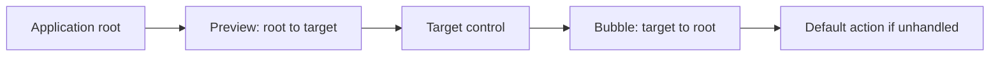
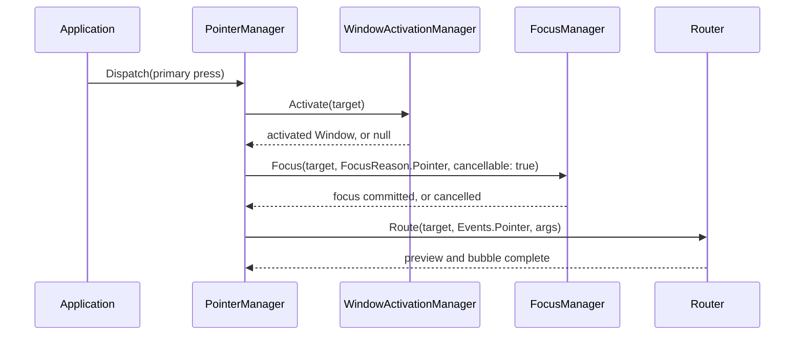
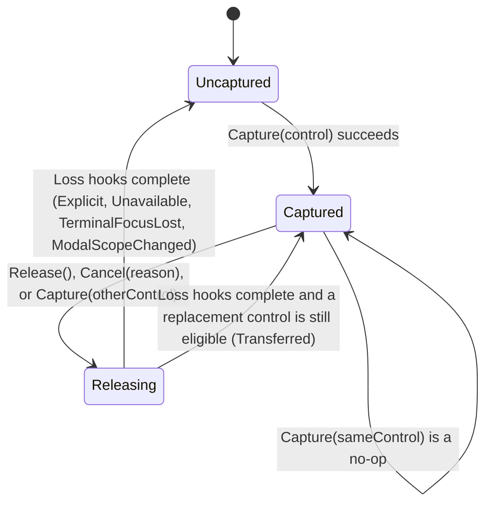

# Input routing

## Overview

Terminal bytes are decoded into immutable key, text, pointer, paste, focus,
resize, query, closure, and fault events before they enter the UI project.
Controls never parse terminal bytes themselves.

## Terminal input values

`SharpVision.Terminal.Input.InputDecoder` consumes borrowed byte spans
incrementally and calls `IInputSink` synchronously. The sink receives immutable
`Stroke`, `Text`, `Pointer`, and `TerminalFocus` values, an owned `Paste`, or a
redacted protocol `Diagnostic`. No parser callback span crosses that boundary.

A `Stroke` carries a logical `Code`, an optional Unicode `Rune` for character
keys, a non-negative native numeric code, composable `Modifiers`, and a
press/repeat/release `KeyAction`. A `Text` value contains exactly one valid
Rune. Printable input emits a stroke/text pair, which keeps keyboard commands
and text composition distinct. Legacy Escape-prefixed printable text sets Alt on
the stroke while preserving the same text Rune. That marker is armed only when
the following byte is a valid UTF-8 lead byte (`0xC2`..`0xF4`) that will
actually reach text emission; a byte a pending SS3 or X10 mouse continuation
consumes instead never arms it, so the Escape itself is recovered rather than
leaving Alt attached to an unrelated later keystroke.

`SharpVision.Input.KeyEventArgs` is the protocol-independent routed-control
boundary over a decoded `Stroke`. `IsInitialKeyDown` identifies the start of a
hold, `IsKeyDown` includes both initial and repeated down input, `IsRepeat`
identifies a repeated down event, and `IsKeyUp` identifies the end of a hold.
Controls use inclusive key down for repeatable navigation, scrolling, and
editing, while activation, dismissal, access keys, and shortcuts use initial key
down. A legacy terminal that reports a held key as repeated presses and an
enhanced terminal that distinguishes repeat actions therefore drive the same
control commands without exposing protocol identity to the control layer.

The decoder retains at most three incomplete UTF-8 bytes and replaces malformed
subsequences minimally with U+FFFD. It maps Enter, Tab, Backspace, cursor keys,
Home/End, Insert/Delete, Page Up/Down, Begin, F1-F63, Shift-Tab, described CSI
modifiers, and seven- or eight-bit SS3 forms. Valid keys the decoder does not
recognize keep `Code.Unknown` plus their native code, while malformed and
unsupported forms produce one structural diagnostic and leave the next input
decodable. The original `Code.Unknown` through `Code.Menu` numeric values remain
stable; Begin and F36-F63 were appended to the enum rather than inserted into
that public range.

Enhanced Kitty events add optional shifted and base-layout Runes, all defined
modifier bits, native F13-F35 and lock-key identities, and press, repeat, and
release actions - all without changing the `Stroke`/`Text` boundary described
above. Pointer input preserves both cell and optional pixel coordinates, and
resize-derived metrics mark inferred cell coordinates explicitly. When support
is not proven, these additions degrade to the legacy values above.

A raw Escape byte is ambiguous until another byte arrives. `ExpireEscape` emits
it only after `Options.EscapeTimeout` elapses on the injected `TimeProvider`,
and `Complete` resolves it immediately at end-of-stream. The decoder accounts
for bytes handled outside the protocol parser, so later diagnostic offsets stay
absolute. Bracketed paste, focus, and mouse decoding build on these values in
the [paste/focus](../protocols/paste-focus.md#overview) and
[mouse](../protocols/mouse.md#overview) contracts.

## Route construction

A route is a stable snapshot of the target's ownership ancestry. The preview
phase lets an ancestor intercept input before the target sees it, and the bubble
phase lets an ancestor handle input the target did not consume.

Keyboard input targets the focused control, or the application root when no
control is focused. Pointer input targets the capture owner when capture is
active, and otherwise the result of hit testing over committed layout and
clipping. The dispatcher snapshots the ancestry, previews from root to target,
then bubbles from target to root. `OriginalSource` never changes; controlled
retargeting may change `Source`. Ancestry follows `ControlBase.Parent` across
every ownership role - route construction never requires the parent to be a
`Container` or the edge to appear in the public `Children` collection.

Setting `IsHandled` suppresses the remaining ordinary handlers and the default
control behavior. Handlers that explicitly registered for handled events still
run. Mutating the tree during dispatch does not alter the current route;
invalidation waits until dispatch completes.

A stroke consumed anywhere on or around its route - by a preview handler, an
ordinary routed handler, a control default, a `MenuItem.Shortcut` match, or
access-key discovery - never delivers the paired text record(s) a legacy
terminal or Kitty associated text reports alongside it. `Application` arms that
suppression from the route's own final `IsHandled` verdict in one place, so
every consume path is covered uniformly rather than requiring each one to
remember to arm it individually; see [access keys](access-keys.md#overview) for
the adjacent-pair mechanics.

`IsHandled` never truncates the route itself. Both phases always walk the full
captured ancestry, and each registration decides for itself whether to run, so
an opted-in ancestor handler still observes an event that a descendant already
handled. Default control behavior remains gated on the unhandled state, so an
ancestor default cannot claim an event a descendant consumed.

When a modal scope is active, the matching plane root replaces the application
root as the preview/bubble boundary. Direct `Router.Route` calls are held to the
same restriction, and a route already in progress keeps its captured ancestry.
The [modal route contract](modality.md#modal-route-boundaries) owns the exact
target, boundary, and rejection rules.

## Routed-event API

`Event<TArgs>` is an immutable typed identifier with a diagnostic name and a
`TunnelBubble`, `Bubble`, or `Direct` strategy. The standard `Events` catalog
provides key, text, pointer, paste, and terminal-focus identifiers, each paired
with a sealed argument class over the immutable terminal input values.

`ControlBase.AddHandler` rejects null or duplicate event/delegate pairs and
returns an idempotent registration. Attaching and removing registrations is
dispatcher-affine. Setting `IsHandled` skips later ordinary handlers and the
remaining default behaviors; passing `handledEventsToo: true` opts a handler
into observing handled routes.

`Router.Route` snapshots both the ancestry and the registration-order cutoff
before preview begins. Reparenting a control or adding new handlers therefore
affects the next route, never the bubble already in flight. IsDisposed
registrations stop immediately. Both the ancestry and the per-control handler
snapshots use cleared pooled storage, so they do not retain controls or
delegates.

`OriginalSource` remains the initiating target. `Source` starts at that target
and can be changed through `Retarget`, but only while dispatch is active. The
control currently on the route is the handler's `sender`, and `Phase` reports
preview or bubble. Each route member runs its bubble handlers and then, if the
event is still unhandled, publishes the inherited `KeyDown`, `KeyUp`,
`PointerPressed`, `PointerReleased`, or `PointerMoved` convenience event that
matches the input. `PointerPressed` is primary-only; the other pointer events
retain their action-wide meaning. If a convenience observer handles the event,
that member's concrete default does not run. Otherwise the concrete default runs
before the next ancestor is considered. This ordering is owned by the shared
dispatch seam, so a control override cannot accidentally omit inherited input
events or run its default after one of them handles the input. It also prevents
an ancestor widget's default from preempting a nested editor. A pressed Tab with
no command modifier requests one post-route application traversal; Shift selects
reverse traversal, while Caps Lock and Num Lock are ignored. Control, Alt,
Super, Hyper, or Meta excludes the stroke from traversal. The application
executes an eligible command exactly once from the stable route anchor. The same
path enters the first eligible tab stop when no control was focused. A control
that owns Tab semantics, such as a `TextInput` with `AcceptsTab`, handles the
key before this fallback runs. Exceptions propagate after route state and pooled
storage are cleaned up. Under modality, the fallback traverses and wraps only
within the [active plane](modality.md#keyboard-text-and-paste).

An unhandled pressed Alt character then enters the application
[access-key fallback](access-keys.md#dispatch-precedence). Access-key discovery
never preempts preview, bubble, or a control default. When that fallback accepts
a legacy Alt stroke, it consumes the immediately adjacent equal text Rune so the
mnemonic cannot be inserted into the newly focused editor.

### Selection and clipboard fallback

The framework's Ctrl+C copy handler is registered on the application root and
acts during the preview phase, so it runs ahead of every descendant preview
handler, every bubble handler, and every control default. When the stroke is
Ctrl+C, `Application` walks from the focused target through `ControlBase.Parent`
toward the modal boundary and chooses the nearest enabled control-wide text
selection, then falls back to the nearest `IClipboardCopySource`. It calls the
chosen pure copy method exactly once, publishes that owned string through
`Application.Terminal.Clipboard`, and consumes the stroke. An empty result is
still authoritative and never falls through to a more distant ancestor. With no
source, the stroke remains available to later application fallbacks. Ctrl+X and
Ctrl+V remain editing commands owned by `TextInput`; the copy interface does not
imply mutation.

> [!NOTE]
>
> Because the copy handler acts in preview, a descendant's own Ctrl+C handler —
> preview or bubble — never sees the stroke while a selection or copy source is
> in scope. Only when the walk finds no source does Ctrl+C route normally to the
> focused control.

`ISelectableTextSource.GetSelectableTextSnapshot()` supplies complete semantic
text plus grapheme-to-cell rectangles for currently visible complete glyphs.
Composite and container controls aggregate child snapshots in retained reading
order, applying effective clipping and coordinate translation. Semantic text may
remain present without visible geometry, which is how folded, scrolled, or
temporarily clipped content stays copyable without becoming hit-testable.
`ISelectableTextViewport` optionally lets an owner reveal one semantic offset or
scroll a nested text viewport without knowing its concrete control type.

`ControlBase.IsTextSelectionEnabled` is false by default. When enabled, the
nearest enabled owner on a pointer route may select across semantic child
snapshots. An authoritative aggregate owner may arbitrate a descendant drag so
one range crosses retained-child boundaries. A primary press immediately
collapses any existing range at its new caret; stationary input still reaches
the child's click behavior. The final adornment paints only complete mapped
graphemes, and disable, capture loss, unavailability, or terminal-focus loss
cancels retained gesture state.

## Keyboard modifier policy

Keyboard behavior distinguishes text-producing state from application-command
chords. A control that interprets `Stroke.Character` directly as typed input or
type-ahead accepts no modifier beyond Shift, Caps Lock, and Num Lock. Control,
Alt, Super, Hyper, or Meta leaves that character unhandled so an ancestor can
own the command.

A named keyboard command instead matches its documented modifier set exactly
after removing Caps Lock and Num Lock state. For example, Control+A and
Control+Z accept either lock key but reject Control+Shift, Control+Alt, and
Control+Super variants. Keyboard activation uses the text-producing allowance:
Shift and lock state remain eligible, while command modifiers bubble. A third
classification serves collection selection gestures: Control and Shift stay
eligible alongside the lock keys, so extending or toggling a selection with
those modifiers held remains a selection gesture rather than a command.

## Pointer capture and coordinates

Capture is exclusive per pointer source and supports press, drag, scrollbar,
selection, move/resize, and popup interactions. Detach, disable, close,
terminal-focus loss where configured, or an explicit release ends capture and
raises cancellation when required. Entering or leaving a modal scope applies the
additional [capture confinement rules](modality.md#modal-pointer-and-capture).

`PointerDragThreshold.Cells` is the shared click-to-drag boundary. Its value is
one cell because terminal coordinates are integral: movement by one cell in
either axis crosses the threshold. Composite selection owners use that moment to
cancel a descendant's pending press and transfer capture; motion below it
remains an ordinary click.

Pointer events preserve screen cells, optional pixels, the inferred cell
position, buttons, wheel delta, modifiers, and the action. Local coordinates are
derived from committed transforms at each route element.

Each press origin is retained per physical button. `PressOrigin` is the oldest
surviving raw press, advances to the next surviving origin when that button is
released, and clears completely on buttonless release, pointer leave, or
lifecycle cancellation. An unrelated release cannot replace or erase the origin
of a still-held button.

A primary press, drag, selection, or move/resize transaction completes only on
an explicit primary release or on the buttonless release form emitted by a
protocol that cannot identify the released button. A middle, secondary, back, or
forward release never ends primary capture or clears its pressed/drag state; the
later primary release completes the original transaction normally. Pointer leave
remains an explicit cancellation for capture-backed gestures.

`PointerManager` synthesizes `PointerEventArgs.ClickCount`, because terminal
mouse reports do not carry desktop gesture counts. Presses accumulate only when
the routed target, button set, and cell all match within 500 milliseconds on the
manager's monotonic `TimeProvider`; any mismatch or an expired interval restarts
the count at one. Non-press events report zero. This gesture metadata belongs to
routed UI input and does not alter the immutable terminal `Pointer` value.

The framework's internal pointer-target resolution requires effective visibility
and enabled state and searches the central owned-control registry. It is not a
public descendant-discovery API: private composition roots and framework parts
remain implementation details. Popup-layer targets are considered before
ordinary targets. Ordinary hit-participating slots are searched in reverse
slot-registration and item order, so the last rendered eligible control wins;
slots that opt out suppress their complete subtree from pointer targeting. Each
owner's `ClipsChildren` policy gates its ordinary descendants, while popup
discovery may extend outside the owner's arranged box under the remaining
ancestor clip. Every intermediate owner must still be effectively visible,
enabled, and hit-test visible; an ineligible private composition node suppresses
its complete popup subtree without imposing its bounds on that subtree. Overlay
and scrolling containers preserve their documented viewport and z-order rules on
top of this shared traversal. A pointer handler receives `LocalCells` relative
to its current sender's committed bounds.

On a primary press, `PointerManager` resolves the nearest eligible focusable
member by walking from the routed target toward the root. After modal target
validation, `WindowActivationManager` first resolves and activates the nearest
Window ancestor. That Window bounds the generic focus search, so non-focusable
Window chrome or background does not move focus to an application-shell
ancestor. `FocusManager` then commits focus before the pointer event routes. By
the time routed handlers run, the activated Window is already observable through
`Application.ActiveWindow` and `Window.IsActive`.

This shared focus rule applies to every focusable control; specialized controls
may repeat the same idempotent focus request. A cancelled focus transaction does
not suppress Window activation or pointer routing. A primary press with no
Window ancestor clears activation. When modality is active, physical hit testing
is filtered before hover, activation, focus, press-origin, capture, or routing
state changes; rejected outside input cannot activate a background Window, and
outside dismissal follows the
[consume-without-replay contract](modality.md#outside-interaction-and-dismissal).

Wheel input keeps its routed arguments through pointer dispatch. A scrollable
leaf handles a record only when some in-plane offset actually changes. If an
uncaptured record reaches the active modal boundary unhandled, pointer dispatch
completes the captured scope's Ignore or Dismiss policy without retargeting or
replaying the record. Manual scroll-remainder ancestry follows the same
boundary.

`PointerManager.Dispatch` routes to the exclusive capture owner when one exists
and otherwise uses root hit testing. Pointer state follows the physical hit-test
path even while another control holds capture: the direct target exposes
`IsPointerDirectlyOver` and every ancestor exposes `IsPointerOver`. Semantic
press state belongs only to `PressBehavior`; raw pointer dispatch never marks a
control pressed. An explicit `Release` is quiet; detach, disable, hide,
disposal, and terminal-focus loss first clear capture plus any hover and press
state owned by the unavailable subtree. If a capture target existed, its
protected `OnLostPointerCapture` hook runs next, and the instance
`LostPointerCapture` event then publishes the corresponding, coarser
`PointerCaptureLossReason`: `PointerManager.Cancel` maps the four distinct
`ReleaseReason.Detached`/`Disabled`/`Hidden`/`Disposed` values down to the
single `PointerCaptureLossReason.Unavailable`.

`Capture(control)` is synchronous: it either acquires capture immediately or
returns `false`, so there is no separate "armed" intermediate state. While
`Releasing`, `CapturePointer()` calls made from either the
`OnLostPointerCapture` hook or the `LostPointerCapture` handler return `false`
until the callback sequence unwinds.

Disabling, hiding, or collapsing a control commits the availability property,
clears focus and capture, and only then publishes the property notification. A
throwing focus, capture, unavailability, or property callback cannot skip the
remaining cleanup or notification; the earliest failure is rethrown after the
full transition completes.

An externally derived control uses `RequestFocus()` and `CapturePointer()`
instead of holding manager references. Both return false while the control is
detached or ineligible. `HasPointerCapture` reports identity ownership, and
`ReleasePointerCapture()` releases only the calling control's capture; it cannot
disturb another target's capture. Explicit release remains quiet.

Press-only cleanup does not invoke the protected `OnLostPointerCapture` hook,
because no former capture target exists.

## Pull-style pointer and focus snapshot

`Application.Pointer` exposes a `PointerDevice`, a dispatcher-affine read-model
of the last dispatched pointer state, independent of the routed pointer events
above. Unlike `Focus` and `Capture`, which throw before the first resize because
they own tree state, `Pointer` is always readable: it is constructed once in the
`Application` constructor and never throws. `Position` (the last zero-based cell
position) and `PixelPosition` (the last zero-based pixel position, when the wire
supplied one) are `null` before the first pointer arrives and are cleared on
`PointerAction.Leave`. `Buttons` accumulates physical held state: presses add
their identified buttons, identified releases remove only those buttons, and a
buttonless release or leave clears the set. Held-button motion can add reported
state, buttonless motion clears it, and wheel records preserve it. `Modifiers`
and `LastAction` reflect the most recently dispatched pointer. `Hovered`,
`PressOrigin`, and `Captured` delegate live to `PointerManager` and are `null`
until the tree attaches. `Application.Dispatch` updates the device from every
`RecordKind.Pointer` record before routing it, so a caller reading `Pointer` in
the middle of a callback sees the same state the router just used.

`Application.HasFocus` is a `bool` that tracks whether the terminal window
currently reports focus. It defaults to `true` (assume focused until told
otherwise) and toggles on each `RecordKind.Focus` record, before that record is
routed to the focused control's `Events.TerminalFocusChanged` handler.

Neither member is backed by a new event: `Pointer` and `HasFocus` are pull-style
snapshots for code that wants "where is the mouse" or "are we focused" without
subscribing to routed events. Push-style consumers continue to use the `Router`
pointer and focus events described above.

## Expected behavior

Recording controls verify route order, handled semantics, default actions,
capture, focus, coordinates, clipping, z-order, disabled and hidden targets,
mutation and reparenting during dispatch, nested scrolling, and the final
control and render behavior.

Pooled route snapshots and registrations retain neither handler targets nor
controls: routing evidence forces garbage collection after registration disposal
and tree detachment and confirms nothing is kept alive.

At the terminal layer, representative UTF-8, CSI, and SS3 inputs decode
identically at every byte split, malformed input recovers and completes cleanly,
and warmed ASCII and non-ASCII Rune decoding allocates zero managed bytes per
event. The fixed-seed hostile-byte suite caps paste and parser retention,
injects an explicit recovery boundary, and requires a known trailing Rune to
survive every case. [Press activation](../controls/pressable.md#overview) is the
shared public single-content activation role. Space holds pressed state until a
matching release; Enter activates directly. Every keyboard activation site
across the library gates the same way: a stroke carrying a modifier beyond Shift
(and the lock keys, where reported) is left unhandled and bubbles instead of
activating. A primary pointer press focuses and captures, movement updates the
inside/outside pressed state, and a release inside the control activates once.
Focus loss, capture cancellation, disable, hide, detach, and disposal clear all
held state without activating. Completed activations carry a validated
`ActivationCause` of Keyboard, Pointer, or Programmatic. The transient state
machine is one internal composed behavior that the direct-`ControlBase`
`ComboBox` also uses; sharing the interaction does not dictate public
inheritance.
