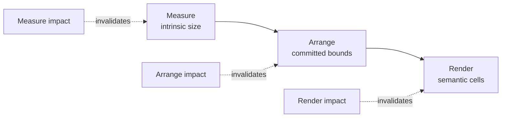
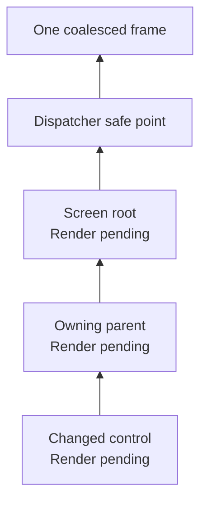
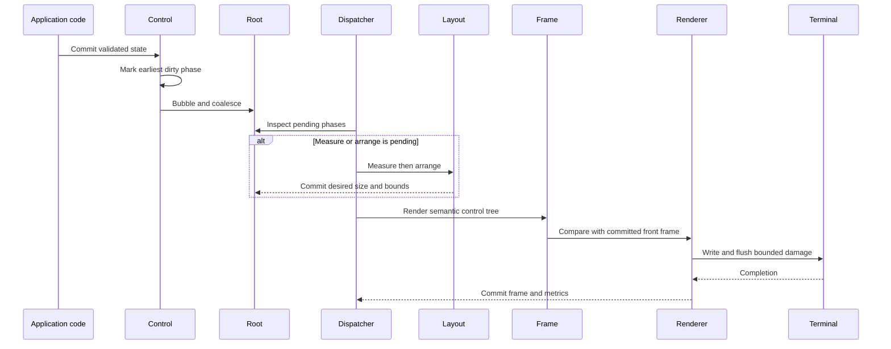

# Invalidation and UI updates

## Overview

SharpVision is a retained UI library. Application code changes control state;
it does not repaint cells or call a public refresh method. Each successful
mutation identifies the earliest UI phase whose previous result is no longer
valid. SharpVision coalesces that work, propagates it to the root, and
processes it on the owning dispatcher.

This page covers control-tree invalidation and update scheduling. The
[layout page](layout.md#overview) owns the measure and arrange algorithms, the
[runtime event loop](../architecture/runtime-event-loop.md#overview) owns
dispatcher ordering, and the
[rendering pipeline](../architecture/rendering-pipeline.md#overview) owns frame
construction, damage comparison, terminal output, and commit.

> [!NOTE] `Renderer.Invalidate()` has a different purpose from control
> invalidation. It marks the physical terminal baseline as unknown and forces a
> complete redraw; it does not request control measurement or arrangement.

## Phase dependency

`InvalidationImpact` names the earliest phase affected by a control change.
Later phases are included automatically, because each phase consumes the
results of the one before it.

| Impact    | Invalidated results                  | Typical cause                                      |
| --------- | ------------------------------------ | -------------------------------------------------- |
| `None`    | None                                 | Hit-test or nonvisual state with no layout effect. |
| `Render`  | Semantic cells.                      | Color, caption with unchanged geometry, or state.  |
| `Arrange` | Committed bounds and semantic cells. | Alignment or position within an unchanged measure. |
| `Measure` | Desired size, bounds, and cells.     | Content extent, padding, border, or size policy.   |

A property should choose the earliest impact that is truthful. Requesting
`Measure` when only cells changed is correct but wasteful; requesting `Render`
when the desired size changed can leave stale geometry on screen.

## Propagation and coalescing

Every control keeps track of its own pending phases. A new request expands to
its complete dependency set and bubbles up the ownership parent chain.
Repeating an already-pending request is a no-op, so several related mutations
end up as one root transaction.

Propagation is conservative: a parent becomes dirty when any of its owned
descendants needs work. The root therefore knows whether the application needs
layout, rendering, or neither, without the framework maintaining an unbounded
global work list.

During an active parent arrangement, a child that is remeasured for its final
finite slot may request arrangement. That request stays local, because the
parent commits the child's arrangement within the same transaction. Bubbling
the identical request back through the arranging ancestor would schedule
layout forever. All other measure, arrange, and render requests propagate
normally.

## Update cycle

The dispatcher processes pending work after input, resize, capability changes,
posted callbacks, and completed terminal writes. It also checks for pending
work before raising `Idle`.

If a frame write is already in flight, further invalidation sets a single
deferred render request. When the write completes, out-of-band protocol bytes
are processed first, then the newest pending UI work. This preserves the
runtime's single-writer guarantee without dropping mutations that happened
during asynchronous output.

There is no public `Refresh`, `Redraw`, or frame-pump API. Application authors
mutate controls on the dispatcher. A custom control uses one of the protected
seams — `SetProperty`, `NotifyPropertyChanged`,
`Invalidate(InvalidationImpact)`, or `InvalidateVisualState()` — depending on
whether it is committing a CLR property, publishing a coordinated mutation,
requesting phase work directly, or changing resolved visual state.

## Phase completion and retry

A phase clears its own pending flag when it starts. Work requested while that
phase is running stays pending for a later transaction instead of recursively
re-entering the phase. Direct measure, arrange, and render reentry is
rejected.

If measure, arrange, or control rendering throws, the failing phase is marked
pending again before the exception leaves the transaction, and later dependent
phases remain pending. The application error policy then decides whether the
session continues or stops; a failed pass is never recorded as a successful
update.

Terminal output has its own transactional boundary. The renderer commits its
front frame only after the complete write and flush succeed. A partial write,
a failed flush, a profile change, a size change, or an explicit terminal-state
invalidation discards trust in that baseline and forces a complete redraw on
the next frame. See
[terminal-state invalidation](../architecture/rendering-pipeline.md#commit-and-terminal-state-invalidation).

## Clean subtree reuse

For a render-only update with unchanged layout, the intended pipeline reuses
the last committed cells for render-clean subtrees and executes rendering only
for dirty branches. Reuse is valid only while cell geometry is unchanged;
after a measure or arrange, every affected branch renders at its newly
committed coordinates. Unicode cell ownership rules still repair any copied
boundary that would split a wide grapheme.

> [!IMPORTANT] **Implementation gap:** `Application` attaches the renderer's
> committed frame to render-only target frames, and `Canvas.CopyFromPrevious`
> safely copies complete cell regions. The current control traversal does not
> call that copy operation for clean subtrees, so every visited control redraws
> its semantic cells. Output remains correct, but render invalidation does not
> yet provide the intended per-subtree execution saving.

## Choosing an impact

Use the strongest row that applies to the complete observable change:

| Change                                                        | Impact    |
| ------------------------------------------------------------- | --------- |
| Text, glyph, or style can change desired cell width or height | `Measure` |
| Existing desired size is stable, but final placement changes  | `Arrange` |
| Geometry is stable and only semantic cells change             | `Render`  |
| No layout or cell output can change                           | `None`    |

Validation happens before state is mutated. Assigning an equivalent value
changes no state, raises no property notification, and requests no phase work.
For a real change, the new value is committed and invalidated before
`PropertyChanged` is raised, so observers see the new state together with the
correct pending work.

## Expected behavior

| Reader-visible guarantee | Observable evidence                                                                                                    |
| ------------------------ | ---------------------------------------------------------------------------------------------------------------------- |
| Dependency closure       | Measure implies arrange and render; arrange implies render.                                                            |
| Stable mutation          | Invalid values and equivalent assignments leave state and pending work unchanged.                                      |
| Bounded scheduling       | Repeated descendant requests coalesce at the root and an in-flight frame produces at most one deferred render request. |
| Deterministic ordering   | Layout commits before semantic rendering, and frame state commits only after terminal flush.                           |
| Failure recovery         | A failed phase remains pending; uncertain terminal state forces a complete redraw.                                     |

Control, layout, application, and renderer verification covers exact phase
selection, ancestor propagation, request coalescing, reentry rejection,
failure retry, resize, in-flight writes, and full-redraw recovery.
Render-clean subtree execution remains subject to the implementation gap
above.
