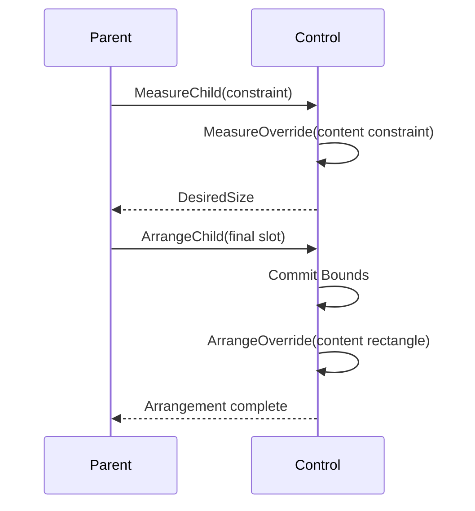

# Layout

## Layout contract

Layout uses measure then arrange over integer terminal cells. The
[box-model contract](box-model.md#box-model-contract) owns margin, border,
padding, content, painting, and hit-test boundaries. Layout resolves the
border-box size and position while preserving those shared ownership rules.

## Lengths

Lengths are fixed cells, percentage, automatic content size, or proportional
remaining space. Values reject negative, NaN, and infinite inputs. Minimum and
maximum constraints clamp the resolved border box and validate `min <= max`.

During unbounded measure, a percentage dimension behaves as automatic/intrinsic
for desired size. During arrange it resolves against the final containing
content box after border, padding, and reserved scrollbars. If the effective
constraint changes, content such as wrapped text is remeasured before final
arrangement.

## Primitive API

`Length.Auto`, `Length.Cells(int)`, `Length.Percent(double)`, and
`Length.Star(double)` are immutable requests. Fixed cells are non-negative
integers, percentages are finite values from 0 through 100, and proportional
weights are finite and positive. The public `Length(LengthKind, double)` constructor
applies the same validation, so callers cannot bypass factory invariants.

`Constraint` represents each measure axis as a nullable non-negative integer;
null is unbounded and zero is a real bound. `Thickness` stores physical
left/top/right/bottom cell edges, rejects negative or overflowing opposing
edges, and deflates `Size` or `Rect` with extents saturated at zero. Horizontal
and vertical alignment and visible/hidden/collapsed participation use the
corresponding enums in `SharpVision.Layout`.

## Passes and rounding

Measure receives available size and returns desired size without assigning
coordinates. Arrange receives the final slot, resolves deferred/percentage and
proportional lengths, and commits bounds. The
[invalidation contract](invalidation.md#phase-completion-and-retry) owns how
work requested during either pass remains pending for a later transaction;
direct layout reentry is rejected.

When an arranging parent remeasures a child against a final finite slot, the
child's resulting arrange request remains local because that parent commits the
new child arrangement in the same transaction. It does not propagate an
identical arrange request back through the active ancestor chain. Measure or
render invalidation, and arrange invalidation outside this exact parent-arrange
case, retain ordinary propagation.

`Engine.Layout(Control, Size)` runs both phases in a zero-origin viewport. It
validates dispatcher affinity, caches unchanged constraints and slots, and
rejects nested transactions. A changed viewport remeasures even when no property
is dirty.

`Control.MeasureOverride(Constraint)` receives the content-box constraint after
margin, the resolved border-box request, border thickness, and padding are
removed. It returns an intrinsic content size. The desired border-box size adds
border and padding back with saturated arithmetic.
`Control.ArrangeOverride(Rect)` receives the final content rectangle after the
border box is aligned and border then padding are deflated. Both extension
points run only for hidden or visible controls; collapsed controls desire zero,
commit empty bounds, and skip both callbacks.

An externally derived owner enters child layout only through
`MeasureChild(Control, Constraint)` and
`ArrangeChild(Control, Rect, ResolvedAxes)`. Both reject null or any control
that is not directly owned by the caller before entering the child's
transaction; arrange also rejects undefined axis flags. `Width`, `Height`, and
`Both` state which border-box dimensions the owner already resolved. Raw
measure, arrange, render, and pending-phase operations remain internal.

Fixed and percentage dimensions override alignment. Horizontal controls default
to `Left`, so an automatic width uses the measured desired size; applications
must opt into `HorizontalAlignment.Stretch` when a control should consume the
available row. An automatic dimension with stretch consumes the available axis;
otherwise automatic layout uses the measured desired size. Minimum and maximum
constraints are applied before the result is capped to the margin-deflated slot,
so tiny viewports always produce contained non-negative rectangles.

Layout surfaces such as `Stack`, `Grid`, `Dock`, and `Overlay` opt into
horizontal stretch because they own a viewport or shared slot. Their ordinary
child controls remain content-sized unless the surface's layout contract
explicitly resolves that child to its slot. `Border` uses the same base
reservation on every control, so intrinsic chrome neither double-reserves space
nor requires a wrapper surface.

Fractional percentage/proportional boundaries use cumulative edge rounding so
adjacent tracks share one boundary and the final track receives the remainder.

## Track allocation

`Tracks.Resolve` is the common integer allocator for Grid rows and columns.
Fixed and automatic tracks reserve their clamped requests first. Percentage
tracks use cumulative edges against the complete final axis rather than a
shrinking remainder. Star tracks then divide the non-negative remainder by
weight, redistributing cells when a maximum clips a share.

The convenience overload returns an array. The full overload accepts
`ReadOnlySpan<T>` inputs and caller-owned `Span<int>` output and performs no
managed allocation. It validates every length, intrinsic request, limit, and
destination size before writing output. During unbounded measure, percentage and
star tracks use their intrinsic automatic requests.

When bounded requests exceed the axis, percentage, automatic, fixed, then star
requests shrink in that order while respecting feasible minimums. If the sum of
minimums itself cannot fit, containment wins and extents shrink below minimums
instead of overflowing the terminal viewport.

`Tracks.Satisfy` expands a contiguous set of tracks for a spanning intrinsic
request. It distributes only the missing cells through cumulative integer edges,
so the final combined extent is exact.

## Panels

Every concrete [`Container`](../controls/container.md#container-contract)
defines both child layout passes. `Stack` uses the common track allocator along
its sequential axis and the base box model across it. Reverse order affects
geometry, rendering, and default focus traversal together. Setting `Border` on
any panel reserves the enabled edges before its panel-specific arrangement runs;
no wrapper is required for layout reservation.

`Grid` supports fixed, percent, auto, proportional tracks, spacing, spans, and
an implicit automatic track when definitions are empty. `Dock` consumes
remaining physical edges in child order. `Overlay` shares the content box for
unpositioned children and adds optional cell or percentage
`Left`/`Top`/`Right`/`Bottom` offsets plus stable z-order for rendering and hit
testing. Use Overlay positioning for diagrams, badges, and other deliberate
placement—not general responsive flow. Any panel can add validated border edges
through the complete `Border` composite without changing its child ownership
model.

`SharpVision.Terminal.Rendering.Canvas` is a frame-owned drawing API, not a
layout panel or `Container`. Custom controls draw through it in
`OnRenderContent`; it never owns child controls.

## Grow and shrink

Every [`Container`](../controls/container.md#container-contract) can size itself
to its content instead of its explicit `Width`/`Height`. `AutoSize` (default
`false`) sizes the border box to content plus its complete border-and-padding
inset on the enabled axis, overriding an explicit fixed or star length while
still honoring `MinWidth`/ `MaxWidth`/`MinHeight`/`MaxHeight`. `AutoSizeMode`
chooses how the fixed request participates once `AutoSize` is on:
`GrowAndShrink` (default) fits content exactly, growing or shrinking below an
explicit fixed-cell size; `GrowOnly` treats an explicit fixed-cell length as a
floor, so the container grows to fit larger content but never shrinks smaller
than the requested size. Both modes clamp the final result to `Min`/`Max` before
arrangement. Content extent and the combined inset use saturated arithmetic
before that clamp.

`AutoSize` and `AutoScroll` (see [Scrolling](scrolling.md)) compose along
independent axes of the same container. A determinate axis — one sized by an
explicit length rather than `AutoSize` — scrolls its content on overflow when
`AutoScroll` is enabled and that axis is selected by `ScrollBars`. An auto-sized
axis instead grows to fit its content up to `Max`; once content exceeds `Max`,
the axis stops growing, caps at that bound, and — if `AutoScroll` is enabled for
it — scrolls the remainder exactly like a determinate axis.

An `AutoScroll` viewport and its framework scrollbar rails are resolved inside
the border-and-padding-deflated content box. Bars never consume border or
padding cells, including when one automatic bar induces the other. A
theme-resolved `Border` change has `Measure` impact, so publishing a new
geometric theme value remeasures and rearranges this complete box model.

## Expected behavior

Cover every length combination, nested percentages, min/max, zero/tiny sizes,
margins/borders/padding, partial edges, saturated combined insets, alignment,
visibility, wrapping remeasure, theme-driven geometry, rounding sums, spans,
cache invalidation, resize, AutoSize, and AutoScroll overflow. Mounted cell
tests use distinct opaque parent and child backgrounds to prove all four margin
edges retain the parent surface and all four padding edges use the child
surface, both with and without an intervening border.

The base box-model suite also runs 10,000 fixed-seed combinations twice and
requires identical geometry, non-negative extents, and containment in the
saturated margin-deflated viewport.
