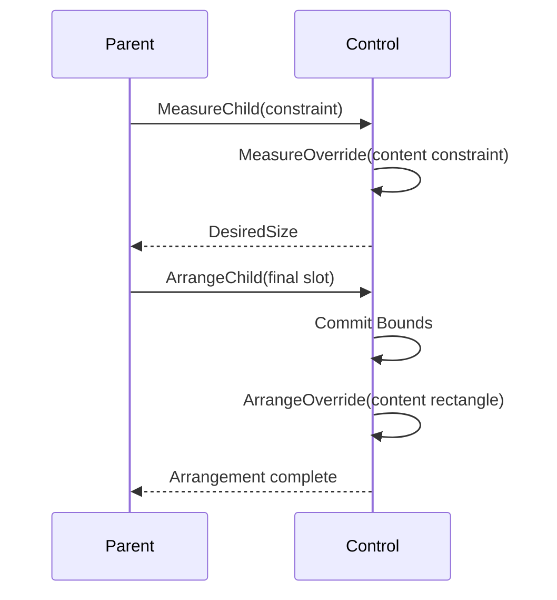

# Layout

## Overview

Layout runs a measure pass followed by an arrange pass, working entirely in
integer terminal cells. The [box model](box-model.md#overview) owns margin,
border, padding, content, painting, and hit-test boundaries; layout resolves the
border-box size and position while preserving those ownership rules.

## Lengths

A length is one of four requests: a fixed number of cells, a percentage, an
automatic (content-sized) dimension, or a proportional share of the remaining
space. Length values reject negative, NaN, and infinite inputs. Minimum and
maximum constraints clamp the resolved border box, and setting them validates
`min <= max`.

During an unbounded measure, a percentage dimension behaves like an automatic
dimension: the control reports its intrinsic desired size. During arrange, the
percentage resolves against the final containing content box, after border,
padding, and any reserved scrollbars are taken out. If that effective constraint
differs from the one used during measure, content such as wrapped text is
remeasured before it is finally arranged.

## Primitive API

`Length.Auto`, `Length.Cells(int)`, `Length.Percent(double)`, and
`Length.Star(double)` create immutable length requests. Fixed cell counts must
be non-negative integers, percentages must be finite values from 0 through 100,
and proportional weights must be finite and positive. The public
`Length(LengthKind, double)` constructor applies the same validation, so callers
cannot bypass the factory invariants.

`Constraint` describes one measure axis as a nullable non-negative integer: null
means the axis is unbounded, and zero is a real bound. `Thickness` stores
physical left/top/right/bottom cell edges, rejects negative edges and
opposing-edge sums that would overflow, and deflates a `Size` or `Rect` with the
resulting extents saturated at zero. Horizontal and vertical alignment and the
visible/hidden/collapsed participation modes use the corresponding enums in
`SharpVision.Layout`.

## Passes and rounding

Measure receives an available size and returns a desired size; it assigns no
coordinates. Arrange receives the final slot, resolves the deferred percentage
and proportional lengths, and commits bounds. Work requested while either pass
is running stays pending for a later transaction, as described in
[invalidation](invalidation.md#phase-completion-and-retry); attempting to
re-enter layout directly is rejected.

When an arranging parent remeasures a child against its final finite slot, the
child's resulting arrange request stays local to the child, because the parent
commits the new child arrangement within the same transaction. The request is
not propagated back up through the ancestor chain that is currently arranging.
Measure and render invalidation, and arrange invalidation outside this exact
parent-arrange case, propagate normally.

`LayoutEngine.Layout(Control, Size)` runs both phases in a zero-origin viewport.
It validates dispatcher affinity, caches results for unchanged constraints and
slots, and rejects nested transactions. A changed viewport triggers a remeasure
even when no property is dirty.

`ControlBase.MeasureOverride(Constraint)` receives the content-box constraint —
what remains after the margin, the resolved border-box request, the border
thickness, and the padding are removed — and returns an intrinsic content size.
The framework then adds border and padding back, with saturated arithmetic, to
produce the desired border-box size. `ControlBase.ArrangeOverride(Rect)`
receives the final content rectangle, computed by aligning the border box and
then deflating it by border and padding. Both extension points run only for
hidden or visible controls; a collapsed control desires zero, commits empty
bounds, and skips both callbacks.

An externally derived owner drives child layout only through
`MeasureChild(Control, Constraint)` and
`ArrangeChild(Control, Rect, ResolvedAxes)`. Both reject a null argument, and
both reject any control that the caller does not directly own, before entering
the child's transaction; arrange additionally rejects undefined axis flags. The
`ResolvedAxes` values `Width`, `Height`, and `Both` tell the child which
border-box dimensions the owner has already resolved. Raw measure, arrange,
render, and pending-phase operations stay internal.

Fixed and percentage dimensions override alignment. Controls default to
`HorizontalAlignment.Left`, so an automatic width uses the measured desired
size; an application opts into `HorizontalAlignment.Stretch` when a control
should take the whole available row. An automatic dimension combined with
stretch consumes the available axis; otherwise an automatic dimension uses the
measured desired size. Minimum and maximum constraints are applied before the
result is capped to the margin-deflated slot, so even tiny viewports produce
contained, non-negative rectangles.

Layout surfaces such as `Stack`, `Grid`, `Dock`, and `Overlay` opt into
horizontal stretch because each owns a viewport or a shared slot. Their ordinary
child controls stay content-sized unless the surface's layout rules explicitly
resolve a child to its slot. `Border` uses the same base reservation on every
control, so intrinsic chrome never double-reserves space and never requires a
wrapper surface.

Fractional percentage and proportional boundaries are rounded cumulatively at
the edges, so adjacent tracks share a single boundary and the final track
receives the remainder.

## Track allocation

`Tracks.Resolve` is the shared integer allocator for Grid rows and columns.
Fixed and automatic tracks reserve their clamped requests first. Percentage
tracks resolve against cumulative edges over the complete final axis, not
against a shrinking remainder. Star tracks then divide the non-negative
remainder by weight, redistributing cells when a maximum clips one track's
share.

The convenience overload returns an array. The full overload accepts
`ReadOnlySpan<T>` inputs and writes into a caller-owned `Span<int>`, so it
performs no managed allocation. It validates every length, intrinsic request,
limit, and the destination size before writing any output. During an unbounded
measure, percentage and star tracks fall back to their intrinsic automatic
requests.

When the bounded requests exceed the axis, tracks shrink in a fixed order —
percentage, automatic, fixed, then star — while respecting whatever minimums can
still be satisfied. If even the sum of the minimums cannot fit, containment
wins: extents shrink below their minimums rather than overflowing the terminal
viewport.

`Tracks.Satisfy` expands a contiguous set of tracks to fit a spanning intrinsic
request. It distributes only the missing cells, using cumulative integer edges,
so the final combined extent is exact.

## Panels

Every concrete [`Container`](../controls/container.md#overview) defines both
child layout passes. `Stack` uses the common track allocator along its
sequential axis and the base box model across it. Reversing the order affects
geometry, rendering, and default focus traversal together. Setting `Border` on
any panel reserves the enabled edges before the panel-specific arrangement runs,
so no wrapper control is needed for layout reservation.

`Grid` supports fixed, percentage, automatic, and proportional tracks, plus
spacing, spans, and an implicit automatic track when no definitions are given.
`Dock` consumes remaining physical edges in child order. `Overlay` shares its
content box among unpositioned children and adds optional cell or percentage
`Left`/`Top`/`Right`/`Bottom` offsets, with a stable z-order used for both
rendering and hit testing. Use Overlay positioning for diagrams, badges, and
other deliberate placement — not for general responsive flow. Any panel can add
validated border edges through the complete `Border` composite without changing
its child ownership model.

`SharpVision.Terminal.Rendering.Canvas` is a frame-owned drawing API, not a
layout panel or a `Container`. Custom controls draw through it in
`OnRenderContent`; it never owns child controls.

## Grow and shrink

Every [`Container`](../controls/container.md#overview) can size itself to its
content instead of its explicit `Width`/`Height`. `AutoSize` (default `false`)
sizes the border box to the content plus the complete border-and-padding inset
on each enabled axis. It overrides an explicit fixed or star length while still
honoring `MinWidth`/`MaxWidth`/`MinHeight`/`MaxHeight`. `AutoSizeMode` decides
how an explicit fixed request participates once `AutoSize` is on:
`GrowAndShrink` (the default) fits the content exactly, growing or shrinking
past an explicit fixed-cell size, while `GrowOnly` treats an explicit fixed-cell
length as a floor — the container grows to fit larger content but never shrinks
below the requested size. Both modes clamp the final result to `Min`/`Max`
before arrangement, and the content extent plus combined inset is computed with
saturated arithmetic before that clamp.

`AutoSize` and `AutoScroll` (see [Scrolling](scrolling.md)) compose along
independent axes of the same container. A determinate axis — one sized by an
explicit length rather than `AutoSize` — scrolls its content on overflow when
`AutoScroll` is enabled and `ScrollBars` selects that axis. An auto-sized axis
instead grows to fit its content up to `Max`; once the content exceeds `Max`,
the axis stops growing, caps at that bound, and — if `AutoScroll` is enabled for
it — scrolls the remainder exactly like a determinate axis.

An `AutoScroll` viewport and its framework scrollbar rails are resolved inside
the border-and-padding-deflated content box. Bars never consume border or
padding cells, even when one automatic bar induces the other. A theme-resolved
`Border` change has `Measure` impact, so publishing a theme with new geometry
remeasures and rearranges this complete box model.

## Expected behavior

Layout behaves consistently across every length combination, nested percentages,
min/max constraints, zero and tiny sizes, margins, borders, padding, partial
border edges, saturated combined insets, alignment, visibility changes, wrapping
remeasure, theme-driven geometry, rounding sums, spans, cache invalidation,
resize, `AutoSize`, and `AutoScroll` overflow. Mounted cell evidence uses
distinct opaque parent and child backgrounds to show that all four margin edges
keep the parent's surface and all four padding edges use the child's surface,
both with and without an intervening border.

The base box-model suite also runs 10,000 fixed-seed combinations twice and
requires identical geometry on both runs, non-negative extents, and containment
within the saturated margin-deflated viewport.
