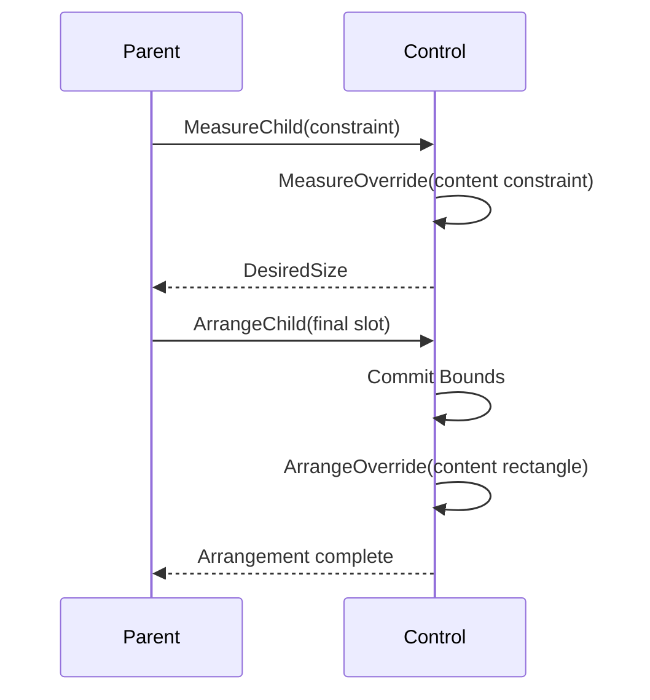

# Layout

## Overview

Layout runs a measure pass followed by an arrange pass, working entirely in
integer terminal cells. The [box model](box-model.md#overview) owns margin,
border, padding, content, painting, and hit-test boundaries; layout resolves the
border-box size and position while preserving those ownership rules.

## Lengths

A dimension length is one of four requests: a fixed number of cells, a
percentage, an automatic (content-sized) dimension, or a proportional share of
the remaining space. Length values reject negative, NaN, and infinite inputs.
Control minimums accept `Cells` and `Percent`; nullable maximums accept those
same two kinds, with null representing no authored ceiling. `Auto` and `Star`
limits are rejected because their resolution would be circular.

During an unbounded measure, a percentage dimension behaves like an automatic
dimension: the control reports its intrinsic desired size. During arrange, the
percentage resolves against the final containing content box, after border,
padding, and any reserved scrollbars are taken out. If that effective constraint
differs from the one used during measure, content such as wrapped text is
remeasured before it is finally arranged.

Percentage limits resolve from that same containing axis on every pass. Under an
unbounded measure axis, a percentage minimum contributes zero and a percentage
maximum contributes no ceiling; the intrinsic result is preserved until a finite
containing extent exists. Comparable limits written in the same kind are
validated when assigned. Differently written limits cannot be compared until
layout: if they resolve to minimum greater than maximum, the minimum wins
deterministically, followed by the final slot containment clamp. A parent that
pre-resolves a child's axis carries the original containing extent through
arrange, so Dock, Stack, Overlay, Grid, Wrap, and popup placement never apply a
percentage a second time to the already-clipped child slot.

## Primitive API

`Length.Auto`, `Length.Cells(int)`, `Length.Percent(double)`, and
`Length.Star(double)` create immutable length requests. Fixed cell counts must
be non-negative integers, percentages must be finite values from 0 through 100,
and proportional weights must be finite and positive. The public
`Length(LengthKind, double)` constructor applies the same validation, so callers
cannot bypass the factory invariants.

`Constraint` describes one measure axis as a nullable non-negative integer: null
means the axis is unbounded, and zero is a real bound. `Thickness` stores
physical left/top/right/bottom cell edges, rejects negative edges and
opposing-edge sums that would overflow, and deflates a `Size` or `Rect` with the
resulting extents saturated at zero. Horizontal and vertical alignment and the
visible/hidden/collapsed participation modes use the corresponding enums in
`SharpVision.Layout`.

Relative control coordinates are composed into absolute coordinates with
saturating integer arithmetic. A child, glyph, hit target, or caret behind a
small clip therefore remains ordered against a parent whose valid logical
rectangle reaches either integer boundary; it cannot wrap into the opposite side
of the coordinate space.

`LayoutMath` owns this cell-arithmetic policy. Signed addition, subtraction,
negation, and multiplication saturate at the nearest integer boundary. Sequence
sums apply saturation after each value from left to right; callers must not
assume saturated addition is associative. Gap extents use
`spacing * (count - 1)`, return zero for zero or one item, saturate before
overflow, and then honor an optional non-negative layout bound.

## Passes and rounding

Measure receives an available size and returns a desired size; it assigns no
coordinates. Arrange receives the final slot, resolves the deferred percentage
and proportional lengths, and commits bounds. Work requested while either pass
is running stays pending for a later transaction, as described in
[invalidation](invalidation.md#phase-completion-and-retry); attempting to
re-enter layout directly is rejected.

When an arranging parent remeasures a child against its final finite slot, the
child's resulting arrange request stays local to the child, because the parent
commits the new child arrangement within the same transaction. The request is
not propagated back up through the ancestor chain that is currently arranging.
Measure and render invalidation, and arrange invalidation outside this exact
parent-arrange case, propagate normally.

`LayoutEngine.Layout(Control, Size)` runs both phases in a zero-origin viewport.
It validates dispatcher affinity, caches results for unchanged constraints and
slots, and rejects nested transactions. A changed viewport triggers a remeasure
even when no property is dirty.

`ControlBase.MeasureOverride(Constraint)` receives the content-box constraint —
what remains after the margin, the resolved border-box request, the border
thickness, and the padding are removed — and returns an intrinsic content size.
The framework then adds border and padding back, with saturated arithmetic, to
produce the desired border-box size. `ControlBase.ArrangeOverride(Rect)`
receives the final content rectangle, computed by aligning the border box and
then deflating it by border and padding. Both extension points run only for
hidden or visible controls; a collapsed control desires zero, commits empty
bounds, and skips both callbacks.

After an owner's arrange callback succeeds, the sealed framework pipeline also
commits empty bounds for every directly owned collapsed child. An owner may
therefore skip collapsed children while applying its placement policy; custom
containers and retained-content controls must not duplicate that cleanup. A
failed owner callback leaves the arrange phase pending and defers the cleanup to
the successful retry.

An externally derived owner drives child layout only through
`MeasureChild(Control, Constraint)` and
`ArrangeChild(Control, Rect, ResolvedAxes)`. Both reject a null argument, and
both reject any control that the caller does not directly own, before entering
the child's transaction; arrange additionally rejects undefined axis flags. The
`ResolvedAxes` values `Width`, `Height`, and `Both` tell the child which
border-box dimensions the owner has already resolved. Raw measure, arrange,
render, and pending-phase operations stay internal.

Fixed and percentage dimensions override alignment. Controls default to
`HorizontalAlignment.Left`, so an automatic width uses the measured desired
size; an application opts into `HorizontalAlignment.Stretch` when a control
should take the whole available row. An automatic dimension combined with
stretch consumes the available axis; otherwise an automatic dimension uses the
measured desired size. Minimum and maximum constraints are applied before the
result is capped to the margin-deflated slot, so even tiny viewports produce
contained, non-negative rectangles.

Caller-facing layout panels use `Container.InitializePanelPresentation()` to
apply horizontal stretch because each owns a viewport or shared slot, and to
enable direct border and shadow authoring. `Stack`, `Grid`, `Dock`, `Overlay`,
`SplitPane`, `Wrap`, and externally derived panels can therefore share one base
initializer without changing the defaults of private retained hosts. Their
ordinary child controls stay content-sized unless the surface's layout rules
explicitly resolve a child to its slot. `Border` uses the same base reservation
on every control, so intrinsic chrome never double-reserves space and never
requires a wrapper surface.

Fractional percentage and proportional boundaries are rounded cumulatively at
the edges, so adjacent tracks share a single boundary and the final track
receives the remainder.

## Track allocation

`Tracks.Resolve` is the shared integer allocator for Grid rows and columns.
Fixed and automatic tracks reserve their clamped requests first. Track minima
and maxima accept `Length.Cells` or `Length.Percent`; a null maximum is
unbounded. Relative limits resolve against the same percentage base as the track
request. In an unbounded measure with no explicit base, a relative minimum
resolves to zero and a relative maximum remains unbounded. If limits written in
different units cross after resolution, the minimum wins. Percentage tracks
resolve against cumulative edges over the complete final axis, not against a
shrinking remainder. Star tracks then divide the non-negative remainder by
weight, redistributing cells when a maximum clips one track's share.

"The complete final axis" a Percent track resolves against is not the same axis
for every caller, and this divergence is intentional rather than an oversight to
unify. `Tracks.Resolve` accepts an optional `percentBase` distinct from its
allocation ceiling for exactly this reason. `Grid.Resolve` and
`TablePresenter.MeasureCells` both reserve spacing out of the incoming axis
before allocating and pass no `percentBase`, so their Percent tracks resolve
against that already spacing-reduced area. `Stack` passes its pre-spacing axis
as an explicit `percentBase` (see
[Stack](../controls/layout/stack.md#behavior)), so its Percent tracks resolve
against the complete axis instead. A caller comparing the two panels with
identical `Percent(50)` participants and non-zero spacing sees Grid's
percentages come out slightly smaller than Stack's for this reason.

The convenience overload returns an array. The full overloads accept
`ReadOnlySpan<T>` inputs and write into a caller-owned `Span<int>`. Integer
limit spans accept bounds already resolved by a caller such as `Stack`; typed
`Length`/`Length?` limit spans resolve responsive track definitions. Both
validate every length, intrinsic request, limit, percentage base, and the
destination size before writing any output. During an unbounded measure,
percentage and star tracks fall back to their intrinsic automatic requests.

When the bounded requests exceed the axis, tracks shrink in a fixed order —
percentage, automatic, fixed, then star — while respecting whatever minimums can
still be satisfied. If even the sum of the minimums cannot fit, containment
wins: extents shrink below their minimums rather than overflowing the terminal
viewport.

`Tracks.Satisfy` expands a contiguous set of tracks to fit a spanning intrinsic
request. It distributes only the missing cells, using cumulative integer edges,
so the final combined extent is exact.

## Panels

Every concrete [`Container`](../controls/container.md#overview) defines both
child layout passes. `Wrap` packs direct children in source order into rows or
columns, breaking only when the next margin-inclusive child cannot fit in its
finite primary lane. Its percentage and proportional children measure against
that full lane; a primary scroll axis is unbounded and therefore forms one
scrollable line or column rather than wrapping at the viewport. `Stack` uses the
common track allocator along its sequential axis and the base box model across
it. Reversing the order affects geometry, rendering, and default focus traversal
together. Setting `Border` on any panel reserves the enabled edges before the
panel-specific arrangement runs, so no wrapper control is needed for layout
reservation.

`Grid` supports fixed, percentage, automatic, and proportional tracks, plus
spacing, spans, and an implicit automatic track when no definitions are given.
`Dock` consumes remaining physical edges in child order. `Overlay` shares its
content box among unpositioned children and adds optional cell or percentage
`Left`/`Top`/`Right`/`Bottom` offsets, with a stable z-order used for both
rendering and hit testing. Use Overlay positioning for diagrams, badges, and
other deliberate placement — not for general responsive flow. Any panel can add
validated border edges through the complete `Border` composite without changing
its child ownership model.

[`SplitPane`](../controls/layout/split-pane.md#overview) owns at most two panes
and reserves one divider cell between them. Its fixed or percentage leading
request and both panes' limits resolve against the divider-excluded content-axis
pool; the same allocation maps to left/right or top/bottom geometry. The divider
supplies focusable keyboard and captured-pointer resizing without replacing
descendant input routing. When `AutoScroll` arms the split axis, each measure
pass resolves percentage requests against the candidate visible viewport minus
the divider cell while the trailing proportional pane retains its intrinsic
extent. Automatic scrollbar feedback repeats that resolution against the
narrowed candidate viewport before committing the final extent and rail cells.

`SharpVision.Terminal.Rendering.TerminalCanvas` is a frame-owned drawing API,
not a layout panel or a `Container`. Custom controls draw through it in
`OnRenderContent`; it never owns child controls.

Built-in panel attached properties share weak per-control storage. A changed
value invalidates only a current parent of the panel type that consumes it;
detached controls and controls under another panel retain the value without
dirtying that unrelated owner. Reparenting changes the eligible invalidation
target immediately. Validation and dispatcher-affine mutability checks finish
before storage changes, and equivalent writes are silent.

## Grow and shrink

Every [`Container`](../controls/container.md#overview) can size itself to its
content instead of its explicit `Width`/`Height`. `AutoSize` (default `false`)
sizes the border box to the content plus the complete border-and-padding inset
on each enabled axis. It overrides an explicit fixed or star length while still
honoring `MinWidth`/`MaxWidth`/`MinHeight`/`MaxHeight`. `AutoSizeMode` decides
how an explicit fixed request participates once `AutoSize` is on. Both modes
clamp the final result to `Min`/`Max` before arrangement, and the content extent
plus combined inset is computed with saturated arithmetic before that clamp.

| `AutoSize` | `AutoSizeMode`            | Axis `Length.Kind`          | Resolved axis extent (before `Min`/`Max` clamp)                                    |
| ---------- | ------------------------- | --------------------------- | ---------------------------------------------------------------------------------- |
| `false`    | —                         | any                         | Standard length resolution; `AutoSizeMode` has no effect.                          |
| `true`     | `GrowAndShrink` (default) | any                         | `content extent + border/padding inset`; any explicit length is ignored.           |
| `true`     | `GrowOnly`                | `Cells`                     | `max(content extent + inset, explicit cell count)` — the explicit size is a floor. |
| `true`     | `GrowOnly`                | `Percent` / `Star` / `Auto` | Same as `GrowAndShrink` — there is no explicit cell count to floor against.        |

`AutoSize` and `AutoScroll` (see [Scrolling](scrolling.md)) compose along
independent axes of the same container — an axis is either determinate (sized by
an explicit length) or auto-sized (grows to fit content), and either the
container's `AutoSize` property or a per-axis `Length.Auto` request puts an axis
into the auto-sized case.

| Axis sizing                                                     | `AutoScroll` enabled and `ScrollBars` selects this axis | Resulting behavior                                                                                  |
| --------------------------------------------------------------- | ------------------------------------------------------- | --------------------------------------------------------------------------------------------------- |
| Determinate (explicit `Cells`/`Percent`/`Star`, `AutoSize` off) | Yes                                                     | Scrolls content on overflow; the resolved axis length never changes.                                |
| Determinate                                                     | No                                                      | Overflow is not scrolled on this axis.                                                              |
| Auto-sized (`AutoSize` on, or this axis's `Length` is `Auto`)   | Yes                                                     | Grows to fit content up to `Max`; once content exceeds `Max`, caps there and scrolls the remainder. |
| Auto-sized                                                      | No                                                      | Grows to fit content up to `Max`; content past `Max` is not reachable.                              |

"Auto-sized" covers both the container's `AutoSize` property and a plain
per-axis `Length.Auto` request — both are treated identically for
growth-then-scroll purposes.

`AutoSize` measures content unbounded first to discover its natural size. A
finite clamp then remeasures both axes: a narrower width can reflow height, and
a shorter height can make a vertical Wrap create columns. When `AutoScroll`
selects an axis, that correction keeps the selected axis unbounded for extent
discovery while carrying the finite candidate viewport as the percentage base.
The scrollbar resolver then remeasures each newly reserved candidate viewport,
at most once per rail, before committing the final extent and physical rail
cells. A rail grows its own physical axis when limits permit; if a maximum
prevents growth, it instead narrows the viewport and reflows content against
that smaller base. The narrowed candidate is probed after its resolved limits
apply, so it can induce the opposite automatic rail; that opposite rail still
grows its own unconstrained physical axis when available.

An `AutoScroll` viewport and its framework scrollbar rails are resolved inside
the border-and-padding-deflated content box. Bars never consume border or
padding cells, even when one automatic bar induces the other. A theme-resolved
`Border` change has `Measure` impact, so publishing a theme with new geometry
remeasures and rearranges this complete box model.

A retained projection whose rows depend on the final viewport width cannot use
the horizontally unbounded content probe as its settled width. The shared
width-dependent viewport transaction therefore captures the owner's exact
measure constraint, performs the initial arrange, rebuilds against the actual
scrollbar-aware width, and synchronously remeasures and rearranges until the
projection width matches. The loop is bounded to four rebuilds and either
settles completely or fails deterministically; it never returns a knowingly
transitional extent or schedules a redundant repair frame.

## Expected behavior

Layout behaves consistently across every length combination, nested percentages,
min/max constraints, zero and tiny sizes, margins, borders, padding, partial
border edges, saturated combined insets, alignment, visibility changes, wrapping
remeasure, theme-driven geometry, rounding sums, spans, cache invalidation,
resize, `AutoSize`, and `AutoScroll` overflow. Mounted cell evidence uses
distinct opaque parent and child backgrounds to show that all four margin edges
keep the parent's surface and all four padding edges use the child's surface,
both with and without an intervening border.

The base box-model suite also runs 10,000 fixed-seed combinations twice and
requires identical geometry on both runs, non-negative extents, and containment
within the saturated margin-deflated viewport.
