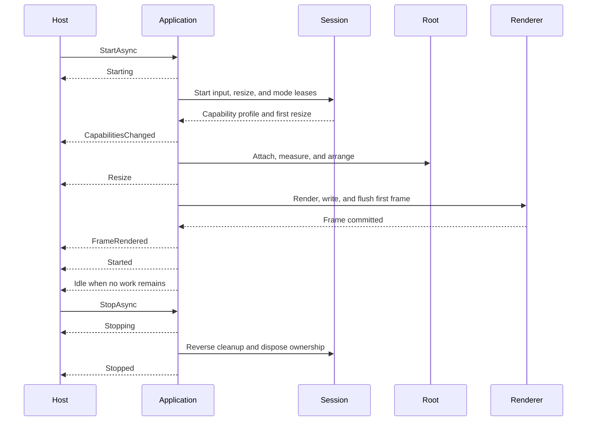

# Lifecycle and runtime events

## Overview

The `Application` events are `Starting`, `Started`, `Stopping`, `Stopped`,
`Idle`, `UnhandledException`, `FrameRendered`, `Resize`, `Diagnostic`,
`ResponseReceived`, `PaletteResponseReceived`, `MetricsResponseReceived`,
`StatusResponseReceived`, `CapabilityResponseReceived`, and
`CapabilitiesChanged`. Terminal key, text, pointer, paste, and focus values
enter the control tree through typed routed events. Session closure and faults
drive shutdown instead of leaking terminal callbacks through the UI API.

Every `FloatingSurfaceBase` first raises `CloseRequested`, a pre-commit veto
hook (`SurfaceCloseRequestedEventArgs.Cancel`) that leaves the surface untouched
and skips `Closing`/`Closed` entirely when set — both the shared `CloseSurface`
engine (the whole `Popup` family, and `Dialog<TResult>`'s typed completion) and
Window's own close affordance, `CloseOnEscape`, and modal dismiss raise it
through the same `FloatingSurfaceBase.RaiseCloseRequested` helper. `Popup` then
publishes `Closing` and `Closed`. `Window` publishes `Closing` and, by default,
accepts collapse. With a positive `FadeOutDuration`, Popup and Window retain
their family state, bounds, focus, and modality while the shared surface becomes
visually absent; cleanup and `Closed` occur at progress zero. A `Closing`
handler that itself changes Window visibility takes responsibility for the
outcome instead — if it leaves the Window visible and presented, `Closed` is
suppressed and no exit starts.

> [!WARNING]
>
> Changing a Window's visibility directly performs the cleanup without
> publishing `CloseRequested`, `Closing`, or `Closed`. A handler guarding
> unsaved work on those events is silently skipped when code collapses the
> Window through `Visibility` instead of requesting a close. Window's three
> close entry points route through the shared `CloseSurface` engine — see
> [floating-surfaces.md](floating-surfaces.md#shared-lifecycle). Modal scopes
> publish `DismissRequested` and one committed `Exited` notification under the
> [modal lifetime contract](modality.md#nested-scopes-and-lifetime).

## Ordering

`Starting` fires before terminal modes are exposed to controls. `Started` fires
after the initial capabilities, root layout, and first committed frame. The
cancellable `Stopping` request occurs once, and `Stopped` fires after cleanup
attempts and pending invocation completion.

Four terminal paths skip `Stopping` entirely and raise only `Stopped`: a
`Starting` handler that throws, disposing an application that was never started,
a process signal that lands before the run begins, and a run token already
cancelled at the first await. All four mean the application never ran, so there
is no running state for a handler to veto — and a `Stopping` raised there would
arrive after `Stopped`, on a tree that has already been disposed. `Stopped` is
therefore the event to hook for teardown that must run on every path; `Stopping`
is specifically the cancellable request to stop something that is currently
running.

> [!NOTE]
>
> The cancellation token passed to `StopAsync` cancels only the caller's
> observation, never the stop itself. The stop request is queued without the
> token, so an already-cancelled token throws `OperationCanceledException` at
> the caller while shutdown proceeds to completion regardless.

A `Starting`, `Started`, or `FrameRendered` handler that throws never skips the
state transition behind it. The exception is reported through
`UnhandledException` — see
[error-handling.md](../architecture/error-handling.md) — and the application
continues to the next transition either way. A `Stopping` handler's exception
takes a different channel: it is recorded into `Failure` and
`LastCleanupException` directly, without raising `UnhandledException`, because
transport ordering can no longer host an interactive policy decision once
shutdown has begun.

> [!NOTE]
>
> Marking an `UnhandledException` handled suppresses only the forced stop — it
> does not erase the failure. `Failure` is recorded before the event raises and
> is write-once, so the application's completion still faults at teardown and a
> console host still reports `Failed`, even for a handled exception.

The five response events are dispatcher-affine and preserve their mutual
transport order across numeric, palette, metrics, DECRQSS, and XTGETTCAP
records. Typed DCS records received during startup negotiation stay queued
behind the initial capability publication and then dispatch in their original
order; matched, unsolicited, duplicate, and late classifications do not suppress
them. `StatusResponseEventArgs` rejects an empty status sentinel, and
`CapabilityResponseEventArgs` rejects null. Both expose application-owned data
that remains valid after parser callbacks return and the session read buffer is
reused. The
[runtime routing contract](../protocols/runtime-routing.md#inbound-consumption-surface)
owns the complete inbound surface.

Initial root attachment is one staged ownership publication. The application
first commits the dispatcher, Unicode policy, and theme context, installs the
focus, pointer-capture, and modality managers across the tree, and only then
invokes the control `OnAttached` callbacks. A callback can therefore use the
protected focus and capture helpers immediately, enter a modal scope through the
application service, and observe every sibling with the same complete inherited
context. The application root supplied by the host must be both detached and
unowned.

Runtime insertion, removal, replacement, and disposal use the
[owned-control transaction](../controls/control.md#children-and-ownership).
Removal first performs guarded availability cleanup against the still-coherent
old tree: focus is released, capture state clears before the cancellation
callbacks run, and active modal scopes remove unavailable included roots or
unwind from an unavailable primary root before `OnUnavailable`. Disposing a
control that owns focus, capture, or modality may perform the corresponding root
cleanup after `OnUnavailable`. Membership, parent, dispatcher, Unicode, theme,
and manager context then commit as one new tree. Parent, theme, detached, and
attached notifications publish from committed state, and the slot impact is
invalidated exactly once before the slot notification. A callback failure cannot
roll the tree back or suppress the later cleanup; an unexpected earlier failure
still requests invalidation from the transaction's `finally` path, and the first
failure is rethrown afterward. Direct child disposal uses only
`ReleaseReason.Disposed`, even though clearing the attached context still
publishes the normal `OnDetached` lifecycle hook.

Resize follows the ordering in the
[runtime event loop](../architecture/runtime-event-loop.md#resize-ordering).
`FrameRendered` reports only a completed transport write and its damage, byte,
and fallback metrics. Strict fallback promotion therefore happens after this
event records the committed lower-fidelity frame. Failed frames produce
diagnostics and force invalidation instead.

`Idle` fires once per transition into a state with no ready or pending work,
after input, timer callbacks, layout, and rendering, directly before the loop
waits. `DispatcherTimer` posts coalesced ordinary dispatcher work and never
emulates ticks by repeatedly invoking idle callbacks. A tick that invalidates
rendering is followed by the normal render and frame-completion order before the
next application idle transition.

The dispatcher primitive enforces the empty ready/pending transition and the
handler-posted-work rule. `Application` connects terminal input, layout, and
renderer pending leases to that primitive. A render holds one pending lease
until its completion callback runs on the dispatcher, so `Idle` can never
precede flush, `FrameRendered`, or `Started`.

The terminal `Runtime.Session` supplies ordered resize, input, closure, and
fault records plus reversible mode ownership. It does not raise the application
starting, started, stopping, stopped, frame-rendered, or `Idle` events; the
application dispatcher owns those callbacks. This separation keeps transport
waits from masquerading as application idleness.

Zero-cell dimensions are delivered as a valid suspended `Dimensions` value.
Positive cell and pixel dimensions derive `Geometry.CellMetrics` only when both
axes produce a positive cell size. `Application` coalesces those terminal
records into committed layout and the public resize event ordering described
above.

## Expected behavior

The exact startup and shutdown, resize, timer, frame, exception, and idle
orderings hold as described, including under cancellation, handler exceptions,
work queued from event handlers, timer-driven invalidation, invalidation from
resize handlers, transport failure, repeated stop requests, modal unwind with
exit-callback failure, and fake waits that never spin. The five response events
keep their mutual transport order, including queued startup DCS records, and
their values remain owned and valid after the transport buffer is reused.
