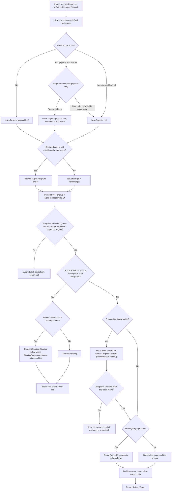

# Modality

## Overview

Modality limits every interactive route to one logical plane while leaving the
retained control tree and visual layers unchanged. A modal plane consists of one
primary root, any explicitly included roots, and all descendants reached through
owned `ControlBase.Parent` ancestry. While a scope is active, background key,
text, paste, focus, pointer, hover, pressed-state, and capture interaction is
blocked.

A modal scope is one entry on the application-owned stack. The youngest scope is
the active one; older scopes stay suspended until the younger scopes exit. Input
outside the active plane is always consumed. Depending on the scope's policy it
is either ignored or turned into a dismissal request, and a dismissing input is
never replayed to the newly exposed background.

## Public model and validation

`Application.Modality` exposes the application's `ModalityManager` once the
first resize has attached the control tree. Reading it earlier throws
`InvalidOperationException`. Enter an arbitrary plane on the dispatcher:

```csharp
var scope = application.Modality.Enter(
    dialog,
    OutsideInteraction.Ignore,
    initialFocus: firstField);
```

`Enter` defaults to `OutsideInteraction.Ignore` and returns a disposable
`ModalScope`. The scope exposes its primary `Root`, its `OutsideInteraction`
policy, and `IsActive`. `DismissRequested` reports qualifying outside input,
`Exited` runs once after the scope commits inactive, and `Include(ControlBase)`
adds another root to the plane. `ModalityManager.Active` exposes only the
youngest scope, not a mutable stack.

`Enter` and `Include` reject null, detached, disposed, foreign, hidden,
collapsed, and disabled roots before any observable mutation.
`OutsideInteraction` must be the defined `Ignore` or `Dismiss` value. An
explicit `initialFocus` must be an eligible descendant of the primary root.
Every call that mutates manager or scope state is dispatcher-affine.

An unavailable-callback transaction also guards the subtree whose detach,
disposal, visibility, or enabled-state change is in progress. `Enter` and
`Include` reject that subtree and every descendant of it, even if a callback
temporarily reattaches, shows, or enables it. Explicit initial focus inside the
guarded subtree is invalid, and automatic initial-focus discovery skips it. The
guard ends together with the unavailable transaction; unrelated roots, and an
ancestor plane that contains the guarded subtree, remain eligible under the
normal tree, availability, and overlap rules.

## Plane membership and ownership

Every owned descendant of a plane root participates automatically, including
content slots, item hosts, composite parts, popup slots, and ordinary container
children. Modality never assumes that descendants appear in
`Container.Children`.

Every root added through `scope.Include(root)` must be disjoint from every plane
root on the active stack: an exact duplicate, an ancestor of an existing root,
or a descendant already covered by an existing root is rejected. `Enter` follows
a different stack rule: it rejects an exact duplicate of an active root but
permits a younger scope rooted at a child inside its suspended parent plane. A
menu opened inside a modal window is the ordinary example. After a root joins
the plane, the retained physical pointer cell is immediately re-hit-tested, so
stationary hover and enter/exit state match the expanded plane without waiting
for another terminal record.

The application publishes one modality manager through the same staged ownership
attachment as focus and capture. A child inserted at runtime inherits it, and
detaching clears it along with the rest of the committed ownership context.

## Modal route boundaries

Without an active scope, routed input previews from the application root to the
target and bubbles from the target back to the application root. With an active
scope, the matching plane root becomes the route boundary: preview begins there
and bubble ends there. Ancestors outside the plane observe neither handlers nor
default behavior.

`Router.Route` enforces this boundary even for direct callers. Routing to a
blocked target is a contract violation and throws. A route captures its ancestry
before preview begins, so entering or exiting a scope from a handler affects the
next input record and never rewrites the route already in progress.

## Keyboard, text, and paste

Key and terminal-focus input targets the eligible focused control. If the active
plane has no in-plane focus, it targets the primary root instead, so dialog and
menu defaults remain reachable. Text and paste require an eligible focused
recipient; without one they are ignored and never fall through to a background
focus target.

Modal Control+C, Control+X, and Control+V processing runs after the key target,
modal boundary, and ancestry are captured but before preview handlers. The
application performs the clipboard operation, marks the same `KeyEventArgs`
handled, and then publishes it along the captured route. Only preview handlers
registered with `handledEventsToo` observe the key; ordinary preview handlers,
all bubble handlers, control defaults, and background ancestors do not. A
clipboard callback may detach the target or change modal scopes, but those
mutations cannot rewrite the current key's captured target, ancestry, or
boundary.

An unhandled Tab or Shift+Tab traverses the active plane in primary-root then
included-root order. Each root keeps its local `TabIndex`, ownership order, and
`TabNavigation` behavior. Traversal wraps within the plane and cannot enter a
suspended parent scope or the unrestricted application background.

Resize, application lifecycle, and transport records are not interaction routes;
they keep their normal ordering while a scope is active.

## Modal focus

Entering a scope snapshots the current focus, then focuses the validated
`initialFocus`, or the first eligible descendant of the primary root, or the
primary root itself when it can focus. A plane with no focusable member is still
valid. Explicit, pointer-driven, and traversal focus requests outside the active
plane return false. Cleanup caused by detach, disable, hide, collapse, or
disposal remains non-cancellable.

Exiting restores the saved target with `FocusReason.Restore` when that target is
still eligible in the newly active parent plane. Otherwise a surviving parent
scope selects its first eligible member. When no modal scope remains, an
ineligible saved target leaves focus null rather than picking an unrelated
application control. The existing transactional changing, lost, gained, and
changed order stays intact.

Focus restoration completes before the scope publishes `Exited`. If a focus
callback fails, restoration retries without a cancellable preview and finally
repairs the manager's `Focused` identity and the controls' `IsFocused` facts
before `Exited`; the earliest callback failure still propagates after cleanup.

## Modal pointer and capture

Hit testing may identify a physical background control, but `PointerManager`
filters the result through the active plane before changing hover, focus, press
origin, capture, or delivery state. `Application.Pointer.Position` still reports
the terminal's physical coordinates. An outside move clears in-plane hover
without entering a background hover path, and outside press, release, and wheel
input can never reach background controls.



Capture owned by an eligible plane member continues to work across the plane's
visual bounds. Entering a scope cancels capture, hover, and press state owned
outside the new plane. New capture requests from outside the plane return false.
Scope changes report the public `PointerCaptureLossReason.ModalScopeChanged` to
the former capture owner, and capture is never restored on exit.

## Outside interaction and dismissal

`OutsideInteraction.Ignore` consumes all outside pointer interaction without
raising a callback. `OutsideInteraction.Dismiss` additionally raises one
`DismissRequested` callback for each uncaptured primary press or wheel record
outside every plane root. Pointer motion does not request dismissal. If the
owner keeps the scope active, a later qualifying record may request dismissal
again.

Wheel input inside the plane first follows the normal routed and scrolling
behavior. A control that changes its scroll offset handles the record and keeps
the plane open. When an uncaptured wheel record remains unhandled at the modal
route boundary, the outside policy completes it the same way: Ignore consumes it
without a callback, and Dismiss publishes one `DismissRequested`.
Scroll-remainder traversal may not cross the active plane boundary. Eligible
pointer capture suppresses this completion while its exclusive transaction
remains active.

Consumption commits before the callback runs. A handler may synchronously close
a surface or dispose the scope, but the triggering record is not hit-tested or
routed again. A failing callback leaves the scope active unless the handler
already ended it, and the background stays blocked.

## Nested scopes and lifetime

```mermaid
stateDiagram-v2
    [*] --> Unrestricted
    Unrestricted --> ParentScope: Enter parent plane
    ParentScope --> ChildScope: Enter nested plane
    ChildScope --> ParentScope: Exit child and restore eligible focus
    ParentScope --> Unrestricted: Exit parent
    ChildScope --> Unrestricted: Dispose parent; unwind child then parent
```



Scopes form a LIFO stack. Disposing the active scope exits it. Disposing an
older scope first unwinds every younger scope in reverse order and then exits
the requested scope. Repeated disposal is harmless. Each exited scope publishes
`Exited` once, after `IsActive` becomes false.

A failed entry rolls back the new scope and every younger scope its callbacks
entered. Every such scope that became observable publishes `Exited` exactly
once, youngest first, after its focus state is restored or repaired. The failure
that initiated the rollback stays authoritative over later cleanup or
notification failures.

The complete requested scope batch commits `IsActive = false` synchronously,
before a reentrant disposal call returns. `ModalityManager.Active` therefore
reports the surviving parent or null immediately, even when focus restoration
and `Exited` publication must wait for an enclosing focus transaction. The
manager keeps inactive lifetime tombstones only to preserve youngest-first
publication; they do not constrain input, focus, plane-root validation, or a
replacement scope entered by the requested scope's `Exited` callback. Any scope
entered before the requested tombstone begins its own `Exited` publication is
drained as younger work.

Losing a primary root through detach, hide, disable, collapse, or disposal ends
that scope and every younger scope. Losing an included root removes only that
secondary root and leaves its owning scope active; a younger scope whose primary
root lies inside the lost included subtree unwinds independently. Application
shutdown unwinds every scope without restoring focus into the stopping tree.

Entry is transactional: validation completes first, and a failure during pointer
cleanup, focus movement, or callbacks rolls back the new stack entry. Exit
commits the requested scope and all younger active scopes inactive before the
disposing call returns. When disposal is requested from inside an active focus
transaction, focus restoration and `Exited` publication may wait until that
enclosing focus pump resumes; dispatcher serialization permits no intervening
input. Reentrant shutdown or unavailability strengthens all pending teardown
before publication: shutdown suppresses the remaining restoration, and an
unavailable subtree is excluded from every remaining restore candidate. Exit
propagates the earliest failure after all required cleanup; a deferred failure
returns through the enclosing focus pump rather than the nested disposing call.
Inactive scopes may remain as ordered lifetime tombstones only until focus
restoration and `Exited` publication complete; they do not constrain input,
focus, or plane-root validation. The manager drains every scope entered before
the requested scope begins its own `Exited` publication as younger work, and a
replacement entered by that requested `Exited` callback survives. Modal
transitions never reacquire cancelled pointer capture.

## Popup and Window presentations

| Surface            | Trigger                                                                                                                                                                       | Scope root          | Default `OutsideInteraction`                            | Exit behavior                                                                                                                                                                                                                                                                                                                 |
| ------------------ | ----------------------------------------------------------------------------------------------------------------------------------------------------------------------------- | ------------------- | ------------------------------------------------------- | ----------------------------------------------------------------------------------------------------------------------------------------------------------------------------------------------------------------------------------------------------------------------------------------------------------------------------- |
| `Popup` (auto)     | `Popup.IsOpen = true` while `ModalBehavior` is `PopupModalBehavior.Auto` (the default) and the popup is attached (`ModalityOwner` not null)                                   | The `Popup` itself  | `Dismiss` (fixed, not selectable)                       | `DismissRequested` sets `IsOpen = false`; any ordinary close or external scope exit closes the presentation and exits the scope before the content becomes unavailable                                                                                                                                                        |
| `Popup.OpenModal`  | Explicit `Popup.OpenModal(outsideInteraction, initialFocus)`; the popup may already be open or still closed - closed opens first, then modality enters on the presented popup | The `Popup` itself  | `Dismiss` (parameter default; caller may pass `Ignore`) | Same close/exit behavior as above; a failed entry recloses only a popup this call itself opened - a popup already open on entry stays open on failure                                                                                                                                                                         |
| `Window.ShowModal` | Explicit `Window.ShowModal(outsideInteraction, initialFocus)`                                                                                                                 | The `Window` itself | `Ignore`                                                | Under `Dismiss`, an outside request raises `Window.Closing` and, by default, collapses and closes the window; a `Closing` handler that itself changes `Visibility` takes responsibility instead, and the window stays visible and modal; disposing the returned scope ends the modal presentation without changing visibility |
| `Menu` (topmost)   | Implicit: first submenu opening (`modality.Enter(this, OutsideInteraction.Dismiss)` on the top `Menu` itself)                                                                 | The topmost `Menu`  | `Dismiss` (fixed, not selectable)                       | Leaf invocation, a final Escape, or an outside dismissal closes the complete chain and exits the scope; submenu Popups are owner-managed (`ModalBehavior.None`) and never stack their own scope                                                                                                                               |

`Popup.OpenModal`'s gate is not open/closed state but whether the popup already
owns a live modal presentation: `HasActiveSurfaceModal` throws
`InvalidOperationException` when true, regardless of `IsOpen`. A call against an
already-open, still-modeless popup proceeds - it enters modality on the
presentation that is already there instead of opening a new one - and any
failure during that entry leaves the popup open exactly as it found it.

A framework control whose retained Popup belongs to a larger logical plane
coordinates that plane internally rather than stacking one scope per surface.
ComboBox roots one scope at its public field, so the field, the private
ListView, and the Popup stay together. Menu marks every submenu Popup
owner-managed and keeps one top-menu-rooted scope for the complete chain.

Neither control has a permanent `IsModal` flag. A normal Window remains
modeless, and disposing a Window's returned scope ends its modal presentation
without changing its visibility. Popup modality is automatic, and an external
scope exit closes the popup's transient visual surface.

## Menu planes

The topmost `Menu` owns one `OutsideInteraction.Dismiss` scope from the first
submenu opening until the complete chain closes. The top menu is the primary
root. Retained submenu popups and nested menus are descendants, so arbitrary
submenu depth stays inside that same plane and never pushes one scope per popup.

An armed main menu may close one sibling popup and open another without ending
the scope. Moving to a command item may close the visible sibling while keeping
the plane armed. A top menu inside a modal window temporarily becomes a younger
child scope, and closing it restores the parent dialog plane.

## Rendering and layout

Modality adds no wrapper, scrim, reparenting, or visual z-order change. Existing
`Overlay` order, popup promotion, intrinsic chrome, measurement, arrangement,
clipping, placement fallback, and rendering remain authoritative. A caller may
add an ordinary visual scrim, but that control has no privileged modal behavior.

Callers remain responsible for placing a modal `Window` in a suitable `Overlay`.
Screen-hosted dialogs are added directly to the screen's private presentation
Overlay. Popup, Flyout, Tooltip, and submenu surfaces use the shared popup layer
without changing logical ownership. The shared
[floating-surface contract](floating-surfaces.md#overview) defines surface
identity and lifecycle; modality only defines input-plane membership.

## Expected behavior

The rules above hold across entry and inclusion validation, route boundaries,
scope changes made mid-route, multi-root traversal, nested restoration,
unavailable roots, pointer capture and hover cleanup, ignored and dismissing
press and wheel behavior, per-record callback counts, failure completion,
older-scope unwind, and shutdown. The unavailable-subtree guard holds even when
callbacks temporarily restore a guarded subtree during `Enter`, `Include`, or
initial-focus selection, while unrelated and ancestor planes remain usable.
Lifetime behavior guarantees youngest-first rollback publication,
restore-before-`Exited` ordering, coherent focus facts after callback failure,
and shutdown or subtree exclusions that strengthen deferred teardown.

End to end, raw UTF-8 text, bracketed paste, key, terminal-focus, SGR pointer,
wheel, and resize records sent through `Application` produce in-plane routes,
background isolation, dismissal without replay, the expected semantic cells, and
the expected emitted bytes. At the application level, Control+C, Control+X, and
Control+V perform their edit, publish the same handled `KeyEventArgs` only to
in-plane `handledEventsToo` preview observers, suppress bubble, default, and
background work, and keep the captured route even when callbacks detach the
target or mutate scopes. Fixed-seed randomized runs model the scope stack,
membership, focus, capture, hover, press origin, dismissal callbacks, and routed
targets after every operation, with named regressions for every discovered
failure.
