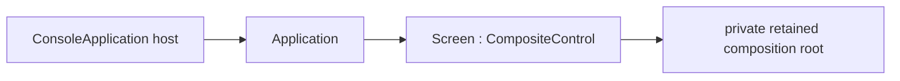

# Screen

## Screen contract

`Screen : CompositeControl` is the abstract application root. A concrete screen
creates its retained control tree in its constructor and installs exactly one
private composition root with `InitializeContent`. It is not a `Container` and
does not expose `Children`; use a real layout container such as `Dock`, `Grid`,
or `Stack` as the composition root when the screen needs multiple visuals.



The normal hosting surface is
`SharpVision.Runtime.ConsoleApplication.CreateBuilder(screen)` or
`ConsoleApplication.RunAsync(screen)`. The host constructs the `Application`,
binds it to the detached screen, and later attaches the retained tree to the UI
dispatcher.

## Construction and lifecycle

Construction is application-independent. It creates every control whose identity
the screen retains and calls `InitializeContent` before the constructor returns.
Composition never runs from measure, render, attachment, or a virtual
base-constructor callback.

The observable lifecycle is:

1. the concrete constructor installs its composition root;
2. `OnAttach` receives the constructed `Application` before startup;
3. the application attaches, measures, arranges, and commits the first frame;
4. `OnStarted` runs after that frame, or after a valid suspended startup; and
5. `OnDispose` runs while disposal releases application-specific resources.

`OnAttach` is the place for application configuration such as theme publication.
`OnStarted` is the place for work that requires the attached tree, including
initial focus. Constructors must not require an `Application`, focus manager,
dispatcher, terminal service, or committed geometry.

Application binding validates the complete composition before publishing the
protected `Application` property. An uninitialized, disposed, owned, or already
attached tree is rejected without changing the binding. If `OnAttach` throws,
the binding is cleared and the screen is not subscribed to
`Application.Started`.

Disposal unsubscribes the started callback, invokes `OnDispose`, clears the
application binding, runs base unavailability cleanup, and then disposes the
owned composition root. Cleanup continues after callback failures and rethrows
the earliest failure after state is consistent.

## Example

```csharp
public sealed class MainScreen : Screen
{
    private readonly TextInput _name;

    public MainScreen()
    {
        _name = new TextInput();
        InitializeContent(new Stack
        {
            Children =
            {
                new Text("Name"),
                _name,
            },
        });
    }

    protected override void OnStarted(Application application)
    {
        _ = application.Focus.Focus(_name);
    }
}
```

## Tests

Prove construction-time composition, private root identity across first layout,
attach and started ordering, missing-composition rejection before application
mutation, attach-failure rollback, exception-complete disposal, and one hosted
end-to-end startup path.
