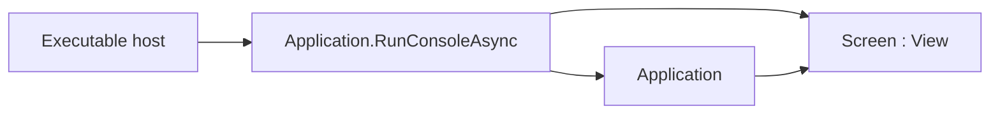

# Screen

## Screen contract

`Screen` is the abstract application-root `View`. A screen is a normal control
in the tree: it measures, arranges, renders, routes input, and participates in
focus like any other container. Executable hosts pass a detached screen to
`Application.RunConsoleAsync` instead of assembling transport, terminal policy,
and application binding themselves.

Concrete screens derive from `Screen` and override
`protected override Control Build()` to return their content root, exactly like
any other [`View`](custom-components.md#custom-components-contract), and
override `OnAttach` or `OnStarted` when they need the running `Application`.
There is no separate root wrapper.

Because shipped layout roots such as `Dock` and `Stack` are sealed, a screen
that needs dock layout returns a `Dock` (or another shipped container) from
`Build()`.

A `Screen` owns exactly one child — its `Build()` result — and, being capacity-1
like any `View`, arranges that child to fill the screen's content box; a root
that should not fill must set its own alignment/size.

## Lifecycle

Construction leaves the screen detached. `Build()` builds a view's content once,
on its first measure, whether or not the view is attached — but for a `Screen`,
the first measure always happens after `Attach`/`OnAttach`, because the
`Application` drives layout only after attachment. The observable lifecycle
order is therefore fixed:
`OnAttach → Build → first committed frame → OnStarted → OnDispose`.

The runtime calls `OnAttach` after the `Application` is constructed and before
`StartAsync`. `OnStarted` runs after the first committed frame or a valid
suspended zero-cell startup. `OnDispose` runs when the screen control is
disposed.

Screens that need the running application, such as for theme publication or
initial focus, use the protected `Application` property from `OnAttach`,
`Build()`, or `OnStarted`. Control mutation remains dispatcher-affine after
attachment.

## Tests

Prove detached-root validation, attach/build/started ordering, disposal through
the control lifetime, and one end-to-end `RunConsoleAsync` path through a
concrete screen.
